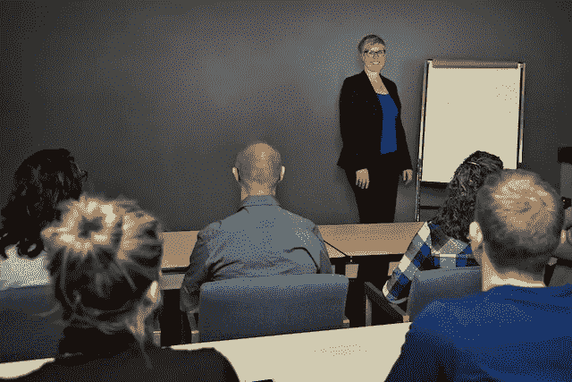

# 公开演讲如何改善你的职业生涯(以及帮助你的建议)

> 原文：<https://medium.datadriveninvestor.com/how-public-speaking-can-improve-your-career-and-tips-to-help-you-d6eaec1f02bd?source=collection_archive---------7----------------------->

一想到要在观众面前演讲，你会手心冒汗，心跳加速吗？如果是这样，你并不孤单——74%的人害怕公开演讲。这使它成为头号恐惧症——比死亡、蜘蛛(我最大的恐惧)和黑暗更可怕。

如果这么多人都有这种恐惧，为什么我会说公开演讲可以改善你的职业生涯呢？因为它经常做得很差，所以它是一个容易发光的地方(如果你花时间学习一些公共演讲技巧)。

别担心，我不是建议你在数百人面前讲话(至少现在不是)。但是，在员工会议上发言，自信地分享你的想法，而不是颤抖的声音或把你的天才留给自己，这不是很棒吗？

尽管我是少数喜欢公开演讲的人之一，但我一直在寻求提高自己的技能。这里有一些帮助我成为一名自信而迷人的公众演说家的小技巧。

## 1.听和学

成为一名优秀的公共演说家的最好方法之一就是仔细倾听和观察他人。记下房间里人们的共鸣。他们什么时候不听？是什么让他们坐起来听？

每次我在会议上发言，我都会在发言前尽可能多地参加会议。这给了我一个机会去评估人群，倾听他们的问题(这样我就知道他们对什么感兴趣)，最重要的是，向他人学习。我们每个人都有自己的个性和说话风格，但这可以通过观察和向其他人学习来提炼。

## 2.按下静音键

由于 80%的交流是非语言的，肢体语言是与听众沟通的关键(不管听众有多小)。剖析肢体语言的最好方法是关掉声音观察别人说话。

想想一些伟大的演讲者——巴拉克·奥巴马、JFK、奥普拉。现在闭上眼睛，想象他们在说话。他们不只是站在讲台上，手臂放在身体两侧。相反，他们擅长于眼神交流，身体前倾，用身体来表达情感。

## 3.寻求帮助

虽然这是不言而喻的，但我很惊讶有多少人没有花时间学习公共演讲技巧。并实践它们！！有很多方法可以提高你的公众演讲能力。你可以参加网上的[课程](https://howtocommunications.com/downloads/how-to-present-like-a-pro/)，加入演讲会，或者要求你的组织引进一名企业培训师(因为你肯定不是唯一一个需要帮助来提高你的公共演讲技巧的人)。

## 职业成长

虽然成为一个好的(或者至少是舒服的)公众演说家需要时间和练习，但也有一些不错的附带好处。当你开始清晰地表达你的信息，用肢体语言与你的听众交流，更自由地分享你的想法，人们会注意到你的。为什么？因为我们都经历过如此痛苦的陈述，以至于我们坐起来关注好的陈述。

这是在你的职业生涯中展示自己并获得关注的一个简单方法。是的，这意味着投入工作去克服恐惧。但是工作会带来高回报。

你猜怎么着？它允许你以一种与他人联系的方式分享你的天赋。你不会在演讲结束后想着，我搞砸了，担心别人会怎么看你。相反，你会知道你所说的话产生了影响。

别担心，成为一名优秀的公众演说家并不意味着做一个小时的演讲。美国总统乔治·华盛顿发表了 135 次就职演说——这可能比那些喋喋不休的总统更有力量。

我鼓励你想一想你在职业生涯中展示的方式(员工会议、正式展示)。你的平均演讲时间是多长？你的典型受众是谁？你最大的公开演讲恐惧和弱点是什么？不要试图在数百人面前完美演讲，从小处着手。寻找提高对核心听众演讲的方法，并从那里开始。

如果你在寻找额外的帮助，你可以下载我的[如何像专业人士一样展示](https://howtocommunications.com/downloads/how-to-present-like-a-pro/)培训视频和分步指南。它将帮助你清楚如何创建一个吸引人的演示文稿，知道如何与你的观众沟通，并帮助你获得从枯燥走向吸引人的信心。

如果你有任何问题或正在挣扎，[给我发个短信](https://howtocommunications.com/contact/)。我很乐意收到你的来信。

这篇文章也以博客的形式出现在[的 How to Communications](https://howtocommunications.com/how-public-speaking-can-improve-your-career-and-tips-to-help-you/) 上。