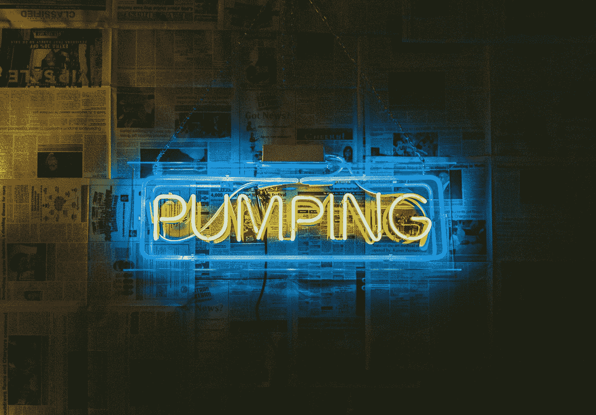
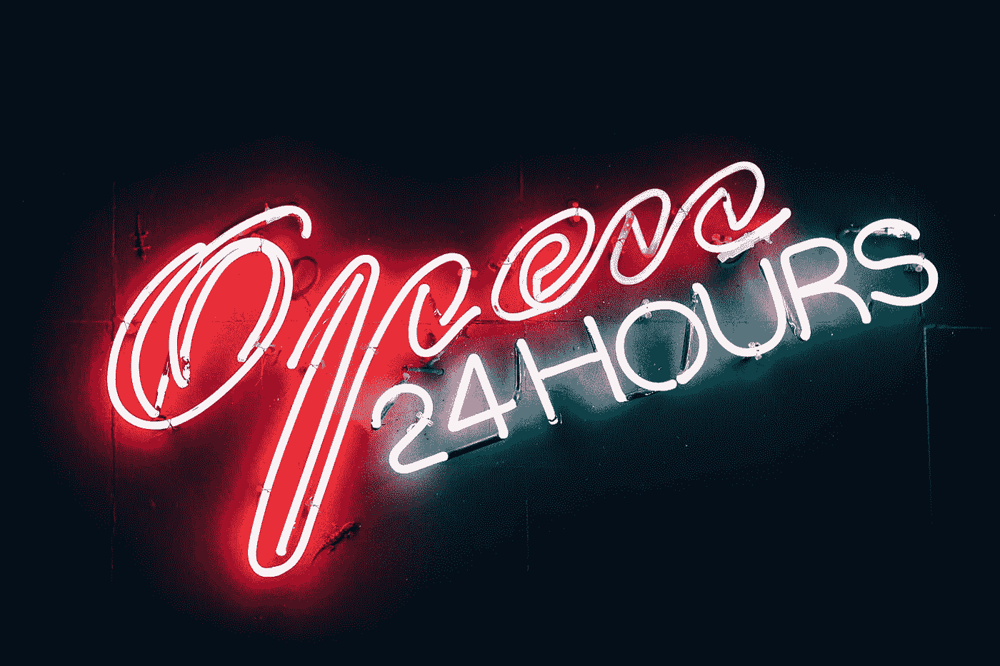

# 泵组和转储组是如何发生的

> 原文：<https://medium.datadriveninvestor.com/how-pump-and-dump-groups-happen-ad983ab90c54?source=collection_archive---------10----------------------->

Photo by [Jakob Owens](https://unsplash.com/@jakobowens1?utm_source=medium&utm_medium=referral) on [Unsplash](https://unsplash.com?utm_source=medium&utm_medium=referral)

抽水和倾倒(PnD)计划有一定的神秘性。评论员用平静的语调谈论隐藏的策划者。那些深陷赤字的人暗地里希望他们的持有能被推迟一天，这样他们就能最终退出他们的袋子。实际上，PND 要平淡得多。一旦“联盟”中的用户达到一定数量，就相对容易实现。美妙之处在于，这些用户中的大部分人甚至不知道他们参加了 PnD。一旦你有了质量，你就可以开始发射 PnDs。但是怎么走到这样一个阶段呢？目睹了许多这样的计划涌现出来，我会这样做。

## 1.获得用户

要成为一支真正的力量，我们要么自己需要雄厚的资金，要么需要大量的人来充当一个积累的雄厚资金。假设我们无法自己推动市场，我们将需要选择后者。但是如何让人们跟随我们的想法呢？我们需要给他们一些东西。更重要的是，我们需要在一段持续的时间内给他们一些东西，让他们回来。

> [DDI 编辑推荐—认证加密货币交易商](http://go.datadriveninvestor.com/cryptotrader/matf)

ICO 的繁荣让这变得相对容易。建立一个资金池，为会员提供接触各种 ico 的机会，否则他们将无法接触到，然后坐下来看着人们从你的工作中致富。许多 ico 在 2018 年的负面表现增加了这一点的难度，但仍然有很多好机会。更好的是，任何糟糕的回报都可以用更广泛的市场来解释(不管怎样，ETH 的暴跌意味着许多 ico 与投入的资产相比并不太差)。

然而，ICOs 的枯井并不是全部。相对来说，找到足够多的人直接为寻求股权的项目做出贡献并不需要太多的工作，而许多 ICO 团队已经在向 sto 转型。在这样一个不受监管的空间里总是会有机会的。

## 2.区别

对于一个池来说，很难实现差异化，但有些人已经非常成功地做到了这一点。那些做得好的人把自己定位为负责任的，凌驾于疯狂之上。他们采取了大胆的立场，例如在 ico 失宠前避开它们。一些团体提供交易建议。其他人拥有特权信息，或者他们免费订阅内容，然后免费分享。有些人只是选择了性能更好的 ico。

## 3.积极的领导

做得最好的社区是那些领导人知名度很高的社区。这是因为不认识的人会引发不信任，但是他们发的帖子越多，越活跃，这种戒心就越少。它还能让人们相信，管理员理应得到他们从最高处获得的费用——这实际上是一份全职工作。

## 4.建立一个社区

用户是短暂的。如果一切都一样，他们会去最划算的地方。我们需要让它变得不平等。这就是 Telegram 的用武之地，因为它允许一个“朋友”社区的出现。人们醒来，他们来到这个团体。为什么不呢？这是他们赚钱的地方。他们想赚更多的钱。

但更重要的是，当每个人都在同一时间赚钱时，那种感觉真的很棒。只要看看 Reddit 密码板的价格就知道了。每个人都很开心，有一种聚会的感觉。幸存的池是那些让人们成为那里的定期海报的池。这有两个影响:

*   加强用户和社区之间的联系
*   鼓励分享想法和信息

两者都让人们更有可能回到团队中来。通常有更严格的审核，因此困扰其他加密组的垃圾邮件较少。因为社区更小，人们更倾向于分享自己的想法。该小组成为一个精心策划的信息库。

## 5.通知

Photo by [Fancycrave](https://unsplash.com/@fancycrave?utm_source=medium&utm_medium=referral) on [Unsplash](https://unsplash.com?utm_source=medium&utm_medium=referral)

无论这家公司在做什么，成功都需要大力宣传。同样，这很大程度上是通过 Telegram 上某种锁定的公告通道来完成的，因此发布的成功不会受到质疑或争议。成功是广告；这是所有人关心的。真正聪明的团队会在频道上发布用户评价，这样看起来更有组织性。这些很可能是真正的用户评价，但显然会忽略任何批评或否定。

## 6.建立一个受审查的邪教

现在我们已经有了一个用户群(可能有 10000-20000 电报用户，即使只有 10000-300 真正活跃),我们需要巩固。为了取得进展，我们需要产生一种类似崇拜的感觉。这是最难的部分。

它可以通过多种方式实现，但通常是围绕一个拥有交易能力或某种合法性的个人。这也可以通过扩展社区感觉来实现，因此它几乎成为一种生活方式，人们谈论的不仅仅是密码，而是其他一切(从投资到汽车到关系)。

到这个阶段，你将有几个月的时间让人们赚钱，尽管团队中有人开始怀疑为什么其他人似乎总是获得 40 倍的回报，而他们只获得 10 倍，或者为什么他们似乎只跟随“坏”的交易电话，而其他人似乎跟随好的交易电话。如果组管理员正确地完成了他们的工作，这些人会责怪他们自己。他们没有正确地遵循指示，他们应该覆盖每一笔交易，他们没有在回报最高的项目上投入足够的资金。

当然，实际上，该组织只是在宣传成功而非失败。消极性会被删除。对任何问题有疑问的人将被删除，并被逐出群。反过来，人们说话越来越少，因为他们害怕自己被踢出去。因此，它变成了一个自我强化的社区，因为他们只讨论成功。

## 7.纵容它

我们已经摆脱了弱势群体，只剩下一组精选的顺从用户，他们中的许多人将在这个阶段汇集自己。一个用户可能从他们所在的另一个组或他们的朋友那里获得资金，使他们贡献的金额成倍增加。有了这种服从和火力，我们准备开始为自己赚取一些无风险利润。

实现这一点的简单方法是选择真实交易量有限的加密资产，但由于虚假的交易量，其日交易量看起来相当高。组管理员在它被选为“目标”之前的几周内获得此信息。然后，他们公开选择的加密资产。因为代币的实际交易量有限，加密资产的价格将开始上涨。这变成了一个自我实现的预言，因为价格上涨，因为我们的集团。然后，管理员可以提前抛售，那些足够早进入的人也将获利，但那些晚进入的人将随着价格的迅速回落而遭受损失。

第四步到第六步对于留住用户群非常重要，因为这个群体中的一些人总是会失去。通过让他们感到自己是社区的一部分，他们经常故意对正在发生的事情视而不见。这些 PND 通常会与其他更合法的机会穿插在一起，这样人们就不会知道发生了什么。事实上，许多 PnD 集团成员甚至不会意识到他们正在做什么。