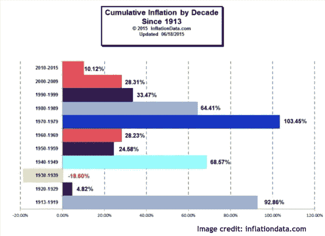
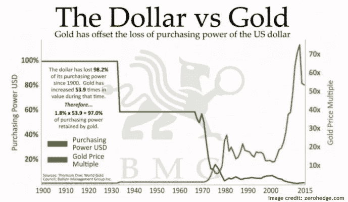
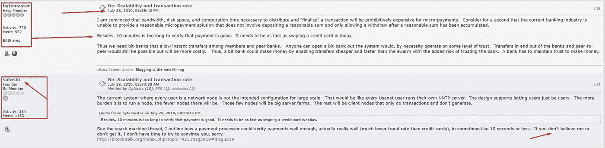
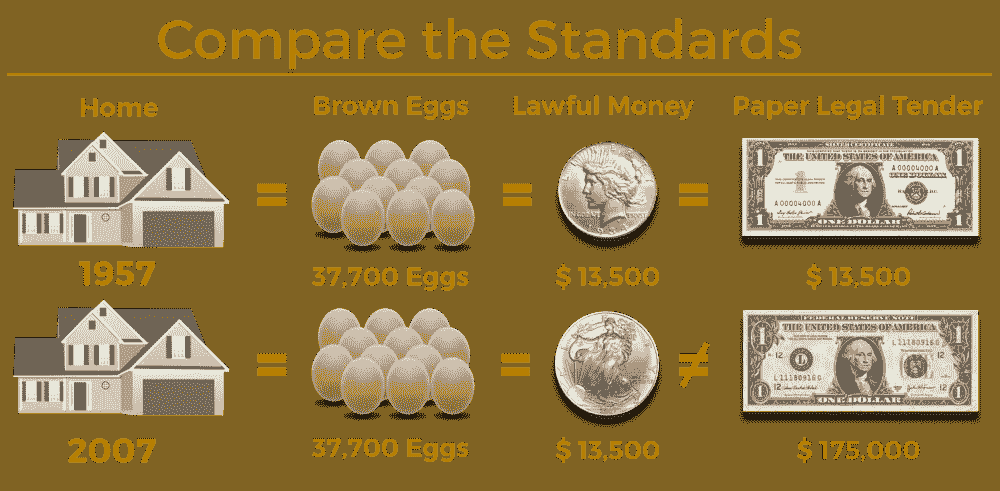
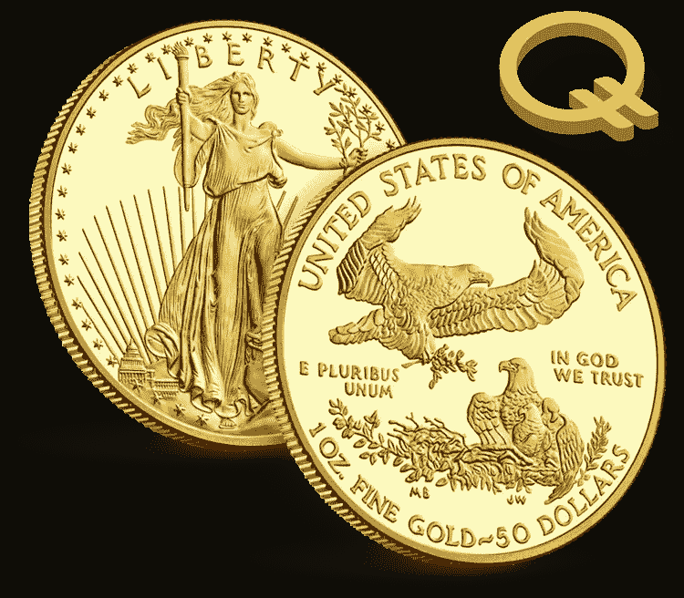
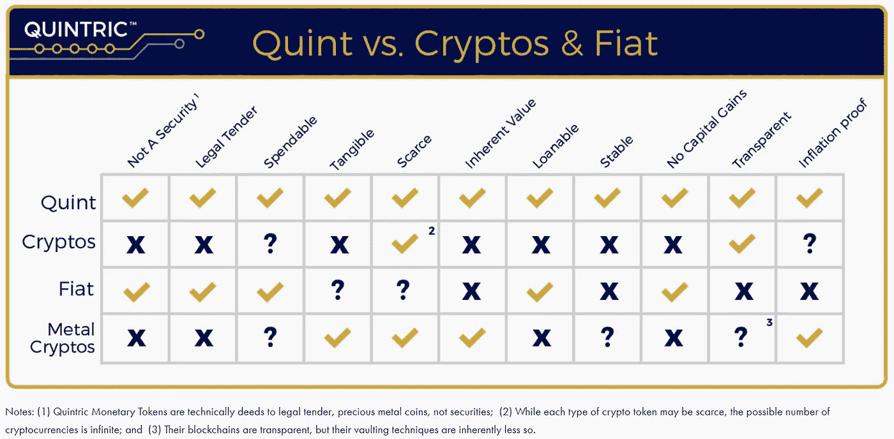

# Quintric 如何解决当前货币体系的问题

> 原文：<https://medium.datadriveninvestor.com/how-quintric-solves-problems-with-the-current-monetary-system-6b5e2a585b9b?source=collection_archive---------0----------------------->

不受抑制的通货膨胀法定货币(美元)是由美联储随意印制的，它不是一个联邦实体，也没有任何储备来支持它发行的纸币。

美国政府正从基于债务的体系中获取货币供应。但是那辆究竟是什么意思呢？政府通过拥有比资产更多的负债来创造基于债务的货币供应，这意味着他们的支出超过了收入。这创造了一个无限信贷和无限债务的状态。这也造成了一种情况，即这些支付的利息永远无法还清，留下一个永久的债务状态。

直到 1971 年，美元都是由黄金支撑的。那一年，理查德·尼克松总统阻止了美元被贵金属支撑。这一决定之后，美元的价格水平飙升，对经济造成了毁灭性的影响，被称为尼克松休克综合症。

从那以后，美元不再被任何东西支持，基本上给消费者留下了一张纸，通常被称为法定货币。这个体系注定要失败，就像世界历史上每一种法定货币和每一家央行都失败了一样。

通货膨胀已经上升到创纪录的水平，降低了美元的购买力，而美元是每个人工作、消费和接受他人商品和服务的货币。问题是它的价值一年比一年低，这使得通货膨胀成为一种隐性税收。

# **进入金特**

Quintric 有一种叫做金特的代币，每个金特相当于 1 盎司美国法定货币金币的 1/1000。每个代币也值二十分之一盎司。美国法定货币的银币——这种银币可凭要求以至少 20 个增量支付。最后，区块链科技正在把钱返还到它真正的源头。

区块链开发工程师丹尼尔·拉里默(Daniel Larimer)在比特币早期从事共识算法的研究。他发现，像 Visa 和 MasterCard 一样，比特币的系统在很大程度上不适合区块链的商业规模，因为它成本太高，而且需要的能源效率低下。

2010 年 7 月，丹尼尔·拉里默和中本聪(比特币的创始人)就比特币 POW 技术在涉及真实消费者使用的实时场景中的可用性进行了讨论:

> 我确信，分配和“完成”一笔交易所需的带宽、磁盘空间和计算时间对于微支付来说是极其昂贵的。请考虑一下，当前的银行业无法提供一种合理的小额支付解决方案，它不涉及存入合理的金额，并且只允许在积累了合理的金额后提取。
> 
> 另外，10 分钟太长了，无法验证支付是否良好。它需要像今天刷信用卡一样快。
> 
> 因此，我们需要允许会员和同行银行之间即时转账的比特银行。任何人都可以开一家比特银行，但这个系统必须在一定程度的信任上运行。银行和个人对个人的资金转移仍然是可能的，但成本会更高。因此，小银行可以通过比大银行更便宜、更快捷的转账来赚钱，同时增加了信任银行的风险。银行必须保持信任才能赚钱。

聪回答道:

> 每个用户都是网络节点的当前系统不是大规模的预期配置。这就像每个新闻组用户运行他们自己的 NNTP 服务器。设计支持让用户只是用户。运行一个节点的负担越重，节点就会越少。这几个节点将成为大型服务器群。其余的将是只做事务而不生成的客户机节点。
> 
> 参见[小吃机线程](https://bitcointalk.org/index.php?topic=423.msg3819#msg3819)，我概述了支付处理器如何在大约 10 秒或更短的时间内足够好地验证支付，实际上非常好(欺诈率比信用卡低得多)。如果你不相信我或者不明白，我没有时间来说服你，对不起。

为了应对当前系统中缓慢的交易速度，丹尼尔·拉里默(Daniel Larimer)创造了所谓的委托股权证明(Delegated Proof of Stake，简称 DPoS)，这使得 2013 年的支付交易速度快如闪电。这个系统消耗的能量是最小的，每次交易只需要一秒钟的笔记本电池。

丹尼尔在 2010 年实现了他所说的目标，也实现了聪最初不以为然的目标。

这一点非常重要，因为 Quintric 将这种 DPOS 共识算法与金特令牌结合使用，能够在三秒或更短时间内在全球范围内实现闪电般的快速转账，从而实现完全结算。

Quintric 不仅拥有技术和概念，还拥有一个团队，他们成功地合作创造了突破性的技术，并结合了旧世界健全的货币价值。

# **金特:黄金支持的代币**

自理查德·尼克松总统宣布美元将不再由黄金支撑以来，银行系统被推入了一种信贷永久扩张的状态。如果一美元不再有黄金做后盾，它还有什么价值？当每年印刷更多的美元时，整个美元体系会发生什么变化？把一张钞票比作另一张普通的纸。有什么区别——商标、水印、弯曲、褶皱？但除了风格，钞票还有什么实际价值呢？

人们越来越厌倦这种无限负债的制度。比特币和其他区块链的出现是对这个破碎系统的回应。有了一个完美分布的公共账本，未来的比特币数量是有限的。这就是比特币的伟大之处。但是有一件事。尽管我们可以在几秒钟内将钱转移到世界上的任何地方，但这些钱的真正后盾是什么？

如果有一种方法将比特币的可运输性与用存款支持货币的概念结合起来，会怎么样？

通过提供黄金支持的法定货币，Quintric 为人们提供了一个打破货币体系的选择。每张代币证明，在出示时，5 美分的美国金币可在 1 盎司的要求下支付。布法罗黄金和美国美国鹰铸币。你也可以通过将硬币零售价格(usmint.gov 公布)除以 1000 来将美元兑换成五分硬币。五重奏由真正的贵金属支持。

这不仅仅局限于美国货币——被称为 iQuints(iQuints)的国际代币也 100%由黄金和白银保险持有物支持。伊昆特家族受到爱尔兰古代中央王国布里费恩王室的支持。再一次，通过一个真正的储蓄机构向全国和全球的消费者群体支持真正的货币。

Quintric 的独特之处在于它提供了非安全令牌。金特和五重奏是支付美国政府铸造的硬币，不属于证券保护伞。金鹰和银鹰被认为是“法定货币”,这意味着美国人可以像使用美联储发行的纸币一样使用它们。Quintric 只是为了最大限度的方便、透明和可用性而对区块链上的硬币进行了象征性的处理，同时掩盖了保管费和其他费用。

“金特”这个名字来源于这样一个事实:一枚 50 美元一盎司金鹰硬币的千分之一等于 5 美分。Quintric 可以将金特代币命名为“Cent ”,并使其成为 1/5000 盎司，但“Centric”并没有相同的环。

使用美联储纸币或金特等法定货币，而非证券，还有另一个关键优势。如果你是用比特币支付的，而且比特币在你花掉之前就升值了，那么这将是一个巨大的资本收益负担。美国国税局对收取差价非常认真，甚至传唤了美国最大的数字交易所比特币基地，以查明谁提前购买了股票，以及他们赚了多少钱，以便追溯收取这些税款。

另一方面，金特用户使用的是法定货币，因此，如果黄金美元相对于其他货币(包括美联储纸币)升值，那么在法律上可能不会有差价资本利得。这消除了您在交易加密货币证券时始终跟踪其价值的负担，并消除了无视法律的风险。

金特不是一种新货币，它是自 1985 年以来在美国合法确立的货币。昆特里克只是寻求让它在更大的层面上流通，再次普及美国金本位制。

# **五人组**

与大多数其他开发团队自上而下分配职位的方式不同(首席执行官、首席财务官、副总裁、助理等。)，这个团队由六个人组成，他们都拥有同一个头衔，主任。

每个导演都带来了自己独特的技能，但每个人都在他们的行业中取得了成功，完成了 R & D 以及洛克希德·马丁公司、梦工厂工作室和微软等公司的其他工作。

[团队](https://quintric.com/about/)也在同一家公司的其他高风险职位上成功合作。Quintric 的董事迈克尔塔加特是一家名为 Cryptonomex 的公司的总裁，该公司目前持有麻省理工学院的石墨烯区块链许可证。石墨烯区块链每秒能够产生 100，000+笔交易，这比 Visa、Mastercard 和 Nasdaq 的总和还要多！董事斯坦·拉里默也在该公司任职，拉里默是 Cryptonomex 的首席执行官。

在区块链行业，你找不到一个拥有这种独特结构和共同成功历史的团队。

鉴于这种对数字货币的新看法正在将黄金和白银支持的货币引入加密货币，五元货币系统将是巨大的。自从理查德·尼克松解除美元与黄金的关系以来，一些人一直在等待存款准备金的回归。Quintric 提供比特币的所有技术，但交易速度更快，消耗的能源更少，并有实际价值的支持。

了解更多关于金特和他们如何改变法定货币用法的信息，[今天就创建一个五分账户](https://escrow.quintric.com/#/register/create-account)来参与健全的货币革命。

作者不是律师或财务顾问。作者希望读者注意，他是 Quintric 的联合创始人和董事会成员。呈现的任何内容都不应被解释为投资建议或法律建议。