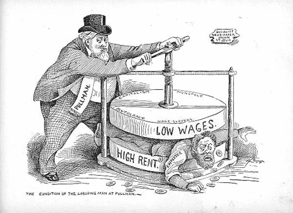

# 激进资本主义如何掏空了我们的社会？

> 原文：<https://medium.datadriveninvestor.com/how-radical-capitalism-has-hollowed-our-society-da4bc10939dd?source=collection_archive---------1----------------------->

The 1894 Cartoon appears so true in 2019

第一部分:资本主义如何从战后的后起之秀变成不平等的灯塔？

世界新秩序是在两次世界大战后建立的，原子武器对未来的战争起到了强大的威慑作用。资本主义推动了巨大的经济繁荣，消费主义上升到新的水平；生产成本大幅降低，中产阶级开始壮大。新兴中产阶级、信用卡、低利率成为推动消费主义的燃料。

普通人总是拥有基本的和稍微多一点的东西，但是随着消费主义，我们开始进行次优的购买，这被我们的祖先认为是“虚荣”。经济学家意识到，虽然我们购买的大部分商品都不是必需的，但生产这些商品和服务的劳动促进了经济发展。受西方经济财富的启发，资本主义驱动的消费主义成为世界上大多数国家的选择。

 [## 为什么包容性财富指数比 GDP 更能衡量社会进步？-数据驱动…

### 你不需要成为一个经济奇才或金融大师就能知道 GDP 的定义。即使你从未拿过 ECON 奖…

www.datadriveninvestor.com](https://www.datadriveninvestor.com/2019/03/08/why-inclusive-wealth-index-is-a-better-measure-of-societal-progress-than-gdp/) 

随着不再有世界大战规模的战争和医学的进步，人口和消费主义都开始以前所未有的速度增长。世界人口从二战结束时的 23 亿增加到今天的 77 亿。这一增长率比地球历史上任何时候都要高。不仅人口在增长，我们的人均消费也比我们的祖先多很多倍。现在，普通人每年的碳足迹为 4900 公斤(美国人均碳足迹高达 16000 公斤)。

第二次世界大战后第一个五十年的资本主义看起来像是要走的路。虽然它带来了不平等，但不平等在一定程度上是激励创新所必需的。资本家成为这个时代的大赢家，因为财富带来更多的财富，成功会带来更多的成功。资本家很快控制了媒体，这意味着他们控制了人民的信息流动，并间接控制了民主国家的政治家。政治阶层开始依赖资本家来资助选举活动和媒体报道，这意味着政客们不会执行法律来分配财富。政客们不考虑超过 4-5 年(选举周期)的问题，绝望地依赖资本家的资助，这给不平等火上浇油。

更多的财富和政治影响导致自动化投资、自由贸易和全球化，这导致西方世界稳定、永久和安全的劳动力就业机会减少。工作要么是低收入的非技术/半技术工作，要么是高收入的技术工作。大多数低收入的生产和服务工作转移到了较贫穷的国家，使数百万人摆脱了贫困。虽然最贫穷国家的数百万人摆脱了赤贫，但全球化的最大赢家是资本主义者，因为他们的财富和利润在低成本生产的支持下飙升。

当今世界生产 78.28 万亿美元(GWP，世界生产总值)，扣除购买力平价后，相当于每个活人每年 17，300 美元，即为了简单起见，将整个世界换算成美国经济。如果这些财富被平均分配(完美的社会主义)，一个四口之家每年将获得 69，200 美元。即使前 20%的人拿走了 60%的收入，剩下的 80%的人每年仍能赚到 3 万美元左右。这些收入支持了资本主义(最高的 20%拿走 60%)，但仍足以让最底层的 80%过上好日子。

然而，政治家支持的极端资本主义意味着这种收入分配极其不平等。不平等的程度如此之大，以至于世界上每 10 秒钟就有一名儿童死于饥饿。全世界有 8 . 21 亿人没有足够的食物来过积极健康的生活。每九个人中就有一个人每晚饿着肚子睡觉。每个人都有足够的食物，但不是每个人都有足够的食物。在较富裕的国家，住房危机逐年恶化。在英国，每 201 人中就有一人无家可归，而与此同时，富人主要用来休闲的高尔夫球场占用的土地可能比住房还要多。

这种不平等不仅限于贫穷国家。以下关于美国这个世界上最富有的国家和现代资本主义先驱的事实会让你大吃一惊:

1.顶层 0.1%的家庭现在拥有的财富与底层 90%的家庭相当。

2.前 25 名对冲基金经理赚的钱比每个幼儿园老师的工资加起来还多(大约 14 万人)。

3.最富有的 1%的人现在拿走了美国 GDP 的 24%,而 1978 年是 9%。

4.4500 万(七分之一)美国人因费用问题放弃药物治疗。这可能包括儿童。

5.80%的人口靠薪水生活。生病一两个月会让这个家庭无家可归。

6.与此同时，微软、亚马逊、苹果、谷歌和脸书的总价值约为 4 万亿美元。这大约是印度 GDP 的 1.5 倍(印度 13.7 亿人口总收入的 1.5 倍)。

7.苹果手里有 2450 亿美元现金。联合国估计，要消除 8 . 62 亿营养不良人口的世界饥饿并促进世界经济，需要在 8-10 年内每年投资 300 亿美元。这笔现金可以彻底根除世界饥饿。

导致 2008 年金融危机的自我放纵的银行家的贪婪是有据可查的。对于许多经济学家来说，这场危机并不令人意外，因为西方经济是由私人和公共债务驱动的，即使在危机过后，这种趋势仍有增无减。

非常大的跨国公司通过纯粹的政治影响几乎不用缴税。由于各州和各地区竞相在当地接纳这些公司，他们获得了多年的税收减免和退税。这些公司不仅不纳税，还在自动化方面投入巨资，这让许多当地企业和社区感觉受到了影响。虽然社区企业的创新和自动化程度较低，但它们在当地雇佣了更多的人并缴纳了更多的税，因为它们无法负担会计师、律师和游说者的费用，这些人参与了对它们有利的歪曲法律的活动。更低的税收意味着用于公共卫生、学校和基础设施的资金更少。

由于缺乏稳定的好工作和资源紧张，随着当地民众对现状不再抱有幻想，西方出现了英国退出欧盟和川普式的民族主义运动。

民族主义运动让选民相信，他们的苦难应该归咎于移民，而不是没有采取任何措施推动财富分配的资本家或政客。民族主义者让当地人相信，他们痛苦的原因是他们下面的人(移民)拖累了他们，而不是他们上面的人(资本家和政客)推他们。移民工人对土著人的失败不负任何责任；他们竭尽全力为资本家工作，以换取低工资和长时间的工作，让他们的家人过上更好的生活。

资本主义的目标是继续自动化的步伐，人工智能将从最贫穷的人那里夺走数百万个工作岗位，而政治家们痛苦地、可能是故意地准备不足以应对这一挑战。

普通人理所当然地认为这个世界属于资本家集团，他们在其中没有什么权力或发言权；虽然消费主义增加了财富，但地球上的陆地面积仍然不变，导致房价呈指数增长。住房已经成为最紧迫的挑战，在世界各大城市，大多数年轻人都买不起房子。无家可归和住房不足的现象正在增加。

消费主义和不受约束的资本主义对公共健康产生了深远的影响。到 2050 年，美国将有三分之一的人患有糖尿病；全球肥胖率正在上升，30%的世界人口肥胖或超重。他们面临快餐的缓慢死亡，含有致癌物质的加工肉类增加了患癌症和心脏病的风险，空气质量下降，在世界上的一些城市，一天的呼吸相当于吸 10 支烟。这意味着在政府所得税收入下降的时候对医疗保健的巨大投资，因为资本主义者通过自动化和低税收从经济中吸取资金。人工智能将为资本主义的这场大火推波助澜。

这就是无助和短视是如何蒙蔽了不同人群的:

1.收入最低的 80%的人口靠一张张的薪水过活，他们不觉得有义务去应对气候变化这样的挑战。他们认为这是富人和政府的职责。他们很容易被任何承诺改善他们生活的人说服。

2.前 3%的资本主义精英被他们的财富蒙蔽了双眼，更多地考虑他们经营的公司，而不是地球和未来。他们中的许多人已经发现了寻找其他缺乏大气层的星球并殖民它们的奇异爱好，他们应该关注的是让这个星球运转起来。由于资本的力量和对权力的间接控制，他们最适合让这个星球运转。

3.剩下的 17%要么看不起最底层的 80%,尽量避免落入那个群体，要么集中精力进入最顶层的 3%。

4.政客和政府被赢得选举蒙蔽了双眼，没有考虑选举周期以外的事情。他们深深地交织在一起，几乎和前 3%的人混在一起。

现代人已经完全失去了应对未来挑战的注意力；气候变化，能源危机，人工智能，水资源短缺，人口增长危机。

***第二节:如何修复资本主义？***

社会主义和资本主义需要找到一个中间立场。资本主义对人类来说是不可思议的，但它已经成为一种习惯。承担风险、创造就业的资本家应该获得丰厚的回报，但不能以其他人陷入贫困、无家可归、零工时合同和绝望为代价。我们需要摆脱这种“赢家通吃”的体系，这种体系正在从根本上削弱我们这个社会。斯堪的纳维亚国家是一个很好的中间立场的例子。通过高税收进行的财富分配在北欧创造了一个反应迅速、幸福的社会，因此毫不奇怪，他们正在领导应对气候变化的斗争。尽管气候恶劣，该地区的幸福指数却是世界上最高的。

北欧幸福:【https://www.youtube.com/watch?v=sEKQYYhp3eE】T4&t = 130s

瑞典变废为金:[https://www.youtube.com/watch?v=14r7f9khK70](https://www.youtube.com/watch?v=14r7f9khK70)

有几种重新分配财富的方法，比如为大型跨国组织引入基于收入的税收，财富税；财产税、提高最低工资、员工所有权、将关键行业重新国有化是其中的一些想法。

许多社会主义政党支持要求企业每年将一定比例的股份转移到由员工控制的基金的政策。然后，该基金将向员工支付定期股息，同时让他们在公司治理中拥有强大的投票权。随着时间的推移，这些基金将成为经济从内到外社会化的一种新方式。然而，最大的好处不是更高的收入，而是更多的集体力量和未来成功的份额。

无论是在美国、英国还是其它地方，我们很少有人直接持有股票。虽然家庭储蓄者可能是间接股东，但投票权由大型金融机构代表他们控制，这些机构往往不能代表储蓄者的利益行事——并在此过程中为自己获取巨额回报。换句话说，我们大多数人对自己的工作缺乏有意义的控制，而现有的所有权结构无法实现这一点。

大型跨国公司在全球范围内赚取了巨额利润，但却没有缴纳足够的税款，因为损益表上的利润可以被管理并转移到避税天堂。这剥夺了社会的数十亿美元，这些钱本可以用于医院病床、学校、道路、癌症治疗和拯救生命。一家年营业额超过 10 亿美元，在一个国家运营超过 10 年，但尽管在全球范围内盈利，但仍未在当地盈利的全球性公司，最有可能是在管理利润。在这种情况下，对收入征收小额税可能是个好主意，因为你无法隐藏收入。

这些只是其中的一些想法，还有更多。我们需要的是全球层面的政治领导力，以关闭避税天堂，停止向超级富豪提供税收优惠，支持提高最低工资，或者在印度等一些国家实施最低工资。认为资本家会自己推动变革的想法是一厢情愿的想法，因为资本家天生就会积累财富，除非必要，否则不会捐出一分钱。实施这些措施是政府的工作。

大多数政客都知道这个问题，但由于害怕他们的资本主义主子，他们没有勇气实施变革。我们今天看到的不平等社会永远无法对抗气候变化这样的挑战。

推荐视频:

美洲的不平等:【https://youtu.be/QPKKQnijnsM 

消费主义:[https://www.youtube.com/watch?v=Y-Unq3R-M0](https://www.youtube.com/watch?v=Y-Unq3R--M0)

不平等:【https://www.youtube.com/watch?v=0xMCWr0O3Hs】T2

税收减免(18 岁以上):【https://www.youtube.com/watch?v=8bl19RoR7lc 