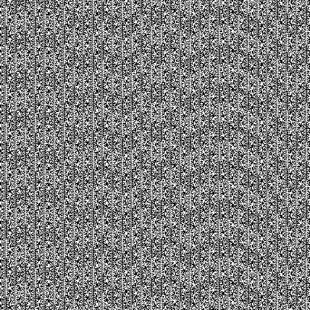
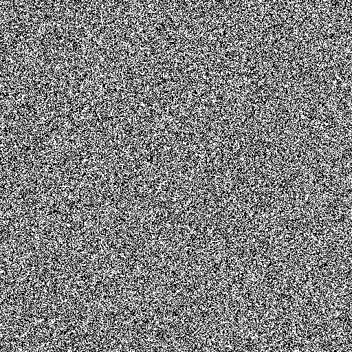

# 一个随机数有多随机？

> 原文：<https://medium.datadriveninvestor.com/how-random-is-a-random-number-2adb8245de59?source=collection_archive---------5----------------------->

[](http://www.track.datadriveninvestor.com/1B9E)

Photo by [Brett Jordan](https://unsplash.com/@brett_jordan?utm_source=medium&utm_medium=referral) on [Unsplash](https://unsplash.com?utm_source=medium&utm_medium=referral)

我喜欢桌游，特别喜欢冒险！每年我都会和我的朋友见面，我们会在年初进行一年一度的比赛来决定谁是那一年的冠军。冠军得到了一个可怕的塑料戒指，我发现它是一个脆脆的玩具，必须一直戴着它。工作面试，婚礼(自己的婚礼)等等，然而我们都想要冠军戒指，敌意和痛苦的程度是不适当的高。

[](https://www.datadriveninvestor.com/2019/02/28/descriptive-vs-inferential-statistics-whats-the-difference/) [## 描述性统计与推断性统计。有什么区别？-数据驱动型投资者

### 想象一下。你拥有一家餐馆，想知道人们对你的生意有什么看法。所以，你给一个…

www.datadriveninvestor.com](https://www.datadriveninvestor.com/2019/02/28/descriptive-vs-inferential-statistics-whats-the-difference/) 

一个朋友有他自己的骰子，如果在正式掷骰子之前，他在个人非官方测试中没有得到至少一个“1”，他就不会“正式”掷骰子。他以一种非常特殊的方式掷骰子，他声称会给他一个 6 分。(为了避免作弊，我们只允许至少 1 米的坠落和至少 3 次偏航和俯仰旋转)。没有意义，不是吗？只要他连续掷出几个好的骰子，我们就不允许。

原因是以这种方式掷骰子并不是完全随机的。如果你在相同的起始条件下掷骰子(上面是相同的一张脸),试着做相同的操作并得到相同的结果，这是不够随机的(我知道这没有任何意义..)但这导致了骰子的应用。随之而来的自然问题是:一个随机数到底有多随机？

因为任何对人工智能和科幻感兴趣的人都知道，奇点的价值之一是随机性的能力，这种能力不是由算法产生的。但是对于一台机器来说可能吗？

我经常发现自己在问自己，是否也有可能让自己产生一种不受事件算法和个人选择影响的随机思维。例如，每当我被要求在一个范围内选择一个随机数时，我通常会不由自主地排除起始和结束的邻居，而且我更喜欢奇数而不是偶数。此外，如果我能很容易地在这个范围内找到一个质数，我可能会选择它。这是我大部分时间都在做的事情，却没有主动去思考。(我刚刚检查了几个视频作为本文的来源，我发现 45%的人出于完全相同的原因在 1 到 10 中选择了 7)

机器如何选择随机数？随机数在加密、模拟游戏、赌博游戏中非常重要，因此它们的算法必须尽可能地“随机”，这一点非常重要。

在每种语言中，随机性是用不同的算法定义的，但是随机算法开始的种子是基于时钟的，返回给我们的是一个“随机”数。不管怎么说，人类非常善于识别视觉模式。因此，研究和接近“随机性”的一个方法是将其可视化。



PHP rand() from Random.org

上图是 PHP 中一个伪随机数的位图表示。很容易发现我们可以定义什么样的模式。

大多数编程语言都使用 PNRG。例如，Javascript 在调用 Math.random()函数时，将选择权留给了浏览器。最近大多数浏览器开始采用 ***xorshift128*** *算法。*

C 语言中的算法源代码如下:

```
**uint64_t** state0 = 1;
**uint64_t** state1 = 2;**uint64_t** xorshift128plus() {
  **uint64_t** s1 = state0;
  **uint64_t** s0 = state1;
  state0 = s0;
  s1 ^= s1 << 23;
  s1 ^= s1 >> 17;
  s1 ^= s0;
  s1 ^= s0 >> 26;
  state1 = s1;
  **return** state0 + state1;
}
```

符号"<我之前的文章讲的是如何手工挖掘一个比特币。

为了可视化，您可以创建一个 600x600 的画布，给它一个 id“canvas ”,并添加以下代码。和前面的例子一样，如果这个数字小于 0.5，那么这个代码将绘制一个黑色像素，0.5 是 50%。

```
var canvas = document.getElementById("canvas"),
    context = canvas.getContext("2d");var y = 0;
draw();
function draw() {
  for(var x = 0; x < 600; x++) {
    if(Math.random() < 0.5) {
      context.fillRect(x, y, 1, 1);
    }
  }
  y++;
  if(y < 600) {
    requestAnimationFrame(draw);
  }
}
```

即使在如此小的表示中它可能看起来是随机的，在非常高的迭代次数之后，即使这个算法也将开始显示出一种模式。

当应用程序需要真正的“随机”数字时，量子物理学就加入了这个游戏。目前量子物理被认为是宇宙中真正随机性的唯一来源(或者至少我们还看不到模式…)，如果需要实验随机性，就使用来自量子物理属性的数字。



TRNG from RANDOM.org

这里有一个真随机数发生器(TRNG)的表示，它使用]大气噪声作为因子，与我们所习惯的非常不同，更加“随机”。

创造随机性的不可能性，甚至几乎在人类的头脑中，是一个实际上非常迷人的想法。它显示了我们实际上可能认为更多的东西是算法，可能是有大量外部因素作为输入的复杂算法(也是其他算法)，但仍然是算法。我们和我们能创造的程序没有什么不同。

所以，如果你想在你的棋盘游戏中使用一个掷骰子的应用程序，你最好选择一个量子属性的！