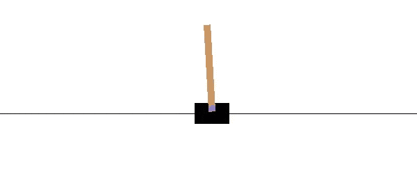
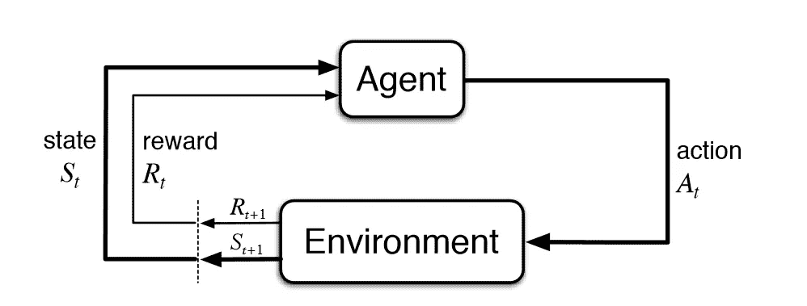
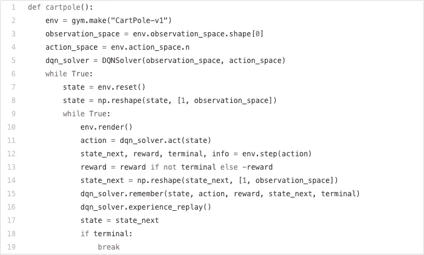
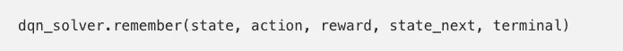

# 强化学习是如何违背万有引力定律的

> 原文：<https://medium.datadriveninvestor.com/how-reinforcement-learning-defied-the-laws-of-gravity-bce53006ea84?source=collection_archive---------13----------------------->

[](http://www.track.datadriveninvestor.com/1B9E)

你有没有玩过一个你非常不擅长的游戏，每次你玩的时候都会很沮丧？嗯，那就是我每次玩平衡游戏时的样子，比如玩钢管舞。所以，我决定创造一个为我玩翻筋斗的游戏机器人！我去年学会了如何用 Python 编程，这是我的第一个游戏机器人。我用强化学习(RL)和深度神经网络(DNN)让它自己玩！

# 翻筋斗的失败



This is what happens when the pole falls

翻筋斗是一个重心高于支点的钟摆。它不稳定，会掉下来，但可以通过移动黑色手推车到枢轴点的中心来轻松控制。目标是通过对支点施加适当的力来保持横翻平衡。

*   横竿的支点是紫色方块。
*   扁担左右移动以保持扁担直立平衡。
*   黑色矩形表示移动以平衡杆子的“小车”。

# 强化学习

为了让横竿“自我平衡”,我们需要实施强化学习。强化学习有助于代理学习和完善自己。你听说过这句话“熟能生巧！”，嗯，游戏就是这么做的，练着练着，直到能完全平衡推车上的杆子，没有任何问题。

RL 是这样一个概念，即一个主体在一个环境中采取行动以最大化其总回报。主要的概念是非常逼真的，其中类似于现实生活中的人类，RL 算法中的代理人受到激励，对坏行为进行惩罚，对好行为进行奖励。

强化学习被认为是三种机器学习范式之一。另外两个是监督学习和非监督学习。在监督学习中，你所做的决定不会影响你对未来的看法。它与无监督学习不同，因为 RL 不需要在没有数据的基础上预测决策。相反，重点是性能，包括在探索(新环境)和开发(已知环境)之间找到平衡。


This is a simple diagram showing what Reinforcement Learning does.

# OpenAI 的健身房环境

2016 年 4 月，OpenAI 发布了 Gym。一个让你接触到像 Cartpole 这样非常受欢迎的游戏和像他们的 Taxi 游戏这样的其他游戏的环境。使用 Gym，我可以进入游戏并复制一个游戏机器人玩翻筋斗

基本上，Gym 是开发和测试 RL 算法的环境的集合。Cartpole 是可用的健身房之一，你可以在 OpenAI 的网站上查看完整的列表或点击[此处](https://gym.openai.com/envs/#classic_control)。Gym 是建立在马尔可夫链模型上的，我们将在本文的后面讨论这个模型。

# 马尔可夫链

马尔可夫链是代理人观察由奖励和下一个状态组成的环境输出，然后据此行动的过程。这整个过程是一个马尔可夫决策过程(MDP)。



Markov Chain

它从一个初始环境开始。它还没有任何关联的奖励，但是它有一个状态(S_t)。

然后，对于每次尝试(迭代)，代理获取当前状态(S_t ),并挑选最佳(基于模型预测选择的)动作(A_t ),并在环境中实现它。然后，环境返回给定动作的奖励(R_t+1)、新状态(S_t+1)以及新状态是否终止的信息。这个过程一直重复，直到一切都结束。



Markov Chain Code

## 第 1–5 行

我只是在搭建环境。[env = gym.make("CartPole-v1)"是 OpenAI 的健身房设置 CartPole 环境。它创建了一个代理(DQNSolver)、一个观察空间(可能的[状态]值)和一个动作空间(可以执行的可能动作)。

## 第 6–8 行

每次玩游戏，都会初始化一个新的环境。[state = env.reset ()]是重置命令，而[state = NP . shape(state，[1，observation_space])]是重塑或设置新环境的命令。

## 第 9–19 行

对于每一步，直到游戏结束，基于一个给定的状态，我们从代理那里得到一个动作。然后我们在一个环境中实现它，得到一个新的状态。随之而来的是奖励。之后，SARS 的命令(状态、动作、奖励、状态 _ 下一步、终端)被编码，这标志着游戏/模拟在我们可以重放它之前结束。

# 深度 Q 学习

DQN 是一种强化学习技术，旨在为任何情况(观察)选择最佳行动。每个观察的每个可能动作都有其 Q 值，其中“Q”代表移动的质量。为了最终得到准确的 Q 值，我们需要深入研究深度神经网络和一些线性代数。

通过为深度 Q 学习算法配备以下工具，我们能够记住每个状态:



然后，它会使用此功能为下一个游戏记住它的体验:


每当有一个新的、更好的 Q 值时，Cartpole 需要知道将它的原始值改为新值。它通过实现以下函数来实现这一点:

```
q_update = (reward + GAMMA * np.amax(self.model.predict(state_next)[0]))
```

在这种情况下，计算新的 Q 值，取给定行为(最佳预测结果)的最大 Q 值，乘以折扣因子(GAMMA ),并最终将其添加到当前状态奖励中。

你可能想知道，这可能很难收敛，因为它就像一个模型在预测自己，但是，我们可以通过添加一个深度神经网络来给它一些帮助。

# 深度神经网络

```
def neural_network_model(input_size):
    network = input_data(shape=[None, input_size, 1], name='input')network = fully_connected(network, 128, activation='relu')
    network = dropout(network, 0.8)network = fully_connected(network, 256, activation='relu')
    network = dropout(network, 0.8)network = fully_connected(network, 512, activation='relu')
    network = dropout(network, 0.8)network = fully_connected(network, 256, activation='relu')
    network = dropout(network, 0.8)network = fully_connected(network, 128, activation='relu')
    network = dropout(network, 0.8)network = fully_connected(network, 2, activation='softmax')
    network = regression(network, optimizer='adam', learning_rate=LR, loss='categorical_crossentropy', name='targets')model = tflearn.DNN(network, tensorboard_dir='log')return model
```

这是一个深度神经网络，它过滤所有提供给它的数据，并相应地训练它。在这种情况下，它使用了我们输入的所有横竿数据(`env = gym.make ("CartPole=v1")`)，神经网络成功地训练了横竿来平衡自己。

最后，我编写了训练脚本来训练模型:

```
def train_model(training_data, model=False):
    X = np.array([i[0] for i in training_data]).reshape(-1, 
len(training_data[0][0]), 1) y = [i[1] for i in training_data]
    if not model:
        model = neural_network_model(input_size = len(X[0]))
    model.fit({'input':X}, {'targets':y}, n_epoch=3, snapshot_step= 500, show_metric= True, run_id='openaistuff') return modeltraining_data = intial_population()model = train_model(training_data)
```

# 结束事项

```
scores = []
choices = []
for each_game in range(20):
    i=0
    score =0
    game_memory =[]
    prev_obs = []
    env.reset()`
    for _ in range(goal_steps):
        env.render()
        if len(prev_obs) ==0:
            action = random.randrange(0,2)
        else:
            action = np.argmax(model.predict(prev_obs.reshape(-1, len(prev_obs),1))[0])
        choices.append(action)
        print("Action: " ,action)
        new_observation, reward, done, info = env.step(action)
        prev_obs = new_observation
        game_memory.append([new_observation, action])
        score+=reward
        if done:
            print("Done with game number = ",each_game," Score = ",score)
            i+=1
```

现在，我们已经完成了这篇文章的结尾，并编写了这个神奇的小车游戏机器人的代码！这只是显示结束的事情，像重置游戏和显示分数。

# 关键要点

*   RL 是这样一个概念，即一个主体在一个环境中采取行动以最大化其总回报。
*   有三种 ML 范式，RL，无监督学习和监督学习。
*   Gym 是一个开发和测试 RL 算法的环境集合。
*   马尔可夫链是代理人观察由奖励和下一个状态组成的环境输出，然后据此行动的过程。
*   DQN 是一种强化学习技术，旨在为任何情况(观察)选择最佳行动。
*   深度神经网络过滤所有馈送给它的数据，并相应地训练它。

我在 YouTube 上找到了这个视频，是 Cartpole 和 RL 的真实应用。

The fun starts at 1:38

> 希望你喜欢这篇文章，现在知道 RL 和深度 Q 学习！请留下一些评论，给它一些掌声！