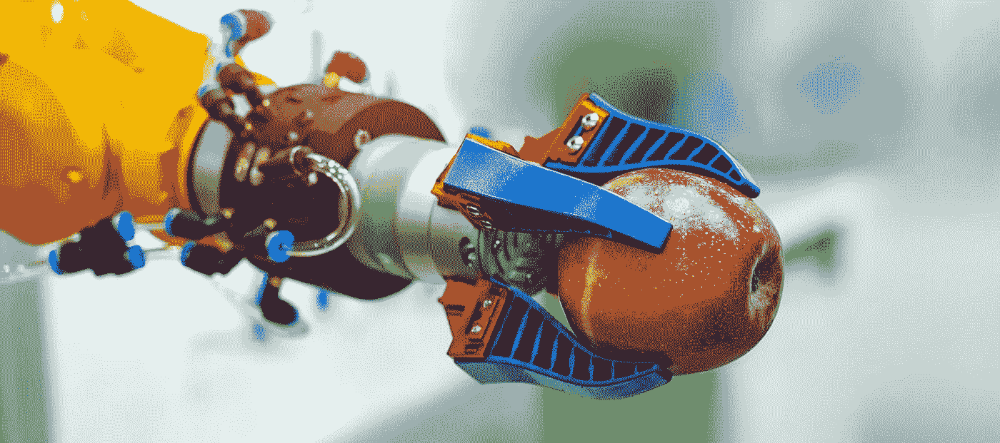
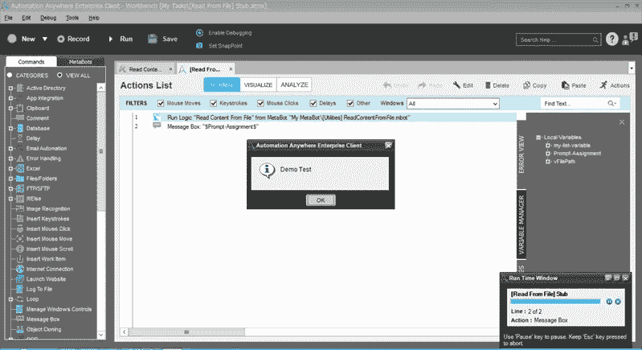
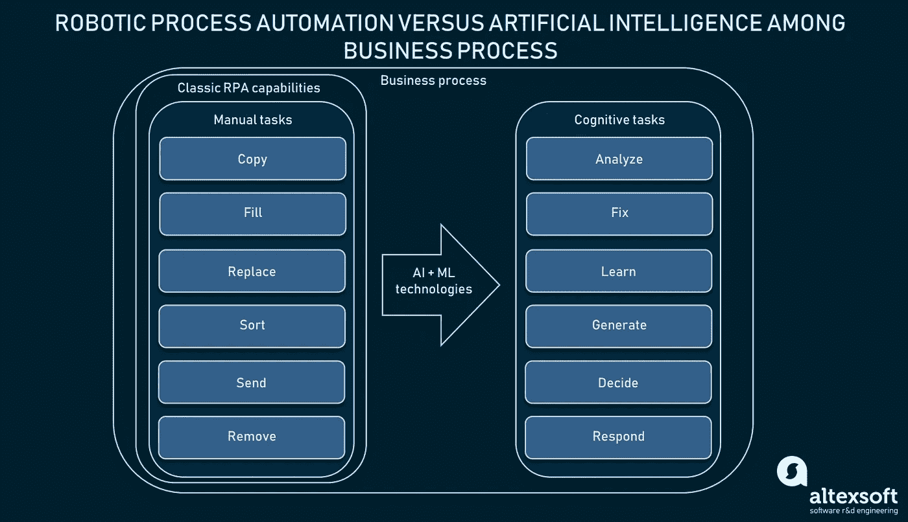
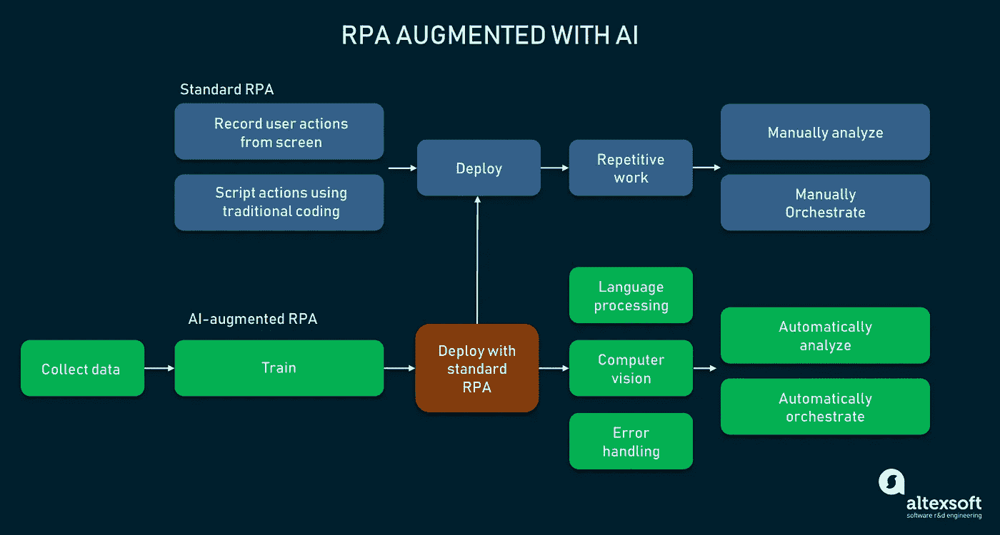
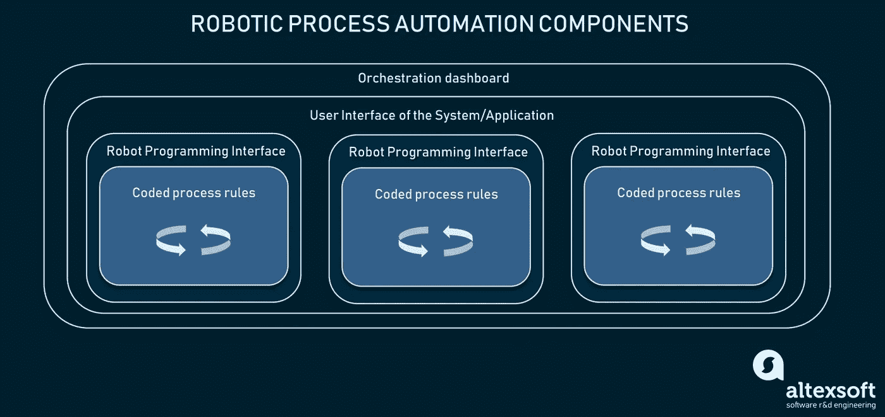

# 机器人过程自动化(RPA)如何应用人工智能:认知自动化、技术分析和用例

> 原文：<https://medium.datadriveninvestor.com/how-robotic-process-automation-rpa-applies-artificial-intelligence-cognitive-automation-50f1b341f82c?source=collection_archive---------2----------------------->

当考虑自动化时，我们倾向于考虑工业过程和机械。虽然这是一个很好的例子，但请记住，自动化不仅解决了蓝领工人的问题，也解决了白领阶层的问题。在过去的十年里，出现了旨在实现办公流程自动化的新技术。

专门涉及业务流程的自动化子集被称为 ***机器人流程自动化*** 或 ***RPA*** 。RPA 的概念并不新鲜，它已经成为优化企业内部流程的标准。但是，它只有在*人工智能(AI)* 和*机器学习(ML)* 的帮助下，才开始获得真正的力量。人工智能技术和 RPA 的融合被称为*智能*或*认知自动化*。

在这篇文章中，我们将探索什么是机器人过程自动化，它如何在经典意义上工作，以及人工智能技术如何在其中使用。区分 RPA 问题，我们将着眼于真实案例来展示 AI 或 ML 如何解决问题，并检查认知自动化技术的行业案例。

# 什么是标准机器人过程自动化？

**机器人流程自动化**是自动化简单的基于规则的流程的最基本方法之一。它的前身应该被认为是屏幕抓取和重复用户动作，它仍然应用在 [QA 自动化](https://www.altexsoft.com/quality-assurance-qa-automation-services/?utm_source=MediumCom&utm_medium=referral)中。但是，RPA 的主要目标是减少人类参与不需要认知努力的劳动密集型任务，如填写表格或在电子表格中进行计算。

RPA 利用被称为*机器人*(想想机器人)的软件程序。机器人是 RPA 的支柱，RPA 是虚拟劳动力。机器人代表可编程或自编程单元，可以与系统中的不同应用程序交互以执行各种过程。机器人自动化中任何机器人的关键要素是它们只能在用户界面(UI)中工作，而不能与机器(或系统)本身一起工作。

下面是一个解释 RPA 工作原理的示例:

1.  您的员工必须手动在表单中输入数据，无论是发票、订单请求、采购订单、交易细节等。
2.  这是通过 Microsoft Office 工具完成的，数据存储在电子表格、ERP 或 CRM 中。
3.  机器人可以被编程为遵循与真实用户相同的模式，这要求它知道 UI 元素在哪里，以及流程是什么。
4.  每次流程改变时，规则都是硬编码的。或者机器人正在对人工代理再现的过程进行屏幕抓取。
5.  使用多个机器人，人类操作员可以选择多个重复的活动，并为它们应用机器人。

按照规定的流程，机器人将开始像人类雇员一样执行其功能。要查看真实示例，请观看 Blue Prism 机器人处理客户订单的演示视频:

*Blue Prism bot processing customer orders demo*

根据行业的不同，机器人可以有一个它可以处理的预先编写的任务列表。机器人通常由供应商构建和提供。因此，机器人的集成任务和配置可以由供应商执行。对于自己编程的 bot，也有专门的**编程接口**可用，基本上就是一个 bot 编程的 IDE。但是，您也可以构建和配置自定义机器人。

*Automation Everywhere bot programming interface Source:* [*ui.vision*](https://ui.vision/blog/uipath-vs-automation-anywhere/)

机器人可以安装在用户的设备上，以防其处理敏感数据，或者作为 SaaS 解决方案从云中运行。但对于屏幕抓取的简单利用，RPA 已成为自动化白领流程和启动数字化转型的标准方式。

# 当前 RPA 限制

机器人能够完成属于它们的所有任务:点击、打字、导航、复制/粘贴/删除、打开应用程序、访问网站等。，所有这些都足以完成他们想要完成的简单任务。每当过程中发生变化，机器人就会出错，或者停止工作，因为这些变化没有包含在规则中。因此，传统形式的 RPA 确实有一定的局限性:

**需要人类介入**。机器人可能几乎不需要任何编码知识来配置和完成一些简单的任务。部分来说，这是可能的，因为屏幕记录和抓取允许机器人通过观察真正的员工来了解真正的用户点击/打开/放下了什么。然而，这需要时间和人类来教会机器人。对于更复杂的任务，除了硬编码流程和规则之外，别无选择。

**没有弹性**。今天，RPA 机器人无法在没有人类交互的情况下响应系统中的变化。这意味着每次工作流或界面中有微小的变化时，开发人员都应该中断并修改流程。

受限于规定的规则，RPA 很难用于自动化复杂的流程。因此，随着人工智能的进步，机器人自动化行业供应商开始利用人工智能技术来提高 RPA 机器人的认知能力。

# 机器人过程自动化的下一步:认知自动化

屏幕抓取器是机器人流程自动化的基础技术，它不同于构建人工智能。虽然机器人自动化涉及通过用户界面模仿人类活动，但人工智能旨在模仿人类的思维过程。

简而言之，人工智能是一个广义的概念，即创造一台能够像人类一样解决狭隘问题的机器。像任何人一样，人工智能应该首先学习信息/过程。机器学习是人工智能的一个子集，可以通过从数据中学习来解决问题。随着人工智能技术变得越来越普及，RPA 正面临着克服当前限制的机遇。

*RPA capabilities versus AI in the business process*

人工智能正在向 RPA 迈出第一步，但许多供应商已经声称拥有由机器学习算法驱动的机器人。为了区分科幻类的东西和人工智能到底是什么，你可以观看我们解释人工智能及其子集的核心定义的视频:

*Definition and examples of artificial intelligence explanation*

因此，RPA 代表了一个基于规则的系统的经典示例。这意味着机器人只能做它被指示做的事情。虽然它足以完成有严格规则或不变条件的任务，但人工智能和机器学习具体来说可以用认知能力甚至决策能力武装机器人。目前，基于 ML 的 RPA 有四个主要分支(或者更确切地说，是用 ML 技术增强的 RPA):

*   人类语言处理
*   计算机视觉
*   RPA 分析和自动编排
*   错误处理

利用新技术将改变实现机器人自动化的整个方法。但人工智能的能力将为自动化需要认知努力甚至修复人类错误的任务开辟一个新的领域。

*Standard RPA implementation can be augmented with additional AI-driven capabilities*

因此，让我们来分解这些用例，并分析哪些人工智能技术可以用来实现这一点。

# 虚拟助手和语音转录的人类语言处理

RPA 主要用于自动化后台流程。然而，有许多日常工作仍然需要人类来完成。该领域的一个机会是实现人类语言处理技术，使机器人能够准确理解人类语音或文本。自然语言处理(NLP)是一种有助于做到这一点的技术。一些最先进的聊天机器人利用自然语言处理与人类交流，转录语音，分析语音，甚至做出反应。那么，NLP 的使用机会有哪些呢？

**电话呼叫转录**。有了 NLP，就有可能实现客户支持流程的自动化，或者使机器能够使用人类语音作为输入。例如，你可以通过 Cognizant 阅读一个[案例研究](https://www.cognizant.com/case-studies/ai-claims-automation)。他们向一家保险公司提供了一个智能机器人，通过一个从电话中转录人类语言的机器人来自动化通知丢失的过程。

虚拟助理。另一个常见的用例是构建能够理解客户服务请求并提供自动响应的聊天机器人。

**报告生成**。麦肯锡[建议](https://www.mckinsey.com/business-functions/digital-mckinsey/our-insights/intelligent-process-automation-the-engine-at-the-core-of-the-next-generation-operating-model)应用文本生成技术来自动创建报告。由于基于规则的 RPA 机器人可以跨多个来源收集信息，因此可以在标准报告上训练基于 NLP 的算法，以使用提供的数据自动生成报告。

# 分析文本、图像和界面的计算机视觉

识别书面字符需要机器“阅读”每个符号，并学习如何组合理解它们。但是像照片这样的视觉信息有更多的维度需要分析，所以不同的技术被用来教机器分析图像。

**计算机视觉**旨在教会机器看到现实世界的物体，并对其做出解释:命名物理属性或对它看到的物体进行分类。你可以在自动驾驶汽车或移动应用程序中找到计算机视觉的实现，这些应用程序可以通过摄像头测量物体的尺寸，甚至分析他们看到的东西。在 RPA 中使用计算机视觉可以实现后台操作或人工操作的自动化。

**书面文字识别**。例如，计算机视觉可以用于将文档中的书面文本转换为数字副本，以便由标准 RPA 系统进一步处理。或者这可能是对数字化纸质文档的独立解释。

**图像分析**。许多机械维修工作都依赖于对视觉信息的分析。通过将机器的图像发送到算法，维护部门将能够在人类参与之前接收初始视觉分析。这也可以应用于保险行业，以支持[索赔评估](https://www.altexsoft.com/blog/datascience/ai-in-insurance-business-process-automation-brings-digital-insurer-performance-to-a-new-level/?utm_source=MediumCom&utm_medium=referral)。例如，一辆受损汽车的图像可以提供财务覆盖范围的初步估计。

**界面分析**。由于传统的 RPA——与接口一起工作——不能处理接口变化，基于 ML 的系统可以帮助适应微小的接口变化并保持机器人工作。这也意味着基于 ML 的系统可以被训练识别标准的界面内容，如文本、表单和按钮，以减少人工参与准备这些机器人用于生产。

# RPA 分析和自动编排

这是当今最复杂的应用领域，因为它需要对机器学习研究进行大量投资，并最终需要设计能够支持人类判断的决策系统。

**机器人性能分析**。如果 RPA 机器人被大规模部署并执行数百项手动任务，那么寻找瓶颈和改进机会将成为一项复杂的分析任务。通过使用历史和当前数据，可以定义异常或瓶颈原因，以进一步优化 bot 性能。

**自动编排**。机器人很少单独使用。通常有数百个，这就产生了集中控制的问题。因此，在 RPA 中，使用了流程编排控制面板。编排工具是命令仪表板，用于管理多个机器人的活动、配置它们、更改访问级别、打开数据源等。流程编排工具还用于部署新的机器人、扩展容量/数量或管理意外的变化。这些工具可以作为基于云的应用程序交付，也可以集成到现有系统中。例如，查看 [UiPath orchestrator](https://www.uipath.com/product/orchestrator) 以了解 RPA 控制面板的外观。

*Components of RPA system*

虽然数据分析肯定会被人类代理查看，但有些领域可能会被机器人携带。例如，扩展工作机器人的数量或机器人分配是可以使用 ML 算法自动化的优化任务。

# 人为错误处理

这个用例对于受到严格监管的行业至关重要，在这些行业中，员工必须处理大量信息，并且在填写表格或进行账户对账等操作时遵守多个州的监管要求。在保险、设施、金融和其他领域，这仍然是一个非常容易出错的过程。它需要多层次的验证，最终需要时间。

在受监管的行业中使用机器学习的一个传统问题是缺乏系统可解释性。简而言之，基于深度神经网络的最先进的人工智能系统在行动上可以非常精确，但对其创造者和监管机构来说仍然是黑匣子。缺乏可解释性对监管者来说是一个危险信号。然而，基于人工智能的系统仍然可以用于错误处理，因为它们可以识别潜在的错误，并为人类同行突出显示它们。

例如，在银行对账中，此类系统可能会显示重复条目、不同的数据格式、数据差异、各种人为错误，如放置逗号、添加错误的字符间距等。

其中一些用例已经实现了，大部分是通过定制工程实现的。然而，现成的 RPA 提供商也声称拥有 ML 系统。

# 支持基于 ML 的机器人的关键 RPA 提供商

市场上所有最大的 RPA 提供商，如 [UiPath](https://www.uipath.com/) 、 [Automation Everywhere](https://www.automationanywhere.com/) 和 [Blue Prism](https://www.blueprism.com/) ，都提供封闭代码解决方案，这既是优势也是劣势。对于封闭的代码库，您将处理的数据委托给供应商，希望没有严重错误会损害机器人。还有像 [Kantu](https://ui.vision/) 这样的开源玩家，为行业巨头提供了一种选择。

**Automation Anywhere** 在 2019 年公开了其 [IQ Bot](https://www.automationanywhere.com/products/iq-bot) 作为无人值守 RPA 的一部分。机器人能够通过观察人类员工执行任务来学习。它配备了语言和图像处理工具，允许 IQ Bot 识别低分辨率文档，并以 190 种语言阅读。这可以被认为是自学/无代码 RPA 的一个例子。

**另一家行业巨头蓝色棱镜**也在推广其名为 [Cogito](https://www.blueprism.com/resources/blog/how-cognitive-technology-brings-intelligence-to-robotic-process-automation) 的 AI 解决方案。Blue Prism 声称，Cogito 系统利用语义分析、自然语言处理和机器学习算法来理解上下文中的信息。[智能自动化页面](https://www.blueprism.com/product)还包含有关 RPA 解决方案利用分析技术的信息。

第三大供应商 UiPath 也有其[智能自动化产品](https://www.uipath.com/rpa/intelligent-process-automation)。除了前面提到的两家厂商，UiPath 还提供了无人值守的语言和图像识别功能。

正如对市场的简要概述所示，AI 还不是 RPA 的成熟部分。虽然主要供应商开始实施智能技术，并通过分析、语言处理和图像识别来增强他们的机器人，但这离认知能力的意义还很远。

# 如今 RPA 有什么好处？

[根据德勤全球 RPA 调查 2017](https://www2.deloitte.com/bg/en/pages/technology/articles/deloitte-global-rpa-survey-2018.html) ，53%的受访者已经开始实施 RPA 解决方案，而且这一数字还将继续增长。虽然没有人知道 RPA 对您的企业来说是否是一个好的选择，但机器人自动化变得越来越受欢迎。尽管目前存在诸多限制，但它仍然提供了许多好处:

*   **减少人为介入**。RPA 可以帮助您的组织管理时间，并确定更重要任务的优先级。
*   **不中断工作**。机器人从不疲劳，所以任务可以整天整夜地执行。
*   **人力资源的优化利用**。这听起来可能有点尴尬，但是 RPA 实施将帮助您优化员工之间的合作方式以及管理他们的时间。更重要的是，它将使您不必仅仅为了增长而招聘，因为机器人将处理大多数日常任务。
*   **严谨**。当我们谈论手动完成的财务操作时，接近零的错误率产生了巨大的差异。
*   **运行速度**。与人类相比，机器人执行程序代码的速度要快得多。
*   **系统不可知论**。大多数情况下，您会发现 RPA 机器人不依赖于操作系统的细节，而是依赖于应用程序。这些机器人的目标是在用户界面中运行，成为跨平台的应用程序，或者在云上工作。
*   **性价比**。虚拟员工大军的运营成本更低。但是，更重要的是，投资回报(ROI)有望大幅增长。
*   **数据质量改善**。在执行业务流程时，您的员工从各种系统获取数据。犯错误或以不同的方式构建数据会影响数据的质量，这使得进一步的分析更加困难。机器人不容易出错。
*   **快速实现**。在大多数情况下，机器人不需要与现有系统如 ERP 或 CRM 集成。
*   **可扩展性**。机器人可以增加或删除，这允许根据需要扩展工作人员，使 RPA 适用于小型和大型企业。
*   **易用性**。一些供应商提供免费的机器人，只需点击几下鼠标就可以完成配置。最著名的例子可能是 [UiPath 社区版](https://www.uipath.com/developers/community-edition)。该工具可以像任何其他软件程序一样安装，不需要任何代码来配置它。
*   **使用范围广**。由于 RPA 机器人读取指令，因此可以创建包含行业相关标准默认例行任务包的机器人。这使得 RPA 非常普遍，只要它可以用于自动化医疗保健、金融或电子商务中的几乎任何日常流程。

很明显，RPA 的优势超越了局限性。然而，对人类互动的依赖仍然是一个大问题——这个问题可能会在人工智能的帮助下得到解决。

*最初发布于* [*机器人流程自动化(RPA)如何应用人工智能:认知自动化、技术分析和用例*](https://www.altexsoft.com/blog/datascience/how-robotic-process-automation-rpa-applies-artificial-intelligence-cognitive-automation-technology-analysis-and-use-cases/?utm_source=MediumCom&utm_medium=referral)