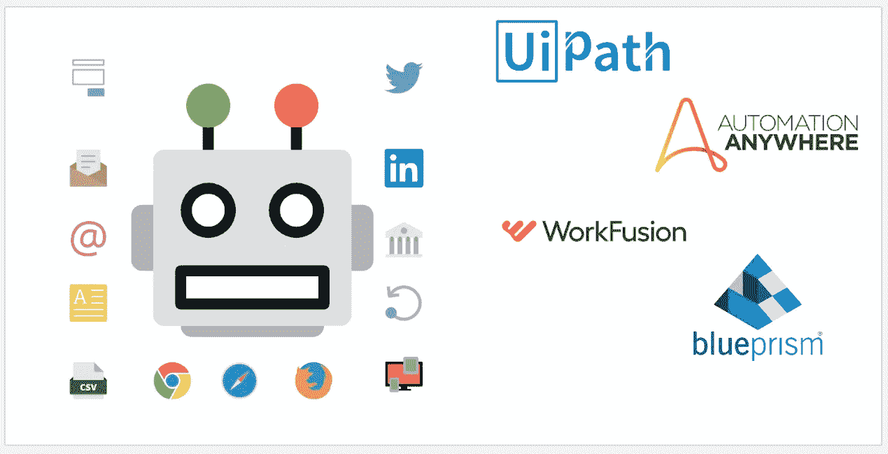
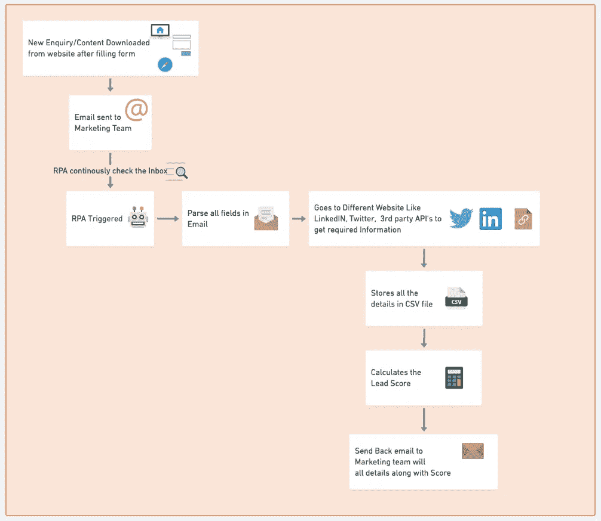
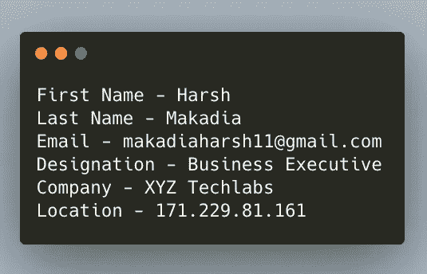
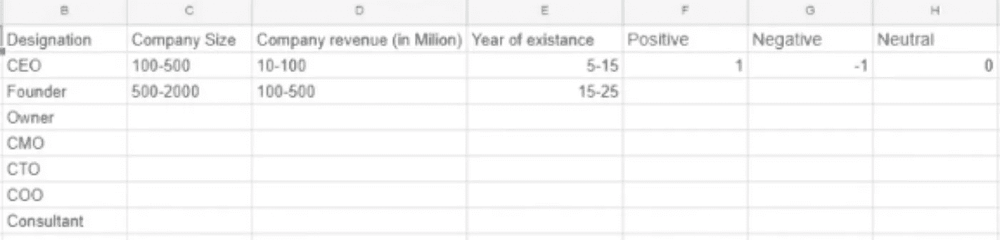
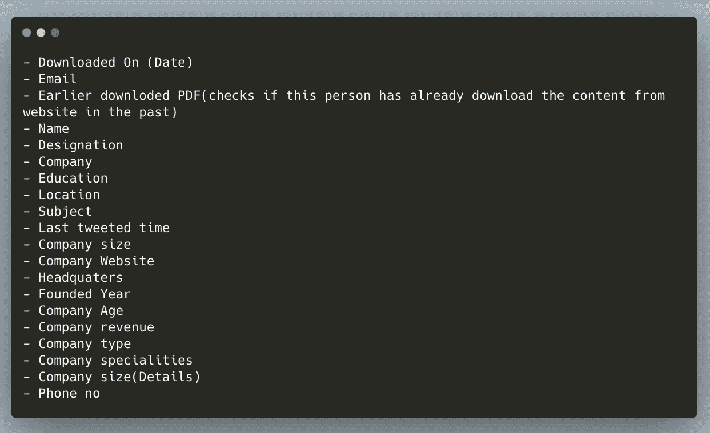

# 机器人流程自动化(RPA)如何帮助实现内向销售线索的自动化

> 原文：<https://medium.datadriveninvestor.com/how-robotics-process-automation-rpa-helped-to-automate-the-inbound-leads-9c459f781dc0?source=collection_archive---------3----------------------->

机器人过程自动化(RPA)是使用具有人工智能(AI)和机器学习功能的软件来处理以前需要人类执行的重复性任务。

RPA 从三项关键技术发展而来:屏幕抓取、工作流自动化和人工智能。

 [## 金融科技初创公司正在扰乱世界各地的银行业-数据驱动的投资者

### 传统的实体银行从未真正从金融危机后遭受的重大挫折中恢复过来…

www.datadriveninvestor.com](https://www.datadriveninvestor.com/2018/10/20/fintech-startups-are-disrupting-the-banking-industry-around-the-world/) 

> 有不同的工具可用于执行自动化，如 UiPath、Automation Anywhere、Blue Prism、WorkFusion 等等。

Welcome to the world of automation

# 销售线索评分是一种方法，用于根据代表每个销售线索对组织的感知价值的尺度对潜在客户进行排名。

销售线索评分有助于营销团队对潜在客户的跟进活动进行优先排序。这里有一个简单的案例研究，介绍了我如何基于不同类型的因素自动进行销售线索评分，以确定该销售线索是否足够好，可以使用 UiPath 进行接洽。

**目标:**

> 执行 RPA 以获取从网站下载内容或填写联系我们表单的用户的所有详细信息。执行自动化以获得有关销售线索当前位置、经验年份、公司实力、收入、位置等的详细信息，从而检查它是否是热门销售线索。

下图简要概述了自动化过程中处理入站销售线索的不同步骤。

RPA workflow to process leads

使用机器人流程自动化执行以下步骤

1.  当用户从网站上下载一些内容，如电子书/案例研究或填写联系我们表格时，公司会收到一封电子邮件，其中包含用户的基本信息，如 ***姓名、电子邮件地址、职务*** 。

Details that are received in the email received

2.线索评分就是根据不同的因素，如名称、公司名称、地点、存在年份、公司收入等，给从网站下载内容的用户打分。

3.一张包含所有评分细节类型的表格将作为一种输入，用于找出实际分数。

Config sheet for calculating the lead score

4.RPA 机器人读取电子邮件，解析所有必需的详细信息

5.尝试从下载时提供的电子邮件地址中查找用户的 LinkedIn 个人资料。

6.从 LinkedIn 个人资料中获取所有重要信息，如教育背景、当前职位、工作经验、地点、公司名称

7.使用 LinkedIn 查找公司的详细信息，了解员工的实力，公司的专长是什么

8.查找关于 twitter 个人资料的详细信息，以检查 Twitter 句柄是否处于活动状态，获取句柄的最后一条 tweet 时间、追随者和追随者

9.尝试利用第三方网站了解公司收入，并收集必要的详细信息

10.在 CSV 文件中收集所有这些详细信息，以便更好地了解销售线索

11.向营销团队发回电子邮件，以便对后续电子邮件等做出更好的决定。

The email send back after automation performed has following fields

因此，RPA 节省了大量人工处理所有销售线索和采取行动所需的时间/精力。现在有了自动化，营销团队可以把时间花在其他生产任务上。这只是如何实现自动化的一个小用例，但是，RPA 也可以用于更复杂的场景。

毫无疑问，机器人过程自动化将是所有企业来年的福音，节省大量时间和人力。

***欢迎来到自动化的世界***

快乐学习💻 😄