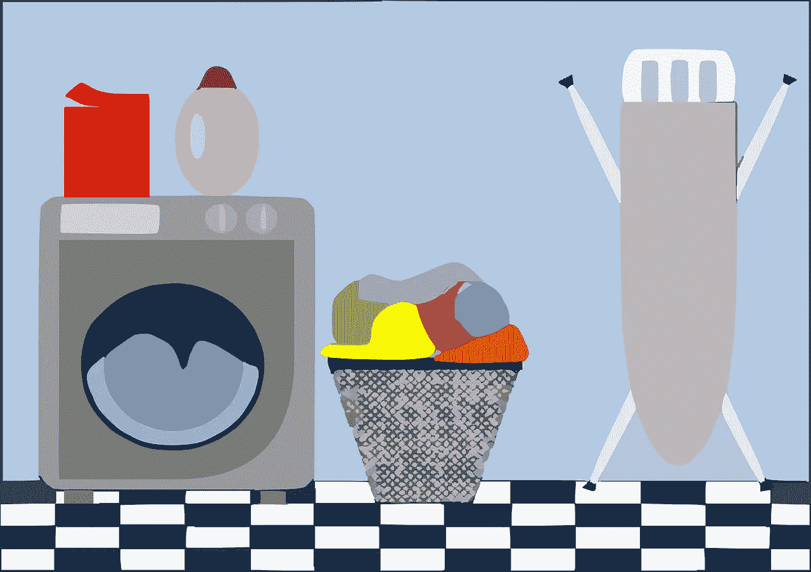
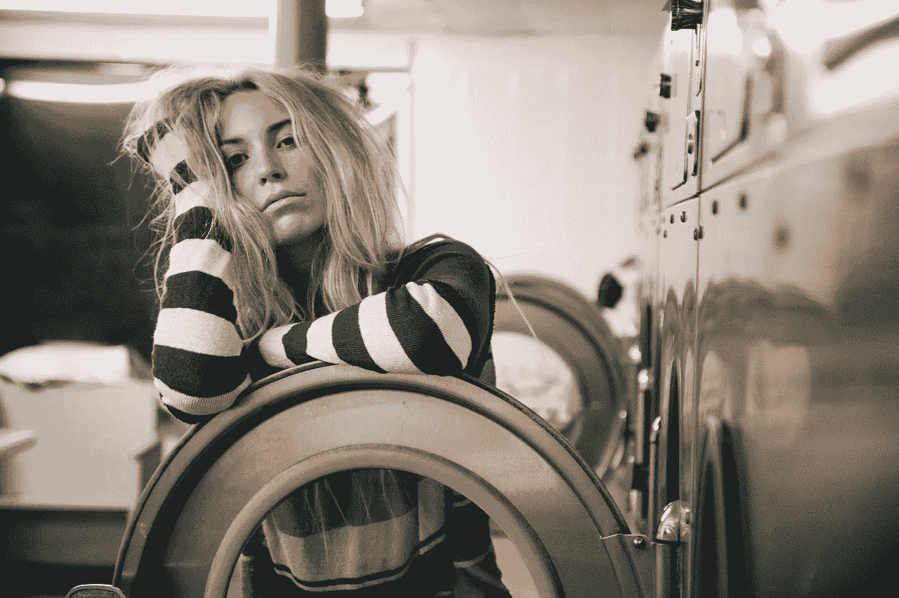
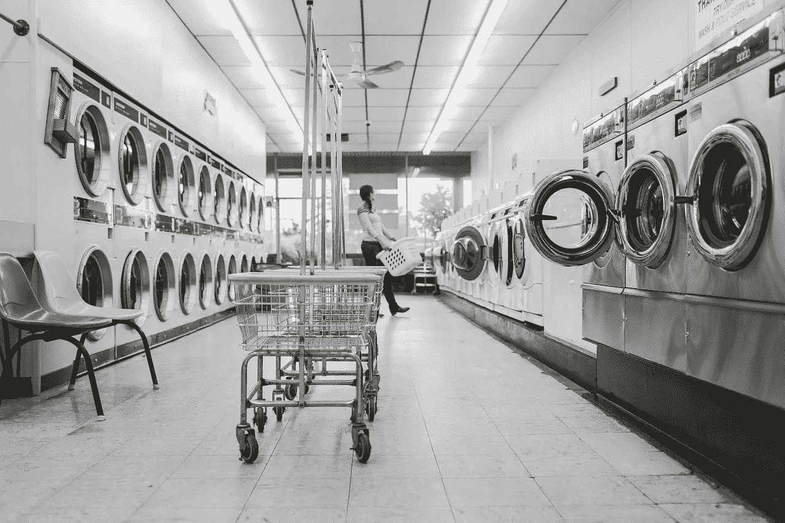
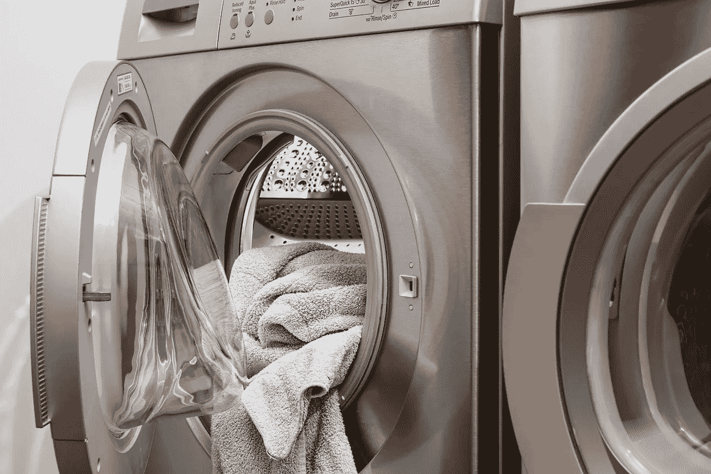

# 宝洁公司有多安全？

> 原文：<https://medium.datadriveninvestor.com/how-safe-is-procter-gamble-94f14fd8747f?source=collection_archive---------4----------------------->

我问宝洁(NYSE: PG)有多安全，因为某个价值投资学派认为，当利率上升时，消费品更安全。

解释一下，[认为](https://www.cnbc.com/2019/03/27/these-stocks-are-seen-as-a-good-bet-when-interest-rates-fall.html?recirc=taboolainternal)当利率上升时，可自由支配的支出下降，但人们仍然购买日常消费品。例如，当利率高的时候，人们仍然会洗衣服。

因此，宝洁公司，或 P&G，是完美的消费品制造商，因为它生产美国五种最受欢迎的洗涤剂中的三种。事实上，销售两种 P&G 清洁剂；汰渍和增益，是 2018 年第四大最受欢迎的洗涤剂的五倍以上。

# **宝洁公司拥有洗衣液业务**

详细来说，美国最受欢迎的洗衣皂是 P&G 的汰渍，据 Statista [计算](https://www.statista.com/statistics/188716/top-liquid-laundry-detergent-brands-in-the-united-states/)2018 年美国销售额为 10.1775 亿美元。第二，宝洁公司 2018 年美国销售额为 5.8111 亿美元。

第三个是 Tide Simply Clean and Fresh，2018 年在美国的销售额为 2.829 亿美元。第四是 Arm & Hammer，这是一款非 P&G 产品，2018 年在美国的销售额为 2.4477 亿美元。

因此，宝洁公司在美国拥有洗衣液业务。此外，Statista 报告称，美国前 10 大洗衣液中有 6 个是 P&G 产品。

因此，宝洁公司是测试消费者主食稳定性论题的最佳公司。有趣的是，P&G 的财务数据为这一论点提供了一些佐证。

 [## 数据驱动投资的兴起——数据驱动投资者

### 当 JCPenney 报告其 2015 年 2Q 的财务结果时，市场感到非常震惊。美国零售巨头…

www.datadriveninvestor.com](https://www.datadriveninvestor.com/2019/02/28/the-rise-of-data-driven-investing/) 

# **宝洁是一家稳定的公司吗？**

宝洁是一家稳定的公司，因为在过去的九个季度中，其收入一直徘徊在 160 亿美元至 170 亿美元左右。

具体来说，P&G 报告 2016 年第四季度收入为 168.56 亿美元，2017 年第四季度为 73.95 亿美元，2018 年第四季度为 174.38 亿美元。因此，在美联储公开市场委员会[将政策利率从 2015 年的 0.5%上调至 2016 年的 0.75%，2017 年的 1.5%，2018 年的 2.2%至 2.5%，2019 年的 2.5%期间，宝洁的收入略有上升， *Focus-Economics* 报道。](https://www.focus-economics.com/country-indicator/united-states/interest-rate)

然而，P&G 的毛利在此期间下降了。为了解释，P&G 报告 2016 年第四季度的毛利为 85.58 亿美元，2017 年第四季度为 86.86 亿美元，2018 年第四季度为 85.19 亿美元。因此，尽管利率较高，宝洁的利润却略有下降。

# **亚马逊和沃尔玛如何威胁宝洁的未来**

我的猜测是，P&G 的利润较低，因为像**沃尔玛(纳斯达克代码:WMT)** 、**亚马逊(纳斯达克代码:AMZN)** 和**克罗格(纽约证券交易所代码:KR)** 这样的大型折扣店迫使它保持低价。折扣巨头迫使宝洁公司保持低价，因为他们控制了大部分市场。

例如，Statista [估计](https://www.statista.com/statistics/188716/top-liquid-laundry-detergent-brands-in-the-united-states/)沃尔玛在 2017 年控制了 26%的美国杂货市场。同时，亚马逊在 2018 年拥有美国电子商务市场 33.7%的份额，*数字商务 360* [计算](https://www.digitalcommerce360.com/2019/02/27/amazon-grabs-a-third-of-us-ecommerce-sales-in-2018/)。因此，亚马逊和沃尔玛都能够迫使宝洁降价以接近他们的顾客。

值得注意的是，克罗格在一些地区拥有食品杂货市场。具体来说，克罗格声称拥有辛辛那提 60%的食品杂货市场，*商业信使* [报道](https://www.bizjournals.com/cincinnati/news/2015/10/29/kroger-discloses-cincinnati-market-share-we-use-it.html)。因此，宝洁必须让克罗格高兴，才能进入许多市场。

# **亚马逊和克罗格如何将宝洁挤出市场**

此外，克罗格和**奥卡多集团有限公司(伦敦证券交易所:OCDO)** 正在[建造](https://marketmadhouse.com/kroger-kr-and-ocado-plan-robotic-warehouse-in-ohio/)机器人履行中心，这可能会主导一些市场的杂货交付。解释一下，履行中心将使用成群的机器人来拉动和包装杂货订单。然后，像 Instacart 这样的服务将运送食品杂货。

此外，亚马逊正在像洛杉矶这样的市场测试两小时的 Prime Now 杂货递送选项。因此，送货可能会使宝洁公司比以往任何时候都更加依赖大型零售企业。

在这种情况下，亚马逊、克罗格和沃尔玛等零售商可能会将 P&G 挤出一些市场。例如，Kroger 可以为其自有品牌 Persil 或 Arm & Hammer 提供免费送货服务。

# 宝洁是一项好的投资吗？

尽管有这些风险，我认为宝洁公司是一个很好的投资，因为它的价格很现实，股息也很高。

我认为市场先生在 2019 年 4 月 4 日将 P&G 的价格定为每股 103.35 美元是正确的。此外，宝洁公司于 2019 年 2 月 15 日支付了 71.7₵股息。此外，2.7₵在 2018 年增加了股息，从 2018 年 2 月的 69₵增加到 2018 年 8 月的 71.7₵。

令人印象深刻的是，股息可能会在 2019 年增长，因为 Dividends.com 认为宝洁公司有 62 年的股息增长。此外，截至 2019 年 4 月 4 日，宝洁股东的派息率为 64.9%，年化派息为 2.47 美元，股息率为 2.78%。

# **宝洁公司&有安全记录**

因此，P&G 的历史使其成为一笔极好的长期收入。例如，它的股息在 20 世纪 60 年代的疯狂、70 年代的滞胀、80 年代的衰退、80 年代和 90 年代沃尔玛的崛起以及 2008 年的经济大崩溃中保持增长。

因此，宝洁部分证明了这样一个论点:在混乱时期，消费品是安全的投资。然而，最近的历史证明，技术和市场的变化可以迅速摧毁主导品牌。

例如，西尔斯、诺基亚、黑莓和通用汽车等曾经强大的品牌在过去二十年中已经崩溃。此外，一些强大的消费品牌如**麦当劳**正在[努力](https://marketmadhouse.com/mcdonalds-mcd-and-the-incredibly-shrinking-revenues/)保持市场份额。

# **电商会拯救宝洁&吗？**

P&G 面临的最大威胁是由技术驱动的购物习惯的改变。具体来说，电子商务和交付越来越容易、方便和快速。

然而，宝洁像 Tide 这样的强势品牌使其在电子商务领域拥有优势。解释一下，在网上订购洗衣液的懒消费者，会先订购自己认可和信任的品牌。这样，那些顾客就会订购 Tide。

此外，P&G 可以通过使用电子商务直接向客户销售来赚更多的钱。例如，与 Instacart 达成独家协议，将 Tide 直接送货上门。因此，宝洁可以通过消除实体零售商来赚更多的钱。

归根结底，宝洁公司是一个强大的公司，它将生存下去并赚钱。因此，P&G 的红利可能会持续很多年。