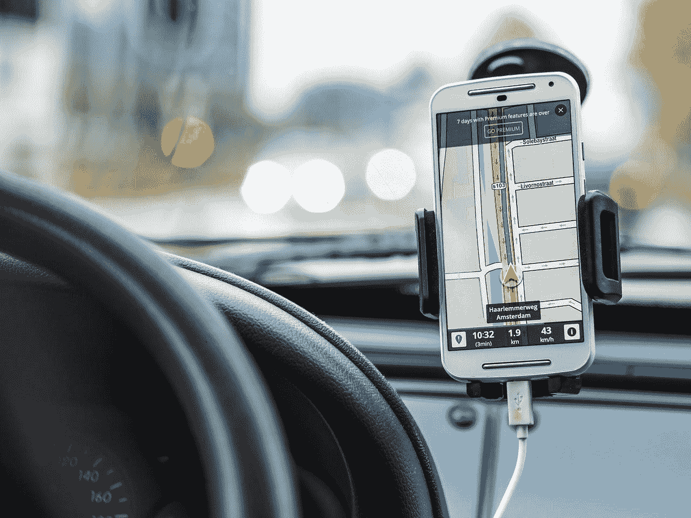

# 使用拼车应用程序，你的数据实际上有多安全？

> 原文：<https://medium.datadriveninvestor.com/how-safe-your-data-actually-is-with-your-ridesharing-app-679f3c775ba9?source=collection_archive---------16----------------------->

## 数据安全是一个永无止境的争论。

我认为可以肯定地说，到目前为止，几乎每个人都尝试过拼车服务。在某些国家，它们可能还很新，但最近它们已经风靡全球。当然，我指的是像[优步](https://www.uber.com/)、 [Taxify](https://taxify.eu/) 或 [Lyft](https://www.lyft.com/) 这样的服务(我很确定还有很多这样的服务)。如果你没有尝试过，至少你肯定听说过。

开始时，兼职工作是一个非常棒的主意，是一种轻松赚外快的好方法，也是一种舒适公平的旅行方式，现在这个主意变得稍微复杂了一些。虽然出租车司机和地方议会不断与优步司机发生战争，但这些服务似乎并不那么好——至少从法律角度来看，到目前为止。

但是坏运气并没有停留在拼车平台上。看起来就连创新本身也不完全支持。引入自动驾驶汽车听起来是一个非常大胆和超前的想法，但看起来似乎所有的可能性都与他们相反。有多起[事故涉及的自动驾驶](https://www.economist.com/the-economist-explains/2018/05/29/why-ubers-self-driving-car-killed-a-pedestrian)汽车充斥新闻。这让你想知道你是想坐在其中一辆车里，还是真的想使用这样的服务。

这些平台的另一个伟大之处是高度透明:你提前得到票价，你可以看到你的旅行历史，万一你找不到你的司机就打电话给他等等。这就是我选择使用其中一个平台的原因。看起来很安全也很容易，车手几乎一直都很专业。但我最近的一次经历让我重新思考了透明度的水平，以及它如何容易适得其反。

 [## 为什么加密对日常生活至关重要？数据驱动的投资者

### 你几乎每天都要输入密码，这是你生活中最基本的加密方式。然而问题是…

www.datadriveninvestor.com](https://www.datadriveninvestor.com/2020/02/10/why-encryption-is-critical-to-everyday-life/) 

因此，这让我想到了这篇文章的要点:你知道你在用你的拼车应用程序分享什么数据吗，此外，你知道它有多安全吗？如果你生活在欧盟，你可能已经说过了:“但是 GDPR！！!"。让我们面对现实:没有人真正获得 GDPR 奖，只是你不应该泄露个人数据。

# 你在分享什么数据？

也许有些事情是显而易见的，有些不是。但这是你从一开始就与他们分享的:

*   **你的电话号码**——不提供你的电话号码，你将无法使用该应用程序
*   **你的卡信息**——同样是强制的，因为如果没有有效的信用卡或借记卡，你就不能使用这个应用程序
*   **电子邮件地址**——我们都希望收件箱里有收据，不是吗？

如果你想使用这款应用，这些都是必须的，但你可能还没有意识到，就已经泄露了很多其他数据:

*   你的生日——免费的东西，哦！
*   **您的家庭和工作地址** —便于在应用程序中导航
*   **您的日历** —不知道为什么这个选项可用，我没有使用它
*   你的照片——因为这是一张非常好的照片，其他人应该看到它，对吗？

你给出的信息可能多或少，这取决于应用程序和你实际给出的信息。

你会说有很多“无辜”的数据，如果你真的想从这项服务中受益，你就必须放弃一些。没错。但接下来我要和你分享的，会让你三思而后行。

pixabay.com

# 你有多安全？

遵循“透明”的好处，这些应用程序允许你报告不同的问题，如:票价高于预期，汽车不安全，司机不专业等等。这听起来不错，它应该让你感到安全和保护。

其中一些应用程序会给你几个小时(可能长达一天)的缓冲窗口，以查看司机的电话号码，反之亦然，例如“我把东西忘在车里了”或类似的情况。

不是因为骚扰。

> 如果我告诉你，司机会打你的私人电话，询问为什么他的车被暂停？

我基本上遇到的情况是，应用程序的收费超过了预期，我问他们发生了什么。显然，他们暂停并收回了司机的钱(以及我的钱)。在旅程结束 4-5 个小时后，司机打电话给我，问我为什么他的旅程被暂停了，他现在去哪里拿回他的钱。

我的心脏几乎停止了跳动。那个人从应用程序中保存了我的号码，知道我住在哪里(他送我回家)。现在打电话给我要求解释。

谈到大胆的创新和技术，我是相当支持的。但是我从来没有想过这样的事情会发生在我身上。我的意思是，我们有该死的 GDPR，对吗？！

虽然在这种情况下你可能会得到一大笔钱，但这仍然需要时间。与此同时，沮丧的司机可以继续打电话给你，或者最终实际上拜访你，因为他想要回他的 20 美元，而你不再回答他的骚扰电话。

# 你的数据安全吗？

经过这次丑陋的经历，我会说不。

但是让我们面对它:我们知道我们的数据在我们选择放弃的那一刻就不是 100%安全的。我们冒这个险是因为发生在我身上的事不太可能发生在你身上。我以前也是这么说的。

虽然情况得到了解决，没有任何重大问题，但它让我在叫车和提供任何关于我的信息时三思而行。我从平台上删除了我的账户，要求他们删除所有关于我的数据，并将继续使用我知道不会分享你的个人号码的应用程序(提示:优步不会显示你的号码，你也看不到司机的实际电话号码——或者至少这是它在罗马尼亚的工作方式)。

## 你知道你在泄露什么数据吗？它有多安全？

*照片:Pixabay /文章原载于* [*LinkedIn 脉搏*](https://www.linkedin.com/pulse/how-safe-your-data-actually-ridesharing-app-oana-cristina-ilie/) *。*