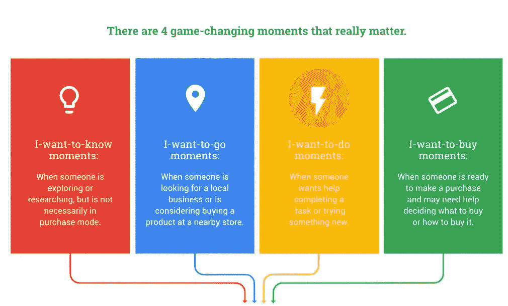
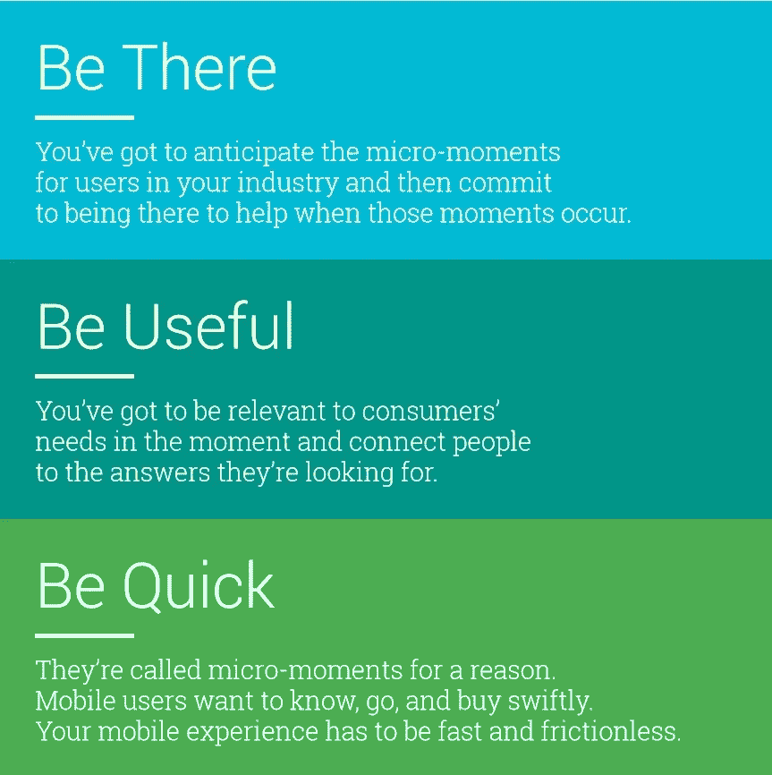

# 如何抓住每一个“微小的瞬间”来帮助你击败你的在线竞争对手

> 原文：<https://medium.datadriveninvestor.com/how-seizing-every-micro-moment-can-help-you-beat-your-online-competition-86e60e07dd4c?source=collection_archive---------11----------------------->

根据 [eMarketer 趋势、预测和统计](https://www.emarketer.com/content/mobile-time-spent-2018)，我们一天平均花 3 小时 35 分钟在手机上。请求查询，浏览网站，而忽略我们每天接触到的所有广告。在浏览互联网时，我们平均每天会看到 4000 到 10000 个广告。我们知道这很令人沮丧，它让我们对某些细节的注意力变得非常脆弱。

Photo by [Daria Nepriakhina](https://unsplash.com/photos/_XR5rkprHQU?utm_source=unsplash&utm_medium=referral&utm_content=creditCopyText) on [Unsplash](https://unsplash.com/search/photos/girl-mobile?utm_source=unsplash&utm_medium=referral&utm_content=creditCopyText)

根据网上调查，人们只在任何网站上停留几秒钟。他们一直等到找到与他们要找的东西相关的东西。这让我们得出结论，你只有不到 30 秒的时间来抓住客户的注意力。让你的在线客户相信你的网站可以帮助他们找到他们想要的东西。你有大约 2 分钟的时间给他们指出一个满意的答案。

 [## 挑战你对人工智能和社会的看法的 4 本书——数据驱动的投资者

### 深度学习、像人类一样思考的机器人、人工智能、神经网络——这些技术引发了…

go.datadriveninvestor.com](http://go.datadriveninvestor.com/4AI1) 

谷歌的营销部门意识到了解这些统计数据对发展在线业务的重要性。他们的营销团队 [Think With Google](https://www.thinkwithgoogle.com/marketing-resources/micro-moments/) 对此进行了研究，得出了一个结论:普通人每天键入大约 150 个查询，在每个网站上花不了几秒钟就能找到相同的答案。他们将输入这些简短查询以获得即时结果的行为称为“微时刻”。这些微时刻构成了查询，例如“我想知道”、“我想去”、“我想做”、“我想购买”时刻。了解这些微小的时刻对你的网上成功至关重要。

# 为了帮助你理解微时刻，理解以下内容-

## 1.)“我想去”的时刻

你什么时候开始制定周末计划？肯定不是提前计划好的。通常是在周五的午休时间。你需要确保从众多选择中选到了正确的地方。这意味着你可能要做一些研究，访问一些网站。在你有限的时间内，你不可能彻底检查网站。你所能做的最好的事情就是检查一些你需要的关键方面，然后你就可以做出相应的决定。

## 2.)“我想知道”的时刻

你需要知道一些关于你将要写的主题的统计数据。知道了互联网是一个信息网，你就向它求助，寻找你需要的东西。在这里，你所需要的只是一个参考统计数据来开始你的写作。所以你只需浏览并暂停到文档中为你提供你特别需要的信息的部分。

## 3.)“我想买”的时刻

你在逛商店的时候看一件新产品。你喜欢它，但你需要知道该产品的评论和最佳在线报价。你拿起手机，开始输入关键词。现在，你没有一整天的时间，所以你需要花几分钟在网上查看所有你想了解的产品。这将帮助你决定是在线订购还是直接从商店订购。

## 3.)“我想做”的时刻

你有客人要来你家，你想准备最好的炖鸡。你四处寻找你最喜欢的厨师的烹饪书的时代已经一去不复返了。现在，你只需拿起你的手机，输入“炖鸡食谱”就可以找到许多文本和视频选项，这些选项将有助于所有必要的指导。

Source - [Think With Google](https://www.thinkwithgoogle.com/marketing-resources/micro-moments/)

所有这些活动都是带着了解、学习、行动或购买的目的进行的。在这里，行动号召决策率和偏好确定性相当高。了解这些时刻并在正确的时间和银盘上提供相同的答案被视为提供最佳的客户体验。

# 如何将这一点纳入你的网络营销策略？

## 1.)认识你的微时刻

根据你提供的服务，你需要找到你关心的“微时刻”。例如，对于电子商务商店，关注的微时刻将是“我想购买”时刻。对于一个博客网站来说，这将是“我想知道”的时刻。同样，对于一个度假目的地或旅游，这将是“我想去”的时刻。了解你关注的微时刻是什么，可以帮助你重新定义你随时随地提供给客户的数据。

## 2.)理解客户需求

重要的是要知道什么是经常被问到的问题，以及在你将要提供的服务中可能出现的问题。了解你的目标客户是谁，你将如何瞄准他们，他们何时需要你，以及在特定情况下你提供什么可能帮助你的客户，这将有助于你认识到你最有效的微时刻，并为他们提供有力的答案或必要的行动呼吁。

## 3.)准确地说是内容

如今，关键字有如此多的重点，以至于仅仅为了确保它们都包含在一个网站中，你最终会在你的内容中充斥关键字。这可能有助于你在 SERP 中的排名，但如果访问者在最初的 30 秒内没有找到他们想要的答案，你会发现你的网站的跳出率会上升。拐弯抹角只会损害你的生意。这就是为什么您需要确保为客户的询问提供准确和及时的相关信息。有了清晰的解决方案和一点点时间，你将赢得客户的信任和忠诚。与用多个选项迷惑客户相比，一个具体的行动号召总是最好的前进方式。

当涉及到电子邮件营销时，一个广告应该涵盖理解活动、重要性和行动号召所需的所有数据。过多的信息或不充分的信息会导致失去读者的注意力，你最终会失去一个潜在的客户。

## 4.)掌握移动广告策略

当谈到数字营销策略时，微时刻是当前的趋势。主要考虑分析寻找即时答案的手机用户。因此，在提供必要的答案或解决方案时，您需要确保您锁定了正确的移动受众。手机广告与桌面广告在时间、优先级、视觉效果、位置等方面有很大不同。与你的竞争对手相比，一个精心策划的策略可以帮助你抓住这些微小的时刻。

## 5.)描述性媒体文件

描述性图片和视频分享是 2015 年以来最热门的营销技术。随着在线营销行业如此快速的发展，一点也不奇怪，好的描述性图片会产生比它们被认为的更大的影响。具有相关和适当描述图像的内容获得超过 90%的收视率。显然，有了一个有效的计划策略，你可以使用视觉效果来帮助你的活动或网站增加流量和销量。

Source — [Think With Google](https://www.thinkwithgoogle.com/marketing-resources/micro-moments/)

# 对 2019 年有帮助吗？

虽然这是谷歌在 2015 年首次推出的，但对许多企业来说，这仍然是一个相当新的概念，因为他们仍然专注于过去的战略。随着手机的使用越来越多，了解微时刻并在业务中加以利用，将使你走在曲线的前面，并帮助你的业务蓬勃发展。这将有助于你每天与顾客互动，了解什么对你的目标受众有效。

> "你必须行动迅速，适应力强，否则策略是没有用的."
> 
> —戴高乐

**感谢您的阅读。如果你喜欢这篇文章，请随意点击👏按钮并帮助其他人找到它。**