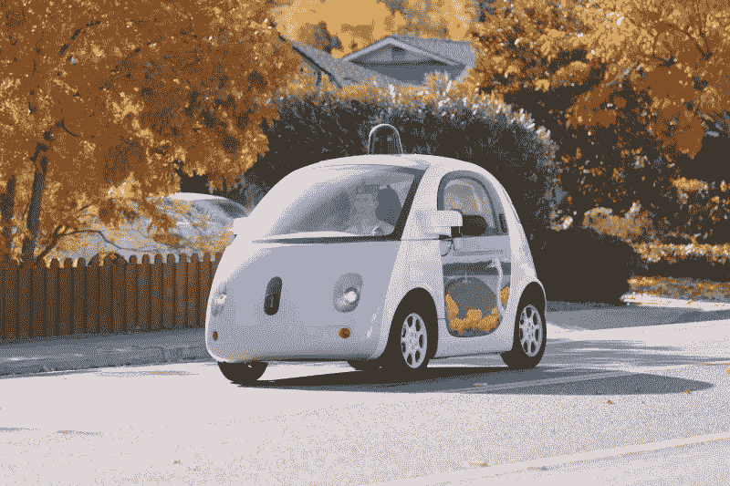

# 无人驾驶汽车将如何改变我们的城市

> 原文：<https://medium.datadriveninvestor.com/how-self-driven-vehicles-will-transform-our-cities-be7ee89717b1?source=collection_archive---------3----------------------->

Google’s Waymo Self-driving car prototype

在考虑部署自动驾驶汽车时，我们会考虑便利性、成本、事故风险、高效运输、黑客问题和人工智能。好的和坏的。这种车的经济影响还不清楚，但我们肯定知道我们会更有生产力，它们会减少事故的数量，这些车看起来会很奇怪。

根据大多数主要汽车制造商的说法，无人驾驶汽车应该会在明年首次正式亮相。特斯拉首席执行官埃隆·马斯克宣布，到明年年底，[道路上的无人驾驶汽车将超过 100 万辆](https://www.businessinsider.com/tesla-takes-direct-aim-uber-lyft-with-robotaxi-plan-2019-4)，而这只是特斯拉。优步、Lyft、Waymo 和其他公司与福特和丰田等主要制造商合作，最迟将在第二年跟进。可以说，已经有大量的投资和计划投入其中。会发生的。交通运输的这些变化将会让许多人感到惊讶，而且将会在几年内发生。

 [## 在自动驾驶汽车发生事故的情况下，谁应该承担法律责任？-数据驱动型投资者

### 我仍然认为自动驾驶汽车是一种奢侈品，而不是必需品…

www.datadriveninvestor.com](https://www.datadriveninvestor.com/2018/11/02/who-is-legally-accountable-in-the-case-of-an-autonomous-vehicle-accident/) 

叫车在世界各地已经成为一种相当成功的现象。你可能至少认识一个为优步或 Lyft 开车的人。其他自动驾驶服务企业也想分一杯羹，如果有其他选择，没有人愿意解决与人类司机打交道的麻烦。因此，过去几年，大多数大型叫车公司一直在人工智能领域大举投资，并建立战略合作伙伴关系。

从消费者的角度来看，如果自动驾驶车辆比人类司机驾驶得更好，为什么会有人希望人类司机在路上引发事故？

**无人驾驶汽车:汽车正在解决资金沉淀问题**

如果按照特斯拉和其他人的计划，在未来一两年内部署自动驾驶汽车，10 年后我们的道路和城市会是什么样子？嗯，我们现有车辆的主要问题是大多数人只在 5%的时间里驾驶它们。其余时间我们停车。如此昂贵的投资没什么用处。我们知道汽车是钱的来源，但如果我们一天中的大部分时间都使用汽车，它们就不会是钱的来源:这就是为什么出租车公司和打车服务公司虽然用同样的汽车载着人们到处跑，但还是能赚钱。财务问题是相对于成本而言，我们使用车辆的生产时间。如果我们用一辆车节省 20 美元的计费时间，并且每天只使用一个小时，那么每个月就可以增加 600 美元的效率。算上所有成本，包括汽油、停车、保险、租赁和维修，大多数[车主每月花费大约 1000 美元](https://globalnews.ca/news/3832649/car-ownership-costs-public-transit-canada/)，每月净损失 400 美元。如果你每天开车 10 个小时来提高效率，那么你每天的效率将会是 10 个小时的 20 倍，同样的成本:每天 200 美元或每月 6000 美元。这是一项值得的投资。不幸的是，没有人需要每天开 10 个小时的车来“节省”生产时间。

然而，如果你拥有自己的无人驾驶汽车，你可以让它成为自己的“优步”,并在订阅的基础上驾驶其他乘客。你拥有这辆车并支付它的费用，但是你让它为别人节省生产时间并从它的使用中赚钱。你拥有硬件，而 AI 在你不需要的时候开着你的车到处跑。您自己的数字优步驱动程序。这样，你可以用你的车在生产时间里每天节省 20 美元，而其他 95%的时间，汽车为你赚钱，节省其他人的生产时间。

对于那些没有车的人来说，每小时开 20 美元可能是值得的。也许他们会乐意每小时付 10 美元来使用你的车。让我们算一下。你从你的自动驾驶客户那里节省了 20 美元，剩下的时间你赚了 230 美元(为了简单起见，我只是用了 23 / 24 小时，而不是 95%)，每天总共赚了 250 美元，或者每月 7500 美元。由于使用和电费的增加，你的成本可能会上升到每月 1500-2000 美元，但你的车不再是一个钱槽。这是一项创收业务。

特斯拉计划建立其机器人出租车网络，以促进这项交易。优步、Lyft 和其他打车公司计划遵循自己的商业模式，但不包括司机。对于消费者来说，服务看起来是一样的，但是价格可能不同。竞争将确保比我在上面的例子中描述的更低的消费成本。耶，我们！一些打车公司计划拥有自己的车队，由他们自己管理和清洁。愿最好的服务赢得公众舆论的法庭！

**自动驾驶车辆的城市规划**

在 10 年内，路上的大多数车辆很可能将是电动的，具有第 4 级(接近完全自动化)或第 5 级自动化(完全自动化)。在加拿大，3700 万人口中，大约有 2500 万辆汽车在路上行驶。如果人们使用如上所述的打车服务出行，我们需要的汽车会少得多。基于我们今天 5%的汽车使用效率，如果我们将汽车使用效率提高到 50%，在可能的 100%完美的情况下，我们在路上需要的汽车将减少 10 倍，因此加拿大的汽车总数约为 250 万辆。

这些汽车都是数字化的，将有优秀复杂的人工智能连接到 Wi-Fi 网络，允许所有汽车与气象站，交通模式，其他汽车，火车，地铁列车，飞机等进行通信。他们会比我们更了解如何安全有效地把我们从 A 地带到 B 地。这将是一个新的交通时代，你根本不需要计划你的旅程。让你的车载导航器为你做所有的跑腿工作，或者你的数字助理。

有了这些安全、安静、电动车辆的有用网络，我们可以把辛苦赚来的钱花在其他重要的事情上，比如休闲或家庭。那些想把电动车变成生意的人会和其他人竞争，加入拼车，但车主和使用者之间会有一个竞争平衡。

然后，城市可以通过多种方式进行改造，以增加美感、便利性或人口密度，利用现在空置的街道和不再使用的停车位。这将给城市规划者提供许多新的选择，告诉他们如何根据需要和需求优化社区。

停车位占用了大量的城市土地。除了纽约市，[大多数美国大城市的停车位都比人口多](https://www.citylab.com/transportation/2018/07/parking-has-eaten-american-cities/565715/)，每英亩土地上的停车位数量在 25 到 50 个之间。这相当于可用土地面积的 10% — 20%。

当自动驾驶汽车进入市场时，城市将把额外的停车场转化为经济适用房、公园、花园、其他商业等。我还预测，为了满足人们用自己的蒸汽移动的愿望，两轮交通工具的增加，像气垫板、滑板、自行车和其他。考虑到引入自动驾驶汽车释放出的额外土地面积，路边将有足够的空间来容纳自行车。想象一下，城市规划者可以利用市中心额外闲置的 10%-20%的土地做些什么！

就我个人而言，我期待着我们街道上的所有这些活动(或减少这些活动)和我们城市的转变。2017 年，仅美国就有 37133 起机动车死亡事件。自动驾驶汽车不会完全消除这一点，但如果我们在人口仍在增长的情况下达到 3 万以下，那将是一个巨大的胜利。只会越来越好。

**5G 和天空**

Volocopter eVTOL passenger drone concept

然后，随着 5G 网络在我们的城市中安装，所有自动车辆网络将在避免任何街道问题方面变得非常棒。此外，由于数据传输的数量和速率很高，运输人员和货物将变得如此高效，我们会想，如果没有它，我们将如何生活。汽车将与网络上的所有汽车即时共享街道和人行道上的活动，同时保持交通畅通，汽车之间的距离舒适，沿途急停次数最少。

需要快速到达某个地方？没问题，像谷歌、优步、亚马逊和其他一些公司也计划推出无人驾驶飞机。货物和乘客会从我们头上飞过，这意味着地面上的车辆就更少了。自动飞行无人机的伟大之处在于，没有人需要飞行员执照才能升空。人工智能正在做所有的工作，并像自动驾驶汽车一样接入相同的网络。如今的商用飞机要大得多，也复杂得多，已经可以在没有飞行员帮助的情况下自行起飞、飞行和降落。因此，如果你想更快地到达市中心，你可以多付一点钱，叫一架电动 VTOL(垂直起降)无人机以 200 公里/小时以上的速度直接带你去你需要去的地方。[据保时捷咨询公司](https://aerospaceexport.com/comparative-analysis-of-the-main-evtol-aircrafts-in-current-development/)称，预计到 2035 年，航空运输市场将达到 320 亿美元。

的确，明天的城市不会像我们今天这样交通堵塞、污染严重、噪音巨大。那里会很安静，来往的车辆会少得多，没有一辆车停着，空气中会有更多的东西在流动。

我等不及要看了！