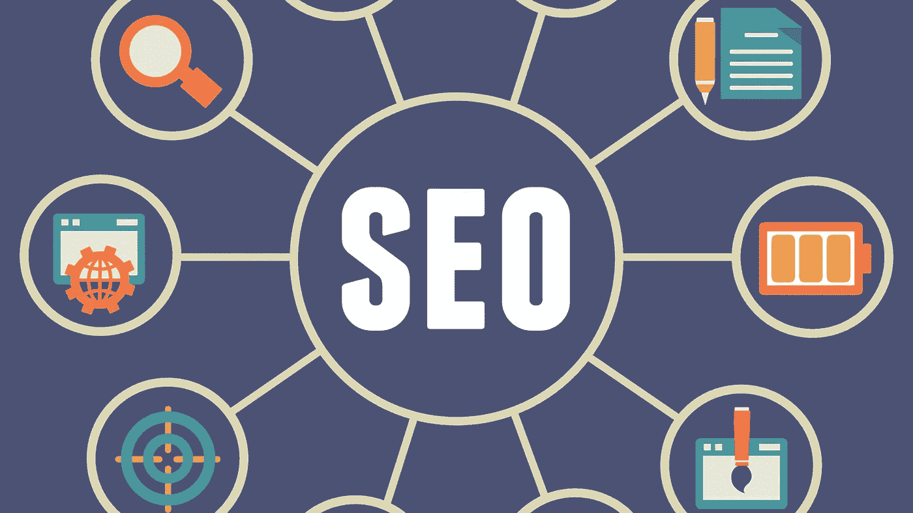
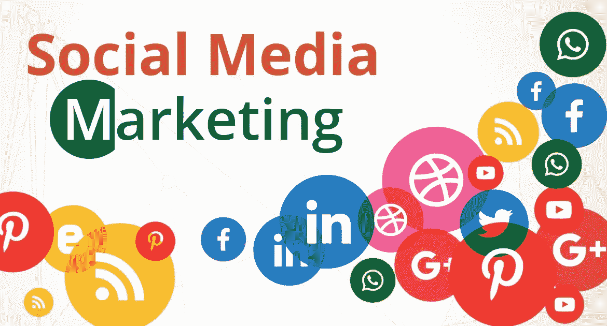

# 搜索引擎优化和社交媒体营销如何齐头并进

> 原文：<https://medium.datadriveninvestor.com/how-seo-and-social-media-marketing-go-hand-in-hand-954e198691f7?source=collection_archive---------17----------------------->

目前，我们正处于数字时代，尽管工业和商业正在走向数字化转型。大多数客户和用户都在寻找在线存在的任何业务进行无缝互动。拥有一个网站更像是联系你获取主要信息的第一个地址。你只是大型谷歌数据库中的一员，拥有其他人提供的同类服务。那么，挑战来了" ***如何在竞争中立于不败之地？****。在当今的情况下，有两种超越竞争对手的最佳方式。*

**1。搜索引擎优化**

**2。社交媒体营销**

*为了让你的网站或博客获得索引和排名靠前，搜索引擎优化(SEO)是最好的做法。SEO 是用正确的关键词来优化你的网站内容以锁定受众的过程。在正确的地方使用正确的关键词会让你的网站比其他网站更容易被索引。也许，搜索引擎优化不是一天的任务，而是需要专门的资源，时间和不懈的努力。*

*为什么 SEO 很重要？*

***优化你的网站内容:***

*当你想了解任何产品或服务时，我们会用合适的关键词进行搜索。因此，用丰富的关键字优化内容会给你更好的结果。无论搜索引擎如何，都要确保你的网站得到了很好的优化。谷歌、雅虎和必应是最受欢迎的搜索引擎，它们可以为你的网站带来有针对性的关键词流量。*

***追踪用户行为的 SEO 工具:***

*有很多免费工具可以用来追踪用户到底在搜索什么。关键字规划和谷歌分析是最好的和免费的工具，以了解你的网站的性能指标。他们会让你知道流量的来源，在你的网站上花了多少时间和所有其他指标。从今以后，你可以优化你的策略来接触在线用户。*

**

*Image source: searchengineland*

***竞争和拓展的付费工具:***

*如果你用传统的搜索引擎优化方法接触大众有困难，谷歌提供一些付费工具和服务来克服它。Google Adwords 是最好的工具，我们通常用它来竞价关键词，并花一些钱在搜索结果中获得更多的可见性。这肯定会帮助你在网站上获得更多的有机流量。这将改善你在接触和培养用户方面的整体行为。*

*页面优化的最佳方法:*

1.  *引人注目的标题*
2.  *恒星含量*
3.  *关键词*
4.  *元描述，元标签*
5.  *媒体内容(图形和视频)*
6.  *搜索引擎友好的网址*
7.  *完美的登录页面等..*

*社交媒体营销:*

*一旦你准备好了你的网站和它的优化，你就可以通过可用的媒介来营销它。无论是传统平台还是数字平台，营销/推广都会给你带来比预期更好的效果。最近一段时间，社交媒体平台已经成为营销的甜蜜点。许多知名品牌都通过社交媒体来接触和联系客户。*

*随着智能手机的使用在过去几年中显著增加，每个品牌和企业都非常重视社交媒体的存在。它将使用户能够在短时间内直接联系各自的品牌。*

**

*Image source: Digital Vidya*

*社交媒体营销会给你即时的结果和建议，以加快你的努力。像脸书、Twitter、LinkedIn 和其他平台都有方便的工具和按钮来分享和评论。你获得的分享和评论越多，你就能在网上与客户建立更多的互动。建立一个完美的社交媒体战略将会给你带来竞争优势。然而，付费活动是社交媒体平台外联的最佳部分。*

1.  *创建内容*
2.  *与合适的用户社区共享*
3.  *开始接触客户和有影响力的人。*
4.  *参与论坛讨论*
5.  *推广你的产品和服务*

*搜索引擎优化和社交媒体营销将永远携手并进，产生可观的网络流量和培育线索。建立您自己的战略，与合适的受众群体合作，以获得有效的投资回报。*

*欲了解更多 [#Clickongadget](https://twitter.com/ClickonGadget)*