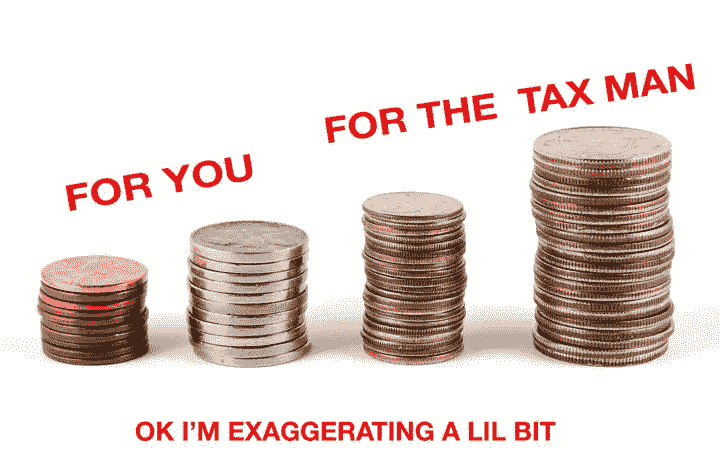
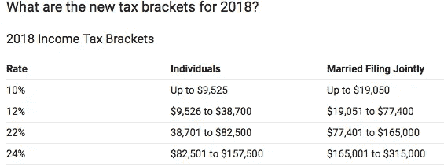

# 2018 年新税法——一个住在公寓里没有孩子的单身人士的简单例子…

> 原文：<https://medium.datadriveninvestor.com/how-several-tax-law-changes-may-affect-bottom-line-of-many-business-owners-and-includes-af3f7eb6a9ee?source=collection_archive---------27----------------------->

**Photo by** [**macropixel**](https://elements.envato.com/user/macropixel)via Envato/elements subscription and graphics by Steph

对个人来说，这个纳税年度没有什么真正的变化，除了税务员试图把我们分成两类:工薪阶层和微笑的富人。当我听到和读到类似“*减税和就业法案”*的短语时，我真的很烦，因为我知道这是扯淡的政治术语。

无论如何，你作为个人/家庭每年都要缴纳联邦税和州税，如果你有生意，如果你有雇员，你还要缴纳联邦税、州税、营业税和工资税。 ***下面我说的是只针对单一个人的联邦所得税。***

**2018 标准扣除额**是税务员给你做工作的筹码:

a.单身可以得到 12，000 美元的筹码，或者如果你结婚了，但与你孩子的妈妈或爸爸分开了，你就被认为是结婚了，需要单独申报。

b.如果你是一家之主，你会得到 18，000 美元的筹码。

c.如果你结婚了并且一起申报，你会得到 24，000 美元的筹码——你们还在一起吗？

*我不会被淘汰，因为你们大多数人的收入不会超过 20 万美元*

**所以税务员给我的总筹码是这样的:**

如果我是一名收入 50，000 美元筹码的单身员工，我不用为 50，000 美元纳税*(基于下面的括号)*税务员人很好，给了我一些筹码，因此我的纳税情况如下:

作为一名**员工**如果我赚了 50k 美元减去上面的(a)12k 美元，因为我是单身= 38000 美元。这意味着我要为 38000 美元纳税。然后我去下面的税级看看税务员要我付多少钱。我看到我的 38，800 美元属于 12%类别，因此我计算出 38，000 美元筹码*12%是我欠税务员的 4，560 美元筹码。作为雇员，税务员已经拿到了他的钱。如果我的工作多交了税，我会得到退款。我没有得到退款的利息，但税务员得到了！

IRS tax Brackets 2018

但是！如果在我的 W-4 *(你知道你第一次被雇用时签署的文件)*上，我没有选择一个豁免，但我写了七个豁免*(豁免就像 moochers ie 人)而有些人在 W-4 上写了 10 或 15，这是一个错误。这意味着 2018 年税务员全年没有从你那里获得足够的筹码，你现在欠他的，他想要他的筹码！*

这个例子是基于一个没有孩子、财产或生意的雇员。你实际上可以根据以上计算你的税款。当你拿到 2018 年的最后一张支票存根或你的 W2 ***时，查找你给税务员的总工资、*** 和联邦筹码，然后检查上面的括号，看看你应该向税务员支付多少税，然后看看你的 W2，看看联邦金额是高还是低。如果税级金额高于您的支票存根或 W2 显示的联邦税，那么您将欠税务员，反之亦然。如果您的 W2 联邦税高于税级，您将获得退款。

这只是一个简单的例子，因为可能有更多的因素，但税务员的主要目标是通过让你认为你在这个纳税季得到了一些特别的东西，但你什么也没有得到，来为**他**简化税收！他只是在巩固游戏！