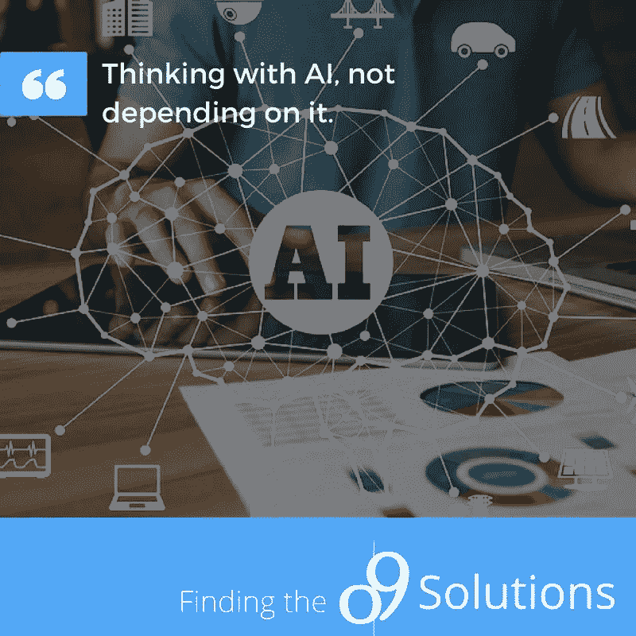

# 人类营销人员应该如何看待&使用人工智能营销人员？

> 原文：<https://medium.datadriveninvestor.com/how-should-human-marketers-see-use-artificial-intelligent-marketers-e3be5ff7c2df?source=collection_archive---------13----------------------->

人工智能第一次被采用是在 1956 年。但是这项技术效率不高，也不容易被企业采用。经过多年的研究和实验，在 20 世纪 90 年代，日本的人工智能技术引起了美国商业的兴趣。IBM 是这一领域的先驱之一，创造了一个击败世界象棋冠军的人工智能。从那时起，投资者和人们对人工智能产生了兴趣，并给予了极大的关注。

[https://miro.medium.com/max/3924/1*2gVkSkStzRG9-GzRpcMeRA.png](https://miro.medium.com/max/3924/1*2gVkSkStzRG9-GzRpcMeRA.png)

如今，几乎所有的大公司(谷歌、脸书、苹果、亚马逊)都有自己的人工智能系统，影响着每一个营销决策。这是个好兆头吗？我的答案是肯定的。然而，我并不是说所有的公司都应该 100%地依赖人工智能进行所有的营销和商业决策。相反，营销人员应该将 AI 视为会议中的另一个人。例如，在一个学校项目中，在一个小组中有一个聪明的学生，他有更好的成绩或者对学生正在做的项目有更多的了解。我建议你把那个学生看成一个人工智能。虽然那个人或人工智能对项目有更清晰的愿景和更完整的想法，但他/她/它并不总是对的。作为一个小组，团队应该讨论并找出实现项目的最佳方法和想法。回到营销，当营销人员在做重大决策时，他们应该将 AI 视为顾问。我非常欣赏人工智能从成千上万的数据中挖掘出几个关键点的能力，它比人类花的时间还少。但我们应该始终对 AI 的工作，对数据挖掘、数据分析以及最终的报告抱有一种怀疑。就像对待真人一样，我们不能百分百信任 AI。这将有利于做出更加人性化的合理决策，并训练人们的批判性思维，这是人工智能尚未完全接管人类的关键原因。

这里有一些使用人工智能营销人员的利弊。

**优点**

*   降低的价格
*   个性化互动
*   推进营销和数据分析流程

**缺点**

*   比起人工智能，顾客更喜欢人类
*   人工智能只能做基于逻辑的工作
*   不保证无错误

我想把重点放在我几乎从讨论中听到或从文章中读到的反对意见上。对于缺点，客户喜欢认为他们比人工智能更聪明，更喜欢与人类而不是人工智能交谈；AI，在这一点上只能解决基本问题，说明我对 AI 的想法缺乏批判性思维；人工智能不是没有错误的，仍然需要人类进行调整。我关注缺点的原因是，我想建议人类如何轻松地克服它们，然后轻松地使用人工智能及其所有优点。

 [## 今年值得关注的 5 大人工智能趋势|数据驱动的投资者

### 预计 2019 年人工智能将取得广泛的重大进展。从谷歌搜索到处理复杂的工作，如…

www.datadriveninvestor.com](https://www.datadriveninvestor.com/2019/02/19/artificial-intelligence-trends-to-watch-this-year/) 

顾客更喜欢人类而不是人工智能
人工智能的一个问题是它没有情感。这可以通过使人工智能更像人类或始终提供真实的员工来解决，允许客户随时与聊天机器人或真人交谈。

**AI 只会做基于逻辑的工作** 就像说的那么简单；我们的技术还不到那一步。但是，基于第一个缺点，这是一件好事，因为人们更喜欢与真人交谈。虽然人工智能可以提供基本的工作，但人类可以负责并专注于更难的工作，这些工作通常需要批判性思维和批判性决策。

**不能保证没有错误** 尽管人工智能的发明耗资数十亿美元，但它并不完美，这一点我们都知道。总有一个错误在某个地方或某个时间出现，可能是故障。在这种情况下，营销人员应该监督 AI 的工作，就像它是一名真正的员工一样。

结论
当我们从人工智能中受益匪浅的时候，我们也应该在使用人工智能的时候仔细思考。它有很大的优势，但也有上面提到的 3 个主要缺点。营销人员应该确保在使用人工智能营销人员之前克服这些缺点。利用人类和人工智能营销人员可以保证为目标受众提供最佳的营销决策和活动，这些目标受众有望从公司获得最大的体验。

不要感冒，度过令人震惊的一周！

油槽车(Tank Car)