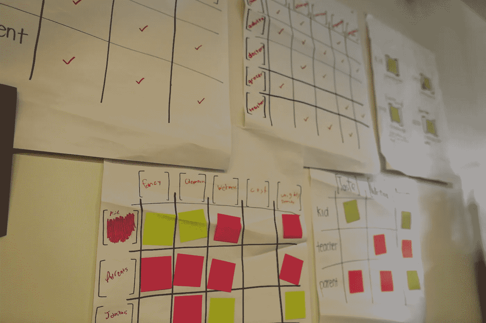
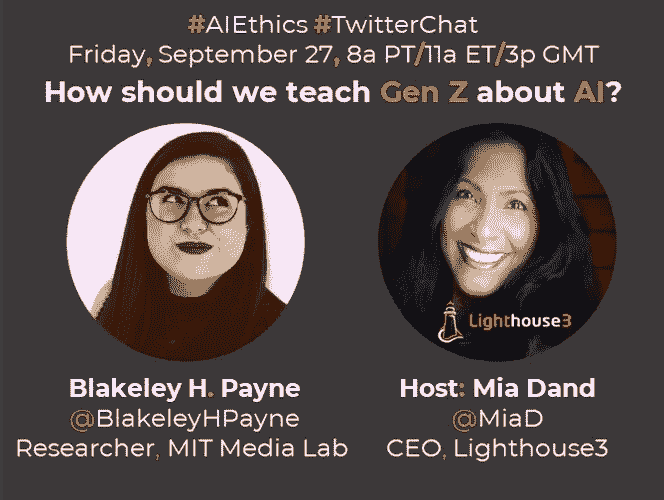
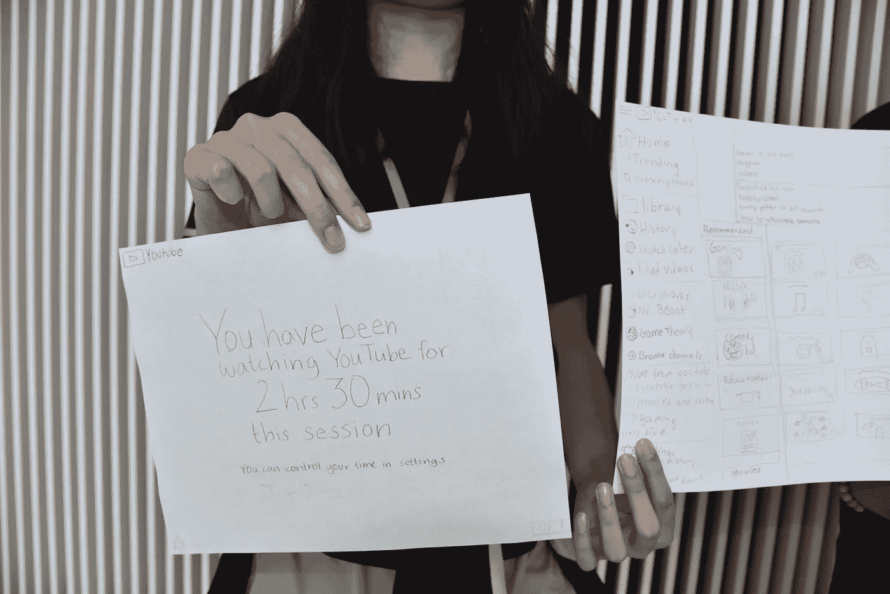
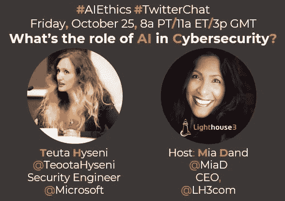

# 我们应该如何教 Gen Z 关于 AI 的知识？

> 原文：<https://medium.datadriveninvestor.com/how-should-we-teach-gen-z-about-ai-c34837254200?source=collection_archive---------9----------------------->

来自麻省理工学院媒体实验室的 Blakeley H. Payne 分享了她为中学生开设人工智能课程的经历，以及在此过程中令人惊讶的收获。

Students construct “ethical matrices” which allow them to map stakeholders in a system to the values they may hold about this system. Here, students consider who cares about an “algorithm” for making their school lunch and why.

对于我们九月的 [**人工智能伦理推特聊天**](https://twitter.com/MiaD/status/1178369043809484800) ，我们邀请了麻省理工学院媒体实验室的研究员[**Blakeley h . Payne**](https://www.linkedin.com/in/blakeleyhpayne/)([@ BlakeleyHPayne](http://twitter.com/BlakeleyHPayne))来获得她对“我们应该如何教 **Gen Z** 关于**人工智能**”的见解并了解她为中学生建立的人工智能的伟大课程。

**米娅·丹德:** **欢迎布莱克利！让我们从你对 Z 世代与其他世代相比有何不同或独特之处，以及他们对科技的态度的见解开始吧？**
**布莱克利·h·佩恩:**我的导师喜欢用的一个术语是“AI 土人”这个时代的孩子从出生开始就伴随着人工智能介导的技术成长。他们是在家里有智能音箱的环境中长大的，看 YouTube 的时间比看电视还多。人工智能对他们来说就像互联网对我一样。正是这种经历使他们与其他几代人如此不同。但很难将他们的态度与前几代人区分开来。我曾经有个十岁左右的孩子告诉我，他担心#AI 会抢走他的工作。从法律上讲，他还有 5 到 6 年不能工作。这是他自己的态度还是他父母的态度？我不确定。

 [## 教科书行业如何最终被颠覆，并将继续改变|数据驱动…

### 就此而言，教科书产业在美国乃至全世界都有着悠久的历史。事实上，他们已经…

www.datadriveninvestor.com](https://www.datadriveninvestor.com/2018/09/25/how-the-textbook-industry-has-finally-been-disrupted-and-will-continue-to-change/) 

我遇到的学生越来越担心，他们对技术的恐惧根植于电影和媒体。今年夏天，我的许多学生表达了对机器人杀手的恐惧。因此，问题是——我们如何向他们表明这不是近期的问题？我们如何让他们觉得有能力解决围绕#AI 的关于公平、正义、责任等困难而紧迫的问题？

**MD:是什么启发你关注这一代人？**
**必和必拓:**我是受到同事 [@randi_c1](http://twitter.com/randi_c1) 的启发。她的论文工作以教学龄前儿童为中心(是的，你没看错！)关于 AI 概念。你可以在这里了解更多关于她的工作:[https://medium . com/MIT-media-lab/pop bots-a-hands-on-steam-platform-for-the-AI-generation-83c 1 be 27 BF 2 f](https://medium.com/mit-media-lab/popbots-a-hands-on-steam-platform-for-the-ai-generation-83c1be27bf2f)
兰迪和我都对科技领域的多样性和包容性问题充满热情，很明显，解决人工智能“多样性危机”的一条途径是早期儿童教育。这让我想和 K-12 学生一起工作，而不是和大学生或研究生一起工作。(尽管该领域也有急需的工作！所有这些学生都是这些技术未来的创造者、管理者和使用者。)
我选择和中学生一起工作具体有两个原因:(1)中学是孩子获得一堆技术独立的年龄。他们在这个年龄得到他们的第一部手机和社交媒体账户。他们往往能够进行更高层次的道德推理。这不仅仅是惩罚和奖励，这意味着课程对他们和他们的老师来说更有趣！

**MD:请告诉我们更多关于你的论文和你为 z 世代准备的课程的信息**
**BHP:** 我的论文是关于我开发的一个开源课程，主题是人工智能和伦理。“人工智能和伦理”可能意味着很多事情，但课程主要侧重于向孩子们展示，正如[@ mathbebedotorg](http://twitter.com/mathbabedotorg)所说，“算法是观点。”
该课程首先试图揭示人工智能在日常生活中的位置，并教他们如何使用 [@Google](http://twitter.com/Google) 的可教机器来学习基本的监督机器学习系统，这可以在这里找到:[https://teachablemachine.withgoogle.com/](https://teachablemachine.withgoogle.com/)
在让人工智能出现在他们周围的世界后，我们可以让学生看到算法实际上是什么意见。我们要求学生写一个算法来做出最好的花生酱和果冻三明治。最后，我们会问:是什么让它变得最好？
是不是最好吃的三明治？最快的制作？最健康？这个活动再次受到了[@ mathbebedotorg](http://twitter.com/mathbabedotorg)关于这个主题的视频的极大启发:[https://www.youtube.com/watch?v=heQzqX35c9A](https://www.youtube.com/watch?v=heQzqX35c9A)
然后课程集中于利益相关者和价值观的想法——谁从这些系统中受益？谁受到了伤害？学生构建“道德矩阵”来帮助确定这一点。最后，学生们通过“重新设计 YouTube”将所有这些整合在一起，这是一项他们已经掌握的技术。他们确定 YouTube 的 rec 算法中的利益相关者，这些利益相关者的价值观，以及新算法可能会是什么样子。

A child holds a draft of her redesigned YouTube project, where she imagines a less-addictive version of the platform.

MD:在你的课程开发或交付过程中，有没有让你感到惊讶的收获？
**必和必拓:**我认为最让我惊讶的是他们对这些系统周围的政治有多了解。我曾经问过我的学生，“YouTube 推荐算法的目标是什么？”我期待着像“娱乐我们”这样的回答但是一出校门，一个学生说，“去卖广告。”他们明白了。只有大约一半的学生认为这是 YouTube 的一个“好”目标。
我觉得我在教学的时候，是在将他们已经知道的东西形式化。人工智能不仅仅是机器人。是的，你在你最喜欢的社交媒体平台上意识到的所有这些问题都是由人工智能系统加剧的问题，这些系统自动化了你已经看到的不平等。

**MD:真是不可思议！那么你和你的课程下一步是什么？布莱克利？**
**必和必拓:**嗯，接下来我要写的就是大量的文字了！(#诚实#学术界)我目前正在努力完成我的论文，并把关于课程的消息传出去。我很兴奋，今年秋天我将在几个地方谈论这项工作，所以如果你在那里，请打个招呼！我会参加今年 10 月的 [@CSforALL](http://twitter.com/CSforALL) 峰会和 11 月的[@ realaai](http://twitter.com/RealAAAI)秋季研讨会。就课程而言，现在的主要努力是(1)让它进入课堂,( 2)从老师那里获得关于如何改进它的反馈。许多人已经着手将该课程翻译成其他语言，如西班牙语、法语、葡萄牙语、德语等，我对它被用于国际课堂的可能性感到非常兴奋。

**MD:** **世界其他地方的组织如何与你合作，潜在地使用你的精彩课程？**
**必和必拓:**这是一个很棒的问题！课程是开源的，可以在这里获得:[https://docs . Google . com/document/d/1 e9 wx 9 obg 7 Cr 0s 5 o 7 ynyhvmx 7h 7 pnitfodxndrsgkp 60/edit # heading = h . ictx 1 ljsx 0 z 4](https://docs.google.com/document/d/1e9wx9oBg7CR0s5O7YnYHVmX7H7pnITfoDxNdrSGkp60/edit#heading=h.ictx1ljsx0z4)
本文档包括工作表、教师指南和授课资料！

MD: 太棒了。非常感谢今天加入我们，布莱克利和分享这些伟大的资源！

下个月在 Twitter 上再次加入我们的网络安全月活动，届时微软安全工程师[Teuta Hyseni](https://twitter.com/TeootaHyseni)[Teuta Hyseni](https://medium.com/u/efaeb650ecbf?source=post_page-----c34837254200--------------------------------)将与我们一起讨论“人工智能在网络安全中的作用”

October CyberSecurity Month #TwitterChat #AIEthics

[***Mia Dand***](https://www.linkedin.com/in/miadand/)*是一位数字化转型领导者，在领导业务、数据、技术和治理+道德的关键交叉领域的复杂跨职能项目方面拥有独特的专业知识。作为总部位于加利福尼亚州奥克兰的战略研究和咨询公司*[***light house 3***](https://lighthouse3.com/)*的首席执行官，Mia 擅长指导全球公司负责任地采用新的&新兴技术，如人工智能，以取得成功的业务成果。
Mia 是一名热情的技术多样性倡导者，在谷歌、惠普、易贝、赛门铁克等全球公司构建以人为本的项目方面拥有丰富的经验。她是“* [***100 位杰出女性人工智能伦理***](https://lighthouse3.com/100-brilliant-women-in-ai-ethics-you-should-follow-in-2019-and-beyond/) *”的创造者，列出并开放在线目录“* [***多样性人工智能***](https://lighthouse3.com/diversityinai/) *”以帮助会议组织者和公司在这一领域招募更多有才华的女性。*