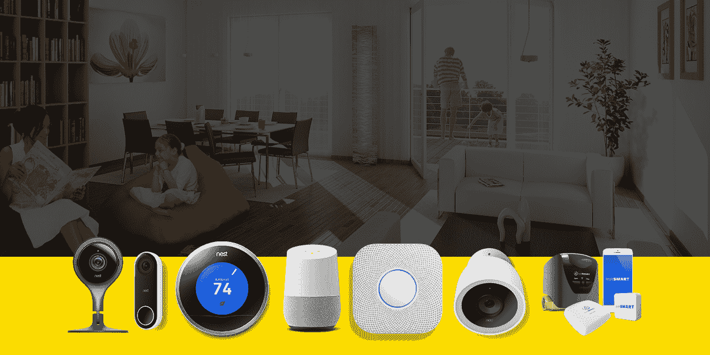
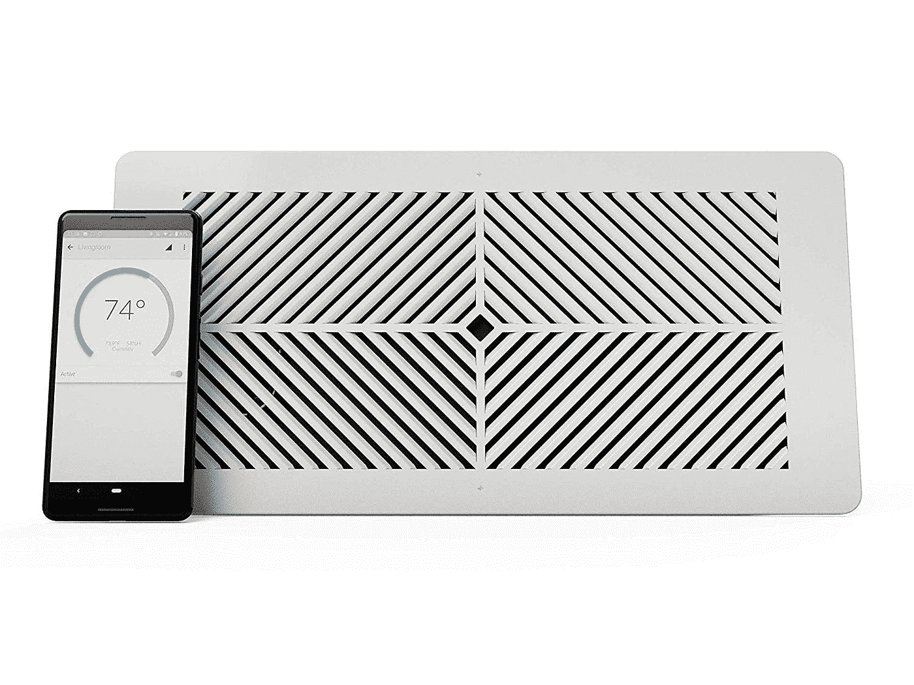
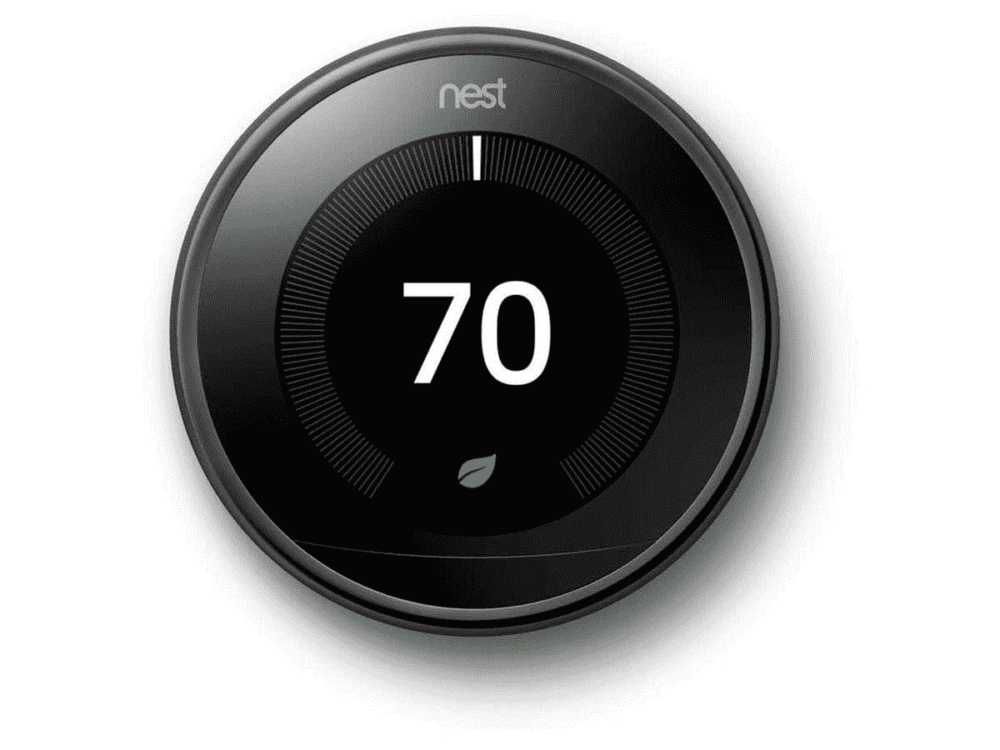
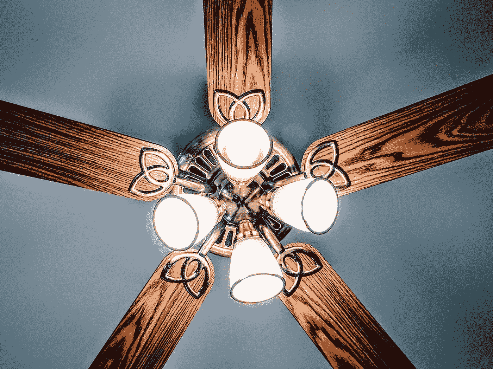

# 智能设备如何帮助您节省资金和能源

> 原文：<https://medium.datadriveninvestor.com/how-smart-devices-can-help-you-save-money-and-energy-f79d2ab7fb7e?source=collection_archive---------10----------------------->

Graphic by [Regex SEO](http://regexseo.com)

如今，几乎每个人都与智能设备进行过交互。至少，大多数人知道它们的存在，并允许互联网和家里其他东西之间的声音和互联。我们通常会想象像 Alexa 这样的智能设备，有人打开灯或从亚马逊订购一些东西。但是节能呢？当人们想到智能技术时，这并不是他们脑海中浮现的第一件事。

但是智能设备一直在悄悄地发展，包含越来越多的功能。随着一些最新的创新，智能家居甚至可以扩展到包括您的暖通空调系统。这意味着控制温度，安排空调或加热器的使用，甚至管理房间或区域的制冷或制热。除此之外，额外的控制可以让你[削减能源成本](https://happyhiller.com/blog/easy-ways-to-slash-your-winter-heating-bills/)，这意味着它对环境有益，同时也为你省钱！看看一些新的智能设备，它们可以帮助你的暖通空调自动化，让你的房子更凉爽，成本更低。

 [## 不管准备好了没有，革命就在我们面前|数据驱动的投资者

### “对于技术如何影响我们的生活和重塑经济，我们必须形成全面的全球共识……

www.datadriveninvestor.com](https://www.datadriveninvestor.com/2019/02/12/ready-or-not-the-revolution-is-upon-us/) 

# 更智能的暖通空调系统

智能通风口、智能恒温器、智能吊扇和传感器都可以通过改善您的 HVAC 系统及其使用来帮助您实现节能。这些设备优化了整个家庭的供暖和制冷使用，降低了运行能耗。它甚至可以指定家中不同地方的温度，或者仅在必要时或在一天中的特定时间触发 HVAC 系统的设定使用。

# 1.智能透气产品

大多数人一天中的大部分时间都在户外度过，在晚上或当屋里的人睡着时，只有卧室才真正需要降温。有了智能通风口，当 HVAC 运行来冷却或加热无人居住的房间时，能源不会浪费。这项技术允许房主完全控制房子里的每个房间，包括允许额外的冷却和加热或者完全切断那个房间的通风口。

甚至有可能将这个过程自动化，这样房主就不需要一直担心手动调节通风口了。随着时间的推移，减少家中闲置部分的使用可以显著节省能源费用。使用像 Keen Smart Vent 这样的智能通风口在特定时间关闭特定房间的通风，已被证明可以将 HVAC 系统的整体能效提高 30%。

# 2.智能恒温器

智能恒温器通过优化整个家庭的温度控制来提供额外的控制和节能。这种设备可以跟踪全天的偏好，以确保始终设定最佳温度。结合传感器和智能通风口，像 Ecobee 这样的智能恒温器可以确保在一周的时间表中有精确数量的能源用于加热和冷却。通过仅在时间表要求时使用能源，并避免浪费的制冷或制热，这种额外的控制可以帮助降低能源成本，让人们的家庭更加舒适。

# 3.智能吊扇

并非每种气候都需要中央空调。对于一些家庭来说，一个吊扇就足够满足冷却和通风的需求了。你可能会认为这意味着智能功能遥不可及或没有必要，但他们实际上已经生产了几种不同的智能吊扇。智能吊扇可以感应到房间有人，并自动启动。与此同时，它可以识别何时不需要运行吊扇，并可以在这些窗口期间通过自动关闭来减少能源使用。如果您只需要一个风扇，它可以节省与更昂贵的暖通空调系统和技术升级相关的成本！

# 4.传感器

许多这种智能设备依靠传感器和接近技术来知道何时何地需要温度控制。智能手机的邻近性是这些设备可以了解谁在家的方式之一，但它只能让它们根据使用该手机的人是否在家或在附近做出决定。通过在家中放置额外的传感器，您可以帮助这些设备更准确地了解您的习惯和偏好。

虽然这听起来有点像科幻小说，但它实际上只是利用新技术来提高你的舒适度和能效。在许多情况下，这些额外的传感器完全是可选的，对您来说可能不值得。尽管如此，对于那些期待更个性化的气候控制和节能住宅的人来说，增加的技术可以成为一个很好的补充。

# 开始用智能设备省钱

虽然一些更先进和最新发展的初始安装或成本可能是一个阻碍，但这些设备有一种通过减少能源使用来相对快速地收回成本的方式。对于普通家庭来说，能源账单往往是最高的，供暖和制冷占据了相当大的一部分成本。

有了这些[智能设备](https://happyhiller.com/electrical/home-automation/)，您可以升级您当前的 HVAC 系统，或者用新的集成系统替换它们，以立即看到您家中整体舒适度和能效的提高。你越早安装它们，你就能越早开始省钱。