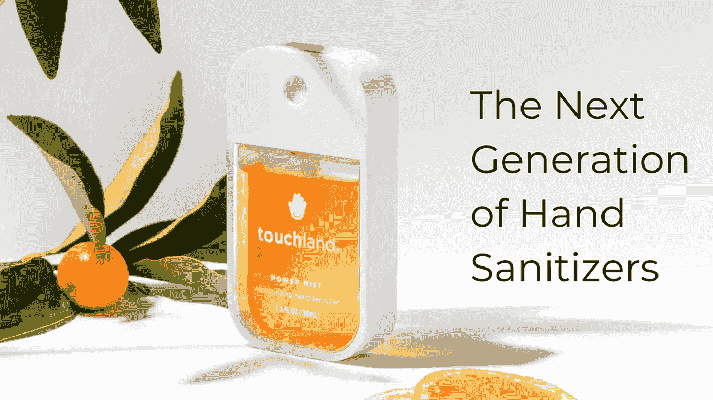
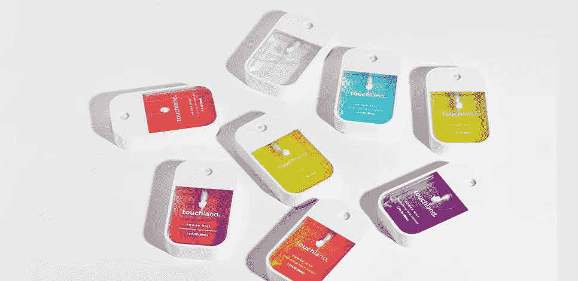

# 微笑和重新开始如何拯救一家公司免于倒闭。5 年后:触地。

> 原文：<https://medium.datadriveninvestor.com/how-smiling-and-starting-all-over-can-save-a-company-from-falling-5-years-later-touchland-94753a04ffd3?source=collection_archive---------2----------------------->

## 一家公司从非常强劲的开始，到处于边缘，最后疯狂扩张的错误、教训和秘密。

这是我决定讲述的第二个故事，作为一个由三篇文章组成的小系列的一部分，在这个系列中，我回顾了我 5 年前谈论过的创业公司，看看它们今天在哪里。我知道 [**安德里亚**](https://twitter.com/andrealisbona?lang=es) **一定会在这个系列里，我知道她会给我惊喜。是的，我不是说公司，我是说安德里亚。正是这种情况下，公司是其创始人的纯粹灵魂和能量，这也是它成为现在这个样子的原因。Andrea 确实让我感到惊讶，而且超出了我的预期:重大的错误、更大的教训、艰难的决定、似乎是命运的运气、永无止境的希望和改变游戏规则的力量——所有这一切从 5 年前一直持续到今天。**

Andrea Lisbona, Founder and CEO of Touchland

# 一个强劲而充满希望的开端

2012 年，我第一次见到安德里亚是在我们的大学，当时我在巴塞罗那定居。虽然我还没有想过要成为一名企业家，但她已经在校园里被认为是一家前途光明的创业公司的创始人。我听 Andrea 讲述了 Touchland 的故事:她说:“我们正在彻底改变洗手液行业。我记得自己在想“洗手液？这听起来多不性感啊…”。直到我明白了她说的“革命化”是什么意思。对，这不是不性感，只是必须彻底改变！我知道，通过瞬间充满房间的能量，安德里亚绝对是在这个行业开创一个新时代的人。

**当时，Touchland 的主要产品**是一个高高竖立在地板上的球，里面装有洗手液和一个传感器，当你靠近你的手时，传感器会释放液体。该产品实际上很酷，非常时尚，非常适合我们大学大楼的走廊，同时对 ESADE 品牌进行了友好的推广。这个想法看起来确实是革命性的。5 年前，唯一能找到洗手液的公共场所是医院(是的，不性感)。但是，问题就在那里:细菌在公共场所的传播和水的浪费，一个人每次洗手超过 2 升。Andrea 和她的团队找到了一种方法，用一种看起来不错、甚至更好用的产品来解决这个问题。看看公司内部，商业模式也是可持续的:他们从海外进口产品，并在国内市场做所有与分销相关的工作。就这样，生意开始起飞了！受到早期成功的鼓舞，Andrea 决定迎接**的下一个挑战:**以全新的外观和感觉开始他们自己的产品线。

两年后，我走在巴塞罗那的街道上，看着五颜六色的窗户，突然认出了我听说过的标志和设计。那是一家豪华服装店橱窗里崭新的袖珍触摸洗手液。哇，他们成功了！看起来棒极了。我原以为会出现一场品牌热潮，会有很多人关注年轻时尚一代的终极洗手液。但是之后，就再也没有了，似乎 Touchland 瞬间就从视线中消失了。一些不好的事情发生了。

# 突然下降

我只能猜测发生了什么，直到几天前我采访了安德里亚，她让我目瞪口呆。**开发自己的产品线**比团队想象的更具挑战性，以至于几乎让公司消失。

产品开发和 Touchland 新标识的创建过程涉及外部专业人员和合作伙伴，他们带来了丰富的经验。新设计的输入是在第一个产品中发现的问题:“球”不可靠，容易破碎，对孩子不友好等等。新设计必须是苹果风格:简约、现代、通用。该产品已经准备好，并在一个特别活动的舞台上向公众宣布和展示，这是硅谷的最佳传统。人们很惊讶，他们喜欢它！人们看到的产品取得了巨大的成功，但是从那里发出的订单揭示了一个事实:该产品不适合大规模生产。我们经常从可怕的创业失败故事中听到这种说法**【现实测试】**。尽管他们说纸经得起考验，但现实是残酷的:这种产品在理论上是伟大的，但它无法被制造出来并投入大规模生产。导致这种情况的主要因素是相关合作伙伴对特定市场缺乏了解，以及难以获得生产成本资金。事实证明，当你在生产中遇到问题时，那会立即在你的开支中产生一个漏洞，安德里亚说，“艰难，非常艰难的时刻”。

所以他们在那里，在几个月的努力实现创造的期望后，他们发现自己比以往任何时候都低。触地得分处在边缘，看起来他们不得不放弃。但是生活会在我们最意想不到的时候给我们惊喜。

# 明星的崛起

在采访 Andrea 之前，我知道我除了知道公司再次腾飞之外一无所知！沉寂了近两年后 [Touchland 在 Kickstarter](https://www.kickstarter.com/projects/959783808/touchland-the-next-generation-of-hand-sanitizers?lang=es) 上爆发了:他们赚了近 68k 美元，而他们设定的目标只有 15k 美元。人们喜欢它们，想要更多！我迫不及待地想知道到底发生了什么，以及它是如何成为可能的！

真正发生的是安德里亚和她的团队不得不经历他们所能想象的最艰难的时期**。投资轮没有按计划进行，他们的现金严重不足，产品仍然不适合生产。很难想象这种情况会有多让人沮丧:当你的创作即将崩溃时，时间已经不多了，你对此无能为力。但是球队没有放弃，他们愿意做任何事情给达奇兰第二次机会。这种态度给了他们第二次机会。**

**那是在 2016 年，他们接到一家**跨国公司的电话，这家公司致力于为全球的大消费品牌制造**商品。该公司从未与初创公司合作过，但现在他们正在寻找一家陷入困境的有前途的初创公司进行投资，利用他们的基础设施，并扩大创新产品的规模。然而，这并不完全是运气:在几个月前的盛大展示活动中，尽管 Touchland 没有达到消费者的预期，但它也创造了一个品牌知名度的大浪潮，并签署了许多合同，这些合同通过联系人的联系导致了希望给予公司。**

****的时刻是决定性的**，很明显:要么他们完成这笔交易，要么公司完蛋。就在那时**安德里亚证明了自己是领导者**，每个人从一开始就看到了她。这个决定很冒险，也很艰难。这笔交易意味着抛弃他们迄今为止建立的一切。这意味着与一个来自不同世界的新伙伴从头开始。这意味着将公司转移到美国，专注于一个新的未知市场。这涉及到个人风险，也意味着两年内没有一单生意。**

> **“这是我做过的最艰难的决定。但这也是最明确的一次——这是我们最后的机会。”**

**尽管如此，安德里亚清楚地表明:这是他们生存的最后机会。她竭尽全力争取得到合同。该团队立即开始对潜在的合作伙伴进行调整。安德烈亚和她的丈夫(她与丈夫一起领导公司)在没有获得投资担保的情况下直接搬到了美国，从而证明了他们的意图和性格。**

**成功了。他们达成了七位数的投资交易，用于开发、专用设备和 FDA 注册，以在美国市场和全球范围内推出。公司起死回生了！他们从错误中吸取了教训，并开始以非常不同的方式做事。现在团队成员的挑选更加仔细了。Andrea 和她的合作伙伴亲自监督和执行每一个相关的细节:从物流和技术细节，到客户服务和法律工作。他们的团队变得前所未有的强大。与跨国公司的关系得到了精心处理，并以非常积极的方式发展。**

**两种新产品诞生了:一种时尚的袖珍型洗手液，闻起来、用起来和感觉都很好，适合 B2C 市场；面向企业的 Touchland KUB:采用 IOT 动力技术的长效自动售货机，可为企业节省资金，同时保护员工、客户和客人。**

**然后是他们开创性的 Kickstarter 活动，这让他们在世界各地获得了合同，并传播了关于新版 Touchland 的消息。2018 年初，他们完成了另一轮 80 万美元的投资，以换取该公司 10%的股份，完成向美国的转移。他们非常重视潜在的 B2B 合同，并已经在许多国家的 WeWork 等公司的办公室中放置了新的 Touchland KUB。这项创新并没有停止，还包括一些功能，例如设施经理可以将多达 100 台加油机连接到一个应用程序，并监控它们在现实生活中的状态。Touchland 还在建立一个 B2C 全渠道销售战略，包括他们自己的电子商务、亚马逊、品牌亭以及与百货零售商和美容连锁店的主要合作伙伴关系。该公司成为一个飞速发展的国际项目，就像我们在 Techcrunch 上读到的那样。现在所有的点都连接起来了，业务的所有元素都同步工作，触摸领域的长期预期的未来已经在这里。**

****

# **回顾过去**

**安德里亚承认，现在她终于喜欢上了这家公司，也喜欢上了和一个好伙伴一起工作。该团队经历了非常艰难的时期，比如我们在创办公司时都害怕的时期，并设法渡过了难关。我真诚地认为，公司的早期发展，克服所有障碍的生存以及目前令人印象深刻的成功都是因为 Andrea。她的性格、领导能力和毅力让达奇兰走到了今天。她从未停止相信最好的，无论发生什么事，她都保持微笑，并将这种能量和灵感传递给周围的每个人。正如她自己所说:**

> **“作为一名创始人，无论如何，你都必须保持微笑，传播积极的氛围。这是让你的团队保持强大和动力的唯一方法，也是保证他们不会在公司最糟糕的时候停止信任公司的唯一方法。”**

**旅途中面临的所有挑战教会了安德里亚比任何教育都要多的东西。她选择了她最重要的错误来分享和学习。**

## ****要学习的 3 个错误:****

*   ****认为推出一款产品很容易。**不是。在这个过程中所有可能发生的坏事都会发生。唯一的办法就是做好面对困难的准备，坚持下去。**
*   **与错误的人一起工作。严格明确你想和谁一起建设你的项目是至关重要的。糟糕的伙伴关系可以在一瞬间把事情搞得天翻地覆。你还必须抵制诱惑，不断给人们新的机会来证明自己——如果他们让你失望了一次，不要再等两三次失望才说再见。与其结交坏朋友，不如独处。**
*   ****低估筹集资金的难度。**投资人可以一直拒绝你一百次，直到其中一个人相信你。寻找投资也比看起来更需要人脉。因此，你必须找到自己的方式，找到合适的人，自己结束这一轮，没有任何机构或合作伙伴会为你做这件事，只有你自己。**

**安德里亚强调了这些错误是如何教会你如此之多，以至于你不再将它们视为错误，而是开始将它们视为人生的课程。她说，尽管她经历了所有的挑战和艰难时期，但她仍然无法改变生活，并且非常感谢能够成为一名企业家。她鼓励每一个想成为企业家的人去尝试一下，她给了我们三条关于创业之旅的宝贵建议。**

## ****给有抱负的企业家的 3 条建议**:**

*   **你必须计划好你的开销，并且彻底地去做。如果达能花掉商业计划中最初写的金额，他们早就破产了。你总是面临意想不到的问题和新的开支，所以好好计划，拥有比你认为你需要的更多的钱，并且总是严格控制你的花费。**
*   **寻找一个适合你公司的好伙伴，明智地去做，不要被闪亮的口号所蒙蔽。当大公司的技术和初创公司的想法和流程结合在一起时，伟大的事情就会发生，但前提是它们匹配。你想只留住那些符合你的文化和价值观的值得信任的人。**
*   **坚持不懈，为漫长而艰难的旅程做好准备。这并不是一条容易的路，相反，它常常是一部恐怖电影。你必须能够忍受不稳定，准备好每一件小事都会影响你，每一件可能出错的事情都会出错。但是，如果你设法保持冷静，经历所有的困难，这将是令人难以置信的满足和回报。**

**Touchland 是一家将这一切归功于其创始人的公司，这也是我们今天在世界各地最鼓舞人心的公司中可以看到的事情。一个强有力的领导者能够带来改变，并在公司的历程中经受考验和成功。我相信我们都必须向 Andrea 学习，记住她的故事，即使在我们的项目和计划最糟糕的时候也要激励我们。对于那些怀疑是否要创业的人，请记住她的话:**

> **“尽管这是一次非常具有挑战性，有时甚至是可怕的旅程，但我绝不会为了其他任何事情而放弃它。这是我做过的最好的选择。现在，无论发生什么，都要坚持不懈，脚踏实地，时刻保持微笑”。**

****