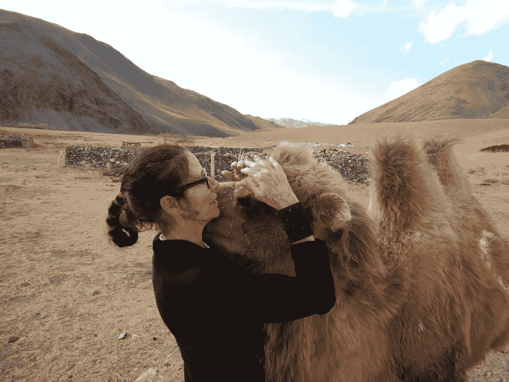
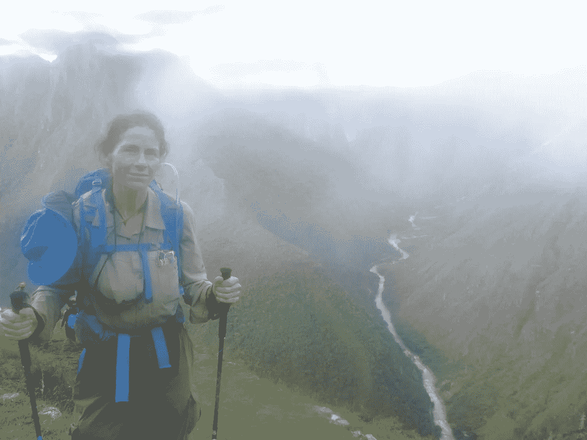

# 我多久会…

> 原文：<https://medium.datadriveninvestor.com/how-soon-will-i-ea2079b2bd23?source=collection_archive---------9----------------------->

Photo by [Razvan Chisu](https://unsplash.com/@nullplus?utm_source=medium&utm_medium=referral) on [Unsplash](https://unsplash.com?utm_source=medium&utm_medium=referral)

## 减肥，赚一百万，一夜成名…

今天早上，就在我下楼去打椭圆机之前，我读了《偷窥新闻》[的这篇](https://medium.com/u/e59c3768914a?source=post_page-----ea2079b2bd23--------------------------------),内容是关于人们如何想知道她花了多少个月才变苗条。

**你会不会哭出声来**。我笑了，不是对她笑，而是和她一起笑，因为人们认为——好像只需要半小时的电视节目——减掉 X 磅，找到爱情，解决我们所有的问题，从此幸福地生活，这是我们这个时代的一种病态。

关于减肥的事情。可以说，这几乎是我们这个时代的头号新年决心。

 [## 健康品牌源于定位|数据驱动的投资者

### 品牌定位是 Phemelo Segoe 的激情之一。她是一名企业家、健康教练和米尔部落的创始人…

www.datadriveninvestor.com](https://www.datadriveninvestor.com/2019/01/11/healthy-brands-grow-from-positioning/) 

1987 年，我的体重是 205 磅。那年我做了一个决定。到那年年底，我已经减掉了将近一半的体重。我从根本上改变了我吃什么，为什么吃，什么时候吃，在哪里吃。我把锻炼计划增加了两倍。有趣的是，这些事情日复一日、周复一周、月复一月地做，往往会产生结果。

**一年。**从那以后，年复一年，我们坚持核心训练，注意饮食，适当锻炼来保持这种状态。大半个人生。对艾格尼丝来说。它从未停止。这需要艰苦的工作。如果我放松，如果我选择油炸圈饼而不是酸奶，它会回来的，伙计们。

当然，苗条并没有让我得到爱情，让我变得富有，或者以任何实质性的方式让我更快乐。它确实让我变得健康，而且健康打开了许多其他的大门。也就是说:

我经常写我的谋生之道，那就是冒险旅行。人们总是问我怎么做到的。

The author in Mongolia with Gogo the baby camel Julia Hubbel

嗯，*四十年来学习如何写作(永无止境)学习如何解决客户问题(永无止境)学习如何销售(永无止境)。我的下一个十年，从 67 岁到 77 岁，很可能也是如此。因为它。从来没有。结束。我仍然不得不在健身房拼命，跑步，训练，流汗来变得强壮。我还是得为了演出卖命。*

聪明、能干、成功的媒体窥视 [Gillian Sisley，](https://medium.com/u/d7d05607c38b?source=post_page-----ea2079b2bd23--------------------------------)她在父母的房子里发展业务，经常评论人们如何希望她雇用他们(他们没有营销能力),他们一直在寻找简单的生活帮，这将允许他们绕过工作去做 Gillian 做的事情。

艾格尼丝·路易斯继续做了一些其他的类比。我分享一个我自己的。我在健身房锻炼了大约 46 年。这就是我整个成年生活，锻炼肌肉和力量。我希望每次有人问我如何得到我的枪时，我能得到一枚镍币。

两种方法:年复一年的严格的重量训练和锻炼，加上精心设计的饮食。我每天做六十个男子俯卧撑。我在两个卧室门上的横杆上做引体向上。这是持续不断的日常纪律。为了结果，我牺牲了一定的时间和舒适。你想看你胳膊上的蚯蚓血管吗？那就是瘦节食。你有六块腹肌，但是如果你像 Agnes 一样喜欢你的香蕉花生酱香草冰淇淋奶昔，没人会看到。对我来说是甜甜圈。你的选择。我们做了不同的选择，得到了不同的结果。

或者，你作弊，掏钱买硅胶假体。然而，我会认真考虑试着移动那个沙发，仅仅因为你*看起来*强壮。你不是。你还有鸡翅，因为你没有做工作。

下面是她文章中我最喜欢的一段:

*这就像爬山一样。攀登可能是艰难的，但你在山顶上看到的景色值得你一路上的每一滴汗、身上的每一粒灰尘和每一次喘息。*

The author doing Macchu Picchu Julia Hubbel

我爬过乞力马扎罗山和肯尼亚山。第一次是 60 岁，第二次是去年 65 岁。我可以告诉你不仅仅是攀登。为了攀登，每天的散步、跑步、爬楼梯、健身、骑自行车、游泳和集中精力去赢得站在那座山上的权利，这些都是艰苦的训练。我去过珠穆朗玛峰大本营，还去过相当多的 14 个营地。都过了六十了。

然而，今年 5 月，我们在珠穆朗玛峰上有太多的死亡，因为那些太有钱的人想知道为了登上世界最高的山峰可能需要多少周的训练。

套用艾格尼丝的话，试试*年*。

我们时代的一个令人不安的趋势是，比较快乐的社交媒体观看和一辈子看着人们在一部电影、一个小时的电视节目或一系列节目中解决复杂问题的结合，导致一种印象，即根本不需要时间就可以得到你想要的东西。

年龄大约是我一半的西斯莱和路易斯不仅会极力争辩说这显然是胡说八道，他们还证明了一个简单的事实:如果你和我不想做这项工作，我们就不会从中受益。

Sisley 仍然不得不拼命营销，出售和移动她的材料来赚钱。它永远不会结束。

路易斯仍然必须避免那些奶昔，并对她的食物做出更好的选择，以保持苗条的身材。它永远不会结束。

在 67 岁的时候，在从 1987 年开始摘掉并一直戴着它之后，公平地说，我知道我在说什么。它。从来没有。他妈的。结束。没有简单的终点，就像没有快速的解决方法一样，几个月之后，一切就永远结束了。你不仅要努力工作才能到达那里，而且在你到达那里之后，你还要继续努力保持。

你能不能请你。OMFG。

关于媒介赚钱:从 2018 年 4 月开始，我已经写了接近*的四千篇*文章。我度过了神奇的一个月，一篇文章在网上疯传，我赚了不少钱。从那以后，我的收入大幅波动。几个月后我可以付清账单。有几个月你会认为我爬进了一个洞穴。“中等”并不是我所做的全部，但我为此付出了很多努力。开始有回报了。对路易斯来说，我也看到人们抱怨他们不是[肖恩塔·格里姆斯](https://medium.com/u/799bdc99a0fd?source=post_page-----ea2079b2bd23--------------------------------)或[蒂姆·丹宁](https://medium.com/u/b6d641be1066?source=post_page-----ea2079b2bd23--------------------------------)。

我的月薪 10，000 美元在哪里？我已经在这里写了三个月了！

朋友们，如果你读了她的文章，你会发现她在做多份工作，专注于她的客户，为自己挖掘各种收入渠道，而且她几乎没有休息。用了*年*。

Grimes 提供作家工作室，我强烈推荐它，不是因为我雇佣了她，而是因为作为一名获奖作家和记者(花了几年时间)，我知道这样的事情会有很大的回报。

你想在这个论坛上赚钱？说一些有价值的东西，一些对你的听众有价值的东西会有帮助。那个。需要。几年。你和我需要在生活中有一个视点。你独特的视角是有价值的，但是如果你把所有的时间都花在地下室偷别人的原创东西，那么…

不需要几个月。再来，试试*年*。

Photo by [bruce mars](https://unsplash.com/@brucemars?utm_source=medium&utm_medium=referral) on [Unsplash](https://unsplash.com?utm_source=medium&utm_medium=referral)

我遇到的、读到的或采访的每一个一夜成名的人，都是年复一年地彻底失败。没有工作，你不能从这里到那里。

如果可以的话，我想在 Agnes 的文章中加入一段我在网上搜索失去的友谊时发现的引文。这是出自精致的[安托万·德·圣·埃克苏佩里、](https://en.wikipedia.org/wiki/Antoine_de_Saint-Exup%C3%A9ry)小王子*:*

# 早上种下一颗橡子，然后期待下午坐在橡树的树荫下，这是懒惰的。

到这个十年结束时，你想做什么？暂时忘掉 2021 年吧。试着从长计议。这不仅允许你获得学位，从事繁重的工作，并为所有的失败和失败做好准备(这是非常棒的中等拷贝，谢谢)，而且你将能够放松，享受旅程，并学习关键的生活技能:

# 耐心。

Photo by [madison lavern](https://unsplash.com/@yogagenapp?utm_source=medium&utm_medium=referral) on [Unsplash](https://unsplash.com?utm_source=medium&utm_medium=referral)