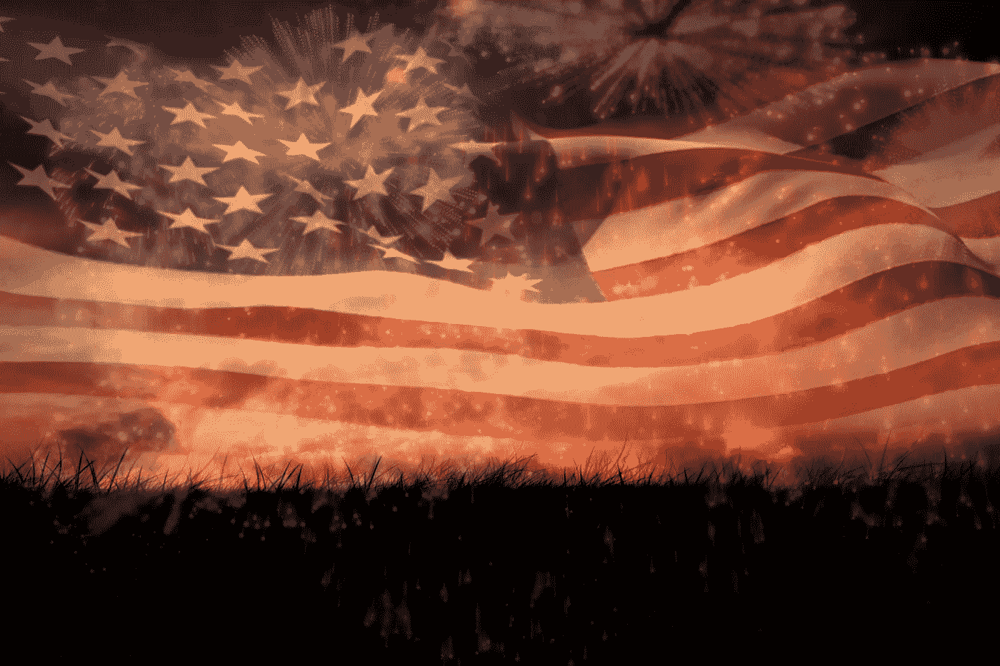

# 多么奇怪的第四个

> 原文：<https://medium.datadriveninvestor.com/how-strange-the-fourth-2666c67e83fa?source=collection_archive---------1----------------------->

对那些热爱美利坚合众国的人来说，7 月 4 日是一个神圣的日子，一个充满爱国主义、怀旧和傲慢的日子，一个品尝美国例外论的仙丹的日子。也许，考虑到前面提到的前提，美国的生日既不是一个真正的生日，也不是真正的美国人的生日是绝对恰当的，尽管北美可能行得通。

1776 年 7 月 4 日，13 个孩子宣布与他们已经长大的父母离婚，但经过一点合理化、一点虚伪和一点扭曲，这件事已经被转换成与两天前批准的事件尽可能不同的东西，今天可能被大多数“美国爱国者”认为是一群叛国的叛乱恐怖分子(尽管不是穆斯林或共产主义者，也不是那么坏)。7 月 4 日，13 个独立、主权和独立的共和国宣布了他们的生存权，讽刺的是，在大多数情况下，这些权利现在成为了大约八、九年后最终形成的联邦的支配性条件。

讽刺；但是大多数关于这个特殊节日的事情都是具有讽刺意味的。

首先，如上所述，它并不代表现在庆祝这一节日的共和国的诞生，尽管在这一天脱离联合王国的 13 个前殖民地可以合法地庆祝这一节日，作为他们享有主权和独立的短暂时期的一个基本节日。因此，在那一天，祝曾经是特拉华州、宾夕法尼亚州、新泽西州、佐治亚州、康涅狄格州、马萨诸塞湾(现在有许多州)、马里兰州、南卡罗来纳州、新罕布什尔州、弗吉尼亚州(当时没有西弗吉尼亚)、纽约、北卡罗来纳州、罗德岛和普罗维登斯种植园(仍是其正式名称)的独立和主权共和国的人们生日快乐。至于[北美]美利坚合众国，嗯，这是完全恰当的，混乱占主导地位。

一个合适的生日可能是 1781 年 3 月 1 日，这一天《联邦条款》被批准，美国正式成为一个州。当然，这一基本文书被否定了，根据其条款，在 1787 年 9 月 17 日签署了现行宪法的最初版本时，需要全体一致才能进行根本的修改，尽管它直到 1787 年 6 月 21 日才生效，当时它在激烈的辩论后最终获得批准，主要是基于后来被称为联邦党人文件的论点，其中大多数被证明充其量是错误的，最差的是彻底的欺骗，因为在我们两年一次的平庸和虚伪的联邦选举中经常发生这种情况。传统有其根源。

当然，更早的时候，1783 年 9 月 3 日，英国通过巴黎条约(众多条约之一)承认了其十三个顽固的前殖民地的独立。在那个时候,“美国”仍然是复数，而不仅仅是一个复合名词，起初只是为了试图弑父的目的而联合起来，但自 1781 年 3 月 1 日以来，一个松散的联盟形式的邦联。

另一个日期可能是 1789 年 4 月 30 日新宪法迎来第一任行政长官的那一天，乔治·华盛顿宣誓就任美国第一任总统。他希望被称呼为“总统先生”,而不是“总统先生”,他可能更喜欢那个日子。

或者，在关于各州权利的辩论结束(或者他们认为如此)后，当联邦转变方向，成为一个更加集权的共和国时，也许是当前美国诞生的最好庆祝；但那会是哪一天呢？最常被引用的内战结束的官方日期是 1865 年 4 月 9 日，罗伯特·e·李将军在阿波马托克斯法院大楼村的麦克林大楼向北弗吉尼亚军队投降。然而，直到 16 个月后的 1866 年 8 月 20 日，阿波马托克斯，总统，当时的安德鲁·约翰逊，才正式宣布战争结束。那时，反叛者是恶棍，不像 90 多年前那些骄傲地授权宣布独立宣言的人，他们和前者一样都是种族主义者。

当我们庆祝一个乔治三世会自豪地称之为自己的帝国时，这是值得思考的事情。
_______

吉列尔莫·卡尔沃·马埃和戴安娜·马塞拉·卡德尼亚斯·加西亚；马尼萨莱斯，2018；保留所有权利。请随意分享适当的归属。

Guillermo Calvo Mahé(以前是诗人)是作家、政治评论家和学者，目前居住在哥伦比亚共和国，尽管他主要居住在美利坚合众国(他是美国公民)。直到最近，他还在马尼萨莱斯自治大学主持政治学、政府和国际关系项目。他拥有政治学(Citadel)、法学(圣约翰大学)、国际法律研究(纽约大学)和翻译研究(佛罗里达大学拉丁美洲研究中心)学位。可以在 guillermo.calvo.mahe@gmail.com 联系到他，他的大部分作品可以通过他在 www.guillermocalvo.com 的博客获得。戴安娜·玛塞拉·卡德尼亚斯·加西亚是一名哥伦比亚社会交流者和记者，她与卡尔沃博士在各种公民、社会和政治项目上合作。