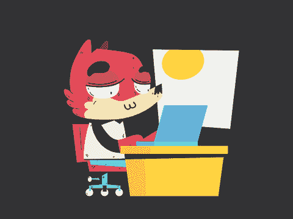
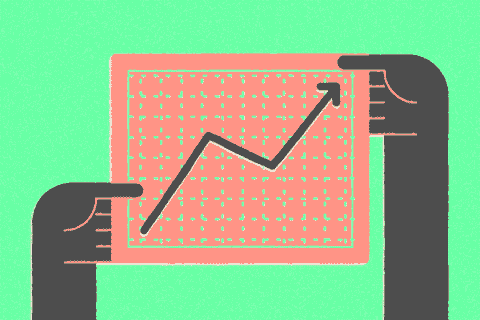

# 多休息如何提高我的工作效率

> 原文：<https://medium.datadriveninvestor.com/how-taking-more-breaks-improved-my-productivity-a9414643217c?source=collection_archive---------13----------------------->

你是如何工作的？许多人一整天都在断断续续地工作，有时效率很高，有时效率很低。其他工人能够在整个工作日保持稳定的工作流程。让我们面对现实吧，有些人只是整天停留在低生产率的稳定步伐上。我吗？我发现自己整天都在努力保持心流，并且总是试图让自己越来越努力地工作。我经常会跳过午休时间，推迟上厕所的时间，并且发现自己会在没有被要求的情况下工作到深夜。

 [## 成功的生活数据驱动型投资者的 25 种自我提升方式

### “我活得越久，学到的就越多。学的越多，体会的越多，知道的越少。”―米切尔·莱格兰德时间到…

www.datadriveninvestor.com](https://www.datadriveninvestor.com/2019/03/12/25-self-improvement-ways-for-a-successful-life/) 

对于不能保持足够高的工作效率，我感到不知所措、压力重重。那我做了什么？我试图研究如何才能战胜我发现自己陷入的这些生产率滑坡。然而，令我惊讶的是，我没有找到如何让自己更努力的信息，而是找到了几项关于工作日休息的实际**重要性的研究。没错——我也震惊了！**

我在寻找一个休息时间更少的工作日的过程中偶然发现的一项研究是由[托克](https://www.torkusa.com/brand/torktakesback/)完成的，该研究表明，每天午休会让员工感觉更有效率、更有成效，并且总体上对目前的工作更满意。一开始我很震惊。我一直担心，如果我休息一下，我会显得不够努力。好吧，原来其他员工也有同样的感觉！事实上，近 20%的北美员工同样担心他们的老板会认为他们不够努力，另外 13%的员工觉得他们会受到同事的评判。

在阅读了几项证明这些相同统计数据的研究后，我坐下来，意识到让你的大脑休息一下，这样你就可以重新开始，这可能是完全健康的。我意识到不断鞭策自己并不像我想象的那样健康。从现在起，我已经从我的无效时间中学习，而不是批评我自己，把自己工作到死。

## 那么，自从采用新的工作策略以来，我学到了什么？

嗯，我学会了更加注意自己一天的感受。我发现工作一个半小时后，我的思维开始变慢。当我开始感到心烦意乱或行动迟缓时，我不再像以前那样努力克服它，而是简单地休息一会儿重新开始。无论是凝视窗外几分钟，在办公室里散散步，还是查看当地新闻，当我回来时，我觉得我能够比以前更容易地专注于手头的任务。当我终于让自己放松时，我惊讶地发现自己变得更有效率了，哪怕只是很短的一段时间。

我认识到，在整个工作日完全 100%高效几乎是不可能的，这真的没问题！如果你在工作日有效率低下的时候，不要气馁，我们都是这样，追求完美的效率是不现实的。最重要的是从你的非生产性时间中学习——记住休息是健康的！

在你的一个工作日里尝试一下这种工作方法，并在下面的评论中让我知道让自己休息是什么感觉！

还是情绪低落？阅读我们最近关于如何走出低迷和告别[职场忧郁](https://clariti.app/blog/workplace-blues/)的博文。

