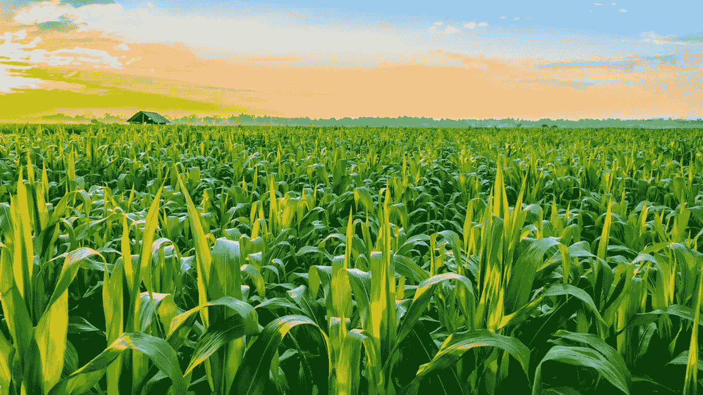
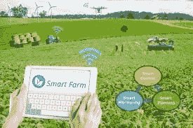

# 技术是如何在农业部门实施的

> 原文：<https://medium.datadriveninvestor.com/how-technology-is-being-implemented-in-agriculture-sector-657b2a8b86?source=collection_archive---------1----------------------->

**农业技术的未来**

农业贸易是一个国家国内生产总值(GDP)的主要部门和贡献者之一，商业企业和农民面临的第一个挑战是使用降级的机械和严重依赖陈旧的初级方法。农业贸易即将有一个大的提升；像混合现实(MR)和 [**人工智能(AI)**](https://www.enterprisetechnologyreview.com/news/ai-in-agriculture-a-modern-approach-toward-successful-farming-nwid-127.html) 等最新技术的流入将为商业企业创新者提供创新和令人兴奋的途径。

先生，数字世界与地理的镰状思维的结果在最近获得了巨大的牵引力。1994 年，Paul Milgram 和 Fumio Kishino 在他们的论文“混合现实视觉显示的分类”中引入了术语“人”即使假设人类的思想还处于萌芽阶段，在这个价值 64000 美元的世界上，数字模拟物体的分层已经打开了一个具有无限潜力的盒子。受害者先进的处理视觉技术，图形处理能力，和显示技术的人，创新者将获得大量的应用，从注意到整个农业作业开始到有关联度递归计划的每一种方法。3D 增强大气允许农民检查完全不同的作物栽培的可能性，并帮助远程工具监视或管理系统。

 [## 忘记石油吧，水是未来。数据驱动的投资者

### 我们不会耗尽燃料的替代品。能源行业曾经是投资者的荣耀，无论…

www.datadriveninvestor.com](https://www.datadriveninvestor.com/2018/11/14/forget-about-oil-water-is-the-future/) 

[**农业中的人工智能和机器人**](https://technologylimitless.com/artificial-intelligence-in-manufacturing/) 平方测量模拟人类行为模式的应用数学和分析模型，并据此执行任务。人工智能提供了一个深入的指导程序，帮助农民完成种植，播种，收获和商业生产。立方厘米与人工智能的结合有助于育种者提高作物产量、土壤管理和耕作。

无线电导航、光学设备陀螺仪、人工智能诱导的农业汽车以及支持 MR 的头盔或眼镜等应用可以通过统计分析来自多个来源的大量结构化和非结构化信息来帮助农民提高作物产量和商品质量，同时实现完全自动化。

2017 年，农业市场规模内的世界人工智能估计为 2.4 亿美元，预计到 2025 年底将达到 11 亿美元。随着人工智能和人的混合，农业企业将为农民提供必要的工具，使他们的利润翻一番，增加国家的价值。

**智能农业改变了农业**

在几个国家，粮食生产和安全广场衡量环境影响和缺水带来的主要挑战。每年人口的逐渐增长需要更多的粮食生产。建议在农业中采用数字技术来提高粮食产量，并根据当地的气候条件解决粮食安全问题。

**看看这个:关于**[**CIO Review**](https://medium.com/@jackmathew/cioreview-beab930fb56e)**杂志**的评论

**什么术语被称为“智能养殖”？**

**智慧农业可能是一种新型的农业管理理念，是利用现代科技来提高农业生产的数量和质量。物联网、全球定位系统和人工智能等技术的传播将有助于农场层面的战略高级认知过程，此外还有工厂层面的运营行动。**

****明智的耕作给农业带来了怎样的变化？****

**早期的农民希望考虑水资源来生产特别适合环境条件的作物，然而，技术的进步消除了农民面临的挑战。近年来，通过合理的耕作技术，农业正开始成倍地提高其门槛。合理耕作包括精确耕作，精确耕作可以通过特定地点的作物管理来应对作物的层内和田间变化。这可能会影响农业的所有领域，以及作物和动物管理的潜力，以更低的价值提高产量，以及水资源的对话。**

****修改合理耕作的要求****

**为了保持合理耕作的准确性，传感器平方测量需要跟踪土壤的浓度水平。在检测机确定的信息的支持下，使用具有呼叫规则和模型的特定软件包来查看作物的状况，以及工厂消除缺陷所需的医学专业知识。农作物的时间段观察可以通过无人机和远程传感器来完成，这些传感器可以记录环境变量和农作物状况。**

**Smart farming solutions square 测量了几个发达国家和发展中国家的农业经济增长率。它通过结合农业技术的进步来消除资源短缺。它将通过保障粮食安全来克服未来粮食供应翻番的挑战。**

****亦见:**[**CIO review**](https://medium.com/cioreview-magazine)**出版物****

****参见:** [**CIOReview 杂志**](https://www.prnewswire.com/news-releases/compliancequest-recognized-by-cioreview-as-one-of-the-top-20-promising-digital-experience-solution-providers-for-2017-300548358.html)**