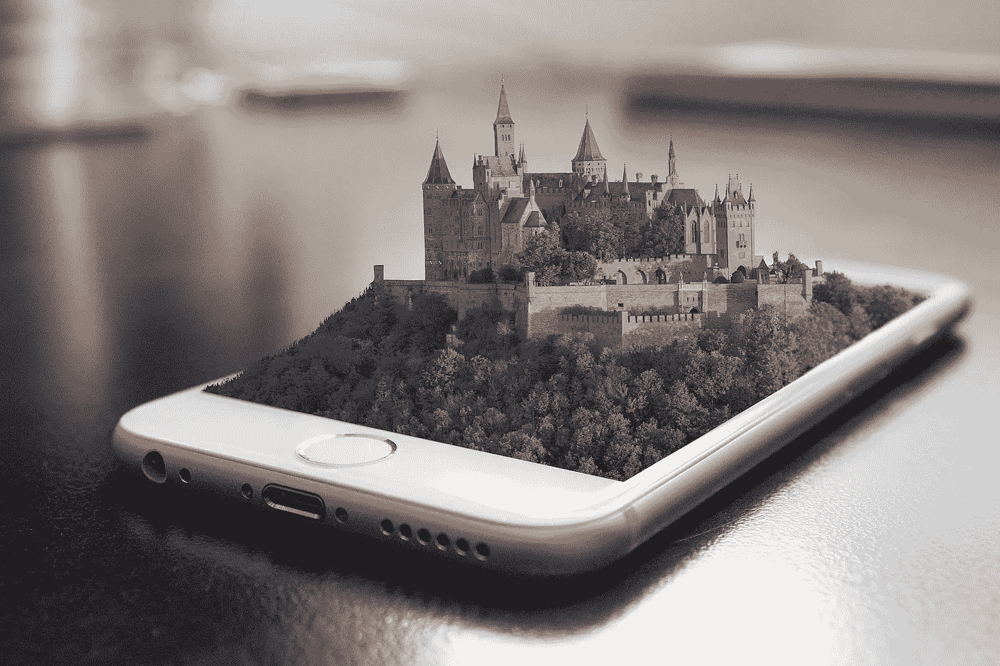
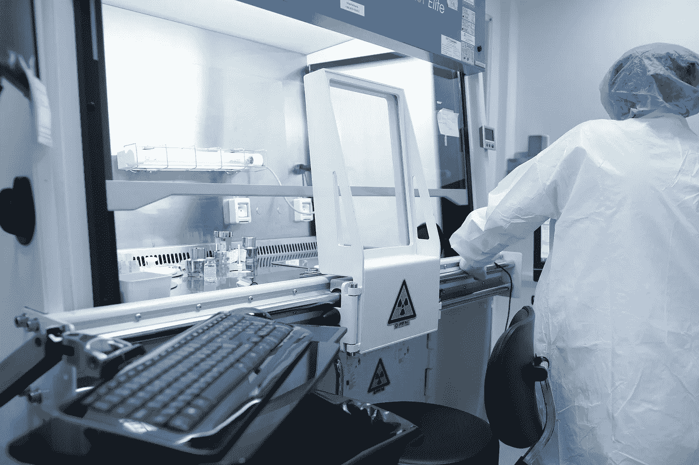

# 科技如何塑造我们的世界

> 原文：<https://medium.datadriveninvestor.com/how-technology-is-shaping-our-world-3c17b378f799?source=collection_archive---------13----------------------->

你知道吗，政治领袖、专家和有影响力的商人每年都会聚在一起讨论我们这个世界面临的最大问题。[根据时间](http://time.com/4177453/davos-history/)，这次会议在瑞士达沃斯聚集了大约 2500 人。不出所料，他们在过去几年中讨论的一个主要话题是技术以及它如何影响我们的世界。

你想过这个吗？我经常这样做，尤其是当我听到技术如何指导人们做决定，或者正如我最近所了解的那样，跟随我们的行动和想法，并将它们转化为有史以来最成功的营销策略的新闻时。这就是我们所说的*人工智能。*

我痴迷这个已经有一段时间了。一开始是一项关于人工智能主题的好奇研究，很快就引发了一场非常有趣、坦率而又势不可挡的探索，探索深度技术如何破坏了我们的日常生活。例如，当我读到脸书和他们正在监听我们谈话的理论时，我不再那么肯定科技是一件好事。

技术以前所未有的方式塑造了我们的世界，我们都意识到了这一点。我们周围都有。即使是那些支持技术是我们的朋友的人，也每天都在使用它，甚至比他们愿意承认的还要多。

事实摆在那里——技术已经迅速成为每个人生活中的一个重要部分，而且不会很快离开我们。也就是说，我想探索它目前塑造我们世界的方式。

# **1。解决了许多问题**

技术对我们世界的最大和最有争议的影响与科学和医学发现的进步有关。在技术的帮助下，以前似乎无法解决的问题被专家们解决了。

想想吧。专家们花了 30 年的时间将艾滋病病毒导致的死刑转化为一种可以控制的疾病。这只是在技术帮助下解决的众多问题中的一个小小的解决方案。

因此，医药和科学方面的费用预计也会降低久而久之。例如，2014 年风险投资公司向各种医疗保健公司投资了 110 亿美元。这笔钱用于提供更好的治疗和诊断，以及研究我们的基因建设，目标是战胜各种疾病。进步是惊人的。以前，一个人类基因组序列的成本是 1 亿美元(2002 年)。现在，成本不到 1000 美元，而我们只能期待它在未来会减少。

科技有它的缺点，这是肯定的，但是对于医疗保健来说，它是我们取得进步的一个不可替代的因素。

# **2。财富分配不均**

当涉及到医疗问题时，技术可能是我们的天使守护者，但当涉及到财富和财务时，它是一个非常大的问题。总的来说，[科技让我们的世界更加丰富。然而，认为所有人都从中受益是非常错误的。](https://www.nytimes.com/1997/09/28/magazine/technology-makes-us-richer-the-paper-bag-revolution.html)

事实上，情况恰恰相反。

是的，我们的财富增加了，但只有少数人从中受益。2009 年，世界上最富有的 1%人口拥有全球 44%的财富，但在 2014 年，这一数字上升到 48%。那只是冰山一角。研究人员认为，到明年，前 1%的人将拥有全球财富的 54%。

基本上，我们的世界将被世界上百分之一的人所拥有和领导。自然，剩下的 99%对此不太高兴，尤其是低技能工人。

为什么是他们？因为自动化的结果是，他们是第一批失业的人。技术可能会带来新的工作岗位和机会，但它也自动化并夺走了我们的许多工作岗位和机会。

# 3.更好的教育与否？

技术变化可能会更好地影响我们的教育，但这些变化并不总是有益的。这些应用程序商店现在充满了教育应用程序，为学生和教师提供了他们从未有过的机会。但是，教育表现和教育之间的联系还有待观察。

一些报告，如经合组织的报告，显示了使用技术帮助学生完成作业的积极效果。但是，只有那些在电脑上花费有限的低于平均水平的时间的人。花太多时间使用它的学生已经显示出他们的教育成就下降。

因此，只有我们学会如何使用和控制技术，它才能促进我们的教育。

# 4.全球对安全的关注

好处是显而易见的，但也有许多伴随技术而来的缺点。全球范围内出现了一系列新的安全问题。因为经济间谍和网络犯罪，我们的世界付出了超过 4450 亿美元的代价。粗略估计，这大约占我们全球收入的 1%。

想一想技术给了恐怖组织在人群中传播恐惧的机会。他们的仇恨信息在几秒钟内就被公之于众，让全世界都可以看到。

这只是开始。如果我们看看现代战争，科技已经把我们带得很远了。十多年前，五角大楼只有不到五十架无人机，但是今天，它有大约七千架！不仅如此。据五角大楼称，到 2023 年，中国将拥有超过[4.2 万架无人机。](http://nationalinterest.org/blog/the-buzz/china-building-42000-military-drones-should-america-worry-12856)

现在，技术可以这样或那样发展。人们一直在讨论优缺点，但事实是，技术就在这里，不会去任何地方。也就是说，我们需要学会如何控制它，并在糟糕的情况下做到最好。当然，利用它提供给我们的力量来改善我们的世界和生活。