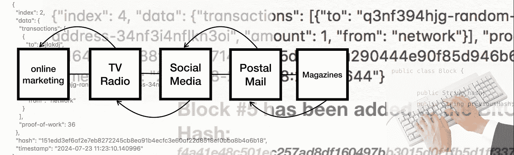
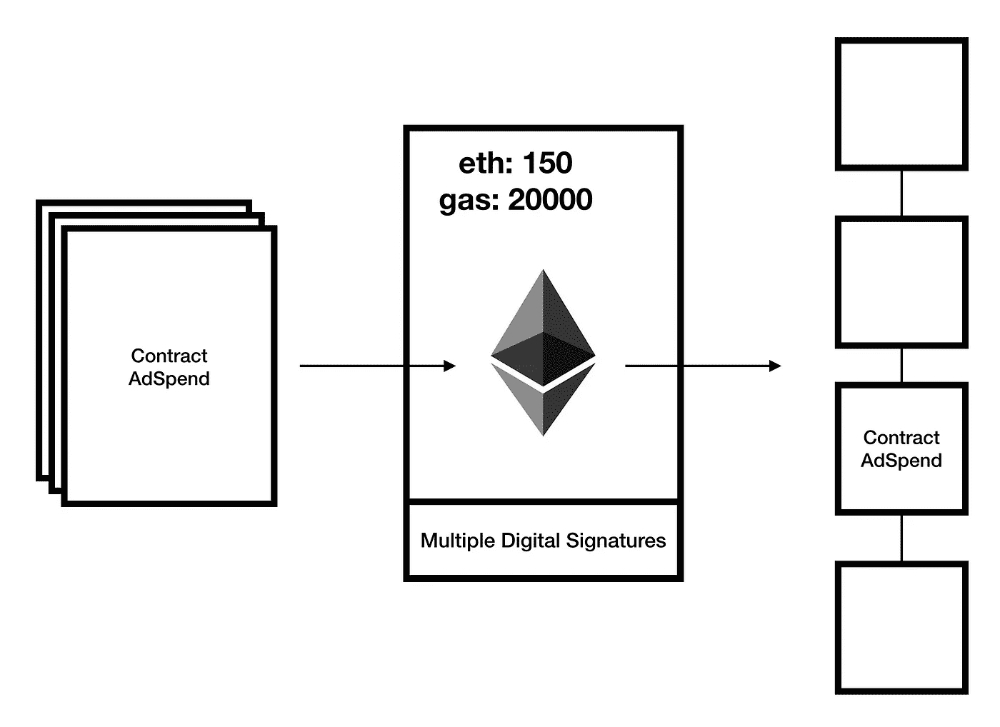
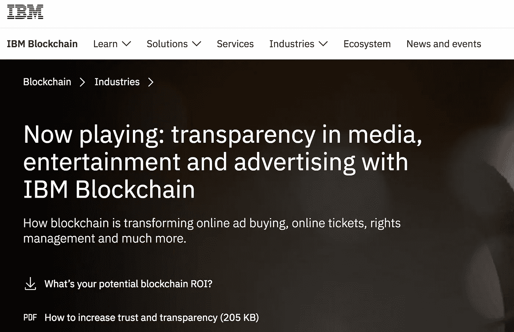
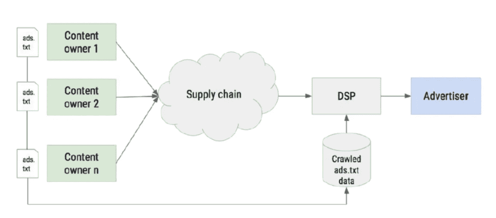

# 区块链如何给广告行业带来信任和透明

> 原文：<https://medium.datadriveninvestor.com/how-the-blockchain-can-bring-trust-and-transparency-to-the-advertising-industry-467829cc161f?source=collection_archive---------4----------------------->

对支出缺乏透明度的担忧长期以来一直困扰着全球数字广告业。对于广告行业来说，这是区块链科技可以真正帮助解决这些问题的地方:缺乏透明度和不透明的和解。在区块链中，一旦事务处理通过一致的流程得到验证，它也将被提交给网络中的所有分类帐。这些分类账是分布式数据库，存储交易记录的信息。谈到转型，区块链科技可以对广告行业产生这样的影响。

Blockchain for advertising at the IBM booth at the 2018 NABShow. (Las Vegas, NV)

互动广告局(IAB)帮助媒体和营销行业在数字经济中蓬勃发展。该组织研究的一件事是区块链在加密货币之外的好处。它有潜力为业务流程的重要组成部分供应链提供**更高的效率、可靠性和高质量的数据**。这个网络可以极大地降低交易成本，因为它是分散的，没有中间人或第三方来仲裁或从一笔大生意中提成。数据的安全性也是由密码技术提供的，它可以防止篡改和不被审查。最重要的特性是保持完全可验证和不可变的信任和透明的分类账或数据库层的能力，这在媒体和广告流程中并不总是可用的。

区块链可以改进的方法之一是广告客户与供应链的互动。在这种情况下，出版商和广告商需要在没有第三方参与的情况下进行交易，或者即使有第三方，他们也不能操纵交易过程中的任何步骤。相反，他们会像在一个*“未经许可且不可信”*的环境中使用他们的平台一样使用区块链。共识机制可以在公共区块链中以无偏见的方式提供信任。但是，他们也可以使用更适合企业的私有区块链，即*“集中和许可的”*，但仍将提供所需的信任和透明度。

A smart contract can implement more trust and transparency between the publisher and advertiser. Using the Ethereum network, a smart contract is implemented by locking ETH into a digitally signed transaction that is put on the blockchain. It contains conditions that will execute upon fulfillment. In this case the publisher gets paid once they fulfill the conditions in the smart contract set forth by the advertiser. All transactions are immutable as well, so this is to prevent malicious actions on anyones part.

媒体采购或“媒体购买”需要更新。由于数字化转型，广告业的生态系统发生了变化。许多相关方之间缺乏质量控制、安全性和财务透明度可能会成为一个问题。区块链能提供的是一个建立在信任基础上的解决方案，解决欺诈可能给这个生态系统带来的问题。通过设计，区块链解决方案可以防止数据被追溯性修改，从而确保交易的可验证性和完整性。这也可以保证准确性并防止任何类型的数据操纵。

根据 IBM 的说法:

> **“区块链不仅能确保信任和透明，它还能帮助各种规模的广告商降低交易成本，提高效率，简化合同，改善发票处理。”**

世界上最大的消费品广告商之一，[联合利华](https://www.unilever.com/)，正与 [IBM](http://ibm.com) 合作在区块链开展一个广告行业的项目。他们的目标之一是为广告商提供透明度。这意味着公司可以披露有关其业务足迹的可靠信息。这还可以防止任何欺诈行为，因为交易是公开记录的，并且可以被披露以确保广告来源正确。由于广告已经变得数字化和高度自动化，几乎任何人发布广告都变得更加容易，而不需要任何信任。

IBM, a tech giant is offering its services to developing blockchain solutions (Source IBM)

缺乏对第三方的可见性是一个行业问题。正是由于这些问题，广告公司需要一种解决方案来应对全球广告欺诈，让公司完全控制他们的广告支出，并监管编程算法以确保预算不会浪费，广告会被正确的人看到。在计划的第一阶段，主要目标是通过提供受众交付的统一视图来识别和纠正协调问题。通过使用智能合同来验证商定的数字，差异可以立即消除，而不是像许多媒体购买那样在几周或几个月后才消除。

广告行业的一个大问题是每年的损失金额。由于未经授权的库存转售，广告商和出版商损失了数十亿美元。这就是像 [**Ads.txt**](https://publisher.adchain.com/) 这样的项目出现的原因。Ads.txt 代表**授权数字卖家**，它为广告发布者公开宣布谁是其库存的授权卖家提供了一个脚本。这利用了 adChain 协议，该协议是存储在以太坊区块链上的智能合同中的信誉良好的发行商域的注册。

An example of an ads.txt file from the [IAB Tech Lab](https://iabtechlab.com/wp-content/uploads/2016/07/IABTechLabOpenRTBAds-txt_Spec_PublicComment_Draft.pdf).

以下是区块链在广告行业中的一些使用案例:

- **电视广告库存的销售**

**-广告支出中的欺诈预防**

**-库存白名单授权卖家**

**-活动协调**

**-简化资金发放的智能合约**

**-广告资产的确认**

显而易见，随着竞争的加剧和预算的缩减，充分利用预算来提高广告的质量和有效性变得非常重要。避免像脸书广告商那样的惨败，他们在看似合法的操作背后操纵网络，这是广告公司可以通过使用区块链以更多的信任和透明度来解决的问题。它让买家和卖家都知道他们到底在和谁做生意。这可以减少欺诈，这是广告行业需要的支出透明度。

然而，未来的挑战相当严峻，除了加密货币(截至本文撰写之时)，目前的区块链系统还没有标准的实施方案。它甚至看起来像一辆“炒作列车”，因为区块链这个词现在似乎给任何项目都增加了价值，尽管可能还没有完全理解它是什么以及它是如何工作的。新项目正在世界各地涌现，但区块链并不完美。尽管有其用途，但仍有需要改进的地方，其中之一就是速度。与 Visa 等老牌机构相比，使用区块链的交易速度仍然落后。开发人员正在努力解决的正是这些与伸缩性相关的问题。尽管有这些障碍，它所能解决的潜在问题对广告业来说是显而易见的。最终，有了一个可以审计交易中每一步的系统，人们会更加放心。

=====================================

关于区块链的更详细的解释，你可以阅读我以前写的关于这个主题的文章。

**“区块链超越比特币，是你分享信息的方式”**
[https://decocal . today/区块链-超越-比特币-是你分享信息的方式-f3d5e1fbb1c8](https://decentralize.today/blockchain-goes-beyond-bitcoin-it-is-how-you-share-information-f3d5e1fbb1c8)

*原发布:*[*https://steemit . com/区块链/@ vtce/nab show-2018-广告与区块链*](https://steemit.com/blockchain/@vtce/nabshow-2018-advertising-and-the-blockchain)