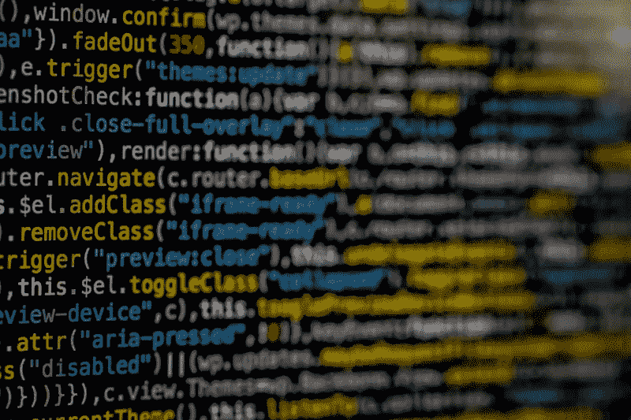

# 官僚主义如何让我们避免在人工智能开发中犯错误。

> 原文：<https://medium.datadriveninvestor.com/how-the-bureaucracy-might-save-us-from-making-a-mistake-in-ai-development-8ddcf8d847c3?source=collection_archive---------17----------------------->

计算是一种抽象。这是将无限的 1 和 0 转化为指导整个生活的程序和技术的奇迹。对于那些不知道机器遵循的逻辑或如何正确地将他们的想法传达给这样一个实体的人来说，编程艺术通常被视为不透明和神秘的。计算开发的故事中最令人惊讶的情节转折是，参与构建和解释这种高级结构的程序员也经常以与门外汉相同的方式看待他们自己的创造。这一令人惊讶的事实形成了争论的核心，即下一级计算——即自我设计和学习机器——是否将通过一种象征性的手段来实现:代号为:由创造者清楚理解的结构化、可理解的逻辑组成的老式人工智能(go fai)——或者通过一种不可理解的、不明确的表达方式来实现，这种表达方式对创造者和使用它的无意识机器来说都是不清楚的。

尚不清楚是否有必要进行区分。通过各种学习方法进行的机器学习和数据分析的各个方面都具有符号/显式表示和非显式表示的功能。NLP、文本分析、推理和类似的系统都是通过符号表示来实现的。语音和图像识别、自动驾驶汽车和其他更高级的任务显示了不明确表达的前景。两者的组合，形成混合人工智能，在模糊系统可能产生不想要的结果的情况下，从导致监督学习的组合中繁荣。由于需要较高认知水平的任务和较低的、重复性更强的认知水平的任务之间有明显的区别，一个更好的问题应该是:**为了未来的发展，是否应该区分这两者？**

**不透明的系统是监管和法律的对立面。由于它们产生的结果甚至连它们的创造者都无法解释，因此很难追究那些对代码故障或供应链某处疏忽负责的人的责任。一个无法解释的系统——却被大多数人广泛使用和接受——会绕过现代法律体系。无政府主义者无疑会称赞这是一个积极的发展，但对于那些可能受到自动司法系统或自动驾驶汽车危害的群体来说，这种系统无意中对其创造者产生了不利的偏见，而自动驾驶汽车认为乘客的生命比路上的行人更重要——了解计算机系统如何得出结论变得至关重要，这样就可以进行激烈、深入的辩论和研究来反对它。**

**符号表示现在被认为不如深度学习系统。很难让那些寻求从医学到法律等多个领域进步的人相信，一个更慢、更容易理解的人工智能发展版本比神秘的、可能创造奇迹的系统更可取。然而，我认为前进的道路是明确的。在可能存在潜在偏见的情况下——社会机构已经要求对决策过程进行验证和彻底检查，我们应该让象征性的表征成为主导模式。在理论的情况下——比如人类的模仿(艺术、阅读、写作等。)，并使用人工智能在研究中寻找线索，否则需要运气，不明确的表示将是完美的。**

**未来有许多可能性。人工智能系统可能会发展到这样一个地步，即一个不明确的系统有可能创建自己的高级符号表示，以帮助人类理解他们系统中以前躲避我们的复杂性。计算能力可以避开密集符号系统通常迟钝、苛刻的要求。这个问题很可能会因为未来的突发奇想而变得无关紧要。就目前而言，上面的概述——人工智能增加了已经有内置方法来对抗偏见(司法审查，同行审查等)的机构和系统。)应该对他们的工作有一个透彻的了解。不透明程度低的混合系统应该是那里的边界。其他没有相同要求的人工智能应用，例如。)一种系统，其唯一的输出是理论上的或良性的。这种模式不是绝对的。肯定会有一些应用程序遵循良性和有害之间的界限。然而，这个分类系统可能是一个更大的框架的开始，它可能会实现更高的准确性。**