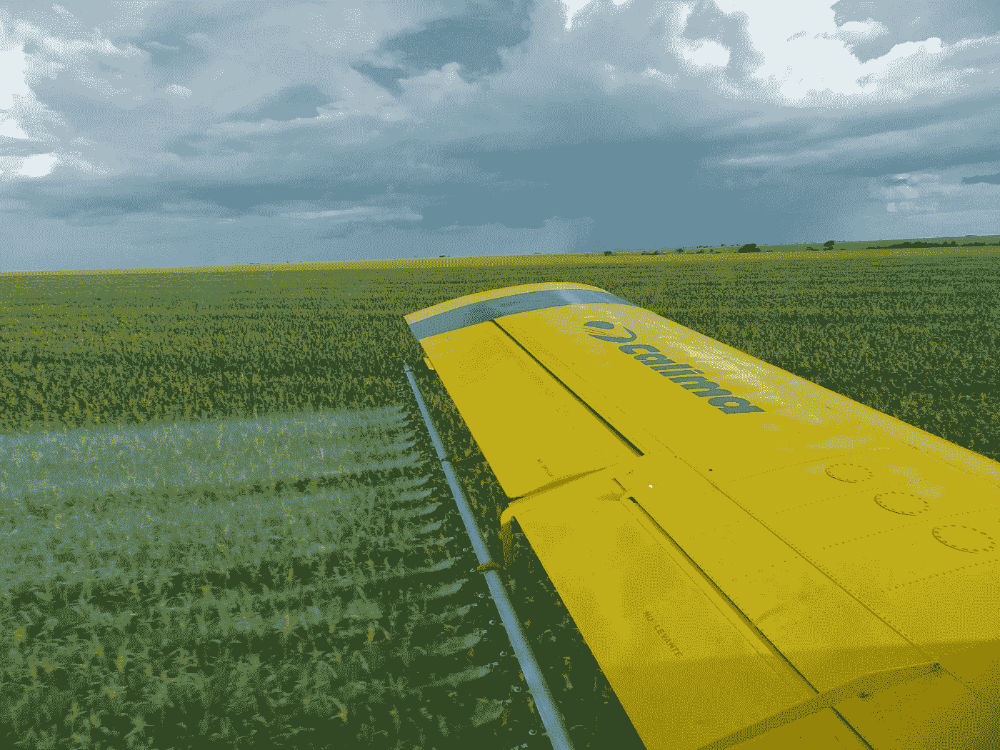

# 昆虫的减少是如何证明有机农业的

> 原文：<https://medium.datadriveninvestor.com/how-the-decline-of-insects-is-making-a-case-for-organic-farming-b225f2020ba9?source=collection_archive---------7----------------------->

Photo by [Alejandro Ruiz](https://www.pexels.com/@alejandro-ruiz-425706?utm_content=attributionCopyText&utm_medium=referral&utm_source=pexels) from [Pexels](https://www.pexels.com/photo/airplane-corn-field-crop-duster-1107822/?utm_content=attributionCopyText&utm_medium=referral&utm_source=pexels)

前几天我读了一篇可怕的文章。根据几个消息来源，我们有望在 100 年内(或更短时间内)消灭这个星球上几乎所有的昆虫。据估计，目前全世界昆虫的数量是全人类的 17 倍。昆虫是地球上每个生态系统的一部分。昆虫是大自然伟大的回收者。昆虫是地球上不在海底或冰下的每一部分的伟大组织者。我们比它们更需要我们，因为我们处于食物链的顶端。

根据《卫报》的文章，世界正在经历第六次物种大灭绝。我要说的是，人类将会成为其中的一部分，除非我们愿意在农场里和昆虫生活在一起。大部分的昆虫损失可以归因于我们每年每天在农场使用的杀虫剂。我是说，拜托，昆虫带回巢穴杀死其他昆虫的杀虫剂？甚至不要让我开始谈论[新叶马铃薯](https://www.sourcewatch.org/index.php/NewLeaf_Potato)，这是一种转基因作物，它的叶子通过阻止它们的胃工作来饿死一种常见的害虫。长远考虑？那种作物对*美国*有什么影响？

世界上大多数政府都提倡和支持使用杀虫剂。我们都被廉价食物的想法说服了。但是当食物便宜时，我们倾向于浪费它。我们大规模浪费食物。据联合国估计，世界粮食产量的 1/3 被浪费掉了。

我想这可以部分归咎于我在典型的餐馆里看到的大份食物。几年前，我带家人去一家煎饼屋，吃了一个看起来像 12 英寸宇宙飞船的煎蛋卷。我可以把那东西切成 12 块，吃一块，然后把剩下的给附近家得宝的日工。当我在美国餐馆吃饭时，我妻子和我通常分吃一餐，因为份量太大了。我简直无法想象一口气吃下这么多食物。她也不能。

昆虫数量下降的趋势与其他一些事情相吻合。人口增长率正在下降。取决于你问的是谁，科学家估计人类人口实际上将在 2040 年到 2070 年之间的某个时候开始下降。[似乎有一种共识和相当高的信心，人类人口将在本世纪末开始下降。](http://www.spiegel.de/international/world/the-great-contraction-experts-predict-global-population-will-plateau-a-795479.html)

所有这些都表明人类最终需要更少的食物。随着人类的减少，对农业的需求也减少了。也许到那时，人类会有更强的节俭意识。比如在餐馆和家里提供小份食物。说真的，我们可以逐渐转向有机农业，直到所有的农业都是有机的，没有杀虫剂和除草剂(除草剂)。没有人会挨饿。首先，我们会有更好、更有营养的食物。第二，这些昆虫会活下来，继续支持我们的农场。我们真的需要那些昆虫。

我认为最大的问题是我们错位的补贴。很久以前，艾伦·格林斯潘谈到了“非理性繁荣”，似乎市场曾经是理性的。我告诉你吧，一个为了一块钱而破坏环境的市场是不理智的。你在当地超市的收银台看到过冲动购物的机会吗？告诉我那东西是理性的。

我们喜欢假装我们有一个自由市场，但事实是，政府插手一切，他们是经济的一大块。政府是我们为文明付出的代价，如果你可以这样称呼它的话。关于那些补贴。绝大多数杀虫剂和除草剂的使用是由我们的农业补贴支持的，因为生产这些东西的公司有钱游说，而且游说得很努力。有机农业没有那么多钱，至少不足以在拜耳或孟山都想有所作为时与之抗衡。他们的方式。

鉴于我们每年损失 2.5%的昆虫，而且我们完全依赖昆虫来维持世界的幸福，我想说，如果我们要补贴农业，那就把我们的时间、精力和金钱用在有机农业上吧。如果我们能把人送上月球，并建造能自己着陆的火箭，我们就能想出如何在没有杀虫剂和让虫子挨饿的转基因生物的情况下养活这个世界。另一种选择看起来相当严峻。

继续写。