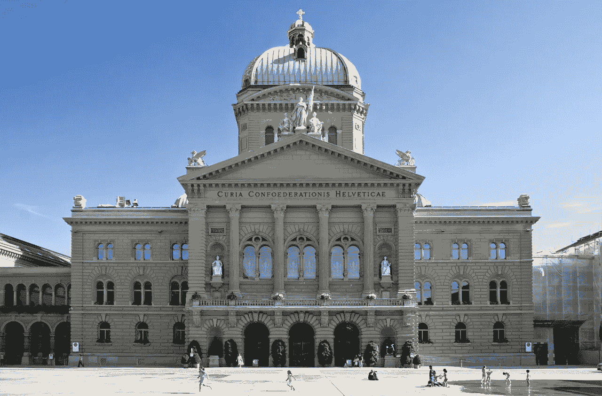
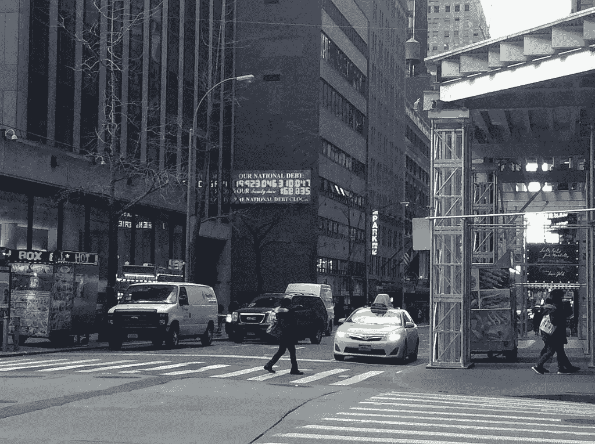
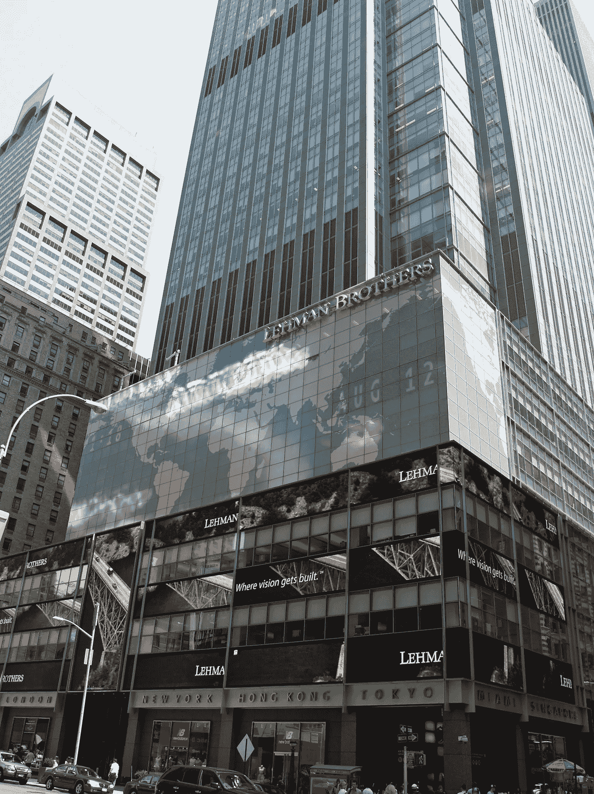

# 经济是如何运作的。

> 原文：<https://medium.datadriveninvestor.com/how-the-economy-works-f84d023523f0?source=collection_archive---------7----------------------->

对每个交易者来说，了解整个经济是如何运作的是很重要的。

一个经济体内部的一切都可以被分解成我们都在做的那些简单的日常交易。这整个金融舞蹈被著名的对冲基金经理雷伊·达里奥描述为一台机器。

然后，我们可以将这些交易定性地归入不同的**市场**。例如汽车市场、股票市场等。这些市场作为一个整体创造了一个 T4 经济。

对于每一笔交易，我们都需要一个买家和一个卖家。第一类人愿意与卖方进行货币或信用交易，以换取商品、金融资产或服务。一个经济体中的货币数量和支出将向我们展示总支出。这是经济的主要驱动力。

雷伊·达里奥继续写道，所有这些交易创造了“推动经济的三大力量”。这些是**生产率增长**、短期债务周期**和长期债务周期**。****

**任何国家最大的买家和卖家都是政府。政府由一个中央政府和一个中央银行组成。政府负责政策和税收。另一方面，中央银行控制着经济体内部的货币和信贷数量。中央银行影响利率和国家货币的数量(T21)。**

****

**Swiss parliament in Bern.**

**不具备购买商品、金融资产或服务所需购买力的买家可能成为借款人。另一方面，一个卖方，如果他出售这个‘购买力’(也称为本金)加上利息，就可以成为一个**贷方**。在一个经济体中，借方和贷方与其他买方和卖方一样重要。雷伊·达里奥甚至提到..**

> **……支出只受到贷款人和借款人提供和接受信贷的意愿的限制。当信贷容易获得时，就会出现经济扩张。当信贷不容易获得时，就会出现衰退。**

**财务顾问将贷款描述为向未来的自己借钱。因此，当利率高时，借款也会减少，因为你的“未来自我”将不得不向贷款人支付更多利息。反之亦然。当利率较低时，会有更多的借贷发生。**

**借方和贷方需要更新他们的会计账簿。当借款人借钱时，他将这笔债务归类为 T2 债务。当贷方贷出资金时，他将其归类为**资产**。当借款人偿还贷款人本金和利息时，这些分录将被关闭。在这个时间点上，交易被结算。**

****

**The US national debt clock. In February 2017, it read $19.9 trillion in national debt.**

**当借款人通过信贷增加购买力时，他也增加了支出，而支出是经济背后的主要力量。如果借款人能在将来偿还他的信用，他在贷款人眼里会更有信用。如果他不能偿还债务，那么贷方就不能收取他的收入，因此他就不能进一步消费。双方要么多花，要么少花。这就是为什么我们有**市场周期**。**

**根据统计，我们将这些周期分为短期和长期。短期通常持续 5 至 8 年，长期持续 75 至 100 年。这些经济周期让我想起了作者迈克尔·霍普夫的一句话..**

> **艰难时世造就强者。强者创造美好时光。好时光造就弱者。而且，软弱的男人会制造困难。**

**当经济崩溃时，人们需要增加努力，获得更多的知识/教育。这种教育将帮助他们创新和/或更有成效。这种生产率的增长将创造一个更强大的经济。经济强劲的人倾向于认为事情是理所当然的，或者被经济疲软的人超越。这将影响第一个经济体的力量，并将再次启动这个循环。因此，在一个经济体中，生产率的增长，以及偿还能力的增长，必然总是大于信贷的增长。长远来看不现实的东西。**

**这种人类行为并不是造成这些循环的唯一因素。如上所述,“向未来的自己借钱”也给未来的自己制造了债务。这本身就形成了一个循环。用现金购买任何东西都可以立即完成交易，但用信用卡购物会引发一个循环。**

**近几十年来，人类行为扮演了重要的角色。以至于描述市场运作方式并将诺贝尔奖授予尤金·法玛教授的**有效市场假说**的先前模型受到了**行为金融学**和**无效市场假说**的挑战。**

**信用本身并不是错误或邪恶的东西。本身不会造成衰退或崩溃。它只是一个工具。当一个人用信贷为企业融资时，如果我们把创业风险放在一边，他会期望赚得更多，从而能够偿还债务。另一方面，如果它会资助一个人去一个充满异国情调的目的地度假，这是西方世界许多人曾经做过的事情，那么他就不指望他的支出会有回报，因此也就没有能力偿还他的债务。促成市场周期的一个因素是，人们倾向于在之前债务的基础上借更多的钱，而不是偿还债务。**

**当一个经济体强劲，一个人的借贷和支出能力上升，那么总支出就会上升。这使得经济机器运转得更快。在这个阶段，人们会消费更多的商品和服务。当商品产量和服务量的增长低于支出时，价格就会上涨。这种现象叫做**通货膨胀**。价格越高，借贷成本或利率就越高。然后，正如我们提到的，更少的人会邀功。与之相反的叫做**通货紧缩。****

**在通货紧缩的经济中，经济活动减少。如果这种趋势持续至少连续两个季度，那么我们称之为**衰退**。此时，中央银行在经济内部进行干预。**

**为了理解中央银行如何影响经济，让我们从微观经济层面开始。当一个人在银行存了 1000 美元，这 1000 美元就变成了他的资产和银行的负债。这 1000 美元本身也不再是储户的财产，而是银行的财产。这被称为**部分准备金银行**。这也意味着银行可以以贷款的形式贷出这笔钱(它的财产)，方法是在账户中持有货币总额的一部分作为储备。举个例子，我们假设需要储备的资金比例是 10%。然后，银行可以在账户中存入 100 美元，并借出另外 900 美元作为贷款，收取利息。**

**银行被要求从客户存款中提取的百分比被称为存款准备金率，由国家中央银行设定。如果一家银行没有达到要求的准备金，它每晚都会从央行或其他银行借入剩余的资金。这些贷款(在美国)被称为联邦基金。联邦基金利率目标是由中央银行在审查国家的经济数据后确定的。所有其他利率都是基于那个利率。当反向需求较高时，银行的利润会减少。**

****

**The central bank of U.S. Also called the FED.**

**衰退过后，市场又开始加速。这一次，人们开始再次消费、借贷和投资。我们有一个市场繁荣期。如果经济人为地处于上升趋势，也就是说借钱，那么市场繁荣之后不久就会被描述为**泡沫**。泡沫倾向于**破裂**，价格将回到公平的市场水平。在泡沫破裂之前，个人和公司进入去杠杆化阶段。他们想尽一切办法减少债务。如果无法逃脱，那么违约**和破产**的风险就会上升。**

**为了再次刺激经济，去杠杆化需要央行采取更激烈的举措。在经济衰退中，利率的简单变化会带来巨大的变化。另一方面，在去杠杆化过程中，利率可能会达到接近 0%的水平，但经济仍会受到影响。为了再次刺激经济，中央银行可以使用量化宽松政策。这是央行凭空印钱，投资到风险相对较低的金融资产(也只有金融资产)，通常是 **10 年期国债**。然后政府拿走这些钱，通过降低失业率来刺激经济，失业率是经济健康的主要因素。如果中央银行没有成功，那么我们就会陷入萧条。**

****

**The headquarters of Lehman Brothers. The bank that, with its default, caused the 2008 crisis.**

**在抑郁症中，人们往往表现得更加不理性。在许多国家，在严重的经济萧条时期，民主的 T21 政治体系被搁置一旁，取而代之的是极权主义。政府将完全控制经济，私人所有权将会越来越小。另一方面，自由意志主义的政治制度将减少政府的影响，让市场掌握在个人手中。正如我们在这里看到的，政治和经济携手并进。这种平衡对于经济机器的正常运转至关重要。**

***来源:***

1.  **《经济机器如何运转》作者雷伊·达里奥。——[*https://www.youtube.com/watch?v=PHe0bXAIuk0*](https://www.youtube.com/watch?v=PHe0bXAIuk0)**
2.  **[https://www . investopedia . com/terms/q/quantitative-easing . ASP](https://www.investopedia.com/terms/q/quantitative-easing.asp)**
3.  **[https://www . investopedia . com/ask/answers/031115/how-do-central-banks-impact-interest-rates-economy . ASP](https://www.investopedia.com/ask/answers/031115/how-do-central-banks-impact-interest-rates-economy.asp)**