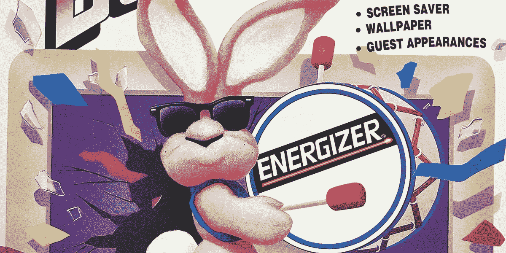
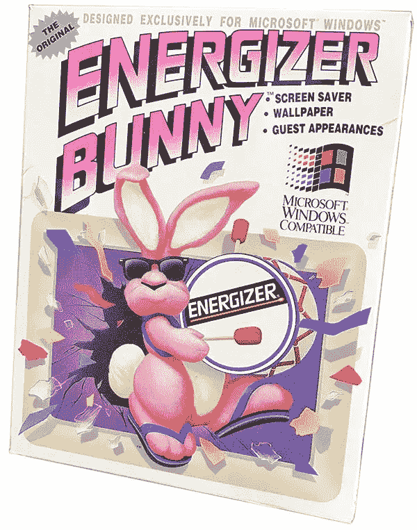
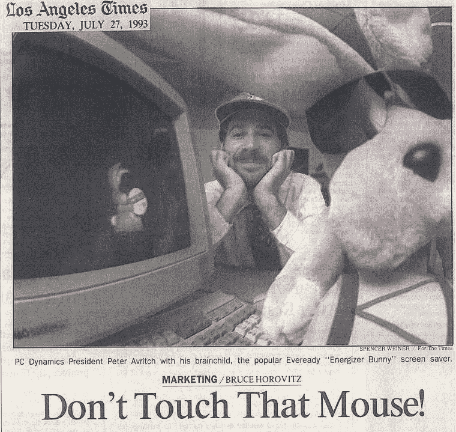
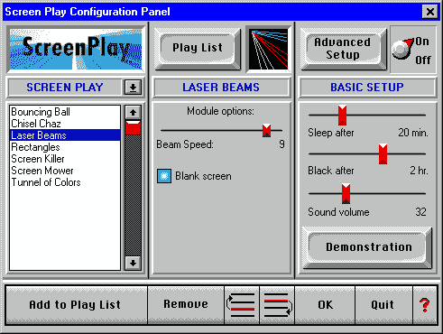
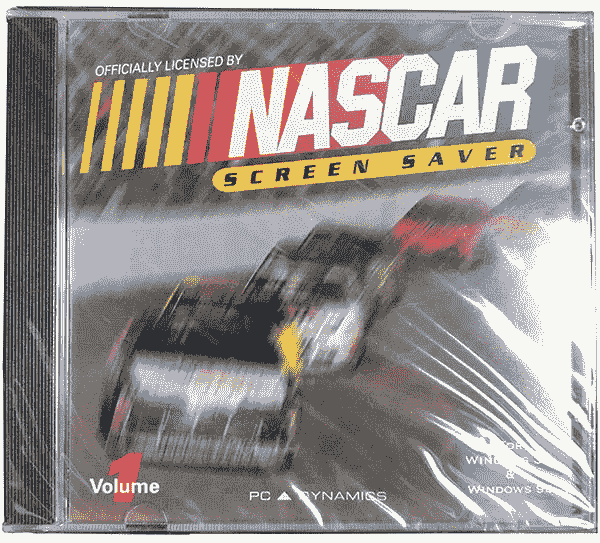
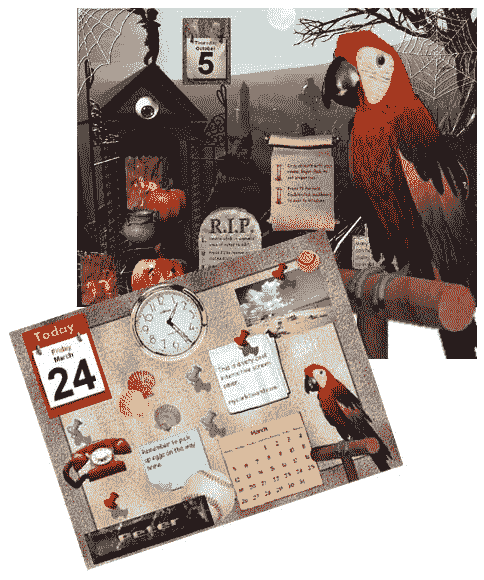
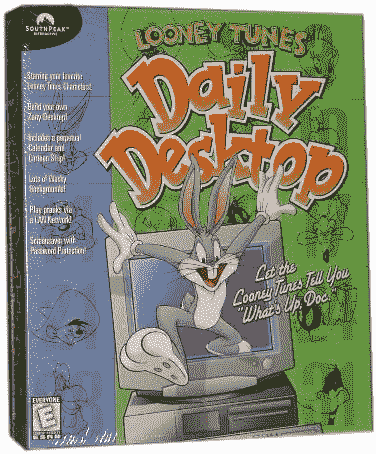

# 劲量兔如何拯救我的公司

> 原文：<https://medium.datadriveninvestor.com/how-the-energizer-bunny-saved-my-company-4d277fca3279?source=collection_archive---------1----------------------->

## 意外的屏幕保护程序

我们的销售大幅放缓。视窗操作系统出现了，微软的 DOS 却退出了。我们急切地想转向一个新的空间——stat。

现在是 1993 年。我的公司, [PC Dynamics](http://www.peteravritch.com/employers/pcdynamics) ,因其 MS DOS 菜单产品系列而闻名，这些产品帮助用户在 Windows 出现之前启动他们喜爱的程序。 [MenuWorks](http://www.peteravritch.com/portfolio/menuworks21) 于 1986 年首次亮相，一旦我们添加了一个神奇的自动化菜单生成器，它就像火箭一样起飞，但现在 Windows 3 出来了，它肯定会接管。

我们的经销商一个接一个地与我“谈话”——Peter，如果你不能尽快在你的产品系列中加入 Windows 产品，我们将被迫放弃你。

我有麻烦了。在我的脑海里，我可以把我的收入图画成零，我在银行里没有太多的跑道；肯定没有足够的时间来创造任何真正有意义的 Windows 产品。

> 我低估了对零售货架空间的争夺和经销商对闪亮新事物的追求。

我并不是没有看到 Windows 获得牵引力；但事后看来，我认为很明显我低估了对零售货架空间的争夺和经销商对闪亮新事物的追求。这一变化超过了 Windows 的实际用户采用率，我想这导致了我的困惑。

服装店因每季更换衣服而臭名昭著。他们把大部分库存都换走了，如果你没有新的东西可以换进来，其他人会很快跳进你的空间。他们已经这样做了几十年。这是可以预测的。

想想吧。Windows 是个人电脑软件的第一个季节变化。自 10 年前个人电脑首次亮相以来，DOS 就是全部。我们没有像服装店那样有规律的变化节奏来给我们提供视角；没有参照系，很难准确预测经销商在新一季会受到怎样的欢迎。

> 主要经销商正在“全力以赴”开发 Windows

我的收入高度依赖店内零售，我即将失去我的货架空间；这并不是因为人们不再喜欢我的产品，或者每个人都突然把他们的电脑升级到 Windows，而是因为主要的经销商正在“全押”在 Windows 上——这是一个闪亮的新事物。

## 这是一个笑话

我知道如果没有 Windows 产品，我很快就会死去，我的脑子里充满了想出某种支点的想法——但这不可能是一个扯淡的支点。那将是一种浪费。

时间已近午夜，我坐在 80 年代风格的橙色高背办公椅上，盯着天花板发呆，想着“我能做什么”、“我能做什么”、“必须简单”、“不能扯淡”。

不知从哪里，一个劲量兔子屏幕保护程序的想法穿过我的大脑。那时他们的广告经常出现在电视上；也许那是潜意识的触发点。

> 一个人，我笑出声来；伙计，那太搞笑了。

一个人，我笑出声来；伙计，那太搞笑了。但我真的不认为它能成为真正的产品。此外，永备永远不会去。但是说真的，那不是一次旅行吗？

第二天早上，我向我们的销售副总裁布鲁斯提到了我的疯狂想法；不是因为我认为我们应该这样做，甚至我们可以这样做，而是因为我仍然认为这是非常有趣的。那只是饮水机旁的谈资——仅此而已。

布鲁斯同意了。太好笑了。作为一个玩笑的想法，它在那天早上像传染病一样传遍了办公室。

这是一个“谈论”这就是我所说的人们在对话中重复的东西。很多事情都是说说而已。谣言。谁在里面。谁出局了。昨晚电视上有些东西。任何有腿的东西。

那天下午晚些时候，布鲁斯走进我的办公室，告诉我他刚刚和 Eveready 通完电话。什么？但是，对业务发展和陌生电话并不陌生，布鲁斯绝不是一个害羞的人。为了好玩，他显然决定看看是否能在 Eveready 找到愿意接他电话的人。他做到了！

> 他们没有拒绝。

他们没有拒绝。这是电话的主旨。但说真的，那是巨大的。

但布鲁斯还了解到，Eveready 从未将他们著名的吉祥物授权给第三方，他们现在也不太可能从我们这样的人开始，所以我们仍然没有比“地狱号”好多少。尽管如此，他们还是很感兴趣。毕竟，这个想法非常可笑——一个关于。

时间在流逝。布鲁斯一直在卖。我一直在编程。我们都做了该做的事。我们仍然不得不继续推进我们的 DOS 产品，同时考虑转向 Windows。

我花了大部分时间研究 MenuWorks 软件的加密插件。这是我们公司客户的常见问题，因为它可以与文件访问控制无缝结合，并集成到我们的启动菜单中。

我也在想，加密会引领我们向 Windows 过渡。这实际上很有意义，因为磁盘加密“存在”于操作系统之下，而且我有能在 MS DOS 和 Windows 下工作的驱动程序。因此，即使 Windows 取代了我们的菜单软件，它也没有任何与加密相关的功能。我想我们可以溜进那个空间——不是超级刺激，但很实际。

## 大型会议

刚过早上 8 点，我家里的电话就响了。是布鲁斯。"你上午 10 点在圣莫尼卡的 Chiat/Day 有个会议."什么？谁啊。

> 是什么如此重要，以至于需要如此突然的觉醒？

现在，任何了解我的人都知道我是典型的午夜程序员；那时候更是如此，那时我更年轻，精力更充沛。翻译:我工作了一整夜，早上 7 点左右才到家。

我刚闭上眼睛，布鲁斯就打电话把我叫醒了。我去圣莫尼卡至少要花一个小时。布鲁斯知道我经常通宵工作，很晚才回来。是什么如此重要，以至于需要如此突然的觉醒？

布鲁斯给我安排好了。“Chiat/Day 是 Eveready 的广告代理。他们在圣莫尼卡的[望远镜大楼](https://en.wikipedia.org/wiki/Binoculars_Building)里(当地著名的地标)。Eveready 刚刚打电话来，今天有一个会议，他们给你 15 分钟来推销屏保的想法。今天或永远不会。”

这完全出乎意料。推销什么？这只是一个玩笑。

我们在电话里策划了一个计划。布鲁斯会制作一个单页纸，我可以在会上快速冲个澡时分发出去。我会在去圣莫尼卡的路上顺道去办公室拿一下分发的东西。他们说什么并不重要；我只是不想空手走进会场。我还有一个小时的时间在路上构思一些广告词。

我会非常诚实。那天早上我完全不知道凯特/戴是谁。我甚至没有时间喝咖啡，而且互联网还是那么的新，你不可能像今天这样去查找资料。我没有睡觉，盲目地走进去。

当然，我后来发现它们很大。超级大。他们制作了著名的[标志性广告](https://www.youtube.com/watch?v=KBmlMQ5GG3I)，该广告在 1984 年奥运会期间播放，当时史蒂夫·乔布斯推出了麦金塔电脑。

那天下午，我开完会回来，仍然有点头晕，我想了解更多关于 Chiat/Day 的情况，所以我走到隔壁去见我的朋友 Mark，他经营着一家营销代理公司。他的办公室和我的相邻很多年了，我们过去经常在一起。我想他以前见过他们。他们似乎是他喜欢的那一类人。

> 是的，他们很大。与他们会面需要几个月的时间。

我是对的。马克知道他们的一切。“是啊，它们很大。与他们会面需要几个月的时间。”当我告诉他我刚从他们那里回来时，他惊讶得目瞪口呆——我只等了两个小时就去见他们了。他尽最大努力告诉了我。

我被带进一个巨大的会议室，里面有大约 12 名广告高管。在例行的寒暄之后，他们告诉我，我在那里是因为 Eveready 的人对屏幕保护程序的想法真的很感兴趣，并请他们研究一下，看看它会如何影响品牌和他们数百万美元的营销计划。

我记得我当时想，与他们所做的一切相比，我是如此的微不足道，以至于让我做一个屏幕保护程序的风险远远大于好处。

我开始抛出一些想法。我认为他们中的一半直接来自他们的广告。让我们面对它，它只是一个屏幕保护程序。它不需要很多深度。在我意识到这一点之前，房间里的每个人都加入了进来，并提出了一些概念。他们订婚了。他们完全明白了。这是一个关于。我可以告诉他们，他们也认为这个想法很可笑，尽管他们很有礼貌，没有用这些话来表达。

仅仅几天后，我们就获得了继续进行的许可。他们想要 7%的版税，定期的状态会议，Chiat/Day 必须批准所有的创意——每一个像素。

## 全力以赴

我需要一个简单的 Windows 产品，没有什么比屏幕保护程序更简单的了。我是不是撞上了什么大东西？这会是我的救赎吗？与我交谈过的人中有一半喜欢这个想法，而另一半则认为这个想法愚蠢至极，不值得把农场作为赌注。

我的银行账户快用完了。最多再走几个月的 t 台。这个项目会花掉我所有的钱，但我会努力争取的。

我开始推销我们的分销商和经销商的时候，我有一些模型。一个经销商，肯菲尔，控制着 Egghead，CompUSA 和 Fry 的销售。这一点很重要，因为肯菲尔更喜欢在购买时预付 5%的费用，以提高快速流动且不会在仓库中堆积灰尘的产品的利润。我以前用 MenuWorks 做过很多次。

预付安排是这样的:我使用的组装和包装公司离肯菲尔大约 45 分钟车程。每当我们有一个大订单要交付，我就会租一辆 U 型拖车，从包装商那里拿起调色板，亲自把它们直接送到加利福尼亚州范奈斯的肯菲尔。他们的采购经理玛丽·安妮知道我什么时候会出现，她会拿着一张支票在码头等我——减去通常预付的 5%。我会在回家的路上把支票存起来。对于软件等高利润产品来说，这是一个很好的安排。

这个预付的东西是我的总计划的关键。我事先知道我没有钱来购买库存，所以我想我可以做些事情，让肯菲尔的支票在我向我的供应商付款之前结清银行。我所需要做的就是从像 Egghead 这样的大型连锁店里排几个大订单；当他们看到包装模型时，这变得很容易。我们正在谈论，订单如潮水般涌来。

早在 1993 年，计算机远没有今天这么强大。在典型的 Windows 系统和 Chiat/Day 的铁腕政策的限制下，我们面临着一系列的挑战。

我们的第一个大问题是动画速度。我们很快发现，对于我们希望创作的一些短剧来说，我们能够达到的最大帧速率是远远不够的。最后，我们聪明的解决方案是挑选自然不需要任何快速动作的场景，比如让兔子戴着水肺在缓慢移动的鱼旁边潜水，或者带着降落伞在云中缓慢漂浮。

我们下一个悲伤的来源是颜色。Windows 的早期版本在这方面受到严重限制。所有正在运行的程序都需要共享一个 256 色的调色板。其中一些颜色是预定义的，而其他颜色是基于正在运行的应用程序而动态变化的。作为一个屏幕保护程序，我们只能依赖调色板中固定颜色的子集，因为我们永远不知道当我们启动时可能还在运行什么。

解决颜色问题的方法是使用一种叫做抖动的技术。这是你从一组固定的颜色中创造新的颜色，通过某种方式组合像素来欺骗你的眼睛——就像旧的报纸照片。上面的屏幕截图显示了我们的 galant 试图渲染各种色调的粉红色，以符合 Eveready 提出的品牌要求。

事实证明，Chiat/Day 是劲量品牌的保护者。他们取消了一些我们最喜欢的场景或细微差别，而允许我们保留。还有很多问题——有人问我，潜水场景中的鲨鱼会不会咬兔子一口；或者降落伞会不会破裂，兔子会不会摔死。那才是真正的搞笑！

尽管他们都热爱产品概念，但软件对他们来说是一个可怕的黑匣子，他们特别担心我们可能会在代码深处埋藏一些邪恶的东西，几个小时都不会出现。我们没有。

> 你从哪里听到鼓声的？

产品终于准备好了。我们向 Chiat/Day 和 Eveready 所有需要签署的人发送了发布候选人。然后我接到 Eveready 法律部门的电话，“你从哪里听到鼓声的？”有什么大不了的？我是从你的电视广告上录下来的，因为这是一个准确配合节拍的简单方法。

我突然发现自己被告知工会、音乐家薪酬要求、演员协会以及演员退休基金的存款。我从电视上录下的那半秒钟声音必须被剪掉。WTF？我该如何匹配声音？我们试图联系我们的一些音乐家朋友，但没有人能比得上我们已经习惯于在广告中听到的标志性节拍。

我给 Eveready 回了电话，恳求他们让我使用录音。还是不行。但他们认同配合节奏保护品牌的重要性。

最后，他们提出自费录制一段完全合法的新音乐。说真的，他们租了录音室时间和一个联盟音乐家敲了一次鼓。这花了他们 5000 美元。老实说，我看不出区别，但他们的律师可以，这才是最重要的。谁知道呢？

## 该发射了

我们开始的时候，银行里只剩下不到一份工资单。但是由于大量的预订和肯菲尔公司 5%的预付款，我们的账户上突然多了几十万美元。所有的部分都变得井然有序了。

> 该产品在商店的售价为 14.95 美元。

该产品在商店售价为 14.95 美元；有时甚至更少。我们的商品成本刚刚超过 1 美元，这还不包括我欠 Eveready 的 7%的许可费，以及另外 7%给我们帮助分销的全国销售代表的费用。

媒体喜欢我们，销量飙升至数百万。我和玛丽·安妮在装卸码头的约会越来越频繁了。生活很美好。

## 明显错误

然后毫无征兆地，我们突然发现自己被起诉专利侵权。但不是永远，他们爱我们，我们总是按时支付版税。是某个声称对软件中出现的任何广告拥有专利的巨魔。说真的，那是他们的专利。他们的立场是兔子在做广告，而屏保显然是软件，所以付钱吧。

我们最终击败了巨魔，并获得了专利，但这需要几个月的时间来解决，并对我们的销售和银行账户造成了影响。我们的客户受到威胁，如果他们继续从我们这里购买，他们会受到专利侵权的影响，他们只是不想承担这种风险。

 [## 我是如何从十亿美元中骗走一个专利骗子的

### 对抗软件商标税

medium.com](https://medium.com/swlh/how-i-screwed-a-patent-troll-out-of-a-billion-dollars-2849cb3e248a) 

## 完整的支点

与此同时，我们开始接到各种知名品牌的电话，要求制作更多的屏保。劲量兔子屏保的流行让我们出名了。我们突然成了品牌屏保的首选公司。

当我们着手这个项目时，Energizer Bunny 并不是我想象中的昙花一现的奇迹。我们找到了支点，尽管这完全是偶然的。

> 我们找到了支点，尽管这完全是偶然的。

很快意识到我们现在是一家屏幕保护公司，我的下一步是创建一个名为[剧本](http://www.peteravritch.com/portfolio/screenplayscreensaver)的公共引擎，作为我们未来所有产品的中心。这一点很重要，因为我从销售 Energizer Bunny 软件中学到的一个关键教训是，让客户花钱购买新的屏幕保护程序来替换他们已经购买的屏幕保护程序会有很多摩擦。

今天，当我在 2018 年写这篇文章时，我意识到许多年轻人甚至无法想象人们会为屏幕保护程序付费的世界。但在 25 年前，它相当流行，用户通常会为像《星际迷航》或迪士尼这样的热门游戏支付 39 至 49 美元。

## 剧本

展望未来，如果我们想向相同的客户销售多种产品，我们需要让他们在某种播放列表中一起工作——这正是剧本的设计目的。更好的是，ScreenPlay 还可以导入我们的许多竞争对手制作的屏幕保护程序。这是一个绝妙的解决方案。

大力水手是我们根据电影剧本出版的第一个商业产品。这是与当时流行的游戏公司 American Technos 合作开发和销售的。

大力水手版引入了另一个新概念——交互式屏幕保护程序。说真的，为什么屏保必须这么静态？为什么不加入一些游戏元素，让它们更有趣呢？

据我所知，我们是第一家制作交互式屏幕保护程序的出版商。

随着我们作为屏保发行商的势头越来越猛，大品牌的机会开始向我们走来。全美汽车比赛协会在 T2 的着陆相当困难。

## 我的工作板

我们从交互式屏幕保护程序中得到的反馈非常好。人们喜欢这个功能。所以我们开始思考，我们如何把它带到下一个层次？答案是[我的工作板](http://www.peteravritch.com/portfolio/mycorkboard)。

这是一个屏幕保存，笔记，图片悬挂，备忘录，几乎组织，日历保持，互动公告板和更多！一点也不像。免费下载。免费注册。很多附加功能。一定要看！

我的工作板是一个巨大的成功。我们有 100 多个附加模块；有些是免费的，有些是付费的，额外的收入来自联盟项目和一些赞助商。

由于互联网的普及和免费下载的激增，在商店销售屏幕保护程序变得越来越困难。我们决定我的工作板将只在网上销售。

我的工作板上有成百上千的拖放艺术品、笔记、时钟、日历和动画小发明。你可以从几十个名牌中挑选一个，输入你的名字，或者安排一个闹钟，用一个动画布谷鸟钟来召唤你。

但是有两个致命的特点吸引了所有人的注意力。第一个是完全活跃的鹦鹉，它在栖木上来回走动并发出嘎嘎声。第二个是网络恶作剧。你可以向同事的屏幕扔鸡蛋，送花，或者用一根炸药把它炸飞。

> 我们有超过一百万的下载量。

核心产品的下载量超过了 100 万次，如果算上附加模块，下载量还会超过数百万次。记住，这是 20 多年前的事了。那是当时最高的数字。我们的服务器很难跟上负载，如果某个巨大的共享软件网站没有提前通知我们就介绍我们，我们的服务器经常会在半夜崩溃。

虽然我们自己从未在商店中将 MyCorkboard 作为盒装产品进行营销，但一家名为 SouthPeak Interactive 的知名公司与我们接洽，为核心引擎贴上私人标签，并共同开发了许多品牌版本，例如下图中的 [Looney Tunes](http://www.peteravritch.com/portfolio/dailydesktopscreensaver) 软件。

## 接下来，另一个支点

正如你所料，互联网继续扩张，很快就被免费的屏保下载搞得饱和了。我们有过一段美好的时光，但是已经结束了。又到了转向的时候了。但那是后话了。

## 感谢阅读。如果你喜欢这篇文章，请随意点击那个按钮👏帮助其他人找到它。