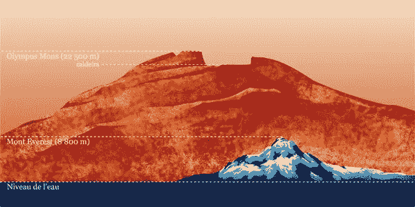

# 谷歌怎么知道这家伙的准确出生日期？

> 原文：<https://medium.datadriveninvestor.com/how-the-f-c-does-google-know-the-precise-dob-of-this-dude-639edf593278?source=collection_archive---------0----------------------->

is Bing an onomatopoeia? Can it be added to the Dictionary?!…

许多年后，对我们所有人和未来的千禧一代来说，我们将真正能够精确描述这种事情。

也许这只是因为我没有技术印章或知识来理解，但**它超过了我**。

一个罗马笨蛋——是**朱利叶斯·凯撒**顺便说一句——立刻被加州的一些笨蛋回答为出生于公元前 100 年**7 月 13 日的人。**

当你在“朱利叶斯·凯撒出生”，“朱利叶斯·凯撒时代”，“JC 罗马体育馆”，我不知道，你输入，他们会回答。

我无法理解这件事。就是太… **大了**。

shit, I googled this one, I forgot to bing it!

我要说的是，对于所有考古学的硕士、专业和博士以及剑桥和牛津的优秀毕业生来说，这个数字还要大。

如果你碰巧看到 [**下载了**](https://www.youtube.com/watch?v=h7YnjPGIeKY) ，这是一部关于 **Napster** 以及它如何繁荣[然后由于**非常特殊的情况**而崩溃](https://www.cnet.com/news/report-napster-in-talks-with-google/)的精彩纪录片，你会听到前**肖恩·帕克队友**说“是的，周围有一些谷歌的家伙。**祝那个** **搜索引擎**的事情好运！”。当肖恩和他的工作人员“生活在快车道上”时，他们看着他们就像是毫无价值的棋子。

 [## 我们屏蔽了社交媒体，这引起了公愤。数据驱动的投资者

### 上瘾，我们看不出来。在最近的一项研究中，基于以前的研究成果，我们想…

www.datadriveninvestor.com](https://www.datadriveninvestor.com/2018/12/01/we-blocked-access-to-social-media-it-caused-an-outrage/) 

长话短说 **Napster 走了**和**谷歌繁荣成一个庞大的数据帝国**，一个*比一切都大*的来源，为你提供最喜欢或最不喜欢的搜索，一个**令人困惑和难以想象的人类图书馆**。

老实说，我不知道他们是如何处理**准确性和断言**这件特殊的**罗马“琐事”**的确定性的，这曾经花费了年复一年的**投资**、科学**研究**以及最重要的**辛勤工作**。

现在点击一下你就知道了，而且**你可以随心所欲地处理那项免费福利**:所以**朱利叶斯·凯撒是一个癌症**，他**可能是一个非常情绪化的纨绔子弟，被当代历史学家**(这没问题)美化，然后被他同时代的追随者、**公民**、**甚至可能是家庭成员**(这也没问题，那只是又一个*星期一在罗马*；事实上，谷歌可能会告诉你朱利叶斯·凯撒在一天中的确切时间。

这些公司(**谷歌和 facebook** ，而不是**罗马公司**)。)变得越来越大，我也要说**充满了他们自己**。

他们控制我们的**一举一动，他们喜欢预测，他们会毫不犹豫地拥抱你、你的孩子、你的孙子**，他们会画出****按照**图案**行动，会在每个角落弹出**并在每个可用的屏幕上欢迎你**。****

****Ad blocks，DNTs，VPN，tor 和**在雷达下飞行**？中国，俄罗斯，朝鲜，缅甸，该死的复活节岛还是皮特凯恩？…他们可能会安全一段时间，但他们也可以理解**有线和社交技术**在**保持他们的大便在一起**方面可能很方便。****

****Yandex 比 google 更安全吗？还是说**只是俄罗斯版的谷歌**？在不到 40 年的时间里，我们从**冷战到代码联盟**。当我说联盟**时，你说控制**(谷歌是由一个美国人和一个俄罗斯人创立的，但你已经知道了，对吗？！)****

****你可以随时选择退出并消失。**还有那个**。****

****你可以探索流过你脑海的**老式行为和情感**的剩余闪光。****

****你知道，丢掉你的手指和他们传输的任何数量的数据来和他们的服务器交换。****

****迄今为止，你认为自己最大的财富是什么？****

****自从苏格拉底、JC、温斯顿、布林和扎克以来一直如此。事情是这样的，古代的公子哥儿能够分享他们的一些想法。****

****后面的那些…我们没有一点关于**他们在玩什么或者去找**的线索。我们只听到风投和公关们**向他们的搜索引擎陈述冗长乏味的关键词**。****

****不清楚他们在找什么。****

****从来都不确定。**信息仍然是至关重要的**，但他们可以让 **100%地保留这些信息，以便进一步分析**，进行比较和对比，让**在接下来的日子里基本上指挥你**。****

****当然我们**报名参加**这个。那是**他们的法律角度**。****

****人类说“**好吧**，**我们在这种操纵的快乐中度过余生，通过卷轴和点击 n' shit** ”。****

****所以**他们继续他们的自然垄断，而我们标记那些该死的图片**(你也知道图片标记对 **facebook 的增长有很大意义**，对吧？！)或者**浏览了一些罗马琐事**。****

****像电话公司这样的垄断可以追溯到一开始，但是你不需要谷歌来做这个，对吗？同样的"**只为我们成长，f#ck 竞争因而客户**成交 *VS* **不同的所谓 30 岁以下的*企业家*** *:*****

****贝尔在 23 岁的时候从梅乌奇那里买下了手机专利。****

******扎克做了** **他的第一个大 M** (不是棉花糖，百万！)当他 22 岁的时候。****

****这就是说，再一次，**这项技术可能总是听起来疯狂而实用，但你必须**不时张开你的眼睛和耳朵。报道广告"*展示我们追逐汽车和衣服，做我们讨厌的工作，这样我们就可以买我们不需要的狗屎*"，正如 [**查克写的**](https://www.youtube.com/watch?v=ByqRVviyOiQ) ，即使那点击或敲击对他们来说转化为更多**有用的数据**。********

不要相信屏幕。

相信你的感觉。

他们**永远也黑不了那些！**

**阿米利特杰伦？…**

通常，人们更担心他们看不见的东西，而不是他们能看见的东西

JC, Roman dude

出生日期(BC 格式):

*7 月 13 日据* ***谷歌***

*7 月 12 日或 13 日根据* ***大英百科全书***

*七月十二日据一位* [*普林斯顿学者*](https://www.amazon.com/C%C3%A6sars-Calendar-Ancient-Beginnings-History/dp/0520258010/ref=sr_1_4?s=books&ie=UTF8&qid=1512043001&sr=1-4&refinements=p_27%3ADenis+Feeney)

七月谁在乎，最后= **谷歌赢了**！