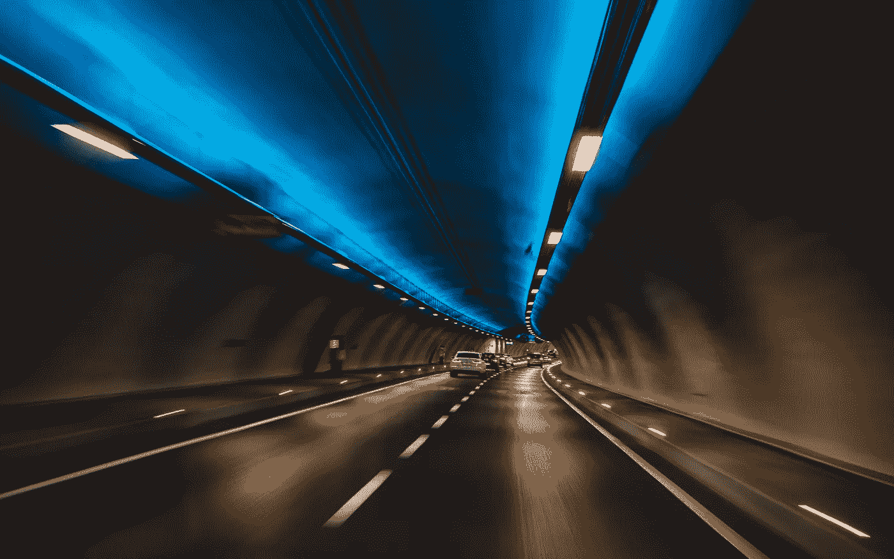
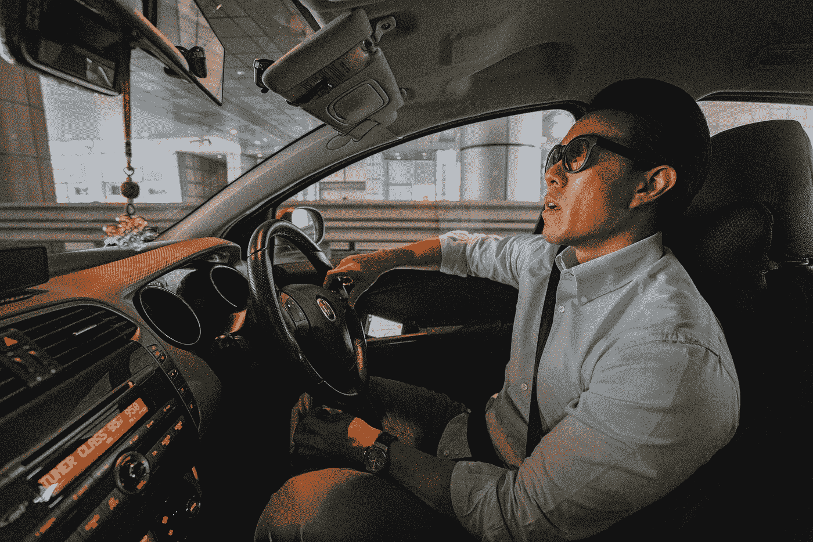
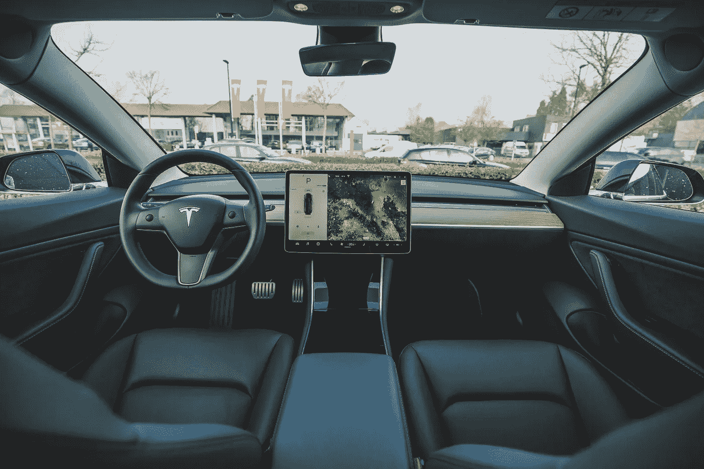

# 物联网如何改变汽车行业

> 原文：<https://medium.datadriveninvestor.com/how-the-internet-of-things-is-transforming-the-automotive-industry-88e1fefef1b4?source=collection_archive---------3----------------------->

物联网(IoT)可能是近年来最具突破性的技术，它将颠覆整个世界。它意味着大量设备之间的持续连接，这些设备在没有人类参与的情况下执行自动数据处理。

一般来说，物联网是指通过互联网连接设备(除了传统的计算机和智能手机)。这个功能意味着从厨房电器到汽车的一切都可以通过物联网连接。

这项技术对汽车行业的影响尤其巨大，以下是几个它将如何影响该行业的例子:

**物联网改变人们的驾驶方式**

我们都习惯了汽车是生产力的“死区”，尤其是对司机而言。但是如果我告诉你很快你就可以在车里继续工作了呢？

这正是自动驾驶汽车的目的，可以通过实施物联网技术来实现。就像它可以将你家里所有的设施连接到一个无线网络一样，它也可以对汽车做同样的事情。

 [## 理解物联网|数据驱动的投资者

### 一个系统越开放，它就越有利于创新和产生信任。然而，当谈到开放系统时…

www.datadriveninvestor.com](https://www.datadriveninvestor.com/2019/09/28/making-sense-of-iot/) 

[车联网](https://www.fpt-software.com/industries/automotive/) (IoV)允许汽车与互联网连接，并相互通信，创建一个联网的自动驾驶汽车系统。自动驾驶汽车配备了传感器，能够识别道路标志和标记，从而完全控制驾驶。反过来，你也可以在旅途中少管闲事。例如，为什么不在开车上班的时候打个盹呢？

正如古罗马人所说，人们需要面包和马戏团。汽车行业试图跟上客户不断增长的需求。一些领先的汽车公司已经在尝试将普通的汽车旅行转变成激动人心的事情。

奥迪 e-tron 是一个最好的例子，说明了如何将日常道路活动转变为纯粹的娱乐活动。这辆车配备了传感器和 VR 头戴设备，它们在扩展现实的基础上工作。汽车从现实世界收集数据，并将其传输到数字生成的幻想现实中，从而创建一个实时游戏。例如，虽然只有灰色的建筑和目光呆滞的人，但一名戴着 VR 耳机的乘客看到了彩色的风景和蓝色的小鸡经过。这就像一个独特的数字生成的主题公园。多酷啊。

**没有交通拥堵的智能基础设施**

当然，这不仅仅是娱乐和舒适，因为 IoV 主要代表道路效率和安全。联网自动驾驶汽车将为智能基础设施奠定基础。城市景观很快就会像科幻电影一样:自动驾驶汽车高速行驶，没有人类参与，没有道路愤怒或延误。智能基础设施将使交通堵塞成为过去。

如果你担心道路安全，请记住高达 90%的交通事故是由人为错误造成的。包括超速行驶、酒后驾驶或只是疏忽大意。智能基础设施消除了所有这些因素。由于人们将不再控制驾驶，事故的数量将急剧下降。联网汽车的实施每年将拯救成千上万人的生命。不用说，车祸率的降低也将在全球范围内节省数十亿美元。

预计 5G 的引入将极大地促进连接性，5G 计划于 2020 年推向全球。汽车公司将很难跟上这一技术飞跃的步伐。

**减少污染和能源消耗**

考虑到我们的星球现在面临的众多环境问题和异常情况，汽车行业不能忽视制造更环保汽车的需求。电动和混合动力汽车最近变得特别流行。想想如今“特斯拉”这个词是如何在大众中产生共鸣的。

IoV 将为减少污染和能源消耗做出巨大贡献。联网自动驾驶汽车将以节油的方式工作。人类司机倾向于滥用汽油和刹车，因此燃烧不合理的燃料量。车联网技术注定要一劳永逸地解决这个问题。智能基础设施允许汽车走最有效的道路，以稳定的速度行驶，并消除紧急制动事件。

理想情况下，预计自主制造商将完全转向生产电动汽车。对汽车公司来说，IoV 的实现和汽车流程向数字空间的过渡将是一个相当有说服力的论据。

**最后的想法**

如你所见，物联网技术将彻底改变汽车行业，改变人们对汽车的印象。配备全自动互联车辆的智能基础设施将彻底改变驾驶体验。甚至汽车的外观也可能发生一些变化。汽车将不再需要转向灯或后视镜，因为所有这些东西都将被连通性所取代。

所有这些都是迈向我们未来幻想的重要一步！