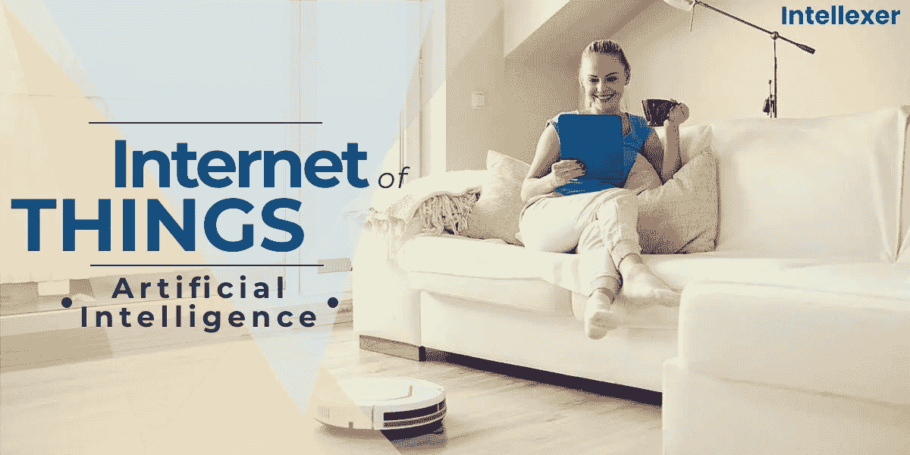

# 物联网与人工智能的关系。

> 原文：<https://medium.datadriveninvestor.com/how-the-internet-of-things-relates-to-artificial-intelligence-586cd1dcd3d5?source=collection_archive---------4----------------------->

人们下班回家后要求打开电视，洗衣机以经济模式洗衣服的未来似乎并不遥远。

我们已经可以与 Siri 或 Alexa 等虚拟助手交谈，搜索电影或订购送货上门的新围巾。为什么不对其他东西做同样的事情呢？

事实上，这就是大家现在所说的物联网，根据维基百科，物联网基本上是物理设备、车辆、家用电器和其他嵌入了电子设备、软件、传感器、执行器和连接的物品的网络，使这些东西能够连接、收集和交换数据。

从本质上讲，物联网技术是关于内置传感器的设备，这些设备通过互联网连接向一个或多个中心位置提供数据。然后对该数据进行分析，并启动相应的操作。

对于任何值得购买的物联网服务来说，这种行为必须证明真正的价值并为用户带来好处。当然，它们从适当的物理动作(例如，将出租车部署到站点)到简单地通知用户(例如，发送消息以通知用户他们已经没有牛奶了)。

正是在数据分析这一步，任何物联网应用的真正价值才得以确定，而这正是人工智能通过理解从设备流出的数据来发挥重要作用的地方。人工智能用于检测这些数据中的模式，从中它可以学习调整物联网服务的行为。

人工智能和物联网成功合作的最好例子可能是特斯拉汽车公司的自动驾驶汽车。汽车充当“东西”，利用人工智能的力量预测各种情况下汽车和行人的行为。此外，所有特斯拉汽车都是作为一个网络运行的。当一辆车学会了什么，他们都学会了。

自动吸尘器是人工智能“体现”在机器人中的一个很好的例子。例如，通过一个应用程序控制的 Roomba 的 iRobot 可以绘制并“记住”一个家庭布局，适应不同的表面或新物品，以最有效的移动模式清洁房间，并对接自己以给电池充电。

人工智能和物联网结合在一起的另一个好例子是 Nest Labs 的智能恒温器解决方案。Nest 的智能手机集成允许从任何地方检查和控制温度。该设备分析用户的温度偏好和工作时间表，并相应地调整温度。

物联网与人工智能合作的应用只会不断增长，创造新的市场和机会，在不久的将来，它们不太可能失去阵地。