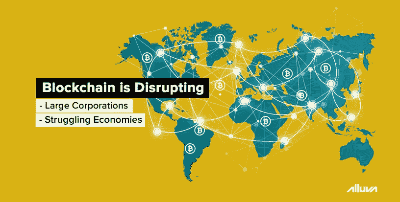

# 加密货币和区块链的观念在现代发生了怎样的变化

> 原文：<https://medium.datadriveninvestor.com/how-the-perceptions-of-cryptocurrency-and-blockchain-have-changed-in-modern-times-99690fc806c1?source=collection_archive---------5----------------------->

与早期的互联网类似，加密货币和区块链产业在短时间内经历了接受度和成熟度的巨大转变。虽然过去十年的前五年见证了 Mt. Gox 的 crypto exchange 的第一次大规模安全漏洞，以及丝绸之路暗网市场的[崩溃](http://bit.ly/337X1vn)，但这也为该技术的更广泛采用和普遍认知奠定了基础。

今天，世界上大多数大公司都以某种方式接受了加密货币或区块链，将其作为一种支付方式提供，或在内部进行测试。在本文中，我们来看看这两种技术已经变得多么丰富和普遍。

 [## 5 行业转型区块链应用|数据驱动投资者

### 除非你一直生活在岩石下，否则我相信你现在已经听说过区块链了。而区块链…

www.datadriveninvestor.com](https://www.datadriveninvestor.com/2019/02/13/5-real-world-blockchain-applications/) 

# 区块链的好处

在我们审视当今的采用趋势之前，让我们先了解一下比特币等加密货币的基础技术区块链是如何工作的。

目前，几乎所有的运营、流程和公司都依赖于信任层级，其中由最高权力机构做出的决定通常被视为最终决定。另一方面，区块链完全没有基于信托的债务，并且是分散的。区块链不再需要人工验证和授权，而是完全自主地根据程序来工作。一个[共识算法](http://bit.ly/alv_md_20)管理一个计算机网络，以确保完全的问责制，利用去中心化来实现更高的效率、更快的速度和增强的安全性。

虽然区块链的概念在 20 世纪 90 年代首次被概念化，但中本聪是第一个以比特币主干的形式开发出该技术的实际和现实实施的人。随着加密货币开始在主流媒体上获得关注，软件和密码学爱好者很快发现区块链有超越“去中心化金融”的用例。供应链、媒体、保险、运输和医疗保健等各个行业的公司目前都在探索和采用该技术的潜力和应用。

# 区块链的采用正在增加

在德勤 2019 年[全球区块链调查](http://bit.ly/2KgT14k)中，53%的受访高管表示，区块链是他们公司今年的五大优先事项之一。此外，86%的受访者认为该技术最终将被主流采用，83%的样本承认他们的公司在区块链应用程序方面有令人信服的商业案例。

随着 IBM 和微软等大公司现在以相对较低的成本提供[区块链即服务](http://bit.ly/2YyjdLA) (BaaS)，该技术的应用对许多中小型组织来说触手可及。前者已经与无数航运公司合作，如马士基，开发区块链供应链[解决方案](https://ibm.co/2Vulu8Z)，而微软正在为从[人工智能](http://bit.ly/31jV11m)到资本市场的一切区块链应用提供支持。

# 逐渐接受加密货币

困扰加密货币行业的最大神话之一是加密货币主要用于非法活动。然而，数字资产已被证明对跨境交易、便利性和长期财富储存具有不可估量的价值。根据从 Statista 获得的[数据](http://bit.ly/2yD5Uia)，截至 2019 年 6 月，区块链钱包目前有超过 4000 万活跃用户。

在委内瑞拉和津巴布韦等经济疲软或陷入困境的国家，数字货币也被证明是一种不可替代的资源。这些国家的公民一直在应对恶性通货膨胀的影响，并开始不信任政府发行的法定货币。因此，比特币在委内瑞拉的交易量持续上升，引起了美国消费者新闻与商业频道和其他主流媒体的关注。

2019 年 3 月，当 BBC [采访](https://bbc.in/2JoeYfS)几位转向加密货币市场以求稳定的委内瑞拉人时，绝大多数当地人表示，他们认为比特币和其他数字货币有助于他们实现金融自由和安全。

# DApps 的引入和采用

比特币发行后的几年内，开发者发现区块链技术可以用于许多非金融用途。随后发布的基于区块链的平台，如以太坊和 Tron，使得这些应用程序的开发变得更加容易。大约在同一时间，术语“分散应用程序”，或 DApp，开始流行起来。与任何智能手机上的传统应用不同，分散式应用直接连接用户和提供商，有效地消除了所有中间商。除了消除单一的中心失败点，DApps 还提供了审查阻力，这保证了表达和言论自由。今天，有超过 2667 个 dapp[在各种区块链上运行](http://bit.ly/2WvMzJx)，日活跃用户数超过 10 万。

像 [Alluva](http://bit.ly/alv_md_01) 这样的 DApps 也致力于在全球范围内改善金融包容性和加密的采用。简单地说，Alluva 是一个 web 应用程序，它允许任何人通过预测各种加密货币的增长潜力来赚取高额回报。用户无需进行任何前期购买或投资即可获得这些奖励。

有关区块链和加密货币市场的更多有趣内容，请关注我们的媒体简介[这里](http://bit.ly/alluva_mdm)。要开始使用 Alluva 的价格预测网络应用程序，请在这里注册。如果您想与 Alluva 团队取得联系，只需在我们的电报组[这里](http://bit.ly/alv_telgrp)留言。