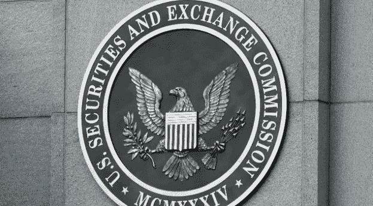

# 证交会是如何弄错的

> 原文：<https://medium.datadriveninvestor.com/how-the-sec-got-it-wrong-28f754ce9b57?source=collection_archive---------7----------------------->

## 这完全是一个合理的问题

自 2017 年 7 月[对 DAO 做出有点不靠谱的裁决](https://www.sec.gov/litigation/investreport/34-81207.pdf?utm_source=hs_email&utm_source=hs_email&utm_medium=email&utm_medium=email&utm_content=2&utm_content=68294002&_hsenc=p2ANqtz-_o-708hXae1mrF--R7aRyLZ2Rd4ls-zUIvTX6HWrlIK9m6F_Ya_3AOzp5YbYHdYtYTTbyL1PDQerI4GyMIcHRMff_0hg&_hsmi=2&utm_campaign=December%20Investor%20Letter&_hsenc=p2ANqtz--Y-CYatsnXUZIpPQafcdbItu-jElsvUk59ucwJ_magKLvuaDY_mptKEsPK-Yy8OeTiEi_DHW5mmmVtybRufcogmy878g&_hsmi=68294002)以来，美国证券交易委员会(SEC)一直在关注首次公开募股(ico)。在该判决的 B 部分，题为“道代币是证券”，美国证券交易委员会试图解释一项针对 J. Howey 的裁决，以确定他的橄榄园是否是一种证券(结果法院说是)。美国证券交易委员会声明:

> 投资合同是对普通企业的资金投资，并合理期望从他人的创业或管理努力中获得利润。

唯一的问题是这是不正确的。[豪伊案的裁决](https://supreme.justia.com/cases/federal/us/328/293/)实际上导致了以下结论:

> 对《证券法》下是否存在“投资合同”的检验是，该计划是否涉及对一个普通企业的资金投资，其利润完全来自他人的努力。

如果你很难找出这两段之间的区别，让我们也帮助 SEC，用正确的英语重写他们的结论:

> 投资合同是对一个普通企业的资金投资，其合理的利润预期完全来自其他人的创业或管理努力。

豪威案的裁决也帮助我们澄清了他人的定义，非常方便，在教学大纲的第二部分:

> 就《证券法》而言,“投资合同”(该法案未定义)是指一项合同、交易或计划，通过该合同、交易或计划，一个人将其资金投资于一个共同的企业，并被引导从发起人或第三方的努力中单独期望利润

现在让我们[查一下缺失单词的定义](https://dictionary.cambridge.org/dictionary/english/solely)(为了公平起见，我们将使用剑桥美国词典):

> **单独** *副词/* **英国** /ˈsəʊl.li/ **美国** /ˈsoʊl.li/ **C1** **仅与** [**无关**](https://dictionary.cambridge.org/dictionary/english/involve) **任何人或任何事** [**其他**](https://dictionary.cambridge.org/dictionary/english/else)

现在让我们重写 Howey 的句子，为委员会拼写出他们省略的英语单词“solely:

> 投资合同是对普通企业的资金投资，仅具有合理的利润预期**而非** [**涉及**](https://dictionary.cambridge.org/dictionary/english/involve) **任何人或任何事** [**否则**](https://dictionary.cambridge.org/dictionary/english/else) 将来自代币发起人或第三方的创业或管理努力

在我们更仔细地研究这个问题之前，让我们进一步分析一下豪威案的裁决，并检查一下合理这个词:

> **B2** [**基于**](https://dictionary.cambridge.org/dictionary/english/based)[**或利用好**](https://dictionary.cambridge.org/dictionary/english/judgment)**[**因此**](https://dictionary.cambridge.org/dictionary/english/therefore) [**尚可**](https://dictionary.cambridge.org/dictionary/english/fair)**[**实用**](https://dictionary.cambridge.org/dictionary/english/practical)**；B1** [**可接受**](https://dictionary.cambridge.org/dictionary/english/acceptable)**；******

****最后，让我们再看一下豪威案的裁决:****

> ****投资合同是对一个普通企业的金钱投资，其预期是基于****或利用良好的** [**判断**](https://dictionary.cambridge.org/dictionary/english/judgment) **和** [**因此**](https://dictionary.cambridge.org/dictionary/english/therefore) [**公平**](https://dictionary.cambridge.org/dictionary/english/fair) **和** [**实际**](https://dictionary.cambridge.org/dictionary/english/practical) 只有利润**而没有********

****因此，对利润的期望必须完全来自他人的创业或管理努力，无论如何，无论如何，都不是你。这很清楚。*完美！*****

****你不需要做任何事。永远不会。你甚至不需要向任何人说出代币的名字——它会神奇地自己升起，而你什么也不用做！艾德:是不是很棒！)****

****如果你还没有弄明白为什么这对于证券交易委员会目前很可能违宪的对符号化世界的抨击是至关重要的， 然后，让我们来看看一般的初始硬币发售流程:1)聚集一个社区 2)向任何传播代币的相关方提供奖金 3)通过提供代币的某种替代用途(例如，它可以在 xyz 百货商店/餐厅购买打折商品)来激励代币持有者参与其中 4)出售代币，5)尽可能多地获得 YouTubers、Tweeters 和其他社交媒体以及主流媒体的联系，以通过广播传播该代币是下一个比特币的集体信息。****

****要明确的是，我不是赞同或谴责标准的 ICO 营销费用。它有很多幼稚和错误的想法，也有很多积极的方面。我在此仅关注这一几乎适用于所有举办过的 ICO 的营销流程是否构成了对代币发行方**的**合理的**利润预期，该预期仅针对**而非** [**涉及**](https://dictionary.cambridge.org/dictionary/english/involve) **任何人或任何事** [**否则**](https://dictionary.cambridge.org/dictionary/english/else) 。******

**首先，一个社区的聚集对我来说似乎取消了管理的角色，因为预期只为投资者**产生利润，而不是** [**涉及**](https://dictionary.cambridge.org/dictionary/english/involve) **任何人或任何事** [**否则**](https://dictionary.cambridge.org/dictionary/english/else) *除非* 所有参加任何社区论坛的社区成员都需要投资。我提到这一要求的原因是，在我看来合乎逻辑的是，如果就像年度股东大会一样，你的*投资者*是唯一被特别允许参加公共聚会的*投资者，那么这种聚会实际上不是面向更广泛世界的营销活动(即不招聘)，而是一个通知*投资者*他们的*投资*进展如何的活动。***

**说到股票，这种年度股东大会的东西可能是相当大的生意:毕竟，伯克希尔哈撒韦公司向潜在投资者提供了折扣很多的 b 股，以便每个公民都可以参加每年被宣传为股票市场的伍德斯托克音乐节(音乐节)活动。我不确定 ico 在他们的 Discord 或 Telegram 社区中是否有这样的排除条款，但我从未加入过要求你首先成为令牌持有者的社区。**

**通常情况下，信息是公开的，任何人都可以看到和使用，事实上，对于 ico 来说。此外，据我所知，用户经常被鼓励出去传播这个项目的多层次营销风格。这些行为似乎会使项目投资者失去合理假设的资格，即管理层仅仅是**而不是** [**涉及**](https://dictionary.cambridge.org/dictionary/english/involve) **任何人或任何事** [**否则**](https://dictionary.cambridge.org/dictionary/english/else) 负责使他们在令牌上获得资本利得。**

**如果 1)对代币是否是证券的可疑性质产生谨慎的想法，2)无论如何肯定会扼杀这个问题。如果一个 ICO 煽动一笔赏金，而这笔赏金在某种程度上是产生象征性价格上涨的基础，从而使投资者获得资本利得，因此非管理层的赏金猎人对此负有部分责任，那么肯定地说，这明确排除了这一条款的存在？**

**根据 3)、4)和 5)，人们可以喋喋不休地谈论代币作为证券的类似不一致之处，对吗？难道不是要求你这个代币购买者积极参与代币的传播吗？那么，如果是这样的话，你不能合理地期望别人为你做所有的重活，对吗？**

**总之，这是一个复杂的问题，但结果实际上非常清楚:大多数(如果不是全部的话)代币明确地*不是*证券*如豪威裁决*中所规定的那样，美国证券交易委员会声称已经根据该裁决做出了司法和公平的裁决。**

***哎呀。***