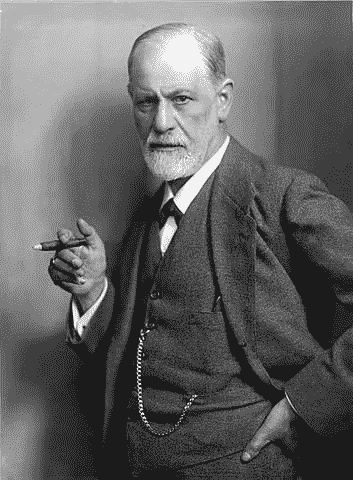
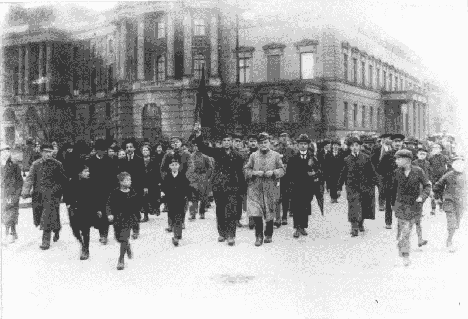

# 自我是如何迷失的

> 原文：<https://medium.datadriveninvestor.com/how-the-self-was-lost-f34b83c3d79a?source=collection_archive---------10----------------------->

“Girl in Red” advertisement for Lucky Strike; shot by [Nickolas Muray](https://en.wikipedia.org/wiki/Nickolas_Muray), a photographer enlisted by Bernays to help popularize feminine thinness and cigarette smoking. Source: [Wikipedia](https://en.wikipedia.org/wiki/Edward_Bernays)

## 艾迪·伯奈斯和快乐机器

> 1928 年，一位总统上台，他同意伯奈斯的观点。胡佛总统是第一个阐明消费主义将成为美国生活核心动力的政治家。…他告诉一群广告商和公关人员,“你们接管了创造欲望的工作，把人们变成了不断移动的快乐机器。已经成为经济进步关键的机器。”20 世纪 20 年代开始出现的是一种如何运行大众民主的新思想。它的核心是消费自我，它不仅使经济运转，而且快乐和温顺，因此创造了一个稳定的社会。(柯蒂斯，2002 年)

2002 年，英国广播公司开始播放电影制作人亚当·柯蒂斯的电视纪录片系列 [***【自我的世纪】***](https://www.youtube.com/watch?v=eJ3RzGoQC4s&t=3s) 。这是对 20 世纪初欧洲和美国的历史、社会和政治分析的结合，重点是维也纳精神分析学家西格蒙德·弗洛伊德(Sigmund Freud)和他的美国门徒兼侄子爱德华·伯奈斯(Edward Bernays)，他是我们今天所说的公共关系或游说的创始人，也是美国企业的宠儿。他被认为是一个魔术师，能够说服我们女人在公共场合吸烟是可以的，或者美国人早餐吃熏肉和鸡蛋是有好处的。好彩香烟成为自由的**火炬，据说通过象征性地给女性一个阴茎，赋予她们权力并解放她们。这部流行至今的电视连续剧让许多人大开眼界，了解了大众媒体的力量、公共关系在社会中的作用以及电视广告，尤其是那些从未读过万斯·帕卡德于 1957 年首次出版的《隐藏的劝说者》的人。**

**在第一集的开始，柯蒂斯说，**

> **一百年前，西格蒙德·弗洛伊德提出了一种关于人性的新理论。他说，他发现了隐藏在所有人内心深处的原始的、性的和侵略性的力量。不加控制的力量会导致个人和社会的混乱和毁灭。这个系列讲述的是在大众民主时代，当权者如何运用弗洛伊德的理论来试图控制危险的人群。(PiALOGUE，2018 年)**

****

**尽管柯蒂斯总的来说对了他的评论，但还是缺少了一些东西，甚至是完全错误的。**

**我认为，不仅精神分析之父西格蒙德·弗洛伊德(Sigmund Freud)关于人类思维和人类行为的理论基本上是错误的，这部纪录片也没有仔细审视弗洛伊德和伯奈斯基于神经科学和心理学最新见解的理论。柯蒂斯说:“弗洛伊德关于人类大脑如何工作的观点现在已经成为社会公认的一部分。正如有精神分析学家所说的那样，“这根本不是真的。大多数专业人士认为弗洛伊德的精神分析是伪科学，这是有充分理由的。亚当·柯蒂斯完全相信了佛洛依德，并继续延续着一个关于人性的最奸诈的神话，这个神话过去和现在都被用来欺骗、压制和控制大众。**

**根据亚当·柯蒂斯的说法，佛洛依德将第一次世界大战*视为他发现的真理的可怕证据。他写道，最可悲的是，根据我们对精神分析的了解，这正是我们应该期望人们的行为方式。* ***政府释放了人类的原始力量，似乎没有人知道如何阻止它们。”*****

**这种信念过去和现在都很普遍。在视频中，亚当·柯蒂斯说，*“沃尔特·李普曼，可能是美国最有影响力的政治思想家，他本质上是在说大众心理的基本机制是无理性的，是非理性的，是动物性的。他认为街上的暴民，也就是他眼中的普通人，不是被他们的思想所驱使，而是被他们的脊髓所驱使。动物驱力的概念，无意识和本能的驱力，潜伏在文明的表面之下..”***

**这些仅仅是弗洛伊德、李普曼等人的假设。科学证据要么薄弱，要么缺失。科学哲学家卡尔·波普尔爵士认为精神分析是不可证伪的，也就是说是不可检验的，因此是伪科学。弗洛伊德的错误结论是可以原谅的，在他的时代，神经学和精神病学是很难理解的医学专业。另一方面，尽管无知可以被原谅，但不健全的研究方法却不能。根据 Webster (2011)，"*弗洛伊德被他的理论迷住了，他设计了一种方法，这种方法在很大程度上允许他创建自己的数据。不是理论基于观察，而是‘观察’有时来源于理论。”***

**换句话说，在描述他的治疗尝试时，他只是在没有系统测试方法的情况下编造了他的理论。**

****

**Berlin, November 9, 1918\. General strike and armed uprising. The Kaiser abdicates. Source: [Wikimedia](http://Bundesarchiv_Bild_183-18594-0045,_Berlin,_Novemberrevolution.jpg)**

**那么，政府在一战中“释放”的“非理性”力量是什么？**

**这真的是在转移视线，转移人们对真正发生的事情的注意力。三方协约(法、俄、英)和**三方联盟**(德、奥匈、意)**除了合理地组织、准备、资助和发动这个星球上的第一次大屠杀外，没有“释放”任何东西。为此，群众不得不被胁迫和操纵去参与。尽管遭到严厉镇压，但在所有参战国，反对这场战争的阻力是相当大的。1918 年，英国哲学家和和平主义者伯特兰·罗素(Bertrand Russell)因公开演讲反对邀请美国站在英国一边参战而被判有罪，并被判入狱 6 个月。在战场上，所谓的“侵略性”和“非理性”的群众在被他们“理性”的指挥官命令返回战场之前，在战壕里庆祝圣诞节。这场战争在欧洲的“非理性”群众中引起了相当多的“理性”起义和革命，他们遭受了超乎想象的痛苦，再也不想经历这样的事情了。他们知道谁该负责，并准备好接管欧洲的权力。他们在俄罗斯成功了，在德国尝试过但失败了。****

**战争的理性原因通常不会公之于众。敌人被妖魔化为邪恶的化身，因此战争成为道德上的必然。如果有必要，一个善意的谎言(大规模杀伤性武器)或一个“假旗”事件也能起到同样的作用。真正的原因在大多数情况下是平庸的，它通常是关于资源的控制，例如石油，或者人口，权力和领土。**

**问题仍然是，这种关于大众邪恶的普遍信念从何而来，以及为什么把自己视为开明科学家的弗洛伊德也会上当。Webster (2011)有一个有趣的解释，**

> **毫无疑问……弗洛伊德真诚地相信，他是在用科学扫除迷信，引入一种新的人性观。然而，他创造精神分析的真正成就是将迷信隐藏在理性的花言巧语之下，以便重新引入一种非常古老的人性观。**
> 
> **通过将无意识或“本我”描绘成一团沸腾的不洁本能，并将男人和女人视为由黑暗的性和虐待狂冲动以及对排泄物的秘密热爱所驱动，弗洛伊德实际上为现代科学时代重新发明了传统的基督教原罪学说。**
> 
> **同时，通过精神分析，他向所有追随他的人提供了一种救赎的手段。如果在二十世纪，精神分析迅速获得了正统的地位和力量，那不是别的原因，而是因为它本身就是一种正统——一种犹太-基督教教义在世俗形式中的微妙的重新表述，正是因为它作为科学被呈现出来，才免受科学的攻击。另一个原因是它本身是一种正统的形式——犹太-基督教教义在世俗形式中的微妙的重新表述，正是因为它作为科学被呈现，所以免受科学的攻击。**

**将大众视为暴力、非理性和邪恶的替罪羊是当权者的一种有用的意识形态，为对民众的政治和强制控制辩护。罗马人不需要弗洛伊德和潜意识来知道如何让他们的民众温顺。Panem et circenses(面包和马戏游戏)，这是罗马诗人尤维纳利斯的一个比喻，是群众阻止他们起义所需要的。**

**对伯奈斯和李普曼来说，管理大众就是让他们保持安静和麻木，接受民主的理念**

> **把它变成一种缓解剂，给人们某种感觉良好的药物，它会对即时的疼痛或即时的渴望做出反应，但不会改变任何客观情况。民主的核心理念是改变统治世界如此之久的权力关系；伯奈斯的民主概念是维持权力关系，即使这意味着需要刺激公众的心理生活。事实上，在他看来，这是必要的。如果你能不断刺激非理性的自我，那么领导力就能继续做它想做的事情。**

**亚当·柯蒂斯在视频中如是说。这并不是说大众不能被欺骗和背叛，或被鼓动起来对抗一个想象中的敌人。纳粹迫害犹太人、共产主义者、社会主义者或任何其他不符合他们意识形态的群体，并通过集会、报纸、电影和广播的大规模宣传获得民众支持。今天，它再次以类似的方式工作。是穆斯林，或者俄罗斯人，纯粹因为政治需要而被诽谤。**

**在花言巧语的背后，我们发现当权者的真正政治议程仍然模糊不清，除非像朱利安·阿桑奇和维基解密这样的人将其公之于众。像黄背心这样的运动预示着不稳定。一旦经济恶化，群众被贫困和暴力所困扰，政治局势就会迅速转变为大规模的叛乱。政治行动是一种启蒙的行为！**

****参考文献****

**伯奈斯和米勒(2005 年)。宣传。纽约布鲁克林:Ig 酒吧。**

**柯蒂斯，a .(制片人)，柯蒂斯，a .(编剧)(2002)。自我的世纪【电视广播】。联合王国:英国广播公司四台。**

**康德，我，汉弗莱，t。).(1992).问题的答案:什么是开悟？检索自[https://www . stmarys-ca . edu/sites/default/files/attachments/files/Kant-什么是% 20Enlightenment _。pdf](https://www.stmarys-ca.edu/sites/default/files/attachments/files/Kant--What%20Is%20Enlightenment_.pdf) (原著出版于公元 1784 年)**

**Lessig，D.(2016 年 6 月 20 日)。自我的世纪(全纪录片)。从 https://www.youtube.com/watch?v=eJ3RzGoQC4s[取回& t=3s](https://www.youtube.com/watch?v=eJ3RzGoQC4s&t=3s)**

**对话。(2018 年 12 月 29 日)。自我抄本的世纪。从 http://pialogue.info/books/Century-of-the-Self.php[取回](http://pialogue.info/books/Century-of-the-Self.php)**

**韦伯斯特河(2011 年)。弗洛伊德(伟大的哲学家)[Kindle]。从 Amazon.com 取回**

**韦伯斯特河(2005 年)。弗洛伊德为什么错了:罪、科学和精神分析。联合王国:奥威尔出版社**