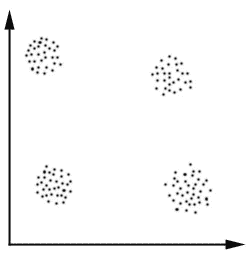
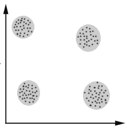
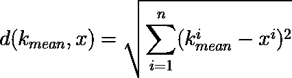
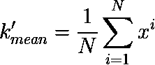
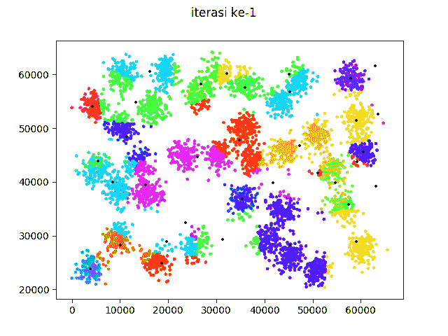

# 最简单的聚类算法如何工作(代码)

> 原文：<https://medium.datadriveninvestor.com/how-the-simplest-clustering-algorithm-work-with-code-b8af21aabda2?source=collection_archive---------5----------------------->

[](http://www.track.datadriveninvestor.com/P12O)

source: [http://s3.amazonaws.com/vspot_prod_images/uploads/group/image/45678/1045759400025.jpg](http://s3.amazonaws.com/vspot_prod_images/uploads/group/image/45678/1045759400025.jpg)

聚类是对数据进行分组的一种方式。如何才能知道某个数据是否属于某个组？作为人类，我们可以凭直觉做到这一点。看看下面的数据。



source: [https://home.deib.polimi.it/matteucc/Clustering/tutorial_html/](https://home.deib.polimi.it/matteucc/Clustering/tutorial_html/) (modified)

我们知道在上面的数据中有 4 个组，我们这样直观地对数据进行分组。



source: [https://home.deib.polimi.it/matteucc/Clustering/tutorial_html/](https://home.deib.polimi.it/matteucc/Clustering/tutorial_html/) (modified)

什么使得某些数据是某个组的成员？这是因为某个数据与某个组的成员比与另一个组的成员更接近。这是我们将在这个故事中讨论的最简单的聚类算法的**核心思想**。这个算法叫做 **k 均值**聚类。k-mean 中的“k”是数据中有多少组，而“mean”是该特定组中数据的中心。所以，k 均值聚类的目的是**在 k 组**的中心绘制 k 点数据。k-mean 聚类中群体的中心称为 **k-mean** 本身。在聚类算法中，group 被称为 **cluster** ，所以从现在开始，我们就用“cluster”这个词来代替“group”。k-mean 聚类算法的步骤如下:

1.  初始化随机 k 均值。
2.  对于每个数据点，测量其与每个 k 均值的欧几里德距离。数据点属于 k-mean，它们之间的距离最短。
3.  将 k-mean 更新为属于它的数据的平均值。
4.  按照指定的迭代次数重复步骤 2 和 3。

k 均值聚类中使用的欧几里德距离(d)公式为



x is the data, n is the number of dimension of data

更新 k 均值(属于 k 均值的数据的均值)的公式为



k’ is the new k-mean after updating it with the meaning of data belong to the certain k-mean and N is the number of data that belong to the certain k-mean.

这个算法非常容易理解。为了让它更清楚，这里的例子是 k-mean 聚类的 python 代码。

```
#!/usr/bin/pythonimport numpy as np
import random
import matplotlib.pyplot as plt
import matplotlib.cm as cm#setting
datasrc = 'datacluster.dat'
kval = 35
itertot = 50def eudistance(vec1, vec2):
	return np.sum((vec1 - vec2)**2.0)**0.5#read data
data = np.genfromtxt(datasrc, delimiter=[8, 8])#prepare color
colors = cm.hsv(np.linspace(0, 1, kval))###############
#normalization#
###############maxcnt = np.zeros((len(data[0])))
mincnt = np.zeros((len(data[0])))
datanorm = np.zeros(np.shape(data))
for i in xrange(len(maxcnt)):
	maxcnt[i] = np.max(data[:,i])
	mincnt[i] = np.min(data[:,i])
	datanorm[:,i] = (data[:,i] - mincnt[i]) / (maxcnt[i] - mincnt[i]) ################
#real algorithm#
#################init kmean
kmean = np.zeros((kval, len(data[0])))
kmeanreal = np.zeros((kval, len(data[0])))for i in xrange(kval):
	for j in xrange(len(data[0])):
		kmean[i,j] = random.uniform(0,1)#looping of real algorithm
distmin = np.zeros((len(datanorm)))
for i in xrange(itertot):
	print 'iterasi ke', i
	for j in xrange(len(distmin)):
		#determine euclid distance
		distall = np.sum((datanorm[j] - kmean)**2.0, axis=1)**0.5
		distmin[j] = np.argmin(distall) #search new k mean
	for j in xrange(kval):
		clust = []
		for k in xrange(len(distmin)):
			if distmin[k] == j:
				clust.append(datanorm[k])
		if len(clust) > 0:
			kmean[j] = np.mean(np.asarray(clust), axis=0)

	#plot the change of clustering
	alllabelcol = []
	for j in xrange(len(distmin)):
		col = colors[int(distmin[j])]
		alllabelcol.append(col)
	alllabelcol = np.asarray(alllabelcol) fig = plt.figure()
	ax = fig.add_subplot(111)
	scatter = ax.scatter(data[:,0],data[:,1], color=alllabelcol,s=5) #back to real scale
	for j in xrange(len(maxcnt)):
		kmeanreal[:,j] = kmean[:,j] * (maxcnt[j] - mincnt[j]) + mincnt[j] for j,k in kmeanreal:
		ax.scatter(j,k,s=10,c='black',marker='+')
	fig.suptitle('iterasi ke-'+str(i+1))
	fig.savefig('clustering/iter-'+str(i)) #############################
#save data in cluster format#
#############################for i in xrange(len(distmin)):
	#determine euclid distance
	distall = np.sum((datanorm[i] - kmean)**2.0, axis=1)**2.0
	distmin[i] = np.argmin(distall)
allclust = []
for j in xrange(kval):
	clust = []
	for k in xrange(len(distmin)):
		if distmin[k] == j:
			clust.append(data[k])
	allclust.append(clust)clustfile = open('clustering_data.dat', 'w')for j in xrange(kval):
	clustfile.write('data in cluster '+str(j+1)+'\n')
	clustfile.write('--------------------------------\n')
	for k in xrange(len(allclust[j])):
		clustfile.write(str(allclust[j][k][0])+'\t'+str(allclust[j][k][1])+'\n')
	clustfile.write('\n\n')
```

或者你可以在这里看到或者下载代码[。关于数据，你可以在这里](https://github.com/genomexyz/machine_learning/blob/master/kmean.py)下载[。代码将在图像(每次迭代)和文本文件(最后一次迭代中的集群)中生成集群数据。对于图像文件，迭代次数与我们设置的一样多。下面是绘制图像结果的代码。](http://cs.joensuu.fi/sipu/datasets/a2.txt)



我们在代码中设置的迭代次数是 50，但是如你所见，在迭代次数达到 50 之前，k 均值停止变化。这证明该算法收敛非常快，但是算法**不能保证**收敛到全局最优。这意味着**每次运行，结果都会不同**所以聚类也会不同。

这就是 k 均值聚类工作方式。在下一个故事中，我将解释另一种聚类算法，您不需要“猜测”数据中有多少个聚类。基于这篇文章，我将解释径向基函数神经网络(RBFNN)的未来。RBFNN 是一种依赖于 k-mean 等聚类算法的神经网络。下一个故事再见。