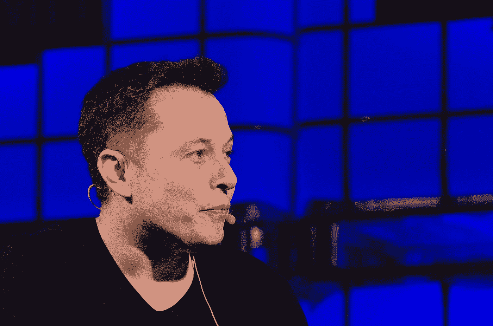
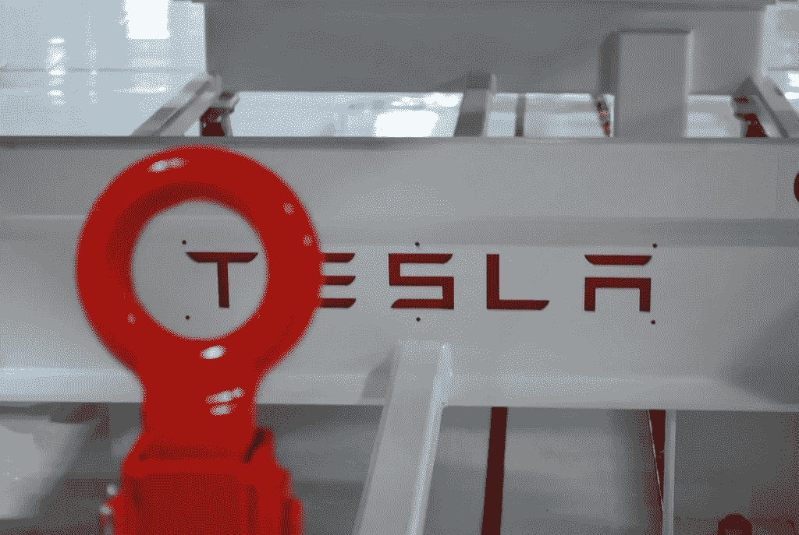
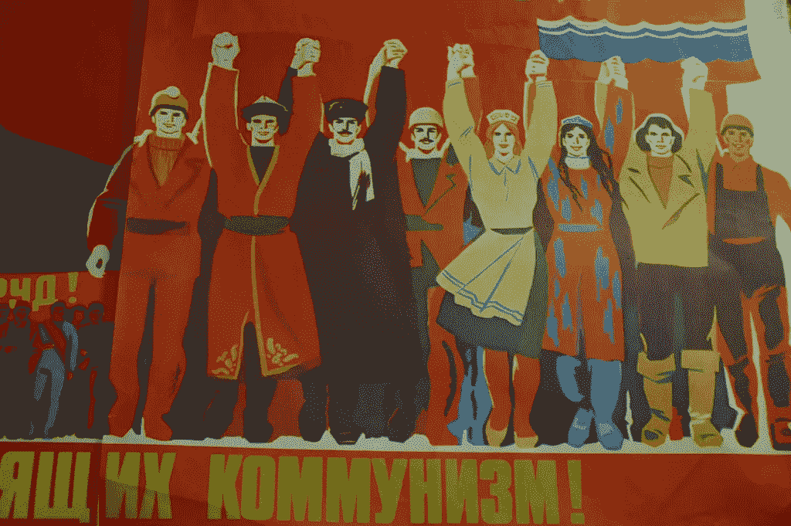

# 特斯拉联盟是如何毁灭世界的

> 原文：<https://medium.datadriveninvestor.com/how-the-tesla-union-destroyed-the-world-27e5b960e10e?source=collection_archive---------3----------------------->

## 来自不可描述的未来的笔记

Image: [Web Summit @ Flickr](https://www.flickr.com/photos/websummit/10707529713/in/photolist-hjbTxg-2jpXAc-QVNPvh-oNtTSq-sAgpsJ-2a2mxrq-qELGz-7B1aSr-7B4TmE-7B187z-7B4Vp7-7B1a8V-7B18Ui-7B4Uxb-7B4XWL-jGnefs-7B4WMj-7B1dvD-7B4S97-7B1aCZ-7B18x8-7B4S1f-7B4YYq-7B4SNS-7B18rP-Eype27-jGmkr5-jGneQq-jGk67p-jGmt7W-jGmAem-jGj5F8-jGmqQ1-jGjkCx-TuvmfS-SfrQip-23JSPLo-5yVq4s-8SvDQ9-8Sszjg-8SvEo9-8SvDSY-FZD7zM-6yVYWS-gbC7SG-jGn24U-jGk2EV-jGk52P-haroZ8-ha1uY5)

对埃隆·马斯克(Elon Musk)来说，这只是又一个工作的早晨:当然，他把时间花在了设计自己的汽车、进行难以置信的复杂物理计算，以及亲自监督生产线上，同时还与他忠诚且受到良好照顾的员工打成一片，鼓励他们把他视为仁慈的父亲般的人物。他似乎注定要带领人类进入一个创新和繁荣的新时代……至少在那天下午之前是这样。很少有人知道，就在那一天，人类将开始跌入深渊。

杰夫来上班时感觉很好。和往常一样，他进门时和伊隆击掌。

“嘿老板！非常感谢上周的工资，这对抚养我的孩子真的很有帮助！”

“哦，这没什么，杰夫！”伊隆回答道。他和他的每一个雇员都直呼其名。“我很幸运有机会为像你这样了不起的、努力工作的人创造就业机会！”埃隆向杰夫敬礼，露出灿烂的笑容，然后继续他重要的动手工作。

杰夫接替了他在生产线上的位置，这条生产线是由埃隆·马斯克亲自设计的。当他开始为令人难以置信的、富有远见的特斯拉汽车组装车轴时，乔开始思考他是多么幸运，这些汽车是为普通人设计的，很像亨利·福特的 T 型车——一个过去时代的马斯克式幻想家。他站在这里，一个来自贫困家庭的没有技能的人，然而他正在帮助建设人类的未来，并为我们不可避免的马斯克领导的太空提升做出贡献。

“我热爱我的工作和我的生活！”他大声说。“当然，有时事情很艰难，但最终我有了一个爱我的妻子和孩子，还有稳定的工作，同时也为世界上最伟大的人的诞生做出了贡献。”

突然，杰夫听到一些箱子后面传来沙沙声。“卡卡卡卡！”

当他转向调查时，一个实体出现了。这种生物看起来像是人类和袋鼠的混合体，走路时双腿弯曲，双臂举至胸部水平，双手下垂。“你好，兄弟，”它靠近杰夫说。

“你是谁先生？你不能回到这里……”他关切地回答。

怪物没有回应。它占据了杰夫旁边的一个位置，拦截下一个车轴，一切都做得非常错误。

“先生！不对，你在做什么？”

"杰弗里兄弟，我是你的新同事！"它发出嘶嘶声。

“哦，如果是那样的话，我很乐意帮助你以正确的方式组装一辆令人难以置信的、有远见的、拯救世界的特斯拉 Model S，”杰夫眉开眼笑地说。

“对，对，很好。”

Image: [Patrick Herbert @ Flickr](https://www.flickr.com/photos/patrick_h/6209957927/in/photolist-asKE98-VXMGMS-5E7NiV-295Ezby-asNpjj-85fSVX-5Ec6v9-bceQhB-asNi7Y-caUneh-qyTmHQ-asbwaM-hnzRcm-caU89E-e5bAtd-aut8AH-hnKqqD-5Ec6K5-bEWnc2-6aH2zm-ocqjQ7-r6ZyX4-emnk9K-i8xTrc-ojUkaR-297naBb-hnJRjj-27KTiz2-RLSbLL-8fifuT-hU73pv-5Ec6wA-hMWeaX-cgKz6b-Gc7S1M-hnLZY6-5Ec7c5-5Ec6jh-hnzKRU-bceQAc-dFoTf9-asvL4r-5Guq1g-5E7NGk-5E7NNk-hMWmmv-bceRi6-5Ec6vA-hnWfzJ-fSX2hR)

当杰夫尽力训练他的新同事时，他感到不安。这个人不知道如何正确地完成一天的工作。他显然已经被政府救济的安逸生活腐蚀了。

"那么，杰弗里兄弟，你有没有想过这一切有多不公平？"动物冷笑道。

杰夫震惊地看着他。“现在这都什么了？”

“哦，所有这些，你都知道吗？当肥猫埃隆可以啜饮香槟，回到他十八座豪宅中的任何一座时，你为什么要做这些无聊的事情？”

“什么？!"杰夫难以置信地说。“但是埃隆赢得了他所拥有的，我很自豪能为他工作！你为什么撒谎？你叫什么名字？”

“我是乔，哥哥杰夫。”这个生物绕着圈蹦蹦跳跳，像猪一样哼哼着。"你想过加入工会吗？"

“一个工会？！不，我绝不会！见鬼，雇佣合同的一部分是签署一份具有法律约束力的声明，确认我们从未也永远不会加入工会。它们扼杀生产力和创新。如果我们加入工会，特斯拉将不得不关闭，这对人类来说将是可怕的！”

乔俯下身子，舔了舔杰夫的鼻尖。“嗯，杰夫，”他极具颠覆性地说，“我是工会会员。”

“什么？！你是怎么通过筛选的？!"

“杰弗 fffffffffffffffffffffffffffffff！！!"野兽尖叫道。“那不重要！嘿，你听说过 COOOOmmunism 吗……*同志*杰夫？”

杰夫张着嘴。“是的，我对共产主义的邪恶了如指掌。你是共产党员吗，乔？”

“埃隆·马斯克是布尔乔亚，杰夫同志。你是无产者。像你这样的人做所有的工作，而他得到所有的报酬，把残羹剩饭扔给你！”乔说，用叛逆的外国话。

“不……那不是真的……那不可能！”杰夫回答道。

"卡卡卡卡卡卡，"乔咯咯地笑着。“记得吗，杰夫，你儿子得了白血病？你不得不卖掉你的房子来支付他的治疗，不是吗？”

“但是……保险不包括它……埃隆无能为力，否则他不得不为每个人的家庭提供全额保险。那特斯拉就破产了！”

乔竖起一只眉毛，像道恩·强森(别名“岩石”)，一个非裔美国颠覆分子，众所周知与黑豹，一个著名的黑人身份极端组织有联系。“他们本来可以做到的，杰夫同志！他们选择不这样做。但是你猜怎么着，杰夫？在共产主义制度下，每个人都可以免费获得医疗保健……”

“不行！”

“你知道这是真的！喏，在这儿签字，加入工会，哦，还有共产党。”

杰夫匆忙地到处签名。世界迷失了。

那天晚上，杰夫回到他的一居室公寓。他以前对自己的处境很满意——毕竟，每个人在社会上都有自己的位置，这是他的位置。但他走进那扇门时，他那漂亮的金发女店员正带着最暴躁的表情走进来，她刚刚满怀爱意地为他准备了一顿丰盛的米饭和豆子晚餐，这是优秀的工人需要充足的食物能量来完成分配给他们的任务所见过的唯一食物。

“你好，我亲爱的丈夫！为什么拉长着脸？！来给我一个拥抱，让我们把你的眉头拧下来！我非常爱你，为了让你开心，我愿意做任何事！”

他直视着她，走了过去，瘫倒在破旧的沙发上。

“我们需要共产主义，安。”

Image: [Jesus Encinar @ Flickr](https://www.flickr.com/photos/jencinar/44458077/in/photolist-4VRQz-a3X5Yc-bk6qYN-6tBAj6-25n5g5p-3eQbHE-7RHz6u-8dU3gP-9UxQvz-5P1UZa-GwJ4p-awteK-bLjQb2-6Ea1w-fhVz9-9USt4g-9ieick-joWZNz-2GhWwT-tygVm-2akdLTP-pjjJvT-6ff5Uw-6z2UYz-rbXUek-5TNWUa-83zk5z-6fuQHe-8dWctM-apP95z-8dX8K7-dWvzdQ-89Bd6-7BZeRd-5ui76N-VV4gSM-funsWS-8Z7gNX-4pVe5a-eeaiTc-52sGKt-6faVcc-jXCJVP-cTxRPL-HXbRG-83Crgm-6XaAAf-6faVmV-6nfuQ1-5CGNAZ)

“哦，那是个有趣的笑话，丈夫！哈哈！”她回答道。

“这不是玩笑。我和工厂里的其他人长时间辛苦工作，我们挣的钱甚至还不够在周围的一居室公寓里生活。小杰夫差点死了，却没有人为此做点什么，就因为我们付不起钱！与此同时，拒绝提供帮助的公司老板被誉为超级英雄。他说，他确信自己是对的，但实际上所有的事情都是错的。

安喘着气，捂住了嘴。“天啊，杰夫，不，谁对你做的？!"

“还有，安，我很抱歉，社会让你相信女人必须对男人唯命是从，我特别抱歉，我直接参与了你的压迫。在共产主义制度下，男女将被平等对待。”

“但那只是你的感觉，杰夫！事情是这样的，因为生物学，”她正确地推测。

“不安，这些都是事实！我们需要一场共产主义革命，我计划带头冲锋陷阵。我和我的同志乔在特斯拉工厂成立了一个工会。”

安，一个正直而自豪的美国人，已经听够了。她把手伸进围裙，拿出她的 AR-15。不幸的是，在她将矛头指向杰夫要求合法安乐死之前，一把可耻的苏联 AK-47 的嘎嘎声弥漫了整个房间。安倒在地上，死了。作为一名共产党员，杰夫笑得很开心，因为共产党员非常喜欢死亡和杀戮，尤其是对自己妻子的杀戮。乔跳上前去，可疑地穿得像约瑟夫·斯大林，留着小胡子。

“我们走吧，杰夫同志，”浑身是血的乔说。“革命不会自己开始！”

杰夫的孩子们被骚动吵醒，从卧室里走了出来。他们看到母亲躺在血泊中，一时惊呆了。

“孩子们，共产主义的时候到了，”杰夫说。孩子们无法抵御颠覆分子的暗示性影响，立即改变了他们的举止。“耶！”当乔递给他们每支 AK-47 时，他们惊叫着，在母亲的血泊中翻滚。

“来，各位！去特斯拉工厂！除了你的锁链，你没有什么可失去的了，”乔边说边向前滑行。

就在那一刻，埃隆·马斯克猛然惊醒。他抬头向上望去，只见他自己和他醒来的女友格莱姆斯倒映在纯金天花板上，那是他通过自己不可思议的功绩公平获得的。他很快意识到与阿泽利亚·班克斯的三人行不过是一场梦。忍住眼泪，他翻了个身，又睡着了。

我经常想事情是否会有所不同。如果埃隆从床上爬起来在一个等待的妓女嘴里撒尿呢？他会不会及时注意到监视系统上的共产主义者暴徒，命令 Space-X 海军陆战队在工厂里占据防御位置，让他们轻而易举地对颠覆分子实施安乐死？

总有一天，在共产主义再次失败后，一个新的马斯克式的幻想家可能会出现。基本的逻辑和理性会让这样一个天才创造出时间机器。当然，他会用它来确保马斯克对特斯拉联盟的胜利，让他回到通往永恒宝座的道路上，这是他与生俱来的权利。