# 五大 Shopify 品牌如何准备和推出他们的黑色星期五活动，以及如何在即将到来的假日季节使用相同的策略。

> 原文：<https://medium.datadriveninvestor.com/how-the-top-5-shopify-brands-prepared-launched-their-black-friday-campaigns-and-how-you-can-use-ac576d9240d4?source=collection_archive---------8----------------------->

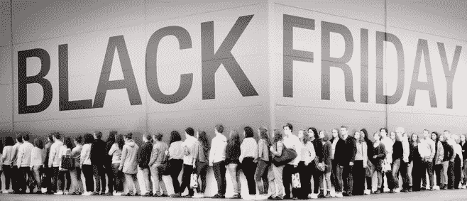

Does anyone relate? 😆

黑色星期五是全球的官方购物日。电子商务品牌试图抓住他们的观众的注意力，并用优惠激励他们。向五大 Shopify 品牌学习他们如何利用这些天来增加销售和开展成功的活动。

毫无疑问，即将到来的假期是每个网商全年最兴奋但也最有压力的购物期。

事实上，2017 年假日季电子商务销售数据有些惊人:

*11 月 1 日至 22 日，每天 10 亿美元*

**感恩节 15.2 亿美元**

**黑色星期五 50 亿美元**

**网络星期一 66 亿美元**

***总计 1081.5 亿美元***

***在去年的 BFCM 期间，Shopify 的店主也粉碎了它。电子商务平台提供了关于其商家销售数据的总体概述，这些数据无疑是惊人的:***

***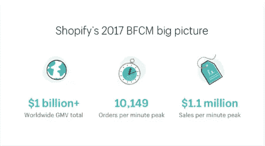***

***Data retrieved from a [Shopify Plus research.](https://www.shopify.com/enterprise/holiday-shopping-online#2)***

***很明显，电子商务正在彻底改变零售业，目前它肯定不会有任何发展。***

***对今年 BFCM 的收入和销售额的预测甚至更高。***

***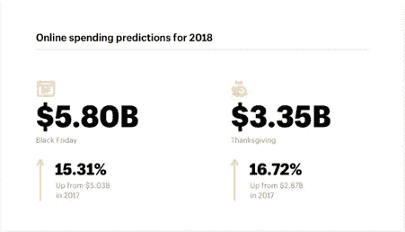***

***Data retrieved from a [Shopify Plus research.](https://www.shopify.com/enterprise/holiday-shopping-online#2)***

***Shopify 的[假日购物趋势&统计 2017–2018](http://Data retrieved from a Shopify Plus research.)研究的另一个有用见解是商店游客基于所用设备的购买行为。***

***有趣的是，移动用户完成的交易首次高于桌面用户。***

***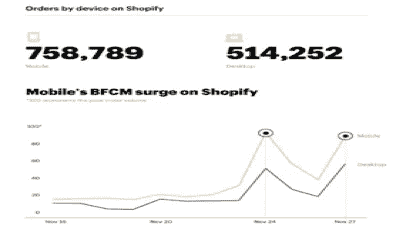***

***Data retrieved from a [Shopify Plus research.](https://www.shopify.com/enterprise/holiday-shopping-online#2)***

***通常，我们在过去几年的电子商务中看到的是，客户在移动设备上浏览，然后在桌面上完成交易。***

***然而，这里可以得出的结论是，商家应该专注于为他们的访问者提供卓越的移动体验，并在移动生态系统中传达他们的品牌身份。***

***在我开始黑色星期五策略之前，最后一个值得一提的统计数据是网上消费排名前十的国家。***

***记住哪些国家是目前最熟悉的网上购物国家总是好的，这样你就可以针对这些国家调整你的内容营销和付费广告。***

***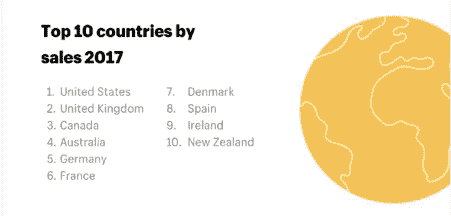***

***Data retrieved from a [Shopify Plus research.](https://www.shopify.com/enterprise/holiday-shopping-online#2)***

***如果你对这些统计数据感兴趣，你可以查看 Shopify Plus 的这张[信息图](https://www.shopify.com/enterprise/holiday-shopping-online#2)。***

***既然你已经很好地理解了为什么这个假期对你的业务增长至关重要，那么让我们深入了解一下一些最成功的 Shopify 品牌是如何利用黑色星期五的。***

***让我先给你提供一个简单的方法，你也可以用它来探索所有使用 Shopify 作为电子商务平台的品牌。***

***前往[google.com](http://google.com/)，准确输入“myip.ms shopify”。然后点击第一个结果。***

***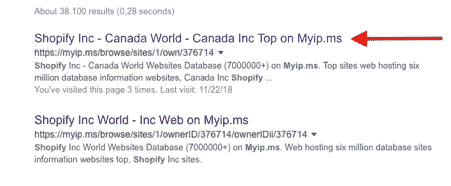***

***单击后，您将被重定向到该网站，您应该能够看到类似下图的内容。***

***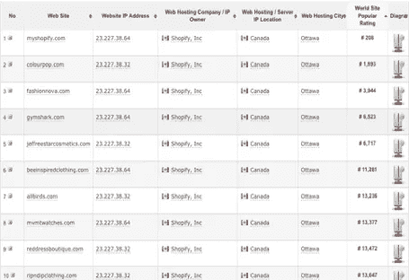***

***这些是使用 Shopify 平台的前 10 大品牌。你当然可以浏览网站，探索任何其他你感兴趣的品牌。***

***排名是基于他们的每日访问量而不是收入，然而，一个商店的访问量越大，收入就越高。它总是取决于其网站的转化率。***

***我特别关注下面提到的品牌，原因很简单，它们确实在其网站和社交媒体页面上发起了有组织的黑色星期五活动。***

***下面没有提到的其余 10 大品牌至少在黑色星期五前一天没有开展或准备开展任何促销活动。***

# ***开展黑色星期五活动的五大 Shopify 品牌:***

******1。彩色流行******

*****2。时尚新星*****

*****3。健身房鲨鱼*****

*****4。蜜蜂启发服装*****

*****5。MVMNT 手表*****

# **[颜色流行](http://www.colourpop.com)**

**ColourPop 目前绝对是美容化妆行业的霸主。这家总部位于加州的美容品牌自 2014 年由 Seed Beauty 创立并拥有，其所有产品均在内部设计和制造，并在过去两年中实现了显著增长。**

*****统计:*****

***日访问量:203.000***

***预计日销售额:14.700 美元***

***上月总访问量:590 万次***

**我做的第一件事当然是抓住品牌的情绪，如果他们正在为节日做准备，我会访问他们的网站。**

**正如你所看到的，标题包括一个名为“假日”的特定菜单，在这里你可以找到所有在假日期间打折的产品。**

**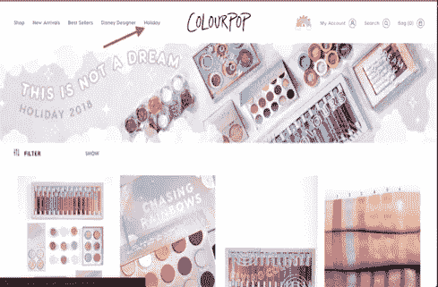**

**这是一个伟大的想法，你也可以在你的商店实施。**

**您可以轻松创建一个新系列，并为其命名，如“假日交易”、“假日”、“打折”等。并把它放在你网站的标题上。**

**在这个节日期间，大多数来你网站的访问者都有销售意识，这意味着他们会立即寻找你的促销活动。**

**为什么不使他们的生活更轻松，并引导他们达成他们可能正在寻找的交易。**

**在主页上向前滚动一点，另一个大横幅吸引了我的注意。**

**如你所见，横幅相当成功地传达了 ColouPop 想要传达的信息。**

*****它包括:*****

***1。传达当前折扣率的明确信息。***

***2。哪些产品打折的完整介绍。***

***3。在这张你可能无法忽视的嘴唇的大图下面，有一个“立即购买”的按钮。***

**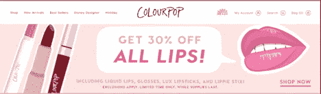**

**到目前为止，访问者甚至只需访问他们的网站，就可以清楚地了解该品牌的销售和促销情况。**

**我想在这里提到的最后一件事与黑色星期五的背景无关，但给我留下了深刻印象的是访问者一旦订阅了 ColourPop 的电子邮件时事通讯后收到的消息。**

**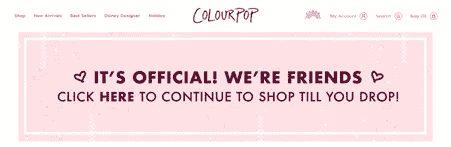**

**正如你从上图中看到的，一旦你订阅了电子邮件简讯，你就会看到这个简单但设计精美的横幅。**

**ColourPop 在任何可能的情况下设定其品牌基调和特征的方式都是完美的。**

**横幅没有什么特别的，我想说这是一个简单的热情欢迎的信息。**

**然而，它描述了品牌如何对待其访问者，以及他们如何额外努力为他们的访问者提供愉快的体验。**

**尽管该网站足以理解 ColourPop 如何为黑色星期五促销活动定位，但我很好奇他们如何在社交媒体渠道上传达即将到来的销售期。**

**我访问了他们的脸书页面，浏览了他们的一些帖子，在那里我发现了一些有趣且非常有用的策略。**

**首先，正如你所看到的，他们宣布促销活动比预期的黑色星期五更早开始，这是很常见的，但他们也宣布他们将每天发布新的“网络交易”。**

**为他们的粉丝制造一些宣传和好奇心的聪明策略，你不觉得吗？**

**想象一下，你最喜欢的品牌宣布，在接下来的几天里，他们将每天发布新的交易。**

**你不想继续关注今天和第二天的交易吗？我打赌你会的。**

**这是 ColourPop 的一个非常有趣的策略，可以很容易地应用到你的商店。**

**列出访客最感兴趣的产品，宣布即将到来的每日交易，然后每天推出一个。**

**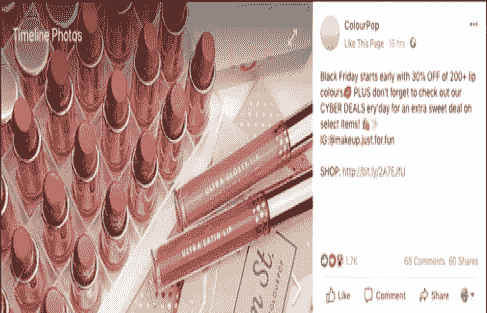****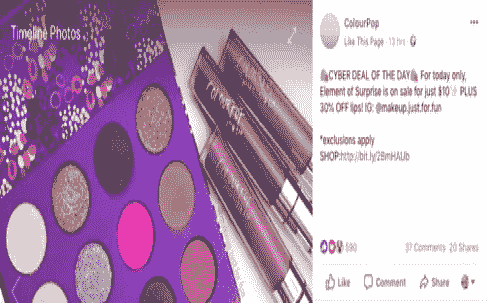**

**为了给他们的黑色星期五活动造势，ColouPop 实施的另一个很酷的策略是在他们的社交媒体渠道(脸书、Instagram、Twitter)上举办一场比赛，猜猜他们什么时候会宣布获胜者。**

**你说得对！**

**在黑色星期五。**

****所以他们用这种战术实际上取得的是:****

***答:通过他们所有的社交媒体渠道向大量受众宣布(参见下面的参与帖子)新产品发布。***

**在黑色星期五，设法让人们回到他们的页面。**

***c .增加他们的社交媒体关注。***

**对于他们吸收的赠送 3 个产品包的成本来说，这还不错。**

**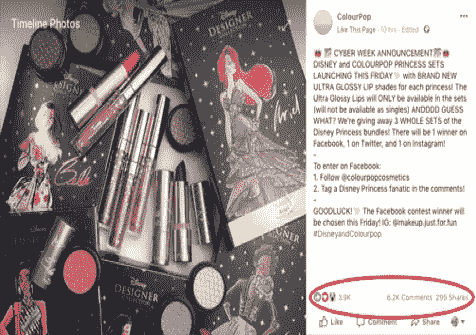**

## **总而言之:**

***1。用精心设计的横幅更新你网站的主页，让它清楚地表明你在全店范围内开展促销活动。***

***2。用一个适当命名的收藏更新你的网站标题，这将使你的访问者很容易找到你所有的促销品。***

***3。通过宣布每日交易，在你的品牌社交媒体渠道上制造一些宣传。***

***4。在您所有的社交媒体渠道中开展一场赠品竞赛，并在您希望推出促销活动的当天宣布获胜者。***

# **[时尚新星](http://www.fashionnova.com)**

**如果你在电子商务行业，你一定听说过时尚新星。这是发展最快的女装在线品牌之一，它在社交媒体上投入巨资，以提高品牌知名度和获得新客户。**

****统计:****

***日访问量:86.000***

***预计日销售额:17.300 美元***

***上月总访问量:330 万次***

**和 ColourPop 一样，研究时尚新星黑色星期五的策略也遵循同样的过程。**

**我跳进了他们的网站，那里有一个非常闪亮和令人印象深刻的横幅，通知我黑色星期五的销售活动。**

****下图中需要注意的事项有:****

***1。公告栏的哪一部分是用来传达黑色星期五销售。***

***2。令人印象深刻的横幅清楚地表明，销售是实时的，以及客户可以预期的销售百分比。***

***3。最后，该品牌试图提高紧迫性，使用倒计时器向游客展示他们必须抓住任何促销活动的剩余时间。***

**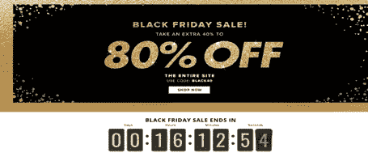**

**在社交媒体策略方面，Fashion Nova 决定遵循一种类似于 ColourPop 的策略，为他们的观众营造关于即将到来的黑色星期五销售的宣传。**

**下图是该品牌在脸书和 Instagram 页面上的帖子。他们最初从 11 月 21 日开始在一天中频繁地张贴它(每天 3-4 次)。**

**这里要带走的一件事是品牌在线形象的一致性，以及试图建立在受众基础上的早期兴奋感。**

**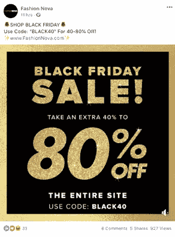**

## ****总之:****

***1。在你的网站主页上使用一个令人印象深刻的横幅，它可以在你的社交媒体渠道上使用，以保持一致性。***

***2。为即将到来的黑色星期五销售发布几次/天，这建立了炒作和兴奋。***

***3。在你的网站主页上使用倒计时器来增加紧迫感，尽可能多地完成销售。***

# **[健身房](http://www.gymshark.com)**

**英国 2016 年增长最快的公司，2017 年销售额为 4100 万英镑，无疑是一个值得一提的电子商务品牌。Gymshark 的创始人兼首席执行官是一位名叫本·弗朗西斯(Ben Francis)的 19 岁大学生，他热爱健身，具有强烈的创业精神。**

****统计:****

***日访问量:35000***

***预计日销售额:不适用***

***上月总访问量:240 万次***

**以下是你在黑色星期五访问 Gymshark 网站时看到的内容。**

**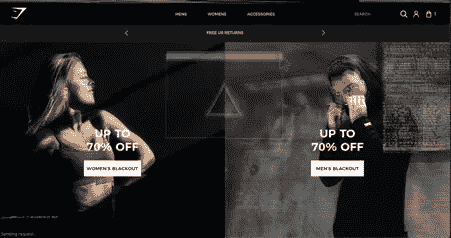**

**他们将他们的黑色星期五活动命名为“停电”，他们清楚地展示了全店范围内高达 70%的销售。**

*****点击此处查看详情:他们主页上的行动号召按钮包含了活动名称。*****

**我认为他们主页的横幅吸引人的注意，并且在信息横幅上清晰可见。**

**该品牌的脸书封面也使用了黑色星期五相关的横幅，指出了高百分比的折扣，并通过提到折扣将在有限的时间内提供来增加一些紧迫性。**

**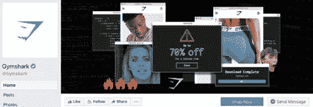**

**然而，Gymshark 的黑色星期五活动最令人印象深刻的部分是他们决定提前发布社交媒体帖子。**

**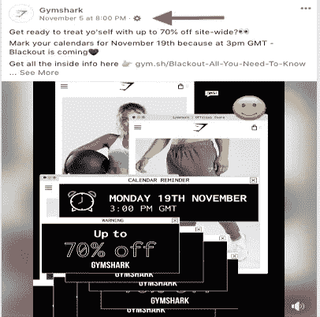**

**正如你从上面的图片中看到的，他们在 11 月 5 日在他们的脸书页面上发布了第一个黑色星期五相关的帖子。**

**这几乎是该运动实际发起日期的 15 天前。**

**相当令人印象深刻，不是吗？**

**从上面的图片也可以明显看出，后期创意(这是一个视频)的重点是在他们将发布“停电”活动的特定日期。**

**接下来的两篇脸书帖子是在 11 月 7 日和 9 日发布的，他们在那里宣布了活动开始时将出售的产品！**

**这是一个为你的产品建立需求的好主意！人们浏览你的网站，搜索所有可供选择的产品，并开始思考他们应该在即将到来的销售中瞄准哪些产品。**

**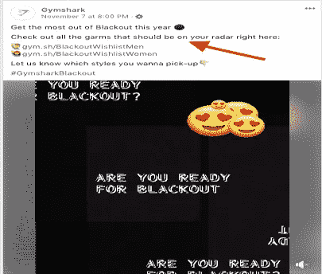****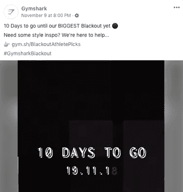**

**如你所见，他们所有的社交帖子中都提到了“停电”活动的发布日期。**

**当他们的“停电”发布时间到来时，这是该品牌的帖子:**

****

**他们也在脸书推出了几个广告，并附上了他们的有机帖子，显然是为了提高他们的影响力，让他们的观众知道这场运动是直播的。**

**正如你所看到的，他们确实播放了一些轮播广告，可能是为了重新定位，还有两个分别针对男性和女性的不同视频广告。**

**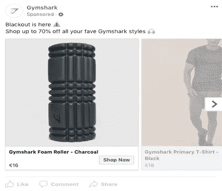****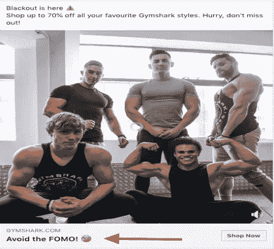****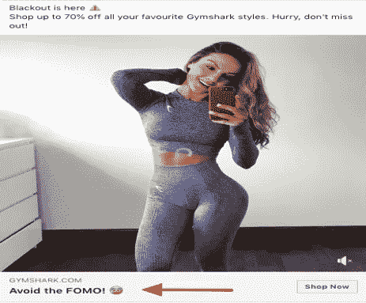**

**广告文案并不疯狂，只是一个简单的广告文案，传达了他们想要传达的信息，即“停电”活动正在进行。**

**广告的标题是“避开 FOMO！”这很不寻常，或者至少是我在其他脸书广告上没见过的。通常我会看到一些间接的技巧，让顾客产生一种 FOMO 的感觉，例如(有限的库存，一次性报价等)。)但不直接“建议”他们避开 FOMO(害怕错过)。**

**现在你可能会怀疑，这很正常，我也会怀疑这场运动是否成功。**

**嗯，谢谢你邀请我！**

**该活动不仅成功，而且非常成功，以至于在发布当天人们都吓坏了，该品牌很快就脱销了，人们在脸书上抱怨说，他们在结账页面上看到了类似“你试图购买的商品目前缺货”的消息。**

**事实上，问题太大了，该品牌为他们在社交媒体账户上造成的所有不便道歉。**

**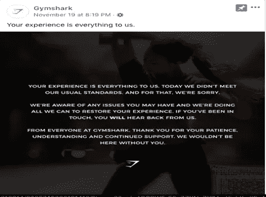**

## **总而言之:**

***1。修改你的网站和你的脸书网页，并把它们变成即将到来的运动情绪。***

***2。尽早在你的社交媒体账户上发布即将到来的活动。***

***3。让粉丝知道哪些产品会打折。***

***4。在活动现场播放脸书广告，让你的观众知道活动正在进行。***

***5。确保有足够的库存来满足需求。***

# **[蜜蜂启发的服装](http://www.beeinspiredclothing.com)**

**Bee inspired Clothing 由前职业足球运动员 Steven Robb 和 Mark Corcoran 于 2013 年创立，是一个屡获殊荣的街头服饰品牌，在脸书和 Instagram 上拥有大量粉丝。**

****统计:****

***日访问量:24.400***

***预计日销售额:9.700 美元***

***上月总访问量:240 万次***

**与之前提到的品牌相比，该品牌没有在黑色星期五前几天开展有组织的宣传活动，以营造炒作和刺激气氛。**

**然而，他们确实像其他品牌一样更新了他们网站主页上的相关横幅，这与他们在脸书封面照片中使用的横幅相同。**

**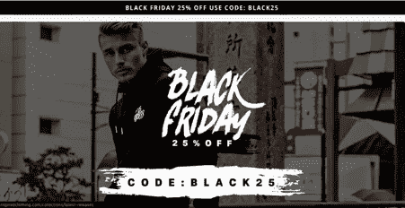**

**为了利用黑色星期五，该品牌采用了一种不同的策略，即激励其受众注册他们的电子邮件列表，以便他们能够在其他人之前首先了解即将到来的促销活动。**

**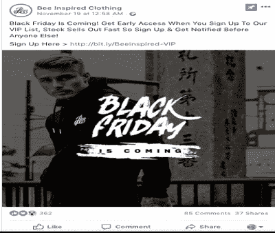**

**这样他们给了他们的粉丝一个订阅时事通讯的理由，你猜怎么着？他们增加了电子邮件列表，这对所有品牌来说仍然是最重要的。增长列表的绝妙方法！**

**总之:**

***1。根据即将到来的活动更新您的网站和社交媒体。***

***2。通过首先向人们提供活动的交易来激励他们订阅你的电子邮件列表。***

# **[MVMT 手表](http://www.mvmtwatches.com)**

**2013 年由两名名叫 Jake Kassan & Kramer LaPlante 的大学辍学生创立的 MVMT 手表颠覆了手表行业，并于 2018 年 8 月被摩凡陀集团以超过 1 亿美元的价格收购。**

****统计:****

***日访问量:23.500***

***预计日销售额:28.600 美元***

***上月总访问量:110 万次***

**在更新网站主页和脸书页面方面，与其他品牌相比没有什么惊喜。**

**MVMT 更新了其网站主页，用一个令人印象深刻的横幅清晰地传达了黑色星期五庆祝活动的精神。**

**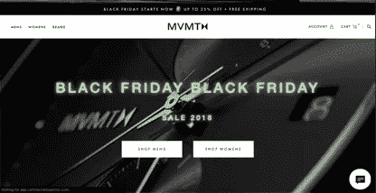****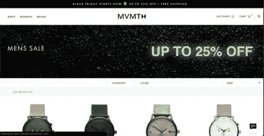**

**我可以想象，他们并没有太关注“高于折上折”区域的折扣比例，因为在这种情况下，MVMT 手表提供了 25%的低折扣，而其他品牌则提供了很高的折扣。**

**然而，对于一个网站的主页来说，这是一个精心设计的横幅，它清楚地向访问者传递了信息。**

**他们在脸书封面上使用了背景不同但原则相同的横幅。**

**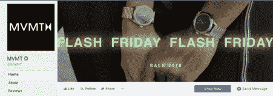**

**该品牌自 11 月 16 日发布视频展示该品牌的故事并宣传即将到来的黑色星期五销售后，就没有开始宣传其黑色星期五销售。**

**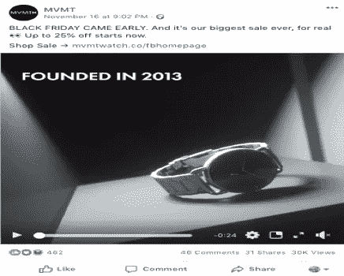**

**到目前为止，没有什么真正不同的品牌之前提到的。**

**但是不要太肯定。**

**当我浏览 MVMT 手表网站时，一件非常独特的东西吸引了我的注意。**

**该品牌在这个假期推出了一份礼物指南，根据你的价格偏好向你推荐你应该送他/她什么礼物。看看下面的图片，你就会明白了。**

**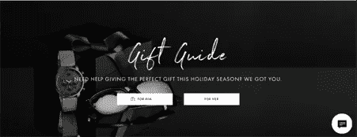****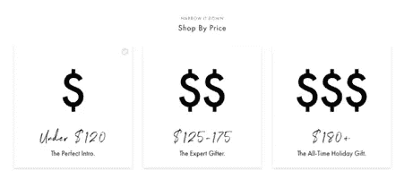****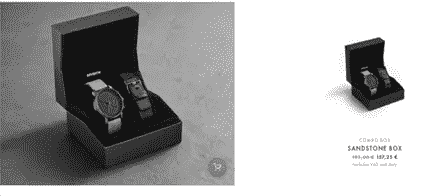****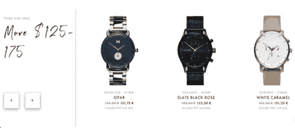**

**他们非常关注当今的送礼精神，这可以从他们在社交媒体上发布的关于他们策划的礼品的帖子中看出:**

**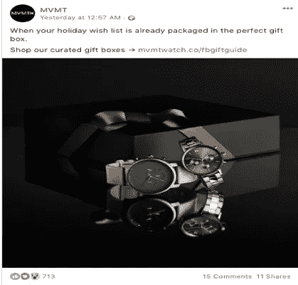****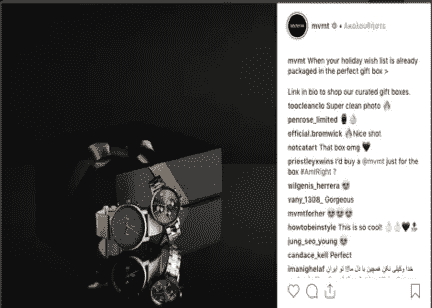**

**如此惊人的想法和执行力。你不觉得吗？**

**恭喜，MVMT 手表！**

## ****总之:****

***1。在活动前几天播放一段宣传视频，谈论你的主张，介绍即将到来的促销活动。***

***2。如果你的产品适合送礼，花些时间制作一份礼物指南，帮助你的顾客更容易为他们的爱人选择礼物。***

# **结束语**

**当你读到这篇文章的时候，黑色星期五已经过去了。然而，假期很长，直到新年前夕，如果你没有为今年的黑色星期五举办特别活动，你真的不必担心。一年的最后一个季度，尤其是假日季节，为您提供了多次吸引客户注意力并完成销售的机会。**

**这就是为什么我分析了一些顶级 Shopify 品牌在推出黑色星期五活动时已经做的事情，这样你就有希望获得一些灵感，并在自己的业务中应用一些你读过的策略。**

**对于电子商务和实体零售商来说，这都是最繁忙的购物时期，这可能是你利用宣传和客户日益增长的购物意愿的最佳时机。**

**因此，总结并留给你我的最后一句话，我会建议你在接下来的日子里成功地开展促销活动:**

***1。花一些额外的时间更新你的网站主页和脸书封面，让它们与你的竞选横幅相关。***

***2。在促销活动开始前几天，开始为你的促销创造兴奋感和期待感。***

***3。活动开始的那一天，在脸书的 Instagram 上投放广告，让你的观众知道活动开始了。***

***4。像 MVMT 手表一样多做一点，为你的产品策划礼物创意创造一个完美的展示。***

***5。在您所有的社交媒体账户中开展一场竞赛，并在活动启动当天宣布获胜者。***

**我希望这篇文章为你提供了一些有助于你计划、准备并最终启动你的活动的宝贵经验。**

**祝你万事如意，节日快乐！**

**我对电子商务行业和数字营销非常有热情，我会试着每周分享一次我的想法。

保重:)**