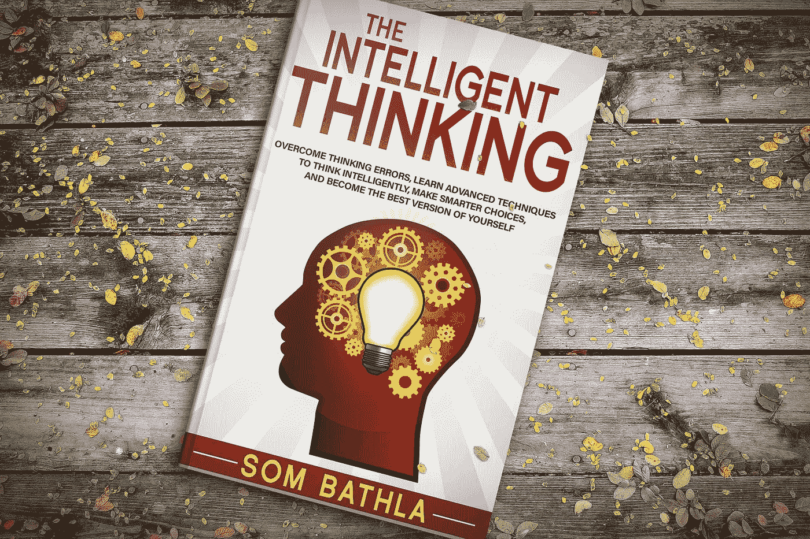

# 如何思考失败(用这种技巧)可以增加你成功的机会！

> 原文：<https://medium.datadriveninvestor.com/how-thinking-failure-with-this-technique-can-multiply-your-chances-of-success-edbba90d15e8?source=collection_archive---------42----------------------->

Photo by [Quinten de Graaf](https://unsplash.com/@quinten149?utm_source=medium&utm_medium=referral) on [Unsplash](https://unsplash.com?utm_source=medium&utm_medium=referral)

## 有人告诉过你，如果你想在某项冒险中获得成功，就要认真思考失败吗？

大概不会！

这看起来太反直觉了，不是吗？

所有的自助或激励大师都告诉你，用生动的细节，用你想要实现的准确的颜色、形状和风格来想象成功。他们告诉你只看到自己成功，而不是失败。

我亲身体验了大多数自助大师解释的东西。感觉很棒，很快乐。看来你已经达到目标了。

但是除了体验这种想象中的成就感，它并没有太多的实际意义。因为大多数人经常会陷入幻觉中，错过了为实现目标而努力的机会。

只想着已经取得的成功往往会让他们骄傲自大，让他们忘记现实或可能会遇到的障碍——这种人似乎在建造空中楼阁。

毫无疑问，思考和准备成功很重要，但不能以忽视为此付出的代价为代价——即未能评估困难、挑战和实现成功所需的行动量。

# 更好的方法:逆向思维

我遇到了著名的希腊斯多葛派遵循的这种不同的技术。他们建议，如果你真的想要什么，问自己一些与你想要达到的目标相反的问题。当你的想法与你的目标相反时(例如，关于失败)，你必须找出导致你失败的主要原因，然后你必须制定一个计划来避免相反的结果。这种技术叫做**逆向思维。**

举一个上面的例子。假设你正在做一份工作，你想要升职或加薪——这就是你的目标。现在让我们在这里应用逆向思维技术。

你必须问自己**如何被降职或者甚至被解雇？你必须列出几个你可能被解雇的原因。以下可能是一些原因:**

> -你不与同事合作或建立关系。
> 
> -你没有更好地学习工作技能，而是选择使用多年前学到的旧方法。
> 
> -你拿多少钱就干多少，不愿意付出额外的努力来达到要求的结果。
> 
> -你不理解上级的观点，甚至不致力于实现共同的目标。

可能有更多的原因是因为失业，这取决于你的具体情况。当然，你不想丢掉工作；相反，你的目标是更快地获得晋升。

以下是逆向思维技巧的建议。

现在，一旦你列出了原因，你需要避免以上所有可能让你丢掉工作的原因。一般来说，我们太专注于终点线，往往会忽略或不注意做正确的事情或避免途中的某些错误。

**逆向思维就是找出导致最坏情况的原因，一旦你知道了这些原因；你的工作就是通过强化这些因素来避免失败。仅仅是避免这些错误就会大大增加你成功的机会。**

# **心理反差**

海蒂·格兰特·哈尔沃森在她的书《成功:我们如何才能达到我们的目标》中提到了“心理对比”的概念。在心理对比中， ***你首先想象达到你的目标，然后反思挡在路上的障碍*** 。

她建议在设定目标时使用的最佳策略似乎是积极地思考如何实现目标，同时现实地思考如何实现目标(T21)。

如果你想得到一份高薪工作，首先想象自己接受了一家顶级公司的邀请，然后想想你和这份邀请之间的障碍——那里有许多其他同样合格的候选人，你需要弄清楚为什么你会被选中？此外，你必须考虑如果一份工作没有成功，你是否必须申请其他工作。这就是所谓的 ***行动的必要性*——这是一种对实现目标至关重要的心理状态。**

她进一步指出，仅仅梦想(没有任何行动计划)得到你梦想的工作或实现你的财务目标会有多棒，不会让你有任何进展。心理对比通过聚焦你需要做什么来实现愿望和梦想，从而将愿望和梦想变成现实。

如果你想知道更多不同的思考方式，更准确地说，更聪明的思考方式，我出版了一本名为 [**《聪明的思考**](http://geni.us/YDbiq) **的新书。**

你将具体了解我们是如何错误地思考的，以及我们是否以及如何改变我们的思考方式。

这本书充满了大量的思维技巧，这些技巧得到了心理学研究的支持，并由许多伟大的思想家实施，如埃隆·马斯克、爱因斯坦、莱昂纳多·达·芬奇等等。点击**[**就能拿到你的那本书。**](http://geni.us/YDbiq)**

# 希望你喜欢这篇文章。

你介意为此鼓掌吗？

# 想要大幅提升性能吗？

# [下载免费报告——揭示 5 种心理训练工具，让你在未来 30 天内发挥出最佳水平](http://sombathla.lpages.co/mentalshifts/)