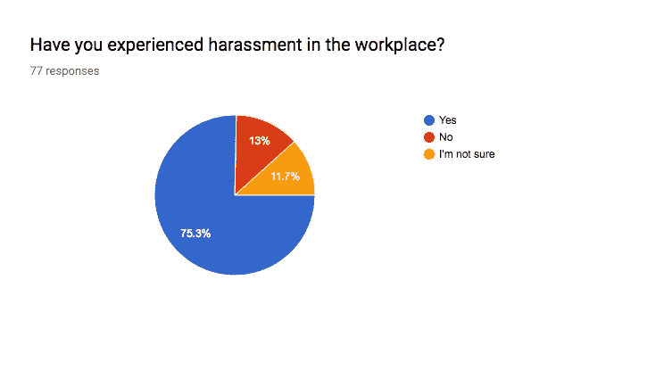
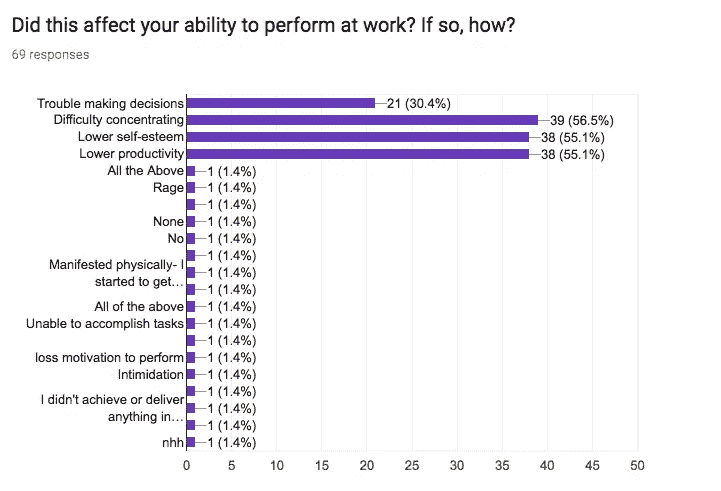

# 这家公司如何采取行动利用人工智能做好事…

> 原文：<https://medium.datadriveninvestor.com/how-this-company-is-taking-action-utilizing-ai-for-good-9dd5a6fcdab3?source=collection_archive---------7----------------------->

在过去的一年里，我们一直专注于 AI(深度学习)的民主化，我们犯了错误，赢得了一些胜利，但我们远远没有完成我们设定的使命。我将谈论一家公司，该公司正在利用我们的技术 Codey 来使他们的工作场所更加安全。

我们一直在研究和测试某些电子邮件和文本是如何真正影响人类大脑的。我们发现外表上的人并不总是表现出真正受伤的效果。

我们的意思是，在我们的研究中，人们并不总是说出他们的感受。例如，受试者 A 说某个信息“你为什么雇佣这个黑人女孩”对他没有影响，但是当看结果时，我们能够表明它确实影响了他们，而且更令人信服的是，它比其他信息的伤害持续时间更长

如果一个人在工作时发了一条令人不安的短信，可能是老板发的，也可能是任何员工发的。我们想真正了解大脑的哪个部分受到了影响&受影响的时间有多长。这就是科迪如何帮助一家公司的。

想象一下有一个有毒的工作场所&你想对你的老板说些什么，但你不能。想象一下，在一个工作场所，你想要一个真正好的工作环境，但有些人可能是高绩效的员工，但并不总是对他们周围的人有好处。

营造良好工作环境的一些最佳方法是在一开始就建立这种文化，从一天中 80%的时间都在交流的地方开始，那就是电子邮件和短信。

[55B.ai](https://medium.com/u/67f85dd21eda?source=post_page-----9dd5a6fcdab3--------------------------------) 希望利用人工智能不仅使深度学习民主化，还能帮助解决人类的问题。

Results were taken from 55B’s research

我们很想解决这些复杂的问题，因为我们觉得人工智能有很多用途，这是一种可以用来促进社会公益的方式，对于一个企业来说，组件可以创造真正的价值。

Results were taken from 55B’s research

如果你看一下上面的图表，你会发现辱骂/仇恨言论有许多不同的方式。以上是仇恨言论的一些结果，在人们遭受持续攻击超过 5 年后，他们更有可能有心理健康问题。

大脑的某些部分确实会受到体内化学物质的影响，这是没有外部冲突的。 [55B.ai](https://medium.com/u/67f85dd21eda?source=post_page-----9dd5a6fcdab3--------------------------------) 已经与一些公司合作，开始通过自动化来报告&分析。

CieloXR 旨在带来相同的理念，以增强课堂学习体验。我们 CieloXR 相信，新一代儿童可以更有效地参与创新技术，所有文化和经济环境中的课堂都应该成为技术的催化剂。

cieloXR & [55B.ai](https://medium.com/u/67f85dd21eda?source=post_page-----9dd5a6fcdab3--------------------------------) 合作帮助实现某些报告&分析的自动化。公司里的每个人都觉得这也是引入其他任务的好方法。

作为一名创始人，你必须做出选择，因为这个世界发展得非常快。我们不得不做出艰难的选择，这有时会让业务变得困难，这是一件很好的事情，因为它使目标和里程碑更加接近。

科迪已经被介绍给几家公司，但我们正在继续推进这项任务，那就是将人工智能(应用深度学习)民主化&然后利用这种教育来解决人类复杂的问题。这是一个很大的目标，但当你想解决未来的问题时，你必须在这个行业专注于人的问题，而不是技术问题。

感谢您阅读这篇简短的节选&我将推出更多关于我的大脑和其他人的内容。

享受未来的更新

请与需要看到这个的人分享…

朋友、家人、同事

提醒他们，他们可以做任何他们想做的事情…

感谢阅读！如果你喜欢这篇文章，

向...问好:

[**Instagram**](https://www.instagram.com/55b.ai/) **，** [**Instagram 个人**](https://www.instagram.com/mikea.mcnair/) **，** [**脸书**](https://www.facebook.com/mikea.mcnair/) **，** [**推特**](https://twitter.com/mikeamcnair) **，** [**iTunes**](https://itunes.apple.com/us/podcast/empower-be-different/id1262788006?mt=2)