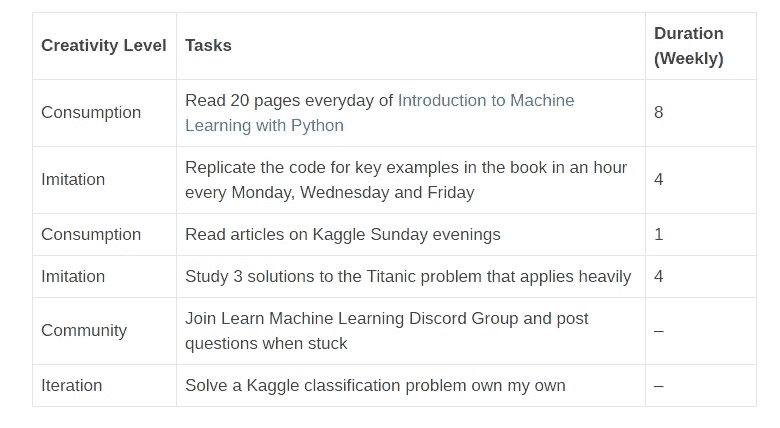

# 如何在 2019 年实现你的数据科学学习目标

> 原文：<https://medium.datadriveninvestor.com/how-to-achieve-your-data-science-learning-goals-in-2019-d1cde0920b2a?source=collection_archive---------8----------------------->

Unsplash

作为一名自学成才的数据科学家或想要成为数据科学家的人，决定每次学习什么非常重要。然而，它本身可能会成为一项有压力的任务，因为有大量的材料和新概念要涵盖。对于一些人来说，挑战在于他们缺乏不断学习的动力。他们在一两个星期后退出，然后重新开始，并一直如此循环。

所以我为你写了这篇文章，如果:

*   你觉得自己学得不够快，或者学得不够多
*   你很容易被机器学习领域的新课程或新话题分散注意力
*   你是一个完全的新手，你不知道从哪里开始
*   2019 年你需要一个有可实现目标的结构化学习方法。

事实是，在这个过程中，我们会遇到新的有趣的资源、课程或框架。我们面临的挑战是不要被它们冲昏头脑——关于 XYZ 框架的闪亮新课程，或者一位知名数据科学家关于机器学习新领域的最新著作。虽然我不反对与新资源保持同步，但它们可能会分散我们的注意力，让我们一事无成。因此，对自学成才的数据科学家来说，优先安排我们的学习时间并取得进步至关重要。否则，我们会发现自己每天都在红迪网和 T2 推特上跳来跳去，试图了解最新的话题。

# 从心中的目标开始

艾伦·甘尼特在他的书《T4:创造曲线》中说，我们可以遵循四条法则来掌握任何技能:

*   消费法则——阅读相关书籍，看相关教程，听相关播客等。他建议我们花 20%的醒着的时间在这个主题上消耗大量的材料。
*   模仿法则——复制作者所采取的步骤，重做我们已经看过的教程，并从头开始重写代码以加强我们的理解。这就是本·富兰克林如何学会写作的。
*   创意社区法则——向以前做过的人提问。撰写这些材料的作者，加入 Reddit、Discord、Slack 或 Twitter 上的活跃社区。
*   迭代法则——应用我们所学来解决问题。这可能是一个小项目，教科书中的练习，Kaggle 比赛或修复错误。

因此，当我们开始新的一年时，我希望我们在旅程中保持脚踏实地。问问你自己:我想在一月份完成哪一件事？那么，有哪些工具或资源可以帮助我实现这个目标呢？在我们的学习旅程中，一个月是很短的时间。然而，我们可以用它作为个人的衡量标准来量化我们的成就和衡量进展。例如，假设你还是一个初学者，已经熟悉了机器学习中使用的概念和工具，你想回答我之前问的问题:这个月我想完成哪一件事？这个月我想解决一个难题。

那么，什么工具或资源会帮助我实现这个目标呢？下面是一个带有资源的示例计划。

这是一个有具体步骤的好计划。非常具体非常重要，所以请继续写下你一天中想要完成任务的时间，或者改变你为每项任务投入的时间。我建议你保持任务不超过六个，这样你就不会因为太多的任务而陷入困境。

现在你已经为一月定下了基调，你开始每一天的时候都要考虑到结束。你的思想集中在学习任务上，以及你如何完成它们。你的思想指向复制代码和消化你所学的概念——即使是在工作的时候。你按照计划到你的桌子前学习。你不用担心实现关于[卷积神经网络](https://en.wikipedia.org/wiki/Convolutional_neural_network)的最新论文。你不会因为在推特上看到的对话而花 3 个小时去研究 [Pytorch](https://pytorch.org/) 和 [Tensorflow](https://www.tensorflow.org/) 的区别。你没有 [FOMO](https://en.wikipedia.org/wiki/Fear_of_missing_out) (害怕错过)在[生成对抗网络](https://en.wikipedia.org/wiki/Generative_adversarial_network)上，因为它在 Reddit 上产生了很多嗡嗡声。你热衷于贯彻你的计划。我知道仅仅设定目标并不能保证你会完成上面所有的任务——尤其是如果你非常忙的话。但是我可以保证，当你继续执行这些任务时，它会帮助你更有成就感。它还能帮助你在被社交媒体和热门或潮流分散注意力时重新集中注意力。最终，作为一名数据科学家，你的工作将是确定哪些项目是重要的，因此这种结构化方法是学习确定工作流优先级的良好开端，这是每个数据科学家都需要的有用技能。

# 采取行动

因此，当你临近新的一年时，我向你发出挑战，把每个月都看成一块画布，你可以在上面写下你的学习目标，并真正去实现它们。批判性地思考你想提高技能的领域或主题，或者你想从事的项目。写下 5 或 6 个具体而详细的步骤来帮助你实现它，并把它放在你电脑上的便利贴上或者你每天都能看到的地方。每个月都这样做，必要时完善你的计划，但要坚持下去。

> 有具体的目标有助于你优先考虑你的决定和时间。

如果这是你试图成为一名自学成才的数据科学家的第一个月，我建议你查看我创建的让我开始这段旅程的学习计划，见[此处。](https://data805.com/a-roadmap-to-becoming-a-data-scientist/)

继续学习！

一如既往，我欢迎反馈和建设性的批评。可以通过推特 [@Frawzey](https://twitter.com/frawzey) 或者我们的博客【data805.com 联系到我