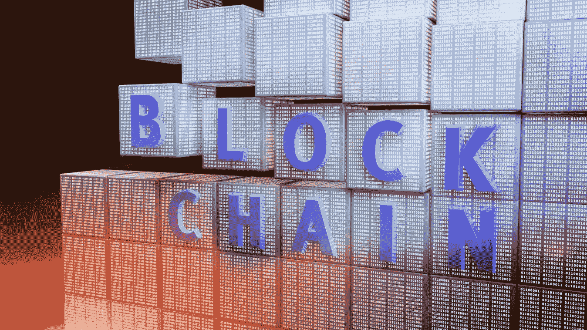
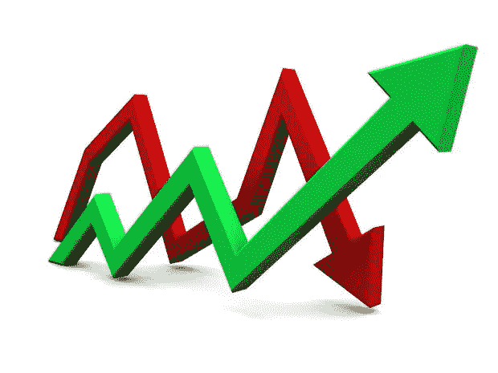
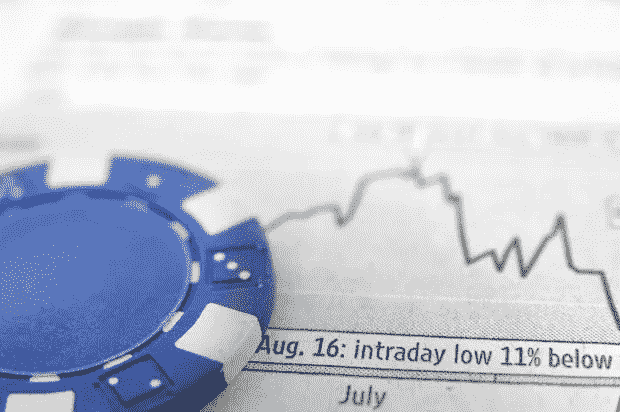
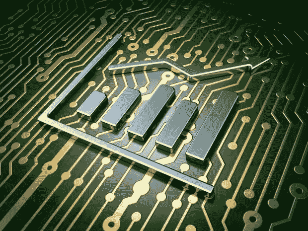

# 如何在你的股票投资组合中增加区块链敞口

> 原文：<https://medium.datadriveninvestor.com/how-to-add-blockchain-exposure-to-your-stock-portfolio-511bd417ba51?source=collection_archive---------1----------------------->

区块链技术已经从一个流行的金融科技流行语演变成一种适用于解决现实世界挑战的技术。然而，目前，由于技术本身仍处于起步阶段，大多数区块链解决方案仍处于概念验证阶段。出于这个原因，现在就开始在你的股票投资组合中增加区块链风险敞口可能是明智的，这样你就可以尽早进入，并从未来几年的技术增长中受益。

几年前，投资区块链科技的唯一方式是购买比特币或其他加密货币。如今，投资者还可以选择购买参与开发区块链科技产品和服务的公司的股票。

投资者现在可以接触到一系列不同类型的区块链上市公司，从市值不到 1000 万美元的区块链初创公司的股票，到在这项新技术上下大赌注的老牌跨国科技巨头。

## **初创公司股票对蓝筹股**

现有的区块链股票可以明确分为两类:初创公司，主要由 nanocap 股票组成，以及正在开发区块链解决方案的老牌蓝筹科技集团。

## **区块链创业股票**

在过去的几年里，几家区块链公司决定上市以获得股权融资。这些公司包括澳大利亚的 DigitalX、加拿大的 BTL 集团、英国的 Coinsilium 集团以及美国的 BTCS 和环球舞台控股公司。

澳大利亚区块链初创公司 [DigitalX Ltd (ASX:DCC)](https://digitalx.com/) 开发基于区块链的产品和服务，以颠覆支付行业。它最著名的解决方案叫做 [AirPocket](https://www.airpocket.com/) ，允许个人向 14 个不同的国家发送和接收低成本的国际汇款。DigitalX 在澳大利亚证券交易所上市，市值 1000 万澳元(780 万美元)。

总部位于温哥华的 BTL 集团有限公司在多伦多证券交易所上市。BTL 集团(TSXV:BTL)为一系列行业生产区块链和智能合同解决方案，并开发了名为 Interbid 的企业区块链解决方案。最近，领先的能源公司 BP、Eni Trading & Shipping 和 Wien Energie 对 Interbid 进行了测试，而[现在准备进入投产阶段](http://www.marketwired.com/press-release/bp-eni-trading-shipping-wien-energie-successfully-complete-btl-groups-interbit-energy-2220028.htm)。BTL 集团市值 8500 万加元(6700 万美元)，在加拿大和英国都有办事处。

总部位于英国的 [Consilium (NEX:COIN)](https://www.coinsilium.com/) 是一家区块链投资公司，通过其加速器为早期区块链初创公司提供融资和管理。Coinsilium 的股票在伦敦 NEX 交易所交易，该公司的市值约为 350 万英镑(450 万美元)。

如果你是一名美国投资者，并且你不会因为投资低价股而感到厌烦，你也可以在你的投资组合中增加 [BTCS 公司(股票代码:BTCS)](http://www.btcs.com/) 的股票。BTCS 是第一家在美国上市的区块链公司，专注于开发区块链和基于加密货币的解决方案。或者，你也可以看看总部位于纽约的控股和发展公司[Global Arena Holding Inc(OTC mkts:GAHC)](http://globalarenaholding.com/)，该公司收购使用区块链技术的技术、专利和公司。

## **区块链蓝筹股**

如果你希望自己持有的股票由蓝筹股组成，或者作为基金经理需要这样做，你会很高兴地知道，有几家知名的技术公司可以投资，以增加你投资组合中的区块链风险。

[IBM 在区块链技术](https://qz.com/673434/ibm-is-making-big-bets-on-blockchain-technology/)上下了重注，2016 年推出自己的区块链服务就可以见证这一点。IBM 的区块链平台是 Linux 基金会开源 Hyperledger 项目的一个版本，IBM 是该项目的创始成员之一。自推出其[区块链即服务(BaaS)平台](https://www.ibm.com/blockchain/)以来，IBM(纽约证券交易所代码:IBM)已经与供应链管理、金融服务、医疗保健和食品安全等行业的公司和初创公司合作，试图成为大企业的区块链解决方案提供商。

与 IBM 类似，微软也坚信分布式账本技术具有创造颠覆性业务解决方案的潜力。微软(纳斯达克股票代码:MSFT)因此开发了自己的[区块链即服务平台](https://azure.microsoft.com/en-gb/solutions/blockchain/)，托管在其云计算平台 Azure 上。微软的 BaaS 平台为企业提供了一个解决方案，允许他们开发、测试和运行由[微软 Azure](https://azure.microsoft.com/) 支持的分布式总账业务解决方案。

你也可以通过在你的投资组合中增加在线零售商 Overstock 的股票来分散投资“纯”科技股。Overstock 的核心业务是其电子商务平台，但该公司也与区块链科技有着密切的关系。Overstock(纳斯达克代码:OSTK)不仅是 2014 年首批接受比特币作为支付方式的在线商家之一，而且这家纳斯达克上市公司还通过其区块链业务部门 [Medici Ventures](http://www.mediciventures.com/) 积极投资区块链公司。

## **该不该投资区块链科技股？**

区块链技术可以应用于为广泛的行业提供解决方案，包括提高运营效率和降低成本，以数字化基于纸张的流程和提高数据安全性。

许多人预测，区块链将成为一项影响力不亚于互联网在 20 世纪 90 年代成为主流的技术。出于这个原因，现在可能是审视围绕这项新技术的投资选择的最佳时机。

虽然投资价值与特定区块链项目(如以太坊)的成功相关的数字代币风险很大，并且需要一定程度的技术理解，但投资能让你接触到区块链技术的股票可能是更容易但同样有利可图的投资选择。此外，鉴于对区块链商业解决方案的需求不断上升，在未来几年，区块链科技相关上市公司的股价表现优于同行也就不足为奇了。

虽然公开交易的区块链初创公司在很大程度上仅限于流动性差的纳米股，但如果你想在股票投资组合中增加区块链风险，科技巨头 IBM 和微软的股票可能值得仔细研究。它们让投资者直接接触到对区块链科技股需求的增长，同时仍然关注股票投资者所珍视的所有蓝筹股。