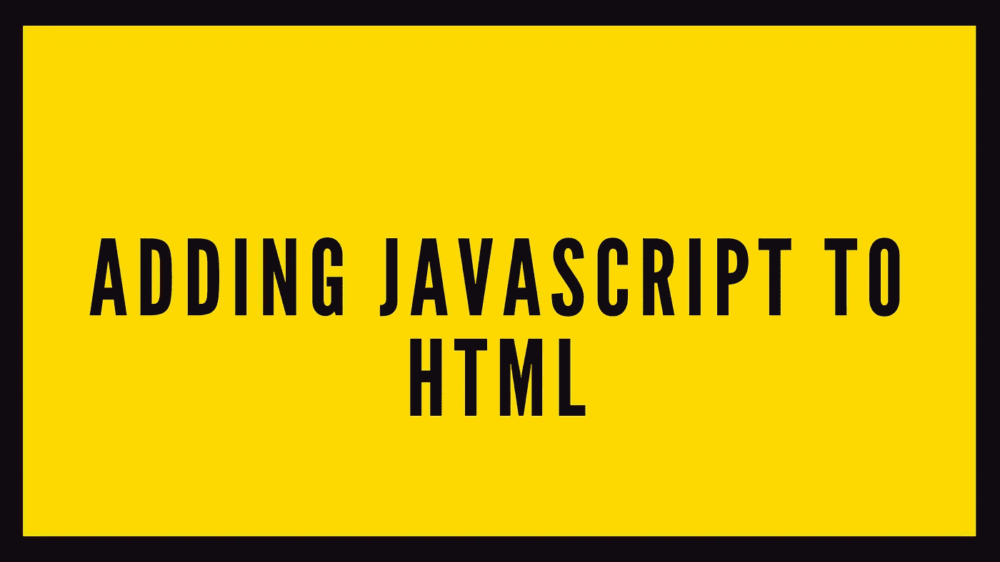
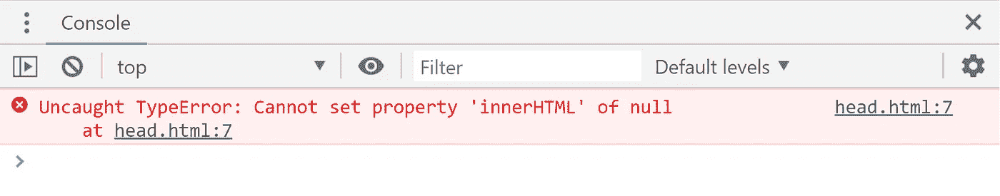

# 将 Javascript 添加到 HTML 的不同方法

> 原文：<https://medium.datadriveninvestor.com/how-to-add-javascript-to-html-5715f69e4d0d?source=collection_archive---------13----------------------->



我们可以通过不同的方式将 Javascript 添加到 HTML 中:

1.  在`<head>`标签之间。
2.  在`</body>`标签之前或之后。
3.  在单独的文件中

# 在头部标签之间

如果我们希望脚本在页面内容呈现之前运行，我们必须将它添加到`<head>`和`</head>`标签之间。



浏览器从顶部读取 HTML 文档，当它到达脚本时，它试图执行第 7 行，但是它不知道' *body* 是什么，因为它还没有被创建。换句话说，主体是空的。
为了解决这个问题，我们需要在`</body>`标签之前或之后运行脚本。

# 在结束正文标记之前或之后

如果我们希望脚本在页面内容呈现后运行，我们需要将它添加到`</body>`标签之前或之后。

## 在结束正文标记之前

## 在结束正文标记之后

现在，当我们打开这一页时，我们将看到 *Hello world！*

# 在单独的文件中

当我们的脚本很大和/或我们将在许多页面中使用它时，我们通常会在一个单独的文件中添加一个脚本。通过这样做，我们可以在许多页面中重用我们的脚本，并且我们可以使我们的代码更具可读性。

这个果然也会显示 *Hello world！*在页面上。我们上面加载脚本的方式是一个普通加载的例子。

加载外部 Javascript 文件有三种不同的方式:

*   标准载荷
*   异步加载
*   推迟其加载

## 标准载荷

在这种情况下，HTML 文件将被解析，直到它遇到对 Javascript 文件的引用，然后 Javascript 文件将被加载和执行。一旦执行完成，浏览器将继续解析 HTML 文件的其余部分。

```
<script src="script.js"></script>
```

**我应该在什么时候选择这种装载方式？**

这通常是你引用脚本的方式。只要您在`</body>`标签之前或之后引用您的脚本，一切都会好的。如果出于某种原因，你必须在其他地方引用你的脚本，比如在`<head>`和`</head>`标签之间，那么推迟加载可能是一个更好的选择。

## 异步加载 Javascript 文件

当我们异步加载一个 Javascript 文件时，它将和 HTML 文件一起被下载。脚本加载完成后，将执行脚本，当执行完成时，浏览器将继续解析 HTML 文件。

```
<script src="script.js" async></script>
```

当我们想要异步加载一个脚本文件时，我们只需要添加单词 ***async*** 。

什么时候应该异步加载脚本？

*   当脚本没有任何依赖项时
*   当脚本不依赖于其他文件时

## 推迟 Javascript 文件的加载

推迟 Javascript 文件的加载意味着脚本执行将被延迟，直到 HTML 文档被完全加载。

```
<script src="script.js" defer></script>
```

要延迟加载，我们只需在引用中添加*。*

***我应该什么时候推迟脚本的加载？***

*脚本需要完全解析 DOM 的任何时候。例如，如果您在 HTML 文档的头部添加了一个对外部脚本的引用(使用 defer 关键字),并且该脚本以某种方式与 DOM 交互，那么该脚本将会运行得非常好，因为它只有在 DOM 完全加载后才会执行。*