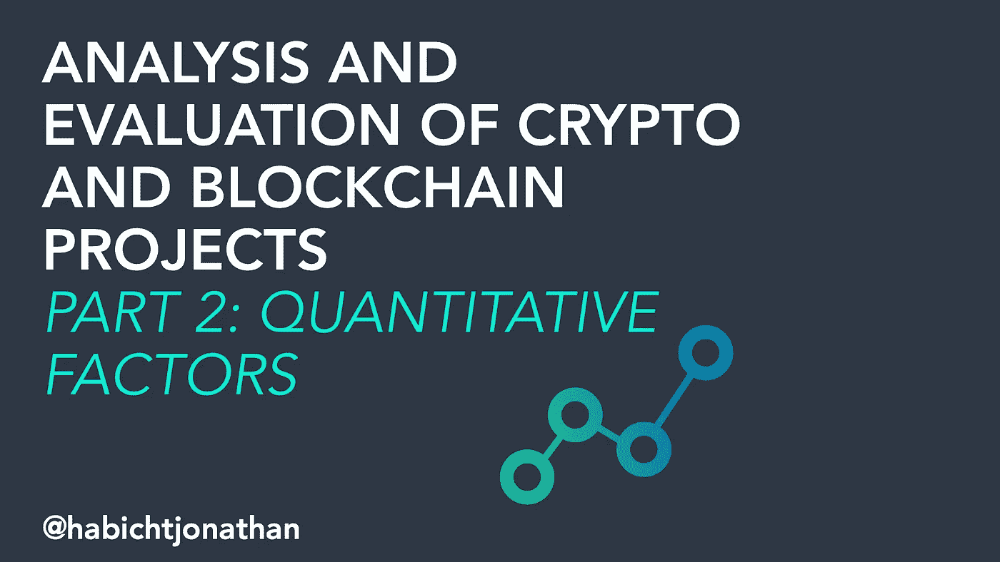
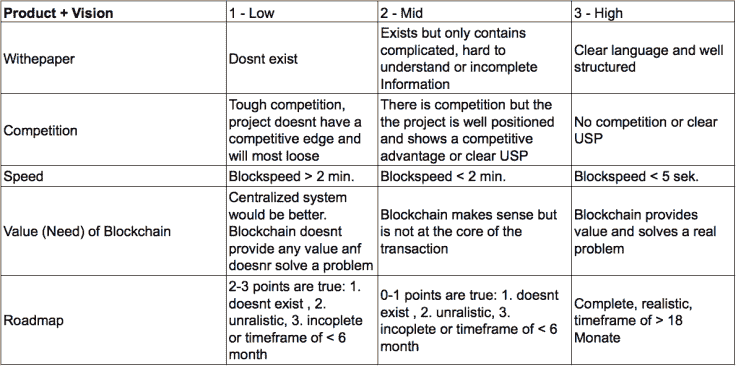
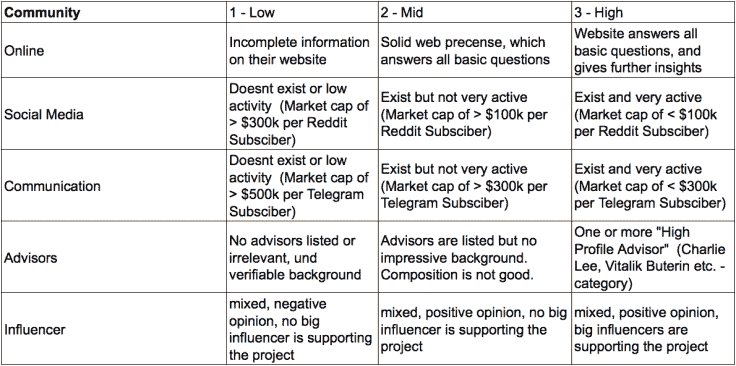
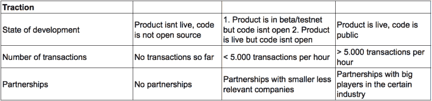
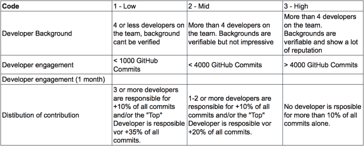
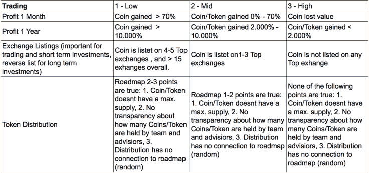
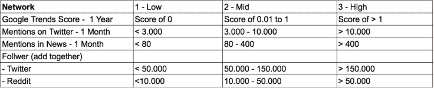

# 如何分析和评估加密和区块链项目第 2 部分:量化因素

> 原文：<https://medium.datadriveninvestor.com/how-to-analyze-and-evaluate-crypto-and-blockchain-projects-part-2-quantitative-factors-8eecd2741f7d?source=collection_archive---------2----------------------->

这是我的系列文章的第二部分:“如何分析和评估加密货币”如果你还没有看过第一部分，可以点击这里查看第一部分。
由于围绕区块链和加密货币的大规模炒作，投资者很难过滤信息，看穿所有的噪音。在有效的基础上比较不同的项目并不容易。因此，我的分析框架的第二部分可以被看作是对第一部分的补充，并在其上添加了第二层。

如果您正在寻找关于这个主题的采访和文章，您很可能会遇到与我们在第一部分中讨论的框架非常相似的框架。背景和团队、愿景和产品、白皮书的质量，或者关于项目的价值主张和解决问题能力的简单问题，都是项目成功的关键因素。

然而，我相信我们可以做更多的事情来做出更好的决定。
区块链项目的伟大之处在于大多数项目都是开源的，这意味着它们的大部分代码都是公开的，许多讨论都是以非常透明的方式进行的。我们通过这些渠道收集的数据也应该进入我们的评估流程。在本文中，我将向您展示如何构建和分析这些数据，以确定项目的合法性和潜力。

因此，我开发了一个框架，在第一部分的定性因素之上添加定量数据。通过这样做，我们正在对特定项目和加密货币创建一个整体的新观点。这一框架的起点是 23 个因素，这些因素分为 6 个类别，并按 1 至 3 的等级进行评分。这六个类别是(非常类似于第 1 部分):

*   产品
*   密码
*   社区
*   牵引力
*   贸易
*   网络

这些数据是从不同的来源收集的，如 GitHub、CoinMarketCap、BitInfoCharts、白皮书、社交媒体。[这是完整的电子表格。](https://docs.google.com/spreadsheets/d/1XWnEqcqqPou8RofPhRP1QpbqBHcpYLZd1jbBl_Xgk4Y/edit?usp=sharing)我在下面列出了每一个类别，为了给你一个更好的概述，我添加了一些例子。

# 产品

我们以以太坊为例。以太坊提供了全面清晰的白皮书(3)。有几个竞争对手(EOS，NEO，LISK 等。)他们中的许多人声称，他们已经解决了以太坊目前正在努力解决的技术问题。
另一方面，这一点还有待证实，在证实之前，以太坊将继续占据该领域最重要的市场份额，并为新的竞争者设置了强大的进入壁垒(2)。以太坊区块链目前的封锁时间是 15 秒。(2).区块链及其智能合约正在为许多用例及去中心化应用构建基础(3)。以太坊路线图为项目的未来计划提供了清晰的视角(3)。以太坊在我们框架的“产品”类别中得了 13 分。

**提示:**在这一点上，值得一提的是，在不同类别的加密货币中，不同的方面应该有不同的评级。例如，块时间在基于可伸缩性的项目中起着重要的作用，而在其他情况下(例如，硬币作为价值储存手段)，它并不那么重要。

# 社区

在这个类别中，OmiseGo 的得分为 14 分(满分为 15 分)。在线状态可以被评级为 3。凭借 Reddit 的 3 分和 Telegram 的 2 分，OMG 在同规模的项目中取得了不错的平均成绩。Vitalik Buterin 和 Joseph Poon 是顾问委员会的成员(3)，许多有影响力的人都以积极的方式谈论 OmiseGo)

**提示:**正如我们在第一部分中所讨论的，如果你能从散布的大量废话中识别出好的和有效的观点，Twitter 是一个令人着迷的信息来源。由于大量的机器人和假冒用户，网络不是一个可靠的量化数据来源。我们稍后将回到这一点。Reddit 的分数被放入视角(市值)中，以不歧视较小(较年轻)的项目和 ico。

# 牵引力

在这个类别中，OmiseGo 的得分为 8 分(满分为 9 分)。产品是活的，但是代码不是公开的(2)。东南亚的许多商家和顾客都在使用这个网络(3)，该公司与该地区的 200 家麦当劳分店建立了合作关系(3)。

**提示:** 5000 个事务可能看起来是一个非常随机的数字，但是同样，不同标准的概念取决于项目的用例。此外，值得一提的是，这些数字是不断变化的目标，随着采用率的提高，这些基准将不得不发生变化。

# 密码

在这一类别中，Bitshares 的评级为 9/12。项目背后的开发者是匿名的，不能被识别(2)。Github 说有来自 79 个开发者的 5300 个提交。在过去的一个月里，有 23 个开发人员提交了 80 次(3)。然而，顶级开发人员负责将近 50%的提交(1)。

提示:基于项目贡献分布的评级可能是这个框架中最有争议的一点。尽管拥有一小群领先的开发人员可能不是不可避免的负面影响，但如果成功的关键因素集中在一小群人身上，就会增加风险。

# 贸易

在这一类别中，占卜被评为 10/12 分。价格在上个月下跌了近 70% (3 ),但也比去年上涨了约 1700 %( 3)。奥格在两个顶级交易所(币安和北海巨妖)上市(2)。
总数上限为 1100 万。销售代表:2015 年几乎所有代币都已分发，团队持有总供应量的 20 %( 2)

**提示:**在评估代币的潜在回报时，你应该始终考虑自己的投资策略和目标。如果一个项目在短期内获得了 10 倍、20 倍甚至更多的收益，那么在不久的将来，它可能不是最好的短期交易。不过，如果基本面是正确的，这个项目可能是一项伟大的长期投资。同样的逻辑也适用于交易所上市。对于短期交易，你想要一个还没有在许多大交易所上市的项目，你想推测未来的上市。

# 网络

从中长期来看，一个项目的成功高度依赖于网络效应和炒作。代币拥有的用户、粉丝和投资者越多，就越容易被主流接受。该类别的数据针对拥有、使用或听说过某个特定项目或密码的人数。

字节币在这个类别中的得分是 7.5 分(满分 12 分)。该项目在 Twitter 上有近 7700 次提及(2)，在上个月有 350 次新闻提及(2)。Reddit 社区有 13，000 人，他们的 twitter 粉丝有 44，000 人(1+2=1.5)。谷歌趋势得分是 0.006 (2)

# 结论

[我的分析的第一部分](https://medium.com/@HabichtJonathan/in-this-blog-post-we-will-take-an-in-depth-look-at-the-main-aspects-of-my-qualitative-and-6bcd5ec6d761)侧重于基于定性数据的加密货币和区块链项目的评估。更多的是了解项目的背景、团队、产品和愿景。利用提出的问题深入挖掘这些公司的真正价值。

之后，您可以使用本部分介绍的指南，将您的框架和评估过程提升到下一个级别。我不能保证你在这个市场上的每一步都会成功，只是因为你复制了这些步骤，但以这个模型为指南或地图，找到了你自己研究密码的方法，如果你坚持不懈地这样做，付出大量努力并遵守纪律，我向你保证，成功投资的数量将会增加。

这是完整的电子表格。

*   感谢阅读
*   如果你喜欢这篇文章，请跟我来
*   [LinkedIn](https://de.linkedin.com/in/jonathan-habicht-20aa6680)|[Twitter](https://twitter.com/HabichtJonathan)|[insta gram](https://www.instagram.com/habichtjonathan/)|[YouTube](https://www.youtube.com/channel/UCWY14JhnAqlhhUbkh8iD1gw)
*   不要忘记分享！
*   你也可以在这里注册[我的简讯](https://mailchi.mp/b4af26597d73/gdbdy0yokr)