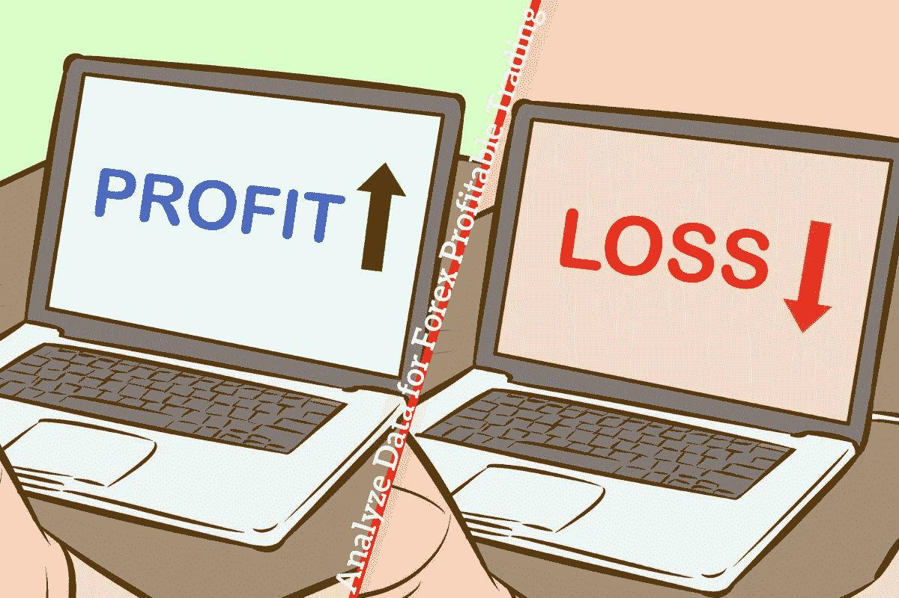

# 如何分析外汇盈利交易的数据

> 原文：<https://medium.datadriveninvestor.com/how-to-analyze-data-for-forex-profitable-trading-2103960cfde1?source=collection_archive---------12----------------------->

Analyze Data for Forex Profitable Trading

期货交易是一门艺术，能够预测货币相对于其他货币的价值变化，以及变化的方向。

好消息是基本面相对简单；美元兑日元会走弱吗？英镑兑欧元会走强吗？

 [## 机器学习的外汇交易挑战|数据驱动的投资者

### 机器学习是人工智能的一个分支，之前占据了很多头条。人们是…

www.datadriveninvestor.com](https://www.datadriveninvestor.com/2019/02/18/the-challenge-of-forex-trading-for-machine-learning/) 

另一个好消息是，普通零售商可以获得大量数据来做出决定。当然，当各种货币兑换的局面在你面前打开时，你可以选择依靠你的直觉做出决定。

虽然快速思考和快速决策在外汇交易中有一席之地，但这只是稳定和成功的长期战略的基础，如果快速决策通过长期计划建立在清晰和周到的基础上，这种战略将提供稳定的利润水平。

只有当你确切地知道要寻找什么样的数据，以及在你的分析中可用的辅助工具时，这种计划才是可能的。

数字通信时代大数据的复杂性是平滑的，因此不可能总结零售交易商在可用空间中可以使用的每一种可能的指标或分析方法。

然而，有可能的是交易者需要记住的主要数据分析板的概述，并看看几种类型的工具，可以使分析更容易和更准确。

**外汇基本面**

当交易者买卖股票时，需要的分析主要集中在相关公司的健康状况，以及各种指标是否预测股票价值可能上升或下降。

更广泛的市场条件当然会有影响，但这些条件对每只交易的股票都是一样的，这就非常强调股票的选择。

然而，与外汇交易相关的根本问题总是货币对的相对优势和劣势。

展望未来以利用价值转移意味着分析宏观经济数据，如利率、失业率和 GDP(国内生产总值)。

这些数字中有许多在经济新闻周期中得到了显著改善，这意味着交易者很容易提前看到一个国家或集团(如欧盟)何时可能宣布可能对货币波动产生影响的数字(当然，预测这种影响将是一个更复杂的问题)。

另一方面，需要更加警惕的是可能由诸如部长级新闻发布会上的评论之类的事件触发的突然变化，该事件被假定为在没有协议的情况下增加英国退出欧盟的机会，从而导致英镑价值下跌。

> 基于这种一次性事件的基本面分析需要对细节的特别关注，几分钟(甚至几秒钟)内获取新闻，并愿意立即建仓。

**技术**

技术分析不是基于货币兑换界限之外的真实世界事件，而是基于对货币价格在过去如何变动的深入分析。

通过关注价格走势图，并用各种工具(包括手动和自动工具)进行分析，交易者可以识别出过去重复出现过的模式，并预计未来会再次出现。

当然，过去的表现并不能保证未来的成功(一些陈词滥调之所以成为陈词滥调，是因为它们是真实的)，但从长远来看，主要货币的相对稳定性意味着运动模式可以相对预测。

**市场动向**

分析外汇市场的另一个方法是关注投资于某种货币的交易者数量的异常变化。

一旦大量交易者投资某种货币，未来可能选择卖出该货币的人群就扩大了，结果是该货币的潜在价值受到影响。分析市场运动可以被认为是由许多人决定的。

过去已经证明，这种智慧往往是错误的。买入或卖出一种特定货币的入侵可能是由对该货币价值走向的了解引发的，但这也可能是由自我实现的简单预测引起的——有时，如果足够多的交易者建立头寸，相当多的其他交易者认为一定有很好的理由这样做并跟随它，创造出几乎没有或根本没有外部理由的模式来养活自己。

这不是三种分析模式中哪一种最有效的问题，因为最好的结果总是通过结合所有三个要素获得的。然而，大量的可用数据，尤其是那些与技术分析相关的数据，意味着聪明的交易者会使用一些可用的工具:

**荧光笔会话**

外汇交易的主要吸引力之一是货币市场在世界的某个地方全天 24 小时开放。事实上，不同的市场在一天的不同时间开放，这意味着该市场的时段往往对交易者正在交易的货币对产生不同的影响。

交易时段突出显示工具可用于将交易者图表分成不同的交易时段，然后突出显示特定时段内发生的任何变动，如一分钟、几分钟或某个小时。

**外汇波动工具**

波动工具将向交易者显示一对货币在过去 30 天内每小时的波动幅度和波动方式。这使得交易者可以更全面地了解货币对的行为，并记录模式，如在特定的日子或一天中的特定时间的重复运动。

> 这个工具的一个更高级的版本将计算出一个典型的波动范围，并且，根据交易者给定的一段时间，将显示货币对保持在指定范围内的百分比概率。

**信号服务**

信号服务提供商以提示的形式提供即时信息，由专家或人工智能系统提供，根据分析建议在特定时间和价格进行交易。

有各种类型的[外汇信号](https://t.me/pipstowin)服务，有些基于基本面分析(即可能对市场产生影响的消息)，有些基于技术分析。

信号不应该与代表你自动交易的人工智能类型混淆——它们只提供及时的信息，由你作为交易者来解释。

进行和应用分析是每个成功交易者的主要实践。交易者进行的分析水平取决于他们对硬数字的倾向和品味，但是要记住的规则是，虽然真的没有太多的分析(只要它是用来最终建仓的)，但太少的分析概念太真实了。

所以，最后，如果你想在[外汇在线交易](https://www.topasiafx.com/)中获利，那么你必须分析一些事情，我已经强调了一些你可以应用到你的分析中的方法。如果你想让我为你报道什么话题，请告诉我。