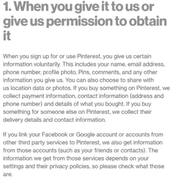
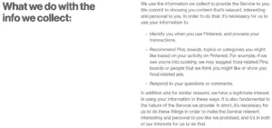

# 如何避免在网上被操纵

> 原文：<https://medium.datadriveninvestor.com/how-to-avoid-being-manipulated-online-74bf4f560672?source=collection_archive---------1----------------------->

# 网络公司在剥削你

这些天，几乎每个人都知道脸书是不道德的。马克·扎克伯格在国会作证，联邦贸易委员会最近对他的公司罚款 50 亿美元。虽然这可能是众所周知的，但还是有必要重复一下脸书和类似公司的做法。这一点尤其正确，因为脸书仍保持着令人难以置信的利润。而且，它仍然拥有 24.1 亿的月活跃用户。脸书和其他大型在线公司，如谷歌和亚马逊，正在收集和利用从用户那里收集的数据。这些数据被用来为用户提供有针对性的广告，影响他们的行为。简单来说，网络公司在操纵他们的用户。下面，我着重介绍了三种避免在网上被操纵的方法。

# 了解正在收集哪些数据

公司会跟踪您在网上和移动应用程序中进行的活动。具体来说，脸书会监控你的赞、评论、点击、滚动和其他“数字肢体语言”公司还会在你的浏览器上放置 cookies 或小文本文件，以跟踪你离开他们网站时做了什么。这些活动有助于公司了解你的兴趣，并配有“明确的标准”明确的标准是你给公司的数据。你的电子邮件地址、姓名、年龄和表达的爱好都是明确标准的例子。

 [## 人们对隐私的不理解是什么？数据驱动的投资者

### 你知道那种感觉。无论是访问应用程序、订阅还是你最喜欢的运动鞋。你按下…

www.datadriveninvestor.com](https://www.datadriveninvestor.com/2019/04/11/privacy-and-convenience/) 

公司的隐私政策规定了他们使用什么数据，他们如何使用这些数据，以及他们引入了哪些额外的数据源。以下是 Pinterest 隐私政策的截图，显示了他们收集的数据(对于整个政策，[单击此处](https://policy.pinterest.com/en/privacy-policy)):

经过一波又一波的国会听证会后，隐私政策变得越来越简单易懂。我建议你花时间阅读它们，这样你就知道你把什么信息交到了网络公司的手中。

# 了解您的数据如何被使用

如何使用您的数据甚至比捕获什么数据更重要。你的数据被卖给其他公司了吗？其他公司在用你的数据做什么？您的数据驻留在公司服务器上时是否受到保护？因为我们无法回答这些问题，我们的数据被用来影响选举。撇开对民主的威胁不谈，让我们知道我们的数据的用途是至关重要的。我再次鼓励你阅读隐私政策。使用与上述相同的 Pinterest 隐私政策，您可以找到关于 Pinterest 如何处理其收集的数据的详细信息:

通过做一些尽职调查，你可以做出一个明智的决定，即你是否对你的数据被使用的方式感到满意。

# 抵制不道德的公司

在你了解了哪些数据被捕获以及如何处理这些数据之后，你就可以决定你应该抵制哪些公司。你会注意到我没有脸书账户。几年前，我开始对使用脸书对人们产生的负面影响感到不安。他们对用户的情绪进行了实验。此外，我开始了解他们在用我的数据做什么。我认为该公司是不道德的，因此停止使用其服务。我不是建议你也这样做。然而，我强调发现这些公司如何利用你的数据赚钱的重要性。不知情的人很容易被操纵。请不要让自己容易受到剥削。

# 避免被操纵

在线公司是推销免费服务的有效营销者。像“连接世界”和“不要作恶”这样伟大的口号掩盖了这些公司的服务实际上并不是免费的这一事实。我们的数据被获取、出售并用于影响我们的购买决策。如果我们知道这些做法，并且对此感到满意，那么只有到那时，我们才应该使用这些公司的服务。当我们看到如此相关的广告以至于我们被吓到时，我们应该知道我们的数据被有效地利用了。知识是剥削的解药。通过保持最新的在线公司数据实践，我们可以避免被操纵。

最初发布于 https://bunkerbasics.com/avoid-being-manipulated/[的](https://bunkerbasics.com/avoid-being-manipulated/)