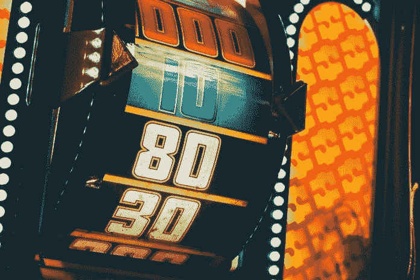

# 如何避免失去|数据驱动的投资者

> 原文：<https://medium.datadriveninvestor.com/how-to-avoid-losing-data-driven-investor-e06e8bcc1147?source=collection_archive---------5----------------------->

今天是你的幸运日！你遇到了一个善良的陌生人，他给你很多选择，而且是免费的。没有诡计，真的:你得到了一顿免费的午餐。

她给你 45 美元。然后，她问你是否想留着那笔钱，或者给她一枚 T2 硬币，如果是正面，她会给你 100 美元，如果是反面，你什么也得不到。

你选择哪个？你是想要口袋里装着 45 美元的现金，还是愿意冒险掷硬币？在进一步阅读之前决定。

当我在我的商业演讲中向听众介绍这种情况时，大约 80%的人说他们会接受这位好心的陌生人的 45 美元。当我第一次了解到这种情况时，我做了这样的选择，大多数有类似选择的人也是如此。

毕竟，45 美元是板上钉钉的事。如果我为了一个得到 100 美元的机会而冒险失去了一切，我会不会觉得自己很愚蠢？我的本能反应是避免失败。毕竟，谁想成为一个失败者，对不对？

好吧，我们来算一下数字。得到正面的机会是 50 %,所以在一半的情况下你会赢得 100 美元，而在其余的情况下，你不会赢得任何东西。这相当于平均 50 美元对 45 美元。

 [## 算法交易的机器学习|数据驱动的投资者

### 当你的一个朋友在脸书上传你的新海滩照，平台建议给你的脸加上标签，这是…

www.datadriveninvestor.com](https://www.datadriveninvestor.com/2019/01/30/machine-learning-for-stock-market-investing/) 

想象你把一枚硬币抛 10 次，100 次，1000 次，10000 次，然后 100000 次。在 100，000 的情况下，如果你每次选择 100 美元的硬币，平均你会得到 500 万美元，而如果你每次选择 45 美元，你会得到 450 万美元。区别在于:整整 50 万美元。

因此，不幸的是，选择 45 美元作为我的礼物实际上会导致失败。正确的选择——最不可能让我成为失败者的选择——是选择抛硬币作为礼物。否则，经过多次抛硬币，你肯定会输。

但是，等等，你可能会想:我提出这是一次性交易，而不是重复的机会。也许如果我告诉你这是一个重复的场景，你会有不同的想法。

问题来了。[研究显示](https://link.springer.com/article/10.1007%2FBF00122574)我们的直觉把我们看到的每一个单独的场景都视为一次性的。事实上，我们每天都面临大量这样的选择。我们的直觉是把每一个都当作一个单独的情况。然而，这些选择形成了一个更广泛的重复模式的一部分，在这个模式中，我们的直觉倾向于引导我们赔钱。

这种本能反应被称为[损失厌恶](https://academic.oup.com/qje/article-abstract/106/4/1039/1873382)，这是由我们大脑的连接方式导致的许多危险的判断错误之一，认知神经科学和行为经济学的学者称之为认知偏差。我们不仅在工作中犯这些错误，在其他生活领域也是如此，例如在我们的购物选择中，正如购物比较网站所揭示的那样。

幸运的是，这些领域的最新研究表明，无论是在你的职业生活、人际关系还是其他生活领域，你都可以[使用务实的策略来解决](https://disasteravoidanceexperts.com/wise-decision-maker-movement-manifesto/)这些危险的判断错误。

你[需要评估](https://disasteravoidanceexperts.com/how-to-evaluate-unconscious-bias-caused-by-cognitive-biases-at-work/)认知偏见在哪些地方伤害了你以及你的团队和组织中的其他人。然后，你可以使用结构化决策方法[快速做出“足够好”的日常决策](https://disasteravoidanceexperts.com/how-to-make-decisions-quickly/)；对于中等重要的选择，更彻底的选择；和一个针对真正重大决策的深入研究。

这些技巧也将帮助你很好地实施你的决定，并制定真正有效的长期战略计划。此外，你可以[培养心理习惯和技能](https://disasteravoidanceexperts.com/12-mental-skills-to-defeat-cognitive-biases/)来注意认知偏差，防止自己陷入其中。

你的职业生涯——任何人的职业生涯——都是由 10 万次抛硬币组成的。陌生人的礼物代表了我们生活中面临的一系列机会，我们可以赢得 500 万美元或 450 万美元，这取决于我们对每一个机会做出的选择。

这同样适用于组织层面。假设您的公司年收入为 5000 万美元，利润为 750 万美元。不管你做了什么选择，如果你组织中的其他员工凭直觉避免损失，公司每年损失 10%的收入或 500 万美元，那么你三分之二的利润将化为乌有，只剩下 250 万美元。

每天，你都会面临一系列的情况，你需要决定是选择通过避免损失而感觉最舒服的课程，还是选择感觉不太舒服并随着时间的推移而导致更多收益的课程。我们不是在谈论巨大的赌公司风险——这需要一种不同的方法——而是那种小的决定，随着时间的推移会积累成一大笔钱。如果你只是跟着感觉走，而不是做计算和跟着数据走，你可能会因为不选择感觉风险最大的课程而损失更多的钱。

为了防止你的直觉把你引入歧途，采取一种让数据引导你的策略，而不是依赖你的直觉。对于你面临的每个决定，把它想象成一个重复的模式，而不是一次性的决定:计算数字，考虑不确定性的作用，采取最有可能带来最大利润的行动。

将每一个选择视为更广泛模式的一部分可能会感觉违背直觉、不舒服和不安全。然而，对你的底线来说，感觉最安全的避免损失的方法实际上要危险得多

*原载于 2019 年 12 月 25 日*[*【https://www.datadriveninvestor.com*](https://www.datadriveninvestor.com/2019/12/15/how-to-avoid-losing/)*。*