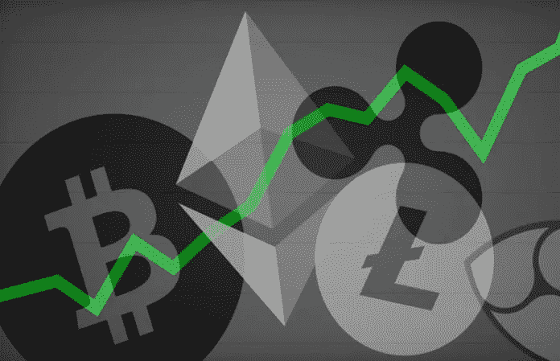
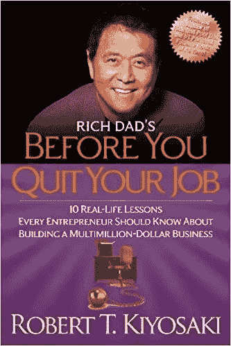
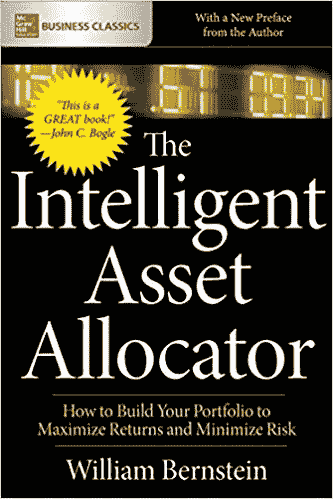

# 比特币和加密货币交易如何避免亏损

> 原文：<https://medium.datadriveninvestor.com/how-to-avoid-losing-money-trading-with-bitcoin-and-cryptos-77bf75aef4ae?source=collection_archive---------2----------------------->

## 每一个变得富有的秘密投资者，就有数百人失去他们的资本。大多数常见的交易错误可以通过遵循一些简单的规则来避免。

几个月前，我遇到了一个对加密货币非常感兴趣的人。那时，我对秘密投资还不太了解。我是一名交易员，但我只交易我非常了解的资产。

这家伙很久以前就开始交易了，他似乎对市场有广泛的了解。于是，我问他是不是 2017 年底交易比特币发了大财的幸运儿之一。

他的回答让我困惑。他表示，当他出售比特币时，他实际上赚了大约一万美元，但这是 2017 年 9 月初。2017 年 12 月底，他有一些朋友最终变得富有，因为他们不断投资 Cryptos，并在顶部出售它们。

所以，与他的朋友们赚的几百万美元相比，他的一万美元是微不足道的。我能感觉到他内心的挫败感。关注我们所没有的，而不是我们所拥有的，这是我们人类的天性。

更糟糕的是，他一直在 cryptos 上投资，试图达到和他朋友一样的结果。但是已经太晚了。我们知道这个故事。2018 年 1 月，加密熊市开始。在他看来，比特币和以太坊是安全的资产。)而且它们会再次上涨，所以他在市场下跌时继续积累头寸。

交易者的首要原则之一是止损，让利润跑。他显然不知道。结果是，他把最初获得的回报还给了市场。但他对前景持积极态度，并保住了自己的位置。这件事发生在 2018 年 3 月底。我想知道他的投资组合现在是什么样子…

这个故事教会了我很多。

首先，人们对成为百万富翁有一种紧迫感。富人有钱是因为他们不断努力走向成功。他们有计划，不会根据情绪做决定。他们一贯努力而聪明。例如，成功的运动员不会突然出现。他们年复一年地致力于他们的工艺，以达到目前的水平。在[《原子习惯的力量》](https://www.amazon.co.uk/gp/product/1847941834/ref=as_li_tl?ie=UTF8&camp=1634&creative=6738&creativeASIN=1847941834&linkCode=as2&tag=emils0001-21&linkId=cf6bd76cb5241a6851901b9cf81cc738)一书中，James Clear 断言，如果一个人能够抑制负面想法并专注于长期目标，欲望、信念和坚持可以推动他走向成功。

[Link to buy the book an Amazon](https://www.amazon.co.uk/gp/product/1847941834/ref=as_li_tl?ie=UTF8&camp=1634&creative=6738&creativeASIN=1847941834&linkCode=as2&tag=emils0001-21&linkId=cf6bd76cb5241a6851901b9cf81cc738)

如果你愿意坚持数年，起初看起来很小很不重要的变化会合成显著的结果。当我在电视上看到埃隆·马斯克时，我看到的是一个对自己的工作充满激情和热情的人。他努力工作([他们说每周 120 小时](https://www.cnbc.com/2018/08/22/what-working-120-hours-a-week-like-teslas-elon-musk-does-to-the-body.html))并且取得了成绩。这在头脑中创造了一种积极的能量状态。在这种情况下，负面情绪没有力量出现。

**富有是一种心态，而不是一种条件。我读过的最好的书之一是罗伯特·清崎的《辞职前的 T4》。**

[Link to buy the book on Amazon](https://www.amazon.co.uk/gp/product/161268050X/ref=as_li_tl?ie=UTF8&camp=1634&creative=6738&creativeASIN=161268050X&linkCode=as2&tag=emils0001-21&linkId=11f400a2d373989ef502240044bd9c69)

这本书谈到了接受金融教育的重要性。不幸的是，这是学校里不教的事情之一。资金管理应该是和文学或数学一样的科目。清崎先生说，富人有能力积累金钱，穷人有能力挥霍金钱。如果你给一个没有正确投资心态的人 100 万美元，他可能会把所有的钱都花在不能产生额外收入的东西上，并在短时间内失去它。

对于**减轻风险**至关重要。我和许多投资者讨论过密码。他们中的大多数人在密码市场上还没有任何职位。虽然 [*基于 ICO 的风投正在兴起*](https://medium.com/@emilianopolitano/the-status-of-funding-in-the-blockchain-industry-90fa0136771f) *，*投资者仍持怀疑态度，因为这仍是一个高度不受监管的世界。他们中的一些人将一小部分资本投资于加密。他们通常投资于公司的股权，而不是购买不能保证公司会交付他们承诺的产品的代币。它们都通过分散投资组合来降低风险。如果你想投资成功，你需要有策略和管理风险。这是纪凡·伯恩斯坦的《智能资产配置器:如何构建你的投资组合以最大化回报和最小化风险》一书中所推荐的。

[Link to buy the book on Amazon](https://www.amazon.co.uk/gp/product/1260026647/ref=as_li_tl?ie=UTF8&camp=1634&creative=6738&creativeASIN=1260026647&linkCode=as2&tag=emils0001-21&linkId=a10b74b95c4f957abc080c37b30c3326)

我们应该始终评估与我们做出的每个决定相关的风险。当我们做出投资决定时，我们应该考虑最坏的情况。如果最坏的情况发生，我们无论如何都应该可以在晚上睡个好觉。如果我们认为失去 30%(或更多)的资本是不可持续的，那么我们就不应该进行投资。

有时我想知道我的朋友是否能够在为时已晚之前阻止火车失事。有了正确的教育和工具，他就能制定交易计划。没有计划很难在这个世界上生存，因为一切都取决于情绪和反应交易。