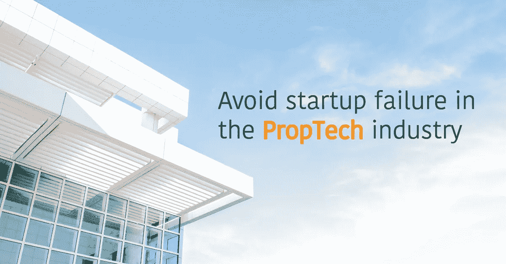

# 避免 PropTech 的创业失败——第二部分:加速、压力、事件、影响者、网络和上市

> 原文：<https://medium.datadriveninvestor.com/how-to-avoid-startup-failure-in-the-proptech-industry-9b38d4f0be5b?source=collection_archive---------11----------------------->

这是关于在 PropTech 行业避免失败的第二篇文章。如果你读了第一篇，直接跳到下一章“找到合适的加速器”，如果你想读第一篇文章[，这里有一个链接给你](https://medium.com/advisay/how-to-avoid-startup-failure-in-the-proptech-industry-c4bc607d4eb2)！

以下是订阅邮件列表的链接:

**这些文章**的目的是针对今年早些时候 [CBinsights](https://www.cbinsights.com/research/startup-failure-reasons-top/) 确定的创业失败的 20 个原因提出解决方案。事实上，超过 70%的创业公司会在生命的前 20 个月死去；根据《福布斯》的统计，硬件公司的这一比例高达 97%。现在我们知道了原因，让我们看看如何在 PropTech 和 ConTech 行业中克服它们。

这一系列文章将根据我作为欧洲房地产行业 PropTech 企业家的个人经历，介绍和描述不同的解决方案。非常感谢所有有益于 PropTech 创业社区并为读者增加价值的评论和替代解决方案。如果有很多有见地的评论，我会写另一篇文章，将所有众包的经验合并在一篇论文中，并像这篇文章一样与社区分享。

由于这个主题非常吸引我，我将在两到三篇文章以及未来的更新中讨论这个主题。别忘了订阅邮件列表！

如果你有具体的问题，你可以在 LinkedIn 上[联系我。](https://www.linkedin.com/in/jonas-canton-54407187/)

## **找到合适的加速器**

加速器将推动您的业务增长。在我个人看来，网络是加速器所能提供的最大价值。仔细分析导师网络和加速器的核心团队。他们的资料包括潜在客户、初创企业高管、行业专家、风险资本家和其他潜在投资者。就像对孵化器和投资者一样，确定你是否能认出一些有影响力的人。如果他们站在你这边，你的公司的曝光率会大大提高。另一个关键因素是确定加速器的赞助商，并确定是否与投资者的以前客户没有摩擦。这确实能为你关上几扇门！

在最初的几周，这些导师会为你提供宝贵的建议、市场见解和推荐，以加速你的业务发展。这些见解将帮助你进一步改善你的商业模式。在这期间，花时间和尽可能多的人联系。在讨论你的业务时，试着收集尽可能多的数据来改进你的定价模式。如前所述，拥有一个以市场洞察为基础的完善的定价策略对于最大化您未来的收入至关重要。基于这些见解，你将能够改进和证明你的财务模型，并因此被投资者视为更可靠。关于这个主题的更多信息，请参考投资者章节。

有些加速器还会为你提供律师服务的学分。这些信用对于建立合同和在筹款过程中为你提供法律建议非常有用。

通常在第一加速阶段结束时组织一次解调。这一天，你将有机会在一屋子的潜在投资者面前推销你的想法。

在筹集资金、拓宽你的客户网络，甚至寻找与其他创业公司的协同效应方面，加速通常非常有效。像孵化器一样，事先做自己的市场调查，以确定所提供服务的质量。以下是一些 PropTech 加速器:

*   [融合](https://www.fusion.xyz/)
*   [Proptechlab](http://proptechlab.be/)
*   [Proptechrussia](https://en.proptechrussia.com/)
*   [高力国际](http://proptech.colliers.com)
*   [Startupbootcamp](https://www.startupbootcamp.org/accelerator/smart-city-iot-amsterdam/)
*   [调整](http://adaptproptech.com/)

## **按下&媒体**

出现在媒体上，为你的品牌创造动力。尽可能把注意力集中在针对客户的媒体上。在与媒体接触时，要时刻牢记这句话:“*让记者的工作尽可能轻松！*”。这意味着，准备一个**新闻包**，放在你的网站上，或者至少放在一个易于分享的文件夹中。如果你搜索，你可以找到很多关于新闻资料袋应该包括什么的文章。好的，我会帮上忙的……这是来自[福布斯](https://www.forbes.com/sites/forbescommunicationscouncil/2018/02/26/why-a-good-press-kit-is-essential-and-how-to-make-one/#34e157d67782)的一张照片。

另一个策略是写博客，比如在媒体上，或者在 Quora 上回答问题。对写博客有什么看法和建议吗？写作的时候，一定要确保给你的观众带来价值。这样，你的品牌以及你的产品和服务将会被你的观众正面地感知。下面是一些房地产媒体。

*   [Propmodo](https://propmodo.com/)
*   [PropTech 播客](https://www.youtube.com/redirect?q=https%3A%2F%2Fitunes.apple.com%2Fie%2Fpodcast%2Fproptech-podcast%2F&event=video_description&redir_token=g_D0v97tGQgTKdFEy9qTO8xnBMV8MTUzODE1Nzg5N0AxNTM4MDcxNDk3&v=Xwuccn7wrkE)
*   [Spanishproptech](http://www.spanishproptech.es/)
*   [Proptech.es](http://proptech.es/)
*   [Immo2.pro](https://immo2.pro/)
*   [Gewerbe-样方](https://www.gewerbe-quadrat.de/)
*   [今日建立](https://www.estateagenttoday.co.uk/)

## **参加行业活动**

对于早期创业公司来说，参加行业活动可能非常昂贵。我的建议是根据你想要达到的目标仔细选择你的活动。

要选择一项活动，请检查他们的出席率以及返回/预期出席者和返回赞助商的数量。请记住，大型活动也会降低围绕你的品牌制造轰动效应的可能性。总是试着提前与几位资深企业家接触，交流你计划参加的所有活动。确保你在买票之前得到他们的反馈。此外，列出所有参加活动的潜在客户，并提前联系他们以确保会面。在参加活动之前，定义您将在活动期间用来衡量 ROI 的指标和信息。

您可能有兴趣跟踪以下定性和定量信息:

*   收集关于目标受众的数据，以验证和改进您的细分市场
*   在 B2B 领域，与您的销售线索一起定义他们预期的未来增长和创新计划，以及他们路线图的时间安排，以便以后在合适的时间与他们接洽。
*   测试新的定价模式和特别优惠
*   定义产生的总销售线索数量(客户和/或投资者)
*   产生的新销售线索数量
*   将您的销售线索整合到您的 CRM 中(Pipedriveis 是我们使用的工具，我们对此非常满意。这里有一个推广代码:PDP-advisoay 和[附属链接](https://app.pipedrive.com/affiliate/pdp-advisay?utm_content=Advisay&utm_medium=copy_text&utm_source=partners_program)，如果你喜欢这篇文章，想支持我的工作，就用它吧)。
*   随后，定义可行性，评估收集的潜在客户的终身价值，并将其与您对该活动的投资进行比较。
*   想加点什么吗？

您可能有兴趣参加的活动:

*   [未来:proptech](https://futureproptech.co.uk/)
*   【2018 年真实世博会
*   [MIPIM PropTech](https://www.mipim-proptech.com/)
*   [道具技术 360](http://prop-tech360.com/)
*   [Propteq](https://propteqclub.com/)

## **特定行业协会**:

## **行业影响者**

有一个有影响力的人站在你这边对最大化你的品牌曝光度是非常好的。引起他们注意的一个方法是在活动前与他们接触，并当场与他们见面。其他的可能性是通过孵化器和加速器。回到这些章节获取更多信息。[这里有一个链接](https://medium.com/advisay/how-to-avoid-startup-failure-in-the-proptech-industry-c4bc607d4eb2)。以下是 PropTech 行业中一些著名的有影响力的人。这是一个不完整的列表:

*   [伦块](https://twitter.com/MetaPropNYC)
*   [亚历克斯·艾德斯](https://twitter.com/alexedds_?ref_src=twsrc%5Egoogle%7Ctwcamp%5Eserp%7Ctwgr%5Eauthor)
*   [安东尼沉睡](https://www.antonyslumbers.com/)
*   巴托什·多布罗沃斯基
*   [布伦丹·华莱士](https://medium.com/@brendanfwallace)
*   卡罗尔·塔隆
*   [夏洛特鸠麦卡锡](https://www.linkedin.com/in/charlotte-dove-mccarthy/)
*   丹·休斯
*   [龙公爵](http://dukelong.com/)
*   埃迪·霍尔姆
*   艾米莉·赖特
*   佛朗哥·法劳多
*   伊德里斯·古森斯
*   詹姆斯·迪尔斯利
*   约纳斯·哈伯科恩
*   朱莉娅·阿尔特
*   [卢卡斯·基拉尔](https://www.linkedin.com/in/lukaskiral/)
*   迈克·德尔普雷特
*   妮可·布伦内尔
*   [妮可·布伦内尔播客](https://www.youtube.com/redirect?q=https%3A%2F%2Fitunes.apple.com%2Fie%2Fpodcast%2Fnicole-bremner%2F&event=video_description&redir_token=g_D0v97tGQgTKdFEy9qTO8xnBMV8MTUzODE1Nzg5N0AxNTM4MDcxNDk3&v=Xwuccn7wrkE)
*   [沃特·特鲁菲诺](http://www.hollandproptech.nl/author/wouter/)

## **本地网络**

在大多数欧洲国家，都有促进科技创业的全国性举措。通常，在这种网络的顶端，你会发现当地的 PropTech 和 ConTech 的影响者。这些组织有助于与其他当地企业家建立联系，他们会为你的创业提供一些好的建议。许多这样的网络组织他们自己的 PropTech 活动。以下是一个不完整的列表:

*   [Proptechdach](https://www.proptechdach.de/en/home/) (德国、奥地利和瑞士)
*   [Gpti](http://gpti.de/) (德国)
*   [Apti](https://www.apti.at/) (奥)
*   瑞士科技(瑞士)
*   英国 Proptech 协会(英国)
*   Contechproptech (荷兰)
*   [Proptechbaltic](http://proptechbaltic.com/) (立陶宛、拉脱维亚和爱沙尼亚)
*   [Proptechrussia](https://en.proptechrussia.com/) (俄罗斯)
*   亚洲道具(亚洲)
*   [Frenchproptech](https://www.frenchproptech.fr/) (法国)
*   波兰石油技术公司(波兰)
*   [加拿大石油技术公司](https://proptechcanada.ca/)(加拿大)

## **列出你的创业公司**

将你的创业加入列表是获得曝光率的最简单的方法之一。列表分为两类:一般列表和基于行业的列表。

第一种通常会问你一些关于你公司的数据。帐户很容易设置，但由于大量的公司竞争和大量的流量，您的品牌可能很少曝光。然而，出现在通用列表上是向新客户群宣传你的公司的好方法。当你将产品扩展到新的市场和行业时，这一点尤为重要。此外，让你的品牌在一般的上市中闪耀也会增加你公司的可信度。投资者和媒体喜欢听到新的颠覆性技术。最后，有些平台还会给你提供一些招聘服务。一般列表如下:

*   **[**AngelList**](https://angel.co/)[**启动跟踪器**](https://startuptracker.io/)**
*   **[**product hunt**](https://www.producthunt.com/):**这个平台可以用来宣传新产品或者新功能。这是一篇非常好的文章，集中了大量关于如何将你的品牌推到产品搜索列表顶端的信息。****

****基于行业的列表会询问您有关贵公司的更多详细信息。尽管如此，这一次是值得的！事实上，您提供给列表的所有数据将用于向在 PropTech 和房地产领域寻求创新的精选目标受众展示您的品牌。数据质量将影响你吸引的客户数量。此外，你的个人资料将作为一个被动的客户筛选。使用漂亮的产品图片并润色你的文字，以获得最能描述你的解决方案的所有必要关键词。如果你不想错过任何信息，请看一下新闻章节的新闻资料袋部分(参见新闻和媒体→链接)。对于 PropTech 行业，下面描述的两个平台是在 2018 年创建的。他们提供不同的服务。****

*   ****[**prop tech Finder**](http://www.proptechfinder.com/)prop tech Finder 的创始人是[丹·休斯](https://www.linkedin.com/in/danchughes/)，[液体房地产创新](https://www.liquidrei.com/)和[阿尔法地产洞察](https://www.alphapropinsight.com/)的首席执行官。他是 PropTech 世界最著名的影响者之一。PropTech Finder 的目的是成为 PropTech 创业公司的集中平台。因此，企业家被邀请为他们的创业公司创建一个简介。2018 年 10 月，平台上有 150 家公司。然后，房地产公司和其他客户会被邀请使用高级搜索栏进行浏览，以找到符合他们需求的产品。销售硬件的实体初创公司的一些很酷的特点是产品的可用性和提货地点。最后，您的个人资料可以与您的日历相链接，以方便潜在客户预约。****
*   ****[**Proptech 榜单**](https://www.proptechlist.com/)
    这个平台是 Proptech 创业公司、风险投资和房地产公司之间的媒人。这种匹配服务基于不同的标准，如产品和服务、本地化、企业需求等。一旦公司的简介被编辑，将与整个生态系统进行匹配。2018 年 10 月，Proptech 名单上共有 2000+家企业。作为一家初创企业，根据你的需求，你将被匹配到寻找你的产品和服务的投资者和/或房地产公司。Proptech List 可以成为寻找潜在客户和投资者的直接工具。****

****作为一名企业家，创建自己的公司是一项艰巨的任务，通往成功的道路可能充满幻灭。我真诚地希望这些文章能帮助你在 PropTech 行业获得你应得的成功！****

****如果你喜欢这篇文章，并想在这个主题上有更多的内容，给我一些掌声，不要忘记分享它 *❤* ！****

****如果您有与 PropTech 相关的具体问题或主题，请留下评论，我将尽我所能在接下来的文章中涉及到它。****

****如前所述，我很感激任何关于这次阅读的反馈。再一次，这篇文章是基于我的个人经历。很可能你的公司或你喜欢合作的企业没有被提及，只要在评论区给我写点什么，它就会出现在更新的版本中。****

****恭喜你！你坚持到最后，寻找更多的见解？订阅，以便在新的 PropTech 文章发布时获得通知:****

****伴郎们！****

****乔纳斯****