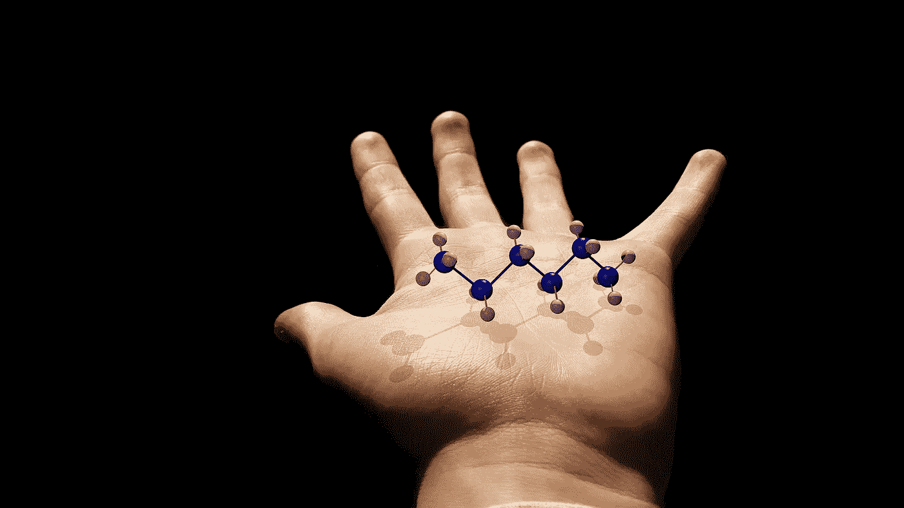
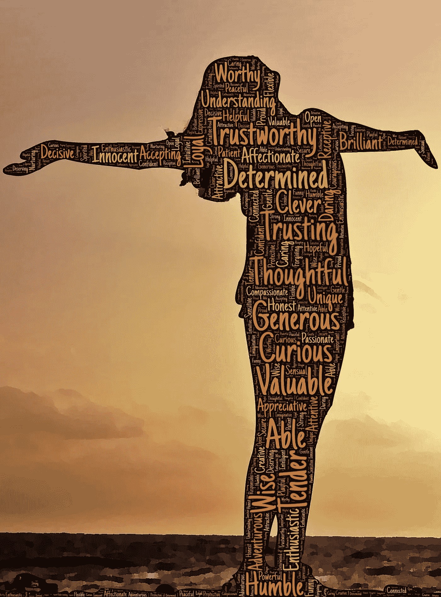

# 如何通过了解社会化学成为一名伟大的领导者

> 原文：<https://medium.datadriveninvestor.com/how-to-be-a-great-leader-by-understanding-social-chemistry-a09515d1b088?source=collection_archive---------21----------------------->

We are biologically wired to look out for the people we care about

商业领袖们越来越渴望知道为什么像史蒂夫·乔布斯、米歇尔·奥巴马、比尔·盖茨、贾辛达·阿登、沃伦·巴菲特和奥普拉这样的人如此成功并受人尊敬。我们想知道是什么给了他们优势去经营如此繁荣的公司和有意义的生活。

但是，如果答案不是你所期望的呢？如果伟大的领导者不是最聪明、最足智多谋、最有进取心或最有影响力的，那会怎样？

## ***西蒙·西内克摆出一个回答***

1.  伟大的领导者不只是 ***放权，他们*** ***效仿*** 。
2.  伟大的领导者不一定是经理、董事甚至首席执行官。伟大的领导者通过 ***保护他们所治理的其他人的福利来承担所有权和责任。***
3.  领导不是等级。 ***领导就是决策。***

这是一个全新的视角，展示了伟大的领导者如何首先照顾他人的福祉，以及这一行动如何在整个公司产生积极的连锁反应——导致员工更积极参与，更诚实的反馈，工作中的安全感，最重要的是，注重福祉的积极的公司文化。

我们看到，伟大的领导人是那些坚定不移地为人民谋福利的人。此外，作为一个受欢迎的副作用，幸福感是在多个层面上推动组织成长的最可靠因素。

# 伟大的领导者会做出关键的决定

西蒙·西内克在他的畅销书《领导者最后吃饭》中调查了这个问题。他着眼于为什么美国军队如此善于持续培养出出色的领导人来完成任务并保护人民的安全。

在一个关于军事飞行员约翰尼·布拉沃(Johnny Bravo)的故事中，Sinek 谈到了伟大的领导者如何首先拥有伟大的直觉，其次才是伟大的专业知识。

> 迈克·德鲁里开着他的 A10 疣猪在云层上盘旋，他的僚机就在他旁边飞行。他觉得地面部队有些不对劲，他可以从他们通过无线电发出的声音中听出来。然后，他收到了一个传输，“部队接触。”这很糟糕。这是一个全面枪战已经爆发，士兵们陷入困境的代码。德鲁里没有被告知去拯救军队，然而，他不能只是坐在那里什么也不做。
> 
> 在 2002 年，飞机没有像今天这样先进的技术。德鲁里正飞向云层覆盖的底部，飞向未知的领域。一旦他冲破云层，他意识到他离地面和邻近的山脉已经很近了。一个明智的飞行员会将飞机拉起，重新计算一个更安全的计划，但当他的朋友处于危险中时，Drowley 不会浪费一秒钟。
> 
> 他集中他的感官，手动控制飞机，精确定位在漆黑的夜晚闪耀的敌人炮火的方向。“请让这个工作”他大声地说，并向敌人开火，一边数着，一边把弹道弹药扔过他们，“一千，两千，三千，四千，五千。”他数了数，因为天太黑了，在黑夜中他看不清地面，这有助于他估计何时拉起飞机以避免撞到山上。
> 
> *“打得好”，一个地面部队通过无线电喊道，“让他们继续前进。”但是，Drowly 没有弹药了。他必须尽快想出办法。他把飞机拉回到他的僚机盘旋的云层中，并迅速向他汇报了情况。两名飞行员一起飞了回来，他们的翅膀只分开了三英尺，Drowley 带领他的僚机直奔敌人的火力，在黑暗中数着，祈祷不要撞到山上。*

二十二名地面士兵当晚回家，**无一伤亡**。但是，如果 Drowley 是一个更明智的飞行员，并决定花时间计划一个“更安全”的行动路线，那么对于那些地面上的士兵来说，这个故事可能会有一个非常不同的结局

# 伟大领袖的社会化学

人类已经在群体生存模式中进化了超过 250 万年。社会凝聚力对于生存、安全和繁衍极其重要。身体使用被称为激素的化学信号来保持我们一起工作，并能够对变化的情况做出反应。荷尔蒙向你的器官和组织发送信号，以调节你的生理和行为，使之与你的内外环境相一致。

这里有 5 种影响我们行为、情绪、快乐、幸福和健康的主要荷尔蒙。

## **内啡肽**

这种激素是用来掩盖身体疼痛的。从技术角度来说，这就是人类是最“持久”的动物的原因。人类比马更能忍耐——事实上，人类学家已经发现人类会追捕一匹马，直到它筋疲力尽而无法继续，要么放弃，要么虚脱而死。

当我们在身体上推动我们的身体时，我们感觉很棒。当健美运动员在健身房锻炼时，他们会感觉到大脑中内啡肽的快乐，因为肌肉撕裂，血液涌向身体的特定部位。‘奔跑者的高’也是如此。当耐力跑者进行大约一个小时的跑步时，他们进入了一个“进入状态”的时期，他们不再感觉到身体上的压力，他们感觉到的只是快乐。但我们都知道，一段时间后，一旦他们放松下来，他们的身体就会陷入痛苦之中，因为他们的生理过程正在争先恐后地修复在跑步过程中拉伤的肌肉和组织。

## **多巴胺**

当我们做了我们说过要做的事情时，这是一种成就感。这是维持我们动力的化学物质，更重要的是，维持我们的生物学焦点。人类是视觉动物，我们的心灵是围绕视觉和视觉想象构建的。这就是为什么我们需要写下我们的目标，这样我们就可以记住它们，然后想象出为了实现目标我们需要做的事情。

要记住的是，多巴胺是高度上瘾的:酒精、赌博、尼古丁和手机通知，都会触发多巴胺在我们的大脑中释放。所以，小心生活中那些让你获得多巴胺的消极事物。

## **血清素**

这就是社群感，同情心，归属感。

它让人们感到安全和被照顾。血清素是 ***领导化学*** 。它负责骄傲、认可、地位和成就感。当你的血管中有血清素时，你的信心会上升——这是最好的事情；当你的血清素激增时，你在房间里的亲人也会触发他们血管中血清素的释放。这种化学物质强化了我们的关系和韧性，让我们在为目标奋斗时感到安全和支持。这是群体生活和群体合作最重要的荷尔蒙。

## **催产素**

这是我们与家人和朋友交换的爱和信任的感觉。当有人支持你时，你会有一种强烈的安全感。关于商业，它并不总是理性的，它关乎关系和安全感。人际关系很重要。

> **这样想:**你和第三方坐下来，经过长时间的谈判，你最终达成了一项协议，双方都对条款感到满意。现在，想象一下，你从会议上站起来，伸出手去握手，而另一个人拒绝了，并说，“不需要握手，我会在文件上签字，一周后给你。”

感觉不太对吧？你会开始质疑那笔交易，你要么取消交易，要么带着保留和不信任的情绪进入交易。

握手“敲定了交易”,象征着你对对方的信任和善意。它说你们彼此之间有一种纽带，你们将照顾和培育这种纽带——所有这些信息都通过催产素在瞬间进行生物传递。

当你慷慨解囊时，你会得到催产素。这不算你给钱的时候；催产素没有那么有效。当你付出时间时，你会得到更多的催产素。事实证明，即使是目睹人类的慷慨行为也会让我们产生催产素。它还能增强我们的免疫系统，减少我们上瘾的倾向。

领导给我们的是他们的时间和精力，而不是他们的金钱。

> “领导的代价是利己主义——当你的职位越高，你做的工作就越少，你必须做得更多……你必须冒着风险去照顾他人，这就是人类学对领导的定义。”
> 
> –**西蒙·西内克**

## **皮质醇**

压力和焦虑的感觉。我们与所有群居动物分享这种化学物质。皮质醇让我们保持活力——当我们注意到其他人对危险有所警觉时，我们就会变得警觉。当我们沉浸在皮质醇中时，我们的身体会进入极端的生存模式。它通过利用我们基本的能量储备来为我们的战斗或逃跑行动做准备。为了做到这一点，我们的身体关闭了所有非必要的功能，将我们的能量集中到必要的生物过程中，以保持我们的生存和安全。所以，像生长和你的免疫系统是第一个被关闭的。皮质醇可以拯救你的生命，当它全部击中风扇时，警告你不要让它在你的系统中长时间存在。如果你这样做，它会真正地把你的健康置于危险之中，慢慢地杀死你。

# 卓越的领导力是一种稀缺资源

领导力之所以如此重要，是因为你不可能领导所有人。你们只有一个人，只能照顾好有限的一群人。

> “领导不是等级。
> 
> 领导不是一个职位。
> 
> 领导是一个决定——领导是一个选择。
> 
> 如果你决定照顾你左边和右边的人，你就决定成为一个领导者。"
> 
> — **西蒙·西内克**

领导力在盾中，而不是矛中。这是你保护和培养他人的意愿，而不是你征服和胜利的决心。

Join our group of growth-minded leaders

## 加入数百名有成长意识的女性

如果你正在努力实现你的目标:*个人职业*和*财务*，我们希望听到你的意见。

[点击这里](https://www.facebook.com/groups/trwprivategroup/)加入我们的脸书团队。

点击这里注册[，将这些博客和更多内容直接发送到您的收件箱。](http://eepurl.com/dADOiv)