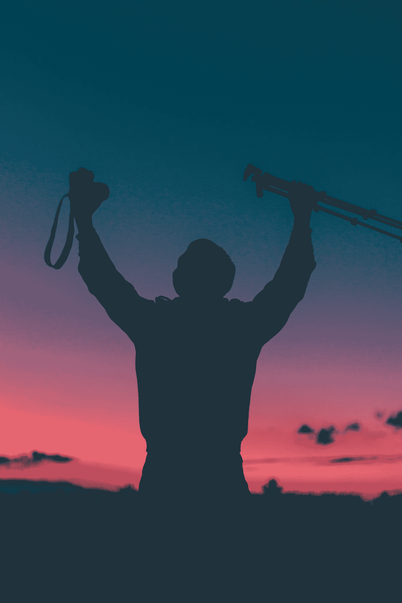

# 如何成为一个不完美的完美主义者

> 原文：<https://medium.datadriveninvestor.com/how-to-be-a-non-perfect-perfectionist-4f226ac9c15f?source=collection_archive---------10----------------------->

## 作为一名运动员、企业家或父母(或任何你想成为的人)…

Photo by [Diego PH](https://unsplash.com/@jdiegoph?utm_source=medium&utm_medium=referral) on [Unsplash](https://unsplash.com?utm_source=medium&utm_medium=referral)

> “精通永远不会到来。它是流动的，不是固定的。并且总是关于持续的旅程…你的生活和实践必须获得深度，以便扩展和超越它自己。新的可能性有机地围绕着你……没有尽头。”—蔡博士

# 1.注重努力而不是天赋或能力

成为有价值的运动员、教练、父母或企业家的最佳方式是为自己设定高标准并努力工作。一贯如此。要做这项工作，你必须专注于持续的高端努力，力求完美，并知道你永远不会达到目标。

作为一名年轻的高中、大学和职业运动员，我的自我分析和个人方法近乎痴迷——我学会了原谅自己的失败和巨大的混乱。我学会了不把自己的努力和同龄人相比。

做群众不做的事。

 [## 想知道领导是谁？请他决定。-数据驱动型投资者

### 一个有效的领导者能为组织提供的最有价值的东西之一是决策能力…

www.datadriveninvestor.com](https://www.datadriveninvestor.com/2019/01/25/want-to-know-who-the-leader-is-ask-him-to-decide/) 

我发现小的、渐进的改进很有趣。这是健康的完美主义。

> 我真诚地相信，这就是你如何掌握你所关心的一门手艺，并打开通往成功的大门。

# 2.永远学习。

是的，与普遍的看法相反(呵呵)，我从来都不是一个完美的玩家，即使在 13 年获得数十亿美元的报酬来玩我热爱的游戏……*muahhh，muahhh*……(邪恶博士笑着进入)之后也不是。

在北密歇根，我没有每天和世界上最高、最快或最有运动天赋的运动员比赛。我必须找到他们。为了成长，我不得不寻找失败。

我们对失败的尝试还不够——在商业、体育或为人父母方面。

# 3.完美主义有不同的类型吗？

你对完美的想法会和我对完美的想法不同，然而今天有一种健康的和不健康的完美主义在上演。

> 卡尔·罗杰斯告诉我们，“美好的生活是一个过程，而不是一种状态。它是一个方向，而不是目的地。”

争取持续、渐进的改进是健康的。给你自己或你的孩子施加压力，让他们成为最有天赋(或最好)的运动员或运动员，或者学生，并不是这样。相信自己不会失败(你会的)，或者因为面临尴尬或失败的风险而不工作是不健康的。当父母和教练只关注天赋和能力，而不是个人职业道德的方向和增量进步时，他们就会遇到问题。

人们知道这样一句话，“罗马不是一天建成的”，然而期望他们的孩子成为什么样的人却不关注这个过程。达到精通需要几年的时间。然而，我从来不明白为什么教练只衡量学生运动员在训练或课堂上的专注和努力。

日复一日追求完美、持续的努力是我们创造真正变化的方式，而不是将我们的才能与其他人进行比较。不上 Instagram，或脸书，或 SnapChat。不与其他家长或教练交谈。

> “让我看看你有多想要它”，这是我们每天都会用到的一句口头禅。

父母，问问你的孩子，教练，问问你的运动员，企业家，问问你的员工(或你自己)，"[你有多想要它](https://medium.com/@Trevor_Huffman/3-tips-for-wanting-it-bad-383d3f1ed081)？"

我爸爸是一名教练。我的兄弟和表兄弟都参加大学体育运动。我想成为他们那样的人，我知道要达到这一点，我必须在练习时力求完美，在训练时达到最高标准。但是完美主义的问题是，父母和孩子迷失在寻找结果的过程中，而不是专注于过程。

理解这一发展过程适用于几乎所有事情的成长和最终成功。

布莱恩·约翰逊建议，“我们的完美主义理想是我们的‘指路明灯’，而不是我们的‘遥远的海岸’"

# 4.如何与自己交谈，如何养育你的运动员

“你真有才华。伟大的比赛，你打得太棒了。我为你的能力感到骄傲。”

没有。

别说了。

怎么样:

“让我看看你有多想要它。”

“我很惊讶你在那场比赛中的韧性，尽管你输了(或赢了)。让我们明天早起，在你的(输入任何东西)努力工作。”

如果天赋能力是唯一的关注点，你就是在为你的孩子(或你自己)将来的失败埋下伏笔。是的，有天赋的球员，最聪明的头脑，和天才的企业家在大学，高中，甚至中学都被告知他们一直是最棒的。但是，如果你看看世界上最成功的企业家、运动员、首席执行官或父母，他们几乎总是将正确的增长思维方式应用于他们的完美主义。

我钦佩你的职业道德，你每天都痴迷于实践、努力和学习。我喜欢和那些孩子、项目和家长一起工作。

具有讽刺意味的是，你在某件事上做得越好，通常意味着你在那件事上赢得越多，这意味着你的才能和赢得越多的认可。这个捕蝇草陷阱对我们这些拥有与我们能力相关的成功的人来说是非常混乱和有害的。这就是为什么你会看到早期的中学篮球天才停滞不前，并且在以后的生活中永远不会成长为运动员和成人。

那么你能做什么呢？

如果你的孩子不好意思尽最大努力，每天努力学习新东西，那么你可能有心态问题。

让他们对自己的努力、成长、学习尝试、奋斗而不是天赋保持完美主义——这是卡罗尔·德韦克的书《成长心态》的基础

# 5.你能回答这个问题吗:金钱和成功哪个更重要还是经历和人生履历？

“嘿(输入儿子或女儿)，我为你独自努力工作感到骄傲。你的职业道德和高标准不仅会在运动中帮助你，也会在生活中帮助你。我很高兴你正在享受日复一日的进步过程。”

我认为这是总结运动教给我的东西的一种简单方式:

> "成功不是拥有的，而是租借的，租金每天都是到期的."—JJ·瓦茨

我曾经一年两次给我的弟弟写一封手写的信，告诉他的努力、日常活动和练习计划，并鼓励他做得更多。

我对他的梦想和目标了如指掌。

“让我看看你有多想要它，”我常常对他说。

他现在是世界排名第一的 FIBA 3x3 美国选手，希望能进入奥运会。具有讽刺意味的是，在一项由更高、更快的运动员主导的运动中，我们作为来自北密歇根的矮个子、更慢的白人成功了。

# 6.不要只是去做——每天都要高标准地去做，并且要有进步的标尺。

你想知道成功的秘诀吗？

***你是秘密。***

在我的篮球营和演讲活动中，我一直对父母、孩子、运动员和青年运动员这样说。

我知道完美是无法达到的，但这正是练习的乐趣所在——这是努力达到完美的过程。

努力从 35 英尺外的虚拟球幕运球命中连续 10 个三分感觉棒极了。有几天我只能数到三。然后是四个。然后是七个。然后在大学和职业赛中，10 分感觉就像是小菜一碟。但我每天都这么做。

> 不去做的阻力越大，你就越需要审视自己为什么要去做。

当我们忘记了天赋、技能、游戏、创业、父母和人都会随着时间而改变时，完美主义会让我们中最优秀的人瘫痪。我们通过努力改变。通过我们迈向最大目标的一小步。通过总是把你最大的努力投入到你的激情中，分析你的手艺，你的游戏，你的创业，你的生活，你的关系，你下次能做得更好。

如果你问我，这是一种更健康的完美主义。

# 阅读更多，学习更多，激发更多，成为更多，旅行更多与[特雷弗·霍夫曼](https://medium.com/u/5e7157084b29?source=post_page-----4f226ac9c15f--------------------------------)讨论更多